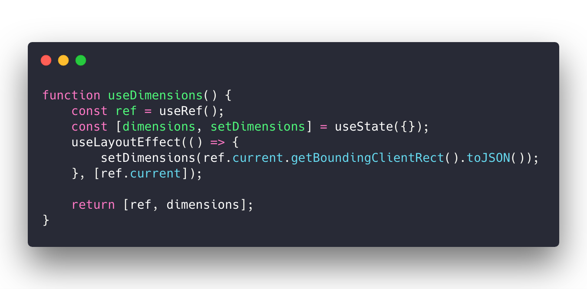

Yes it's new, I just [open sourced it](https://github.com/Swizec/useDimensions) 😛


The other day I wanted to measure some DOM nodes. This is useful when you have to align items, or respond to browser width, or ... lots of reasons okay.


I had to align a curvy line with elements that aren't under my control. This little stepper component uses flexbox to evenly space circles, CSS layouting aligns the title, and you see where this is going.


> Doesn't look like much but it's handy for data visualization. Especially when you want to align things with other things.  
>   
> I used a few of those snippets to position a curved line on this stepper [pic.twitter.com/W9RLizRLPG](https://t.co/W9RLizRLPG)
>
> — Swizec Teller (@Swizec) [March 12, 2019](https://twitter.com/Swizec/status/1105494223011241984?ref_src=twsrc%5Etfw)


SVG in the background detects position of itself, positions of the title and circle, and uses those to define the `start` and `end` line of my curve. 👌


Many ways you can do this.


@lavrton linked to [a list of existing NPM packages](https://www.npmjs.com/search?q=hook%20size) that sort of do it. @mcalus shared how [he uses `react-sizeme`](https://github.com/mcalus3/open-fraksl/blob/master/src/components/DomainComponents/DrawingComponents/FractalStage.tsx) to get it done.


All great, but I wanted something even simpler. I also didn't know about them and kind of just wanted to make my own.


Here's an approach I found works great


> Last night I figured out how to measure DOM dimensions with React Hooks. I'm sure it's been covered before but I had fun finding out. [#200wordsTIL](https://twitter.com/hashtag/200wordsTIL?src=hash&ref_src=twsrc%5Etfw) [pic.twitter.com/TmFWZ9Chk0](https://t.co/TmFWZ9Chk0)
>
> — Swizec Teller (@Swizec) [March 12, 2019](https://twitter.com/Swizec/status/1105494221232910336?ref_src=twsrc%5Etfw)


## useDimensions hook


This seemed like a neat approach so I turned it into [an open source React Hook](https://github.com/Swizec/useDimensions). You might enjoy it.





useDimensions source


Yep that's it. It really is that simple.


👉 [GitHub link](https://github.com/Swizec/useDimensions)


- `useRef` creates a React.ref, lets you access the DOM
- `useState` gives you place to store/read the result
- `useLayoutEffect` runs before browser paint but after all is known
- `getClientBoundingRect()` measures a DOM node. Width, height, x, y, etc
- `toJSON` turns a DOMRect object into a plain object so you can destructure


Here's how to use it in your project 👇


First, add `useDimensions` to your project


```
$ yarn add react-use-dimensions
or
$ npm install --save react-use-dimensions
```


Using it in a component looks like this


```
\import React from 'react';
\import useDimensions from 'react-use-dimensions';

const MyComponent = () => {
    const [ref, { x, y, width }] = useDimensions();
    
    return (
        <div ref={ref}>
            This is the element you'll measure
        </div>
    )
}
```


`useDimensions` returns a 2-element array. First the `ref`, second the dimensions.


This is so multiple `useDimensions` hooks in the same component don't step on each others' toes. Create as many refs and measurement objects as you'd like.


```
const MyComponent = () => {
    const [stepRef, stepSize] = useDimensions();
    const [titleRef, titleSize] = useDimensions();
    
    console.log("Step is at X: ", stepSize.x);
    console.log("Title is", titleSize.width, "wide");
    
    return (
        <div>
            <div ref={stepRef}>This is a step</div>
            <h1 ref={titleRef}>The title</h1>
        </div>
    )
}
```


MIT License of course.


Consider retweeting if you think it's neat


> 🔥useDimensions is now an open source react hook 🔥  
>   
> 🐙 GitHub --> <https://t.co/CNPj4RVfOw>  
> ✍ short blog --> <https://t.co/S5Wp6PJX95>  
>   
> Simple and works great 👌 [pic.twitter.com/8ZWYUCUhIe](https://t.co/8ZWYUCUhIe)
>
> — Swizec Teller (@Swizec) [March 13, 2019](https://twitter.com/Swizec/status/1105868919129030656?ref_src=twsrc%5Etfw)


Enjoy ✌️ ~Swizec