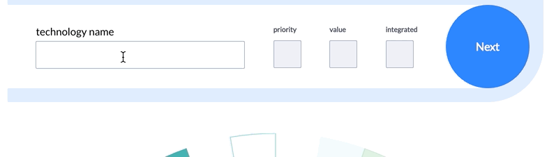
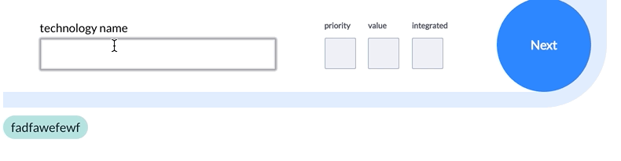
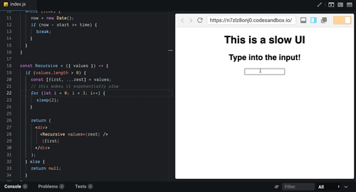
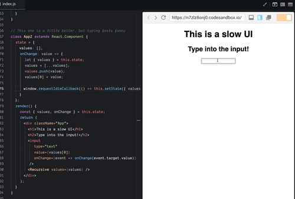
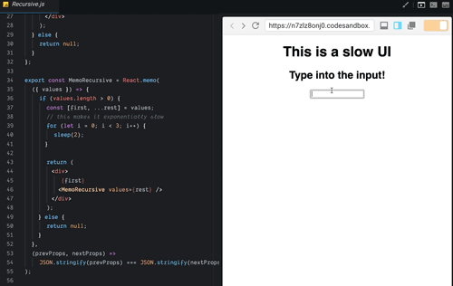
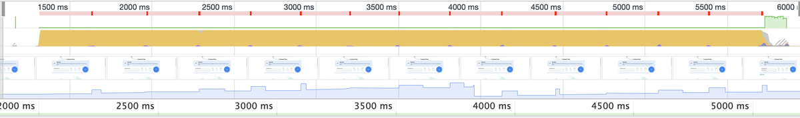
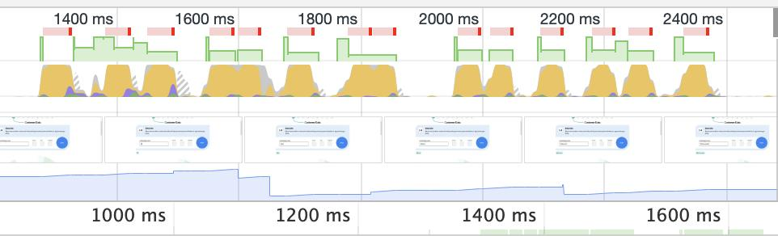

The other day I was dealing with some laggy UI on a project and discovered React.memo as a way of fixing it. I don't know how long React.memo has been a thing but it's new to me and it's amazing.

And when I say laggy UI, I mean _really_ laggy UI. Here's a gif of me typing full speed at 120wpm into a form.

Yeah, real bad. 🙈 After a few small tweaks tho ...

Let's start with how #1 happened, then what you might do to get to #2. . PS: this article is heavy in gifs, please be patient

## How to make a slow UI

There's a few key components to a slow UI and they all have to do with doing too much on too many state updates. I can't share the exact codebase so here's a rough analog I built in CodeSandbox.  In the original code my state structure follows the unidirectional dataflow principle. State for all components lives in `App` and flows down via props. The state object is deep and convoluted so for ease of use, `onChange` callbacks are colocated with state. Many components rely on this state which means that each keystroke re-renders the whole UI.

-   a bunch of tags
-   a big dataviz
-   many tooltips
-   a few things I can't remember

The underlying reason why each keystroke leads to a full re-render is that I'm treating state as immutable. Every keystroke creates a new copy of the entire state tree. JavaScript compares objects by reference.

    {foo: 'bar'} === {foo: 'bar'} // false

Great for making sure your whole UI is always up to date. Bad for performance.

## React time slicing

First avenue of attack is to debounce user input. Update your UI asynchronously on each keystroke instead of forcing your user to wait. Two ways you can approach this: 1) Turn your `<input>` into a component, use local state to drive its value, call the global `onChange` callback every few milliseconds. This works but increases complexity. 2) Use React time slicing and make `this.setState` itself asynchronous. Can't remember which version of React this came with, maybe 16.4 ... it works real good.

    onChange: value => {
      let { values } = this.state;
      values = [...values];
      values.push(value);
      values[0] = value;
      
      this.setState({ values });
    }

👇

    onChange: value => {
      let { values } = this.state;
      values = [...values];
      values.push(value);
      values[0] = value;

      window.requestIdleCallback(() => this.setState({ values }));
    }

Instead of immediately updating our state, we wait for a browser idle callback. Basically saying _"Yo browser, do this when you got some time will ya?"_ The result is a faster app with a somewhat cumbersome typing experience. 

## React.memo

Your best bet isn't to make updates asynchronous, it's to avoid them completely. In ye olden days you'd do that with `shouldComponentUpdate`. It's 2019 now and we don't do that anymore. We've got something much better 👉 `React.memo`. `React.memo` takes a functional React component and memoizes it. First param says what to memoize, second param says when to bust the cache. It's a lot like `useEffect` but for entire components. You tell React exactly when you'd like to re-render. Like this

    export const MemoRecursive = React.memo(
      ({ values }) => {
        // render values
      },
      (prevProps, nextProps) =>
        JSON.stringify(prevProps) === JSON.stringify(nextProps)
    );

First argument is a functional component. When rendering, React.memo calls your comparison function, the second argument, and if that returns `true`, it updates your component. I'm using JSON.stringify as a dirty deep equals. You might want to use one of the many fast deep equals libraries out there. Or maybe there's a specific prop value you can check. The result is an app with smooth UI  Using recursion was a bad example it turns out. Props are never the same so memoization can't kick in. Oops. Tried fixing it by building the array head-first instead of tail-first. Didn't quite work. In the real-world, though, React.memo made a huge difference! Compare these outputs from the Chrome Profiler. I was typing `this is a test` into my input box both times.

Took 4 seconds to type and render without these optimizations. 1 second with. 🤘

# In other news

In other news, my two Reactathon workshops are almost fully sold out. You should consider joining, if you're in town. Great conference too. I'll be there hanging out all weekend :) 👉 [React for DataViz workshop](https://ti.to/real-world-react/react-and-d3-workshop) 👉 [Build a modern app workshop](https://ti.to/real-world-react/modern-app-with-react-workshop) Next two weeks are going to be intense with prep for those workshops. But it's okay, I'm running a marathon on Sunday to give myself a break.  Enjoy your week ❤️ Cheers, ~Swizec
