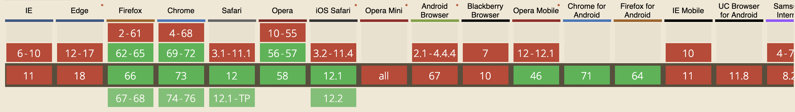
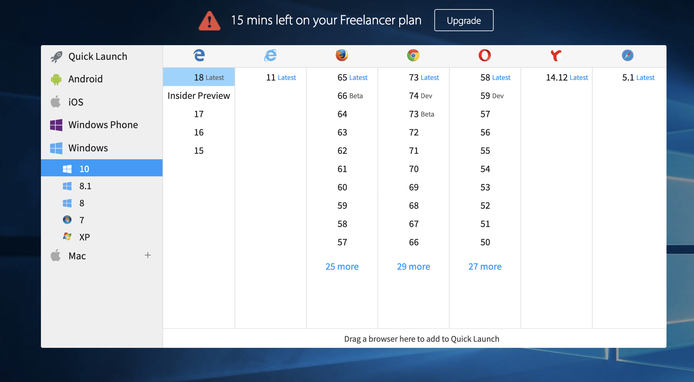
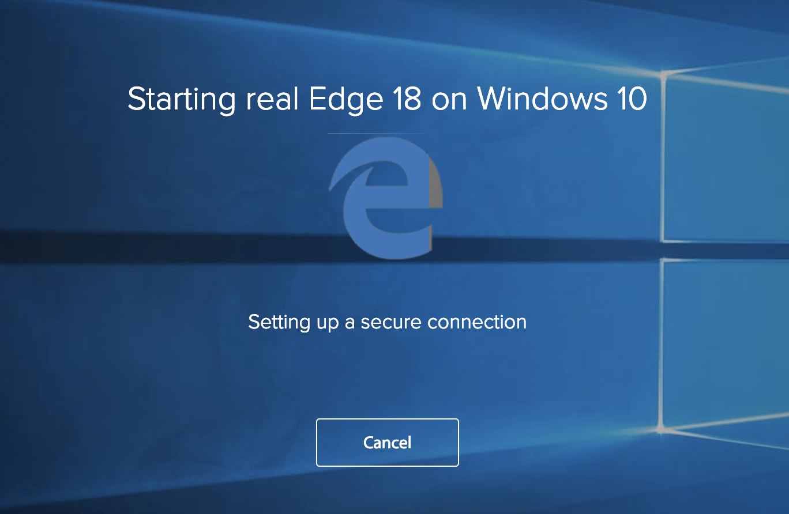

When was the last time you had to make sure your app works on weird browsers like Microsoft Edge?

Me, I had to do it earlier this week. My experience building websites for a web agency back in high school meant I knew what I was getting into.

> Client: Hey can you make it work on Edge?  
>   
> and here I was thinking I could go to bed early tonight [pic.twitter.com/oBqRKe6VYz](https://t.co/oBqRKe6VYz)
>
> — Swizec Teller (@Swizec) [March 19, 2019](https://twitter.com/Swizec/status/1107895195163451393?ref_src=twsrc%5Etfw)

Microsoft Edge did not disappoint.

`Array.flat()` doesn't work on Edge. On _every other browser_ it flattens nested arrays. On Edge it blows up and says the method doesn't exist.

CanIuse for Array.flat

Okay not _every_ browser. Only the ones that people use.

You can solve that with a polyfill right? An npm package that loads itself up and makes Array.flat work.

Yep, makes the error go away. Doesn't behave the way it does on other browsers. 🤦‍♂️

So I had to replace every `.flat()` with my own hack like this: `.reduce((arr, vals) => [...arr, ...vals], [])`. Sigh

In this project I was also using [chroma-js](https://gka.github.io/chroma.js/) to manipulate colors. Convenient way to take a color and give it a little alpha channel with `chroma(color).alpha(0.5)`.

Except on Edge this created invalid hex values. Colors no work at all.

Had to hack it together like this `` `rgba(${chroma(color).alpha(0.5).rgba().join(',')}) ``

🤨

You thought that was bad? It gets even better!

> Oh also on Edge node.getBoundingClientRect() doesn't return a DOMRect. Oh no, it returns a ClientRect.  
>   
> Unlike DOMRect, ClientRect (which exists only on Edge) doesn't have x and y coordinates. Only top and left  
>   
> 🤨
>
> — Swizec Teller (@Swizec) [March 19, 2019](https://twitter.com/Swizec/status/1107905401276624900?ref_src=twsrc%5Etfw)

`.getBoundingClientRect()` doesn't work on Edge. Well it does but it returns a `ClientRect` instead of a `DOMRect`. They work the same except when they don't.

For example DOMRect has `x` and `y` coordinates. `ClientRect` only has `top` and `left`. Oh and ClientRect only exists on Edge. Of course.

This meant I had to fix my [`useDimensions`](https://github.com/Swizec/useDimensions) library. Project relies on it a lot to measure stuff and build responsive data visualizations.

Oh and flexbox doesn't work correctly. Instead of spacing evenly it bunches everything on the left. Of course.

## The hero in this story is BrowserStack

Despite all this pain, there is a silver lining 👉 [BrowserStack](https://www.browserstack.com/) made testing on Microsoft Edge absolutely painless.

Well the testing itself was painful and the results made me cry but _I could test_.

I'm a Mac kind of guy you see. I don't have Edge. I don't have a Windows machine. I have zero interest in VirtualBox and futzing around with images and installing Windows on a partition and whatever else it used to take to test on weird browsers.

With BrowserStack I was able to run Edge in a Chrome tab. That's right. A Chrome tab emulated an entire operating system running a full screen browser.

Edge probably runs on their servers and streams an image to the tab. Still, feels like magic.

BrowserStack open screen

BrowserStack really does support all browsers 👌

You can use it for free for 15 minutes I think. I needed more so I ponied up a whopping $19 for a freelancer plan. That gave me 100 minutes.

You can even run things from localhost. No idea how they made that work. Type `http://localhost:3000` into the URL bar and it actually goes to your localhost.

Just don't type `localhost:3000` because Edge doesn't know how to deal with that and says it can't reach the URL. 🤦‍♂️

And here's proof. Edge running inside Chrome showing my homepage.

Amazing.

Lucky for us Microsoft is replacing the Edge browser engine with Chrome some time soon. Maybe then we won't need this anymore 🤞

Cheers, ~Swizec