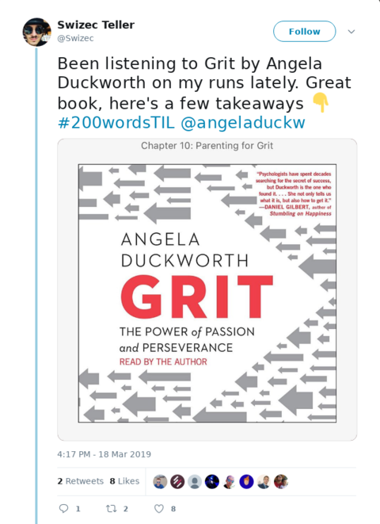

Today I wanted to talk to you about grit. It's not technical but it can help your career. ✌️

Finished the book a few days ago. It's amazing and I suggest you give it a try. Here are my full takeaways 👇

## Why grit

Grit is the strongest predictor of long-term success. Hard work beats talent when talent fails to work hard.

The world is full of talented people who never reach their potential.

Even if you love what you do, you still need grit to succeed. You will not enjoy every moment. There will be tough shit, dark days, days when all feels lost. Talent won't help you there. Grit will.

## What's grit

The key difference between gritty and ungritty people is how they respond to setbacks.

Ungritty people fail and say "Fuck it, I'm too dumb"

Gritty people fail and say "Fuck that, I gotta try harder"

It boils down to growth vs. fixed mindsets. Gritty people have a growth mindset.

Angela spent half the book on this so it's hard to summarize 😅

I'll say it like this:

If you fall and get back up, you're gritty. If you fall and give up, you aren't.

_However_ sometimes giving up is the correct thing to do. You have to say No to a lot of things so you can say Yes to the right things. This is where nuance comes in.

For example:

It is the right decision for Swizec to say _"No, I will not try to qualify for Boston marathon"_. Because I'm 30 minutes too slow and the amount of training to get there isn't worth it.

It would be wrong, however, for Swizec to give up on learning Kotlin. Because that is a valuable engineering skill that I can use to broaden my career and gain insights into other stuff.

## How grit wins

Do that the most which you are worst at.

Part of why gritty people win in the long run is that working harder when you fail lets you systematically fix what you're currently worst at.

Also known as deliberate practice.

That's how Senna became king of the rain. As a kid he had a kart race in the rain, he sucked. After that he practiced every single time it rained.

15 years later, at Donington, in the wet 👉 The Lap of The Gods. Widely considered the best lap of F1 racing in history.

Senna started 5th, advanced to 1st in the first lap, and won with a whopping 1 minute lead. Donington lap record is 1min 18seconds. Astounding performance.

## How you can be gritty

Grit is learnable.

That which doesn't kill you doesn't always make you stronger. When you can't control your suffering, it leads to learned helplessness.

BUT! With even a modicum of control, you learn grit.

Experiments on dogs showed that when you zap them, it hurts. D'oh. If they have a button to shorten their zap, they learn that there's a way out. Without the button, they don't.

What happens next is the cool part.

You take those dogs and put them in an open cage. Zap them again and the dogs who used to have a button think _"Oh look the cage is open I'll just jump out!"_.

Dogs without the button look at the open cage and think _"There's nothign I can do. This hurts. Mom help me. Why are you zapping me?"_. And they don't jump out. They sit there and take it.

Similar experiment on rats showed that if you go through this experience as a teenager, you become a gritty adult and the lesson stays with you for life.

Which brings another interesting point.

Often the least gritty people are those who look most successful as kids.

Straight A students with perfect grades at their perfect little high schools and amazing track records at ivy league colleges with stellar GPAs, president of the chess club … you know the type.

They never learn how to handle failure.

A small slap in the face from Real Life absolutely floors them. They don't know how to deal. They've never failed at anything. It is the end of days.

## How to grow gritty people

Parenting is \\important. When you're a parent, you're parenting obviously. You're also parenting when you're a boss. When you're a mentor. Sometimes even when you're a friend.

When you have an effect on people's personal and professional growth, you are parenting.

So how do you grow gritty people?

And remember, you want to be surrounded by gritty people because you are the average of your 5 closest friends.

Angela talks about different models of parenting and the one that sticks out as most effective is this:

Supportive with high standards.

What that means is that you support your people, you give them what they need to succeed, you nourish, you create a safe environment, you encourage and cajole.

You also have high standards. You let them fail. You let them flounder and flop around. You give them a task and you accept nothing but perfection. If what they deliver isn't good enough, you don't hide the fact. You say it isn't good and ask them to fix.

This is often hard to do. Especially when there's deadlines. But it's \\important.

## How to teach yourself

If you need to teach grit to yourself in adulthood: Good luck.

You can do it but you won't enjoy the process.

The only way is to streeeeeeetch yourself on purpose. Bite off more than you can chew. Chew until you're through.

## What about passion?

Grit is a form of passion. A dogged pursuit of a goal over the long frame of your life.

But passion isn't a flash of inspiration. It isn't something that hits you one day and then you know what you want to be in life.

Passion grows from a little seed. Passion develops over time. The more you learn about a thing, the more you enjoy deepening your knowledge. The better you are the more you love doing it.

So don't worry if you don't know yet what you want to be when you "grow up". Experiment. Try stuff. Find something that pulls you and keep going.

Sooner or later you'll find it. I believe in you :)

❤️

Cheers, ~Swizec