Reactathon was wonderful ❤️ Thanks to all the wonderful speakers. They did a phenomenal job 👌 Here's a recap of stuff I learned 👇 My experience lasted the full 4 days.

## My contribution 👉 workshops

> View this post on Instagram
>
> [Wow this conference room has terrible selfie lighting how dare they Teaching a bunch of fine @reactathon folks about React and D3 ✌️](https://www.instagram.com/p/BvkHoBOlM0h/?utm_source=ig_embed&utm_medium=loading)
>
> A post shared by [Swizec Teller](https://www.instagram.com/swizec/?utm_source=ig_embed&utm_medium=loading) (@swizec) on Mar 28, 2019 at 12:51pm PDT

React for Data Visualization workshop on Thursday. 7 hours of presenting. Went great, a little rusty coz I haven't done it in a while. Modern Web App with Gatsby, GraphQL, Serverless, and Hooks on Friday. Woke up at 2am to "finish" preparing by 10am, then right into 7 hours of presenting. I was … tired? Dead? Thank god I run marathons otherwise there's no way I'd survive that 😅

> View this post on Instagram
>
> [Teaching a bunch of fine #reactathon folks about PWA, GraphQL, Gatsby, Serverless, Reakit, and Lambdas. We’re making a grocery list 💪](https://www.instagram.com/p/BvmxcAdF_LE/?utm_source=ig_embed&utm_medium=loading)
>
> A post shared by [Swizec Teller](https://www.instagram.com/swizec/?utm_source=ig_embed&utm_medium=loading) (@swizec) on Mar 29, 2019 at 1:34pm PDT

That one suffered from the First Iteration problem. You could tell the content wasn't polished yet, the flow wasn't quite there. I made some questionable technical decisions in the example project, we spent too long on some sections, too little on some others. But I think people still learned a lot, asked great questions, and we covered a lot of ground. Too much ground. Could easily turn it into a 3 or 4 day workshop. A few more iterations and I think it's gonna be magnificent. **Lesson learned:** Don't have 2 workshops on different topics in the same week. So tired 😴 This was followed right away by the speaker dinner.

## Speaker dinner

Speaker dinners are amazing. Best part of any conference. It's like getting peer level access to the top minds in your industry. Unless of course you're so tired from being up since 2am and presenting all day that you can barely say Hi. But I chatted dirt bikes with [Ken Wheeler](https://twitter.com/ken_wheeler) and forgot to take a selfie. It was like meeting a down-to-earth celebrity 🤩 And I **learned an important phrase** from [Mark Erikson (@acemarke)](https://twitter.com/acemarke): _"My social battery is now running low. Good night"_ 👌

## Reactathon Day 1 – the lightning talks

I love lightning talks. Each of these is a twitter thread with my live notes. Click through. I'm writing here from memory :) [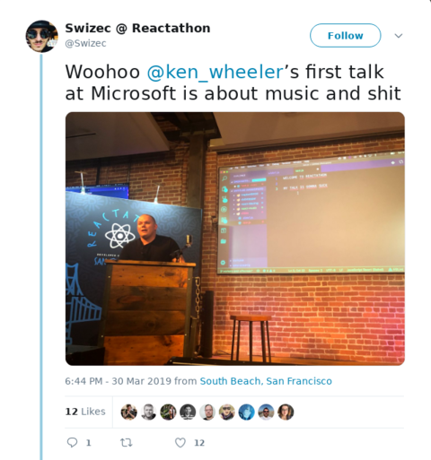](https://twitter.com/Swizec/status/1112168749212164096) [Ken Wheeler](https://twitter.com/ken_wheeler) talked about the renderless component pattern and how it applies to hooks. There was some talk about inverting control of children to their parent, which was hard to grasp in a short talk like this. Then he showed us an app he built with react-music and hooks. Gives you a UI to create sick beats and play music. Wonderful. His render-html-to-canvas demo was amazing too. He says he's not ready to share that one until it can be accessible. [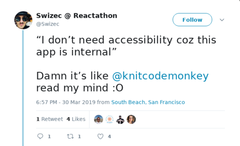](https://twitter.com/Swizec/status/1112171920068239360) [Jen Luker](https://twitter.com/knitcodemonkey) gave us a great way to introduce accessibility into our existing apps 👉 create a lint rule, set everything to warning. Change one rule to error. Everyone complains, everyone grumbles, everyone fixes it. Then you set the next rule to error. Repeat until your app is accessible. Did you know 25% of Americans have some form of disability that requires accessible webapps? Imagine how amazing your business could be with 25% higher conversion rates. 😉 [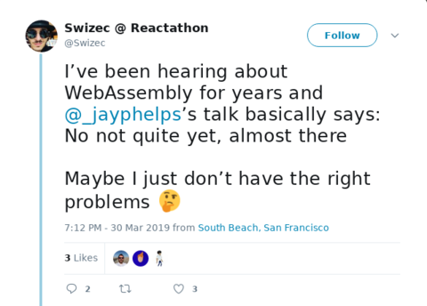](https://twitter.com/Swizec/status/1112175761866145792) [Jay Phelps](https://twitter.com/_jayphelps) talked about Wasm. The main message I got from his talk is that Web Assembly is amazing and getting amazinger with each passing day. It's never going to replace JavaScript and it isn't meant to. It's meant to bring C, Rust, etc. to the frontend for those high-CPU tasks you have to do sometimes. Gives me interesting ideas for data visualization. You know those times when you're processing a dataset with 100,000+ entries and it slows down your whole app? Might be wasm-able. [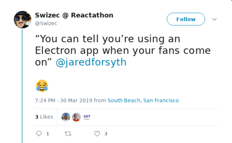](https://twitter.com/Swizec/status/1112178754468470785) [Jared Forsyth](https://twitter.com/jaredforsyth) hyped us up about ReasonML and using it for Native React on the desktop. Write your app in Reason instead of Electron and you can compile straight to native code. No more WebKit, no more spinning fans, just smooth performance at a fraction of CPU and memory usage. His demo looked amazing. [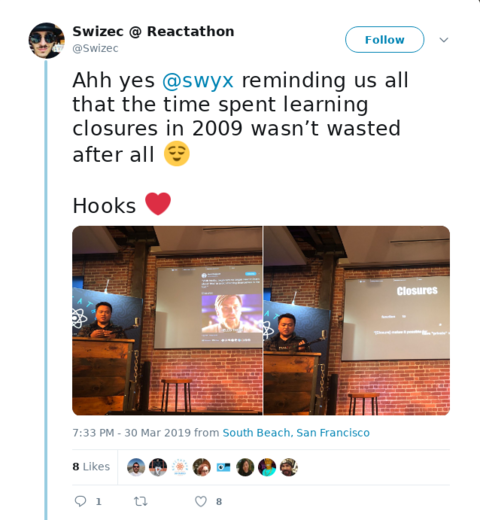](https://twitter.com/Swizec/status/1112181144605188096) Then [@swyx](https://twitter.com/swyx) showed us how to re-implement hooks in some 23 lines of code. No magic, just JavaScript like we used to write many years ago. Closures of closures within closures. Gives you modules and curried values and all sorts of things. It's too technical to recap here and I'm sure he's going to post slides soon. He always does. [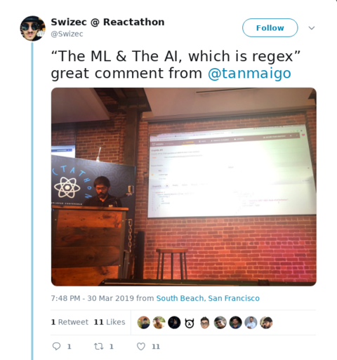](https://twitter.com/Swizec/status/1112184764717363200) [Tanmai Gopal](https://twitter.com/tanmaigo) had the best jokes of any lightning talk. So on point, it was beautiful to watch. Amazing demo too. Using GraphQL subscriptions, Hasura backend, and some serverless stuff, he's able to live stream data into and out of webapp _and_ stay resilient to network failures. The stream just waits and resumes when you come back online. Love it.

## Reactathon Day 2 – the full conf

I drank my morning tea scrolling through imgur sitting in my comfy chair at home. So I missed the first keynote. [Ben Ilegbodu](https://twitter.com/benmvp) talked about the state of the React ecosystem. [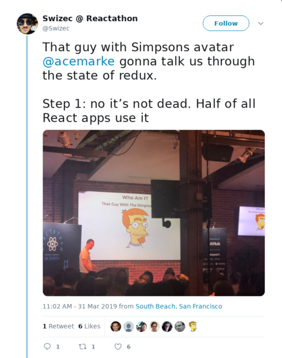](https://twitter.com/Swizec/status/1112414785214144512) Followed by [Mark Erikson](https://twitter.com/acemarke)'s great talk on the state of Redux. But I missed most of that one because mum wanted to facetime and mums are important. I did stay long enough to learn that 50% of all React apps out there use Redux. That blew my mind. 🤯 After fulfilling my Good Son duties I was ready to buckle down, sit through the conference, and not take my laptop out even once. Not once. Sit in front row and be the audience you always wish you had. Take pictures, live tweet, and pay attention. Speakers appreciate that. [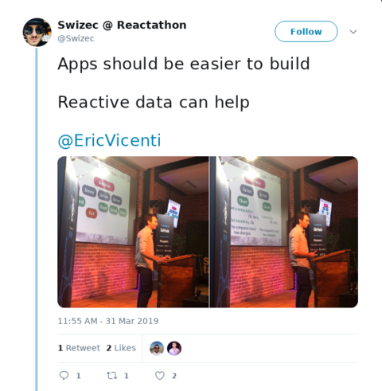](https://twitter.com/Swizec/status/1112428230063984640) [Eric Vicenti](https://twitter.com/EricVicenti) told us about a new architecture for webapps that he's working on. No more database talking to many servers, talking to many clients, having errors and wondering about transactions and correctness, oh no. He proposes an architecture based on web sockets, immutable data, and live streaming connections. You use a chain of blocks to ensure your data is correct. You store actions instead of state. You keep the reducer on the backend so it always knows the final state. You make changes with a pair of `(state, action)` so the server can error you out if your state is wrong. Great idea. Seems to work. He's waiting to finish docs before releasing. [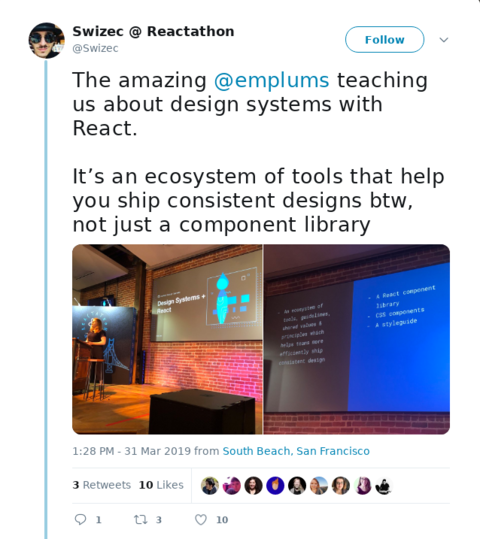](https://twitter.com/Swizec/status/1112451664047333377) [Emily Plummer](https://twitter.com/emplums) told us all about design systems and how they're used at GitHub. A design system isn't just a set of React components. It's an entire toolset of components, documentation, css, etc that helps engineers ship good looking apps from mockups. Get mockups, refer to the system, produce beautiful UI. Streamlines communication between designers and engineers because you're talking a common language. Means designers don't have to give you time consuming pixel-perfect designs, and you don't have to waste your time building pixel-perfect CSS. Your design system does it for you. ❤️  [Jesse Tomchak](https://twitter.com/jtomchak) got everyone excited about Babel macros. It's like writing code that writes your code and it's really powerful. For example, you can write a language extension that replaces something like `?.` into a series of null-safety checks. Means you don't have to worry about writing your own checks which are almost always wrong. 👌 Oh and you can speed up your code by doing things at compile time instead of run time. That's what macros are for. Want to statically insert some code in a bunch of places? Write a macro. [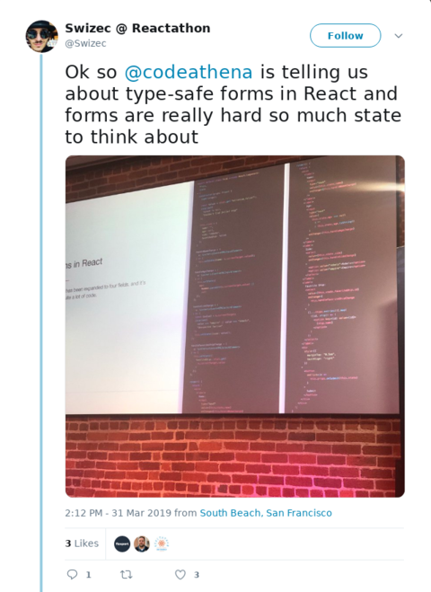](https://twitter.com/Swizec/status/1112462651416694785) [Zach Gotsch](https://twitter.com/CodeAthena) showed us a great new form library he's been building, called formula-one. Formula-one is all about writing type-safe forms. This is important because with React you build custom form elements. Those go way beyond text and textarea so it's time to think about proper typing. Wouldn't want your server to get a string when it expects an array of objects would you? Of course not. Since typing isn't be all and end all, you still nee validation, formula-one makes that easier too. Looked neat, gonna have to try it. [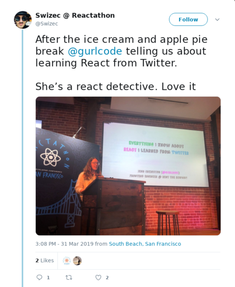](https://twitter.com/Swizec/status/1112476828604592128) [Jenn Creighton](https://twitter.com/gurlcode) called herself a React detective and taught us something important about React that we all managed to forget or not realize. She learned it through investigating tweets from the core team. Did you know React Fiber, the reconciler React's been using since 2016 or so, isn't even a Virtual DOM anymore? That's right. React does not in fact use a virtual dom. It uses a virtual call stack. Mind, blown. 🤯 Most of her talk went right over my head. I'd have to sit down and study what she said for a few hours to understand _how_ Fiber works. It's mindbendy and computer sciencey and exercises brain muscles I haven't used in years. Bottom line is this: No more VDOM. Virtual Stack instead. This enables asynchronous updates and _eventually_ is going to give us React Suspense. Can't wait [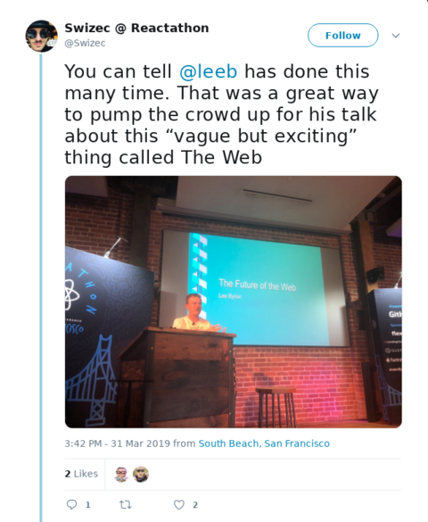](https://twitter.com/Swizec/status/1112485359714099200) [Lee Byron](https://twitter.com/leeb) then traveled us through time. It was 1999 and /cgi-bin/ is all the rage. You can build _dynamic_ websites. Wow. His talk was amazing, beautiful, and a great performance. Such a great summary of itself that I can't even give you a summary. 😅 Lee basically talked about how React grew out of a PHP-based component framework for server-side dynamic web applications and how the modern React Hooks approach is like going back full circle. You have a component with a bit of markup and a few function calls to other stuff. Just like PHP templates 20 years ago. Brilliant. Just the insight of how React came to be was worth it. Guess that's what happens when you work at Facebook for 10 years and see the evolution first hand. [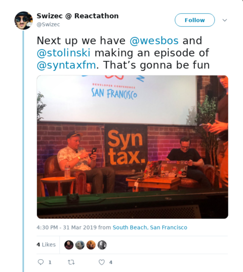](https://twitter.com/Swizec/status/1112497539163410433) [Wes Bos](https://twitter.com/wesbos) and [Scott Tolinski](https://twitter.com/stolinski) closed up Reactathon with a live recording of SyntaxFm. Very fun to watch, super entertaining. We learned a bit about hooks, we watched them tag team a small app in 5 minutes. 👌 Enjoy your Monday ❤️, ~Swizec PS: there's no better way to relax before a conference than [riding too fast on a curvy road, farting proudly, and cowboy poetry](https://www.instagram.com/p/BvprE_AluFE/)
