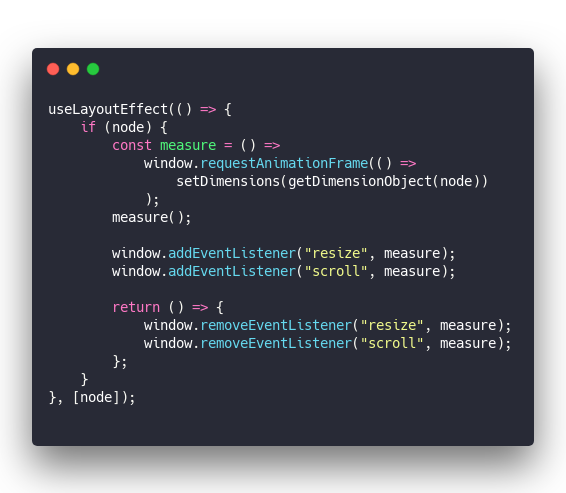
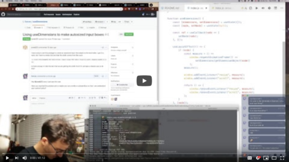
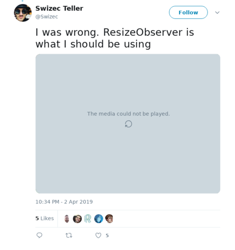
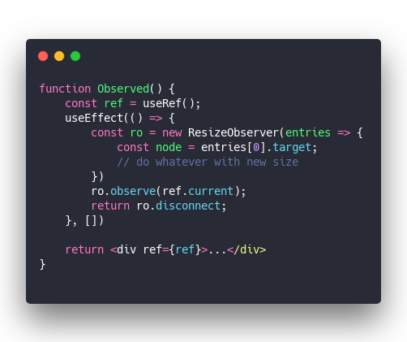

You might remember the [useDimensions](https://github.com/Swizec/useDimensions) React Hook I opensourced a few weeks ago. 246 stars, 2 issues, and 1 merged PR make it the most useful library I ever released 💪 Some 10 days ago I made it update measurements live. Needed to make this working for a client project 👇 [  
Scrollable overlay highlight](./img/8kYM6gu.gif) It's not perfect, but that highlight is a hole punched through a darkened canvas. It uses `useDimensions` for positioning and needs to update when you scroll. Works good enough. Built with hooks, live updating looks like this: &t=seti&l=javascript&ds=true&wc=true&wa=true&pv=48px&ph=32px&ln=false&code=useLayoutEffect(()%20%3D%3E%20%7B%0A%20%20%20%20if%20(node)%20%7B%0A%20%20%20%20%20%20%20%20const%20measure%20%3D%20()%20%3D%3E%0A%20%20%20%20%20%20%20%20%20%20%20%20window.requestAnimationFrame(()%20%3D%3E%0A%20%20%20%20%20%20%20%20%20%20%20%20%20%20%20%20setDimensions(getDimensionObject(node))%0A%20%20%20%20%20%20%20%20%20%20%20%20)%3B%0A%20%20%20%20%20%20%20%20measure()%3B%0A%0A%20%20%20%20%20%20%20%20window.addEventListener(%22resize%22%2C%20measure)%3B%0A%20%20%20%20%20%20%20%20window.addEventListener(%22scroll%22%2C%20measure)%3B%0A%0A%20%20%20%20%20%20%20%20return%20()%20%3D%3E%20%7B%0A%20%20%20%20%20%20%20%20%20%20%20%20window.removeEventListener(%22resize%22%2C%20measure)%3B%0A%20%20%20%20%20%20%20%20%20%20%20%20window.removeEventListener(%22scroll%22%2C%20measure)%3B%0A%20%20%20%20%20%20%20%20%7D%3B%0A%20%20%20%20%7D%0A%7D%2C%20%5Bnode%5D)%3B%0A)

We use a `useLayoutEffect` to run our code synchronously on DOM updates. Inside, we check that the `node` exists, then create a debounced `measure()` function. Measure runs on `requestAnimationFrame` so we don't kill the browser even if the code falls into an infinite loop. You might get small subpixel resizes forever because of layouting edge cases. I've seen it happen. It's bad. `getDimensionObject` gets measurements, `setDimensions` is the state setter from a `useState` hook. You can see [full code here](https://github.com/Swizec/useDimensions/blob/master/src/index.js). Window `resize` and `scroll` listeners will re-run our `measure()` function when things change. Scrolling will change its position, resizing might change its dimensions. There's a problem here 👉 if the container resizes and the window doesn't, we'll have stale dimensions. When you use JavaScript or CSS to resize an element in response to user events, for example. No bueno.

## IntersectionObserver to the rescue!

Last night I decided to fix that with the new [IntersectionObserver API](https://developer.mozilla.org/en-US/docs/Web/API/Intersection_Observer_API)  After some research I realized I was wrong. IntersectionObserver doesn't do what I thought it does, but it's super neat anyway. You want to use the `IntersectionObserver` API when you have two DOM nodes and you want to know when their intersection changes. It's all in the name right? A common use-case is something like my [react-lazyload-fadein library](https://github.com/Swizec/react-lazyload-fadein) where you want to lazy load images juuuuust before they become visible. You could create a new intersection observer between the document and your placeholder node and wait for notifications. Super neat, not what's going to fix our resize edge case. 

## ResizeObserver, that's the thing 👌

[ResizeObserver](https://developer.mozilla.org/en-US/docs/Web/API/ResizeObserver) is an even newer API. Mozilla calls it "experimental". Support is lacking, but there are polyfills you can use. I used [this one](https://www.npmjs.com/package/resize-observer-polyfill) The idea here is that you can create a new observer object, give it a DOM node to observe and it's going to call your function when something changes. You can give it multiple nodes too. Something like this 👇 &t=seti&l=javascript&ds=true&wc=true&wa=true&pv=48px&ph=32px&ln=false&code=function%20Observed()%20%7B%0A%20%20%20%20const%20ref%20%3D%20useRef()%3B%0A%20%20%20%20useEffect(()%20%3D%3E%20%7B%0A%20%20%20%20%20%20%20%20const%20ro%20%3D%20new%20ResizeObserver(entries%20%3D%3E%20%7B%0A%20%20%20%20%20%20%20%20%20%20%20%20const%20node%20%3D%20entries%5B0%5D.target%3B%0A%20%20%20%20%20%20%20%20%20%20%20%20%2F%2F%20do%20whatever%20with%20new%20size%0A%20%20%20%20%20%20%20%20%7D)%0A%20%20%20%20%20%20%20%20ro.observe(ref.current)%3B%0A%20%20%20%20%20%20%20%20return%20ro.disconnect%3B%0A%20%20%20%20%7D%2C%20%5B%5D)%0A%0A%20%20%20%20return%20%3Cdiv%20ref%3D%7Bref%7D%3E...%3C%2Fdiv%3E%0A%7D%0A)

Create a new `ResizeObserver` in an effect post initial mount. Give it a method that runs when the observer fires, make it observe your React element, return the `disconnect` function to clean up on unmount. Perfect. Much cleaner than the hacky solution 👌 Except it doesn't work. You can see it [in the stream](https://youtu.be/uSmd6VMEMTo?t=1756) around the 29 minute mark. ResizeObserver was going crazy and firing as fast as we could read. Remember when I said you can run into subtle layouting edge cases where things are unstable and resize very often? That. So we gave up, reverted back to `window.addEventListener`, and left the edge case alone. Pretend like none of this ever happened. But it was fun to experiment :)

Cheers,  
~Swizec