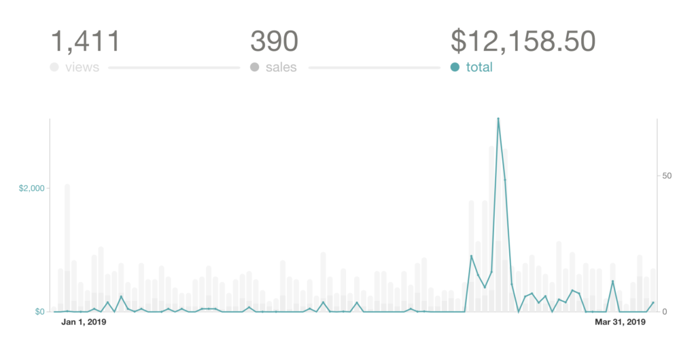

It's the end of Q1 – one of the hardworkingest periods of my life ever. Was it worth the sleepless nights and the stress? Time for an #open report

Swizec LLC, Jan 1st 2019 – Mar 31st 2019

🤑$105,160 total inflows

💸$83,554 total outflows

⏳716 hours

Let's break it down 🤔

Inflows 👇

👨‍⚕️$47,000 consulting

👨‍💻$21,460 dayjob contracting

💰$21,850 pulled from savings

👾$14,556 product sales

Savings make this inflows instead of revenue. I'll explain

Outflows 👇

💰$15,650 SEP IRA contribution

💰$1560 savings

🧛‍♂️$20200 taxes

👩‍💻$5887 freelancers

💻$1959 SaaS

🤓$553 education

👨‍⚕️$282 insurance

🏍$1885 motorcycle

🎟$223 ads

Again savings make it outflows, not costs

PS: $12,923 for staying alive&happy

PPS: $20,670 credit card debt bye bye

https&#x3A;//twitter.com/Swizec/status/1096434172590096384

My day job is now a contracting gig. That happened in October. I still love them, they still love me. 4 days/week gives me more time to sidehustle and to everyone's surprise means I do better work at work. Less stress maybe?

👌

How on earth did I pull off both $47,000 in consulting AND $21,460 in day job contracting in just 3 months?

$32,000 of that consulting was for work done in 2018 😇

My year in review post mentions an outsanding invoice. This was that. Phew

https&#x3A;//swizec.com/blog/sidehustled-180k-almost-killed-my-business/swizec/8835

About those savings shenanigans ... pulling $21,850 from savings and putting $15,650 back into different savings ... not exactly a business move is it?

Except it is. Lemme explain

https&#x3A;//imgur.com/gallery/MdA04

Some of it would have to go to taxes eventually. This March.

Accountant ran the numbers and suggested I move some of that money into a SEP IRA fund instead. Lowers my taxes, but means I can't touch the money for ~30 years.

So I did that.

Better 65 year old Swizec have the money than Uncle Sam using it to drop bombs on innocent children, right? He sure ain't using it to solve homelessness or health care ...

The $5,800 difference between what I pulled and what went back into a SEP ... that covered what I was short for in taxes. Paid taxes on time with no delay for the first time ever 💪

Perhaps this year I'll even keep up with quarterly payments 😛

What was I gonna say next ... oh yeah: Was it worth it?

⏳352 hours day job

⏰65 hours consulting

⏲253 hours product stuff

hm

Removing work done last year, savings stuff, work that pays next quarter ...

... $34/hour 🤔

That's ... not great? I honestly can't tell anymore but I'm sure BigTech pays better than that. 😅

But I got 3 months salary buffer so I got that going for me.

🎉 Ok but in terms of what went well Q1 was a great success! 🎉

- started+finished a freelance project

- (finally) launched ReactForDataViz.com

- ran marathon

- paid my taxes

- paid off my credit card

- 2 workshops at Reactathon

- 1 new workshop built from scratch

And that one might present a whole new way forward beyond React + D3. ✌️

As for what went wrong ... not much.

@willfanguy left me for a BigCorp job after 3 years of helping on the side. Needed to focus to crush it.

Dropped a bunch of balls during the ReactForDataViz.com launch. But I can pick those back up in April :)

Now all I gotta do is figure out what I'm doing with Q2 🤔Was so focused on Q1 I forgot to make any plans for the future lol

https&#x3A;//twitter.com/Swizec/status/1113837427674640384