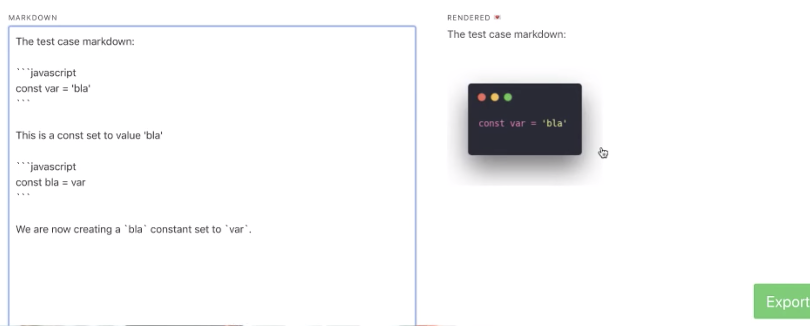

Markdown is all the rage these days.


A simple text format for rich documents, you see it everywhere from GitHub issues to Slack messages. Even Facebook supports it in their business version. Soon their pleb version too, I hear.


With the rise of Gatsby and other static site builders, markdown is an increasingly popular choice for text-heavy webapps. Write content in Markdown, parse and render to React or HTML.


Easy to build the layout, easy to write the content. Perfect 👌


Markdown for content-heavy apps is what I wanna talk about today. Because I discovered how you can make markdown do anything you want. Anything. It's amazing.


https&#x3A;//www.youtube.com/watch?v=QtSSNLh_PBs


I use markdown to write these letters. And my blogs. And my workshop materials.


One of the tools that helps me do that is [TechLetterApp](https://techletter.app/). Takes my Markdown and turns code, youtube links, and tweets into screenshots. Makes them work in email :)


But TechLetterApp had a terrible bug.



Code blocks would eat each other. Linking to Twitter usernames with an `@` corrupted the output. Image links got confused as well. `[]()`.


Basically, the Markdown parser was shit.


I was using [Showdown](https://github.com/showdownjs/showdown). Worked great for simple stuff, broke down on the hard stuff.


Maybe my regex-based extensions broke it.


Or the fact that it used Regex to render Markdown, which is not a regular language. Same problem as using Regex to parse HTML. [You can't](https://stackoverflow.com/questions/1732348/regex-match-open-tags-except-xhtml-self-contained-tags)


Either way, the solution was a rewrite to [Remark](https://github.com/remarkjs/remark)


https&#x3A;//twitter.com/Swizec/status/1114672906607325184


Now TechLetterApp works great.


Time to add more Markdown extensions 😛


## Build your own Markdown extension


You need 3 ingredients to build your own custom Markdown extension.


1. A Remark plugin _that creates a custom node type_
2. A HAST handler _that knows how to use it_
3. A renderer _that allows custom HAST handlers_


I built a Markdown extension that understands YouTube and Twitter links as a special `screenshot` node.


We'll use that to talk about how to build a Markdown extension. You could use the same approach to create completely new Markdown syntax.


## 1. A Remark plugin


Remark is a Markdown parser/compiler that uses plugins to do its thing.


I've written about [How to build a Remark plugin to supercharge your static site](https://swizec.com/blog/buildremark-plugin-supercharge-static-site/swizec/8860) before. Here's the process in a nutshell:


1. Remark parses Markdown to an AST (abstract syntax tree)
2. Remark then uses [the visitor pattern](https://en.wikipedia.org/wiki/Visitor_pattern) to run plugins in sequence on each node
3. Plugins transform nodes to new or different nodes


That 3rd part is what we're building 👉 a method that takes a `node` object and transforms it to a different `node` object.


My link-to-screenshot plugin looks like this:


```
\import visit from "unist-util-visit";
\import Url from "url-parse";

function getScreenshotUrl(url) {
    return `https://84wz7ux5rc.execute-api.us-east-1.amazonaws.com/default/screenshot-as-a-service-dev-screenshot-function?url=${url}`;
}

function remarkUrlThumbnail({ domains = [] }) {
    return tree =>
        new Promise(async (resolve, reject) => {
            const nodesToChange = [];
            visit(tree, "link", node => {
                const url = new Url(node.url);
                const thumbnailable = domains.some(
                    d => url.hostname.replace("www.", "") === d
                );

                if (thumbnailable) {
                    nodesToChange.push({
                        node
                    });
                }
            });
            for (const { node } of nodesToChange) {
                node.type = "screenshot";
                node.url = getScreenshotUrl(node.url);
                node.link = node.url;
            }

            resolve();
        });
}

export default remarkUrlThumbnail;
```


34 lines of prettified code in total. Lemme explain :)


```
\import visit from "unist-util-visit";
\import Url from "url-parse";
```


We use the `visit` util from unist utils to help us visit specific nodes. Easier than writing our own recursion-based tree-crawling code.


That's the stuff of whiteboard interviews and I never want to do it myself in real life. Too hard.


We use `Url` to parse URLs. You could write a regex for it and that's fraught with dangers. Let someone else deal with the edge cases :)


```
function getScreenshotUrl(url) {
    return `https://84wz7ux5rc.execute-api.us-east-1.amazonaws.com/default/screenshot-as-a-service-dev-screenshot-function?url=${url}`;
}
```


`getScreenshotUrl` is a helper method that takes a URL and returns a URL based on my screenshot-as-a-service AWS Lambda. It knows how to take screenshots and make thumbnails of various types of sites.


I should write about how that works some time 🤔


```
function remarkUrlThumbnail({ domains = [] }) {
    return tree =>
        new Promise(async (resolve, reject) => {
            const nodesToChange = [];
            visit(tree, "link", node => {
                const url = new Url(node.url);
                const thumbnailable = domains.some(
                    d => url.hostname.replace("www.", "") === d
                );

                if (thumbnailable) {
                    nodesToChange.push({
                        node
                    });
                }
            });
            for (const { node } of nodesToChange) {
                node.type = "screenshot";
                node.url = getScreenshotUrl(node.url);
                node.link = node.url;
            }

            resolve();
        });
}
```


`remarkUrlThumbnail` is the work horse here. Split into two parts.


First it finds all the candidate nodes. Then it changes them.


We `visit()` every `link` node, those are URLs, and check if they fit a list of domains that we want to thumbnailify. List comes from config, I'll show you in a bit.


Each match is pushed to a `nodesToChange` array.


Then we loop through the array with a `for` loop and change each node type to a `screenshot`, define the new `url`, and keep the old one in `link`.


You can add any property you might need here. The world is your oyster and the `node` is but a JavaScript object for you to play with.


## 2. A HAST handler


Ok so you have a new type of node: `screenshot`. Now what?


Most Remark renderers, like [remark-react](https://github.com/remarkjs/remark-react) which renders to React, and [remark-html](https://github.com/remarkjs/remark-html) which renders to HTML, use an intermediate layer called HAST – HTML Abstract Syntax Tree.


HAST takes a Markdown AST and turns it into an HTML AST. Goes from `link` and `bold` and `quote` nodes to `a` and `b` and `blockquote`. That sort of thing.


But it won't know what to do with `screenshot`. It's not a node type that HAST recognizes.


You can fix that with a HAST handler. Like this


```
const screenshotHandler = (h, node) => {
    const props = { node };

    return h(node, "screenshot", props);
};
```


`screenshotHandler` is a function that takes an `h` function and a `node` as its arguments. `h` is short for `createElement` in the AST rendering world.


No I don't know why `h`, but everyone from React, to Preact, and Vue uses it. They all have their own implementation. The particular implementation you get depends on which Remark renderer you're using.


This is your chance to create elements with the correct `props`, types and children.


Because I'm using `remark-react`, I kept my node type as `screenshot` and gave it the `node` itself as props. You might want to use this opportunity to construct a more proper HTML tree.


## 3. A renderer


I'm using `remark-react`. It takes a markdown AST and transforms it to a tree of React components for easy rendering in React apps. No `dangerouslySetInnerHTML` mess here. ✌️


Another trick that `remark-react` enables is using custom React components to render custom HAST nodes.


So I built a `<Screenshot>` component.


```
\import React, { useState, useEffect } from "react";

function Screenshot({ node }) {
    const [image, setImage] = useState("/lg.pink-pig-ajax-loader.gif");

    useEffect(() => {
        (async () => {
            try {
                const res = await fetch(node.url),
                    url = await res.text();

                setImage(url);
            } catch (e) {
                setImage("/undraw_warning_cyit.png");
            }
        })();
    }, [node]);

    return (
        <a href={node.link} target="_blank" rel="noopener noreferrer">
            
        </a>
    );
}

export default Screenshot;
```


Takes an AST `node` as its prop and returns a linked image. At first the image is a gif spinner, then it turns into a screenshot.


`useState` keeps track of the current image URL. `useEffect` runs a `fetch` request talking to my screenshot lambda.


## Putting it all together


The final step in the puzzle is putting all this together. You'll need some way to intake markdown and somewhere to put the output.


Transforming from markdown to your output looks like this


```
\import remark from "remark";
\import remark2react from "remark-react";
\import urlThumbnail from "./remarkUrlThumbnail";
\import Screenshot from "../Screenshot";

export const remarkCompile = input =>
    new Promise((resolve, reject) => {
        remark()
            .use(urlThumbnail, {
                domains: [
                    "m.twitter.com",
                    "twitter.com",
                    "youtube.com",
                    "youtu.be"
                ]
            })
            .use(remark2react, {
                sanitize: false,
                remarkReactComponents: {
                    screenshot: Screenshot
                },
                toHast: {
                    handlers: {
                        screenshot: screenshotHandler
                    }
                }
            })
            .process(input, (err, output) => {
                if (err) {
                    reject(err);
                } else {
                    resolve(output);
                }
            });
    });
```


We have a `remarkCompile` function that takes an `input`, which is markdown, and returns a promise. Promise resolves with the final `output`, or rejects with an error.


Inside our promise, we instantiate `remark()` and feed it a series of plugins via `use()` calls. First our `urlThumbnail` plugin, then the `remark2react` renderer.


You can put as many plugins as you want in between.


Second argument you pass into `use()` goes into your plugin as a function argument. That's how we pass a list of domains to `urlThumbnail` and a bunch of config to `remark2react`.


```
.use(remark2react, {
    sanitize: false,
    remarkReactComponents: {
        screenshot: Screenshot
    },
    toHast: {
        handlers: {
            screenshot: screenshotHandler
        }
    }
})
```


We have to tell `remark2react` to avoid sanitizing our HAST because we're using custom nodes. The `screenshot` node.


`remarkReactComponents` lets us define mappings from HAST nodes to React components. This is where you'd render links or images or whatever with a custom component. It's also where we say that screenshots render as `<Screenshot>`.


`handlers` is where we list custom HAST handlers. Telling it how to take a custom markdown node and transform it to a custom HTML node.


And that's how you build a custom Markdown extension for your webapp. In a nutshell.


Happy hacking 🤓