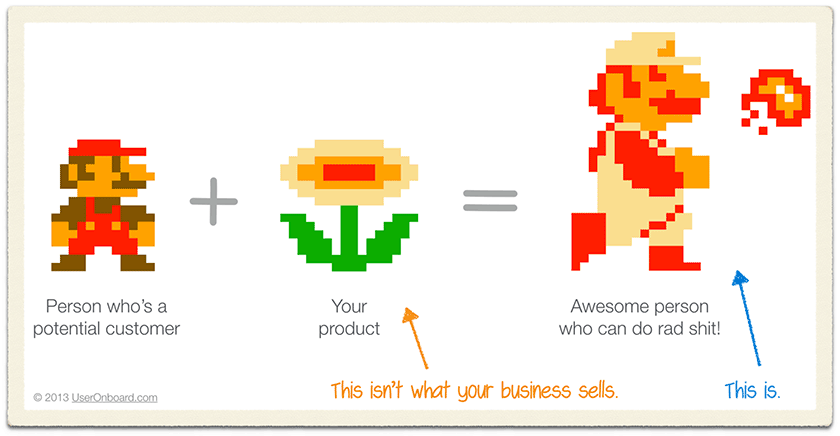

Lemme tell you a story about careers, the web, and spotting trends.

It's 2001 and young Swizec over here writes his first HTML in a high school computer class. Font tags and tables and all the rest.

That's the oldest photo I could find, 2008. Growing up before Facebook is weird like that.

So here I was in this basic computer class and HTML is blowing my mind. _You mean I can just write &lt;b>bold text&lt;/b> and it shows up on the screen!?_ 🤯

All I'd built before were DOS apps in Turbo Pascal and Windows apps in Delphi. Took a lot of code for anything to show up.

I'm not sure I even knew how to make something bold 😅

And here was this teacher telling me I don't need any of that. Not really. I can write some HTML, put a text file on a server, **and the whole world can see what I made**.

She called it not-real-programming, nothing to spend too much time worrying about, we were going to learn the real stuff. Not these silly little "scripting" and "markup" languages. She was just showing us so we'd know it exists.

But I knew it was the future.

## So I became a web developer

That year I built countless websites. I'd run home from school and build stuff. Explore what's possible. Play around.

At school I'd chat with 2 or 3 other guys who were also into websites. They told me about CSS, introduced me to internet forums, and told me there's this thing called PHP that lets you make dynamic websites.

DYNAMIC WEBSITES!?

You mean I can write real actual code with loops and variables and stuff and _change my HTML on the fly!?_

My world changed forever.

No longer restricted to building static sites with HTML and CSS, I could build entire systems. Real stuff that people could use.

I started learning the LAMP stack, turned my home computer into a server, configured my first Apache server, and discovered MySQL.

## LAMP was the future

LAMP – Linux Apache MySQL PHP – really was the future. Mid 2000's onwards everything was LAMP. Everything.

Wordpress was LAMP, Facebook was LAMP, MySpace was LAMP, everything was LAMP. Even my favorite open source social software phpBB was LAMP.

I got into open source. I wrote and released mods for phpBB. I learned about getting people to use your code. I learned about managing releases.

And all the while I kept learning tech.

Whenever something new showed up in my adjacent possible, I jumped on the chance to dig deeper.

HTML opened the gates to CSS. CSS opened the gates to ... more CSS.

But HTML also opened the gates to PHP. And that opened the gates to running a server. Which taught me about Apache and later Nginx.

To use those I had to learn about iptables, network config, NAT, routers, domain servers, and how the web works on the network layer. I even had to learn about TCP/IP and how HTTP is built on top.

As my projects grew in complexity, I learned about system design, about architecture. The MVC architecture – Model View Controller – was the new big thing.

In Silicon Valley, Rails was becoming popular. But I didn't know that. Nobody told me.

Instead I learned second hand. From people in the PHP universe learning from Rails and rewriting their apps to this new approach.

## Ajax shows up, changes everything

Around 2008, Ajax flashes onto the scene.

No longer do you have to reload the whole web page to update some small part.

I jump into JavaScript. Start learning everything I can.

The web is full of DHTML tutorials from the 90's. From before Ajax was a thing. JavaScript is all about weird cursor effects, image galleries, and annoying popups.

But modern JavaScript is a whole new beast. It's a real thing.

I know deep in my gut that JavaScript is the future. That it's about to change everything and become _The Way_ we write websites.

So I let go of PHP and dive into JavaScript.

At first I build small widgets. Little things for websites. A gallery here, a preview there. My Ajax morphs from loading HTML fragments to returning JSON data.

## The SPA is born

And so I discover the SPA – single page app.

While the old farts gripe about how JavaScript isn't a real language and how it's destroying everything they hold dear, us younguns invent the future.

A world of single page webapps.

No more page reloads. No more HTML stitched together on the server. Just a glorified database serving JSON data to REST requests and an entire UI built right in the browser.

The third paradigm shift in my web development career. The web moves fast 😛

That's where we're at right now.

Our users live in the browser. Our browsers are more powerful than ever. Our desktop apps are often just browsers running a webapp.

## A new paradigm shift is coming

Our tools are better than they were in 2010, we've got React and build systems and CDNs and CSS-in-JS and Npm and so many other tools.

But we're still following the SPA paradigm.

You build a server with MVC and expose a RESTful API. Make requests from your clients both web and mobile, read the JSON data, and create your UI on the fly. React (or Vue) on the web, native stuff on the phone and tablet.

Your biggest problem is managing complexity, orchestrating multiple requests for a single page, dealing with spotty connections, and scaling it all so it works for everyone and doesn't break the bank. It's hard.

We're at an inflection point. A paradigm shift is brewing.

## What's our future for the web?

You can never know for sure, but I've been pretty lucky so far. Here's what I think the future looks like 👇

– **serverless backends** Serverless is going to eat the backend. The cloud was a great shift in thinking that moved us from physical to logical servers, but the way we write code remained the same. That's changing. No more servers, just functions. – **progressive web apps – PWA** Webapps are going progressive. An offline-first approach makes webapps work not only offline, but also stay fast in areas with spotty internet. Optimistic updates keep your UI fresh and sync data when possible. – **GraphQL** changes how we think about the API layer. Write complex queries on the frontend, expose your data on the backend, agree on potential types and let the infrastructure handle the rest. No more begging backend engineers to add a parameter, no more gigantic payloads with ten times more data than you need. – **design systems take over** and we finally reach the dream that everyone always promised: A designer, or team of designers, takes care of your styles and you as the engineer don't have to fiddle around. Build UI with a suite of components, the right tools, and it magically comes out looking perfect. – **more full-stack engineers** with the simplification of backend to "just JavaScript functions" and delegating most system complexity to serverless providers, everyone can own the full stack again. Write your frontend code, add a function on the backend, it's all pretty much the same.

It's a glorious beautiful future my friend and I'm excited. Paradigm shifts are fun 🏄‍♀️

What do you think is coming next? [tweet me](https://twitter.com/swizec).