A fully functioning [LOLCODE-to-JavaScript compiler](https://github.com/Swizec/lolcode-babel-macro) implemented as a Babel macro. You never thought you wanted this and now here it is. You're welcome. 🐱

Let me start by proving that this crazy contraption works 👇

[lolcodemacro-example](https://codesandbox.io/embed/github/Swizec/lolcode.macro-example/tree/master/?fontsize=14)

Here you have a CodeSandbox with the legendary [FizzBuzz](https://en.wikipedia.org/wiki/Fizz_buzz) implemented in LOLCODE. A Babel macro compiles it to a JavaScript function at build-time and you use it as any ole JavaScript at runtime.

LOLCODE goes in 🐱

[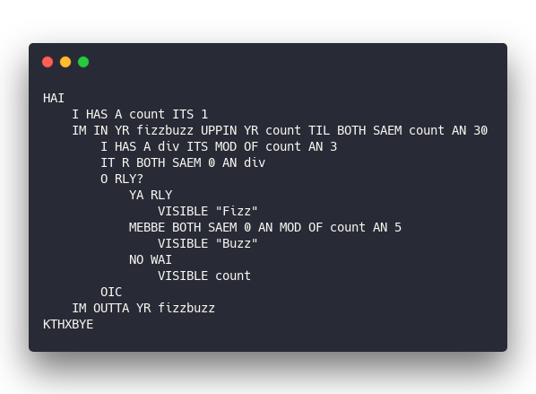](https://carbon.now.sh/?bg=rgba(255,255,255,1)&t=seti&l=lolcode&ds=true&wc=true&wa=true&pv=48px&ph=32px&ln=false&code=HAI%0A%20%20%20%20I%20HAS%20A%20count%20ITS%201%0A%20%20%20%20IM%20IN%20YR%20fizzbuzz%20UPPIN%20YR%20count%20TIL%20BOTH%20SAEM%20count%20AN%2030%0A%20%20%20%20%20%20%20%20I%20HAS%20A%20div%20ITS%20MOD%20OF%20count%20AN%203%0A%20%20%20%20%20%20%20%20IT%20R%20BOTH%20SAEM%200%20AN%20div%0A%20%20%20%20%20%20%20%20O%20RLY%3F%0A%20%20%20%20%20%20%20%20%20%20%20%20YA%20RLY%0A%20%20%20%20%20%20%20%20%20%20%20%20%20%20%20%20VISIBLE%20%22Fizz%22%0A%20%20%20%20%20%20%20%20%20%20%20%20MEBBE%20BOTH%20SAEM%200%20AN%20MOD%20OF%20count%20AN%205%0A%20%20%20%20%20%20%20%20%20%20%20%20%20%20%20%20VISIBLE%20%22Buzz%22%0A%20%20%20%20%20%20%20%20%20%20%20%20NO%20WAI%0A%20%20%20%20%20%20%20%20%20%20%20%20%20%20%20%20VISIBLE%20count%0A%20%20%20%20%20%20%20%20OIC%0A%20%20%20%20IM%20OUTTA%20YR%20fizzbuzz%0AKTHXBYE)

JavaScript comes out ✌️

[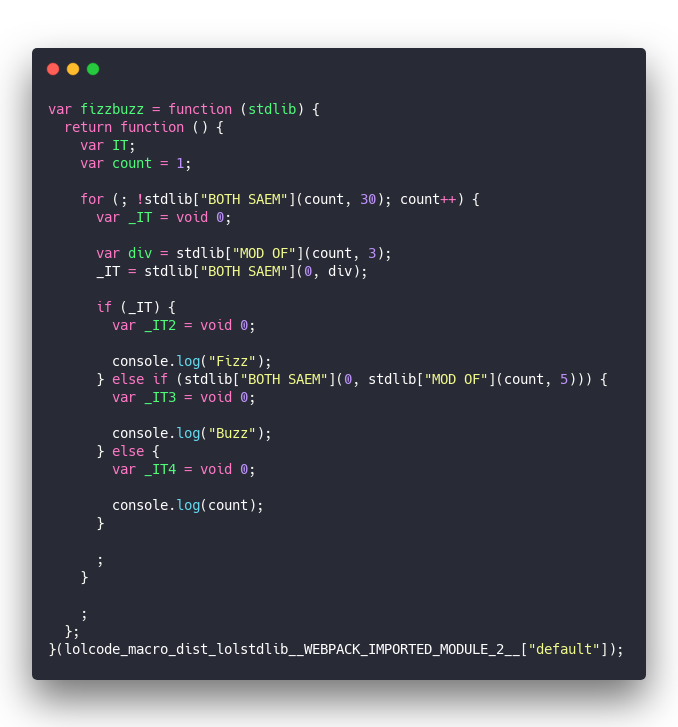](https://carbon.now.sh/?bg=rgba(255,255,255,1)&t=seti&l=javascript&ds=true&wc=true&wa=true&pv=48px&ph=32px&ln=false&code=var%20fizzbuzz%20%3D%20function%20(stdlib)%20%7B%0A%20%20return%20function%20()%20%7B%0A%20%20%20%20var%20IT%3B%0A%20%20%20%20var%20count%20%3D%201%3B%0A%0A%20%20%20%20for%20(%3B%20!stdlib%5B%22BOTH%20SAEM%22%5D(count%2C%2030)%3B%20count%2B%2B)%20%7B%0A%20%20%20%20%20%20var%20_IT%20%3D%20void%200%3B%0A%0A%20%20%20%20%20%20var%20div%20%3D%20stdlib%5B%22MOD%20OF%22%5D(count%2C%203)%3B%0A%20%20%20%20%20%20_IT%20%3D%20stdlib%5B%22BOTH%20SAEM%22%5D(0%2C%20div)%3B%0A%0A%20%20%20%20%20%20if%20(_IT)%20%7B%0A%20%20%20%20%20%20%20%20var%20_IT2%20%3D%20void%200%3B%0A%0A%20%20%20%20%20%20%20%20console.log(%22Fizz%22)%3B%0A%20%20%20%20%20%20%7D%20else%20if%20(stdlib%5B%22BOTH%20SAEM%22%5D(0%2C%20stdlib%5B%22MOD%20OF%22%5D(count%2C%205)))%20%7B%0A%20%20%20%20%20%20%20%20var%20_IT3%20%3D%20void%200%3B%0A%0A%20%20%20%20%20%20%20%20console.log(%22Buzz%22)%3B%0A%20%20%20%20%20%20%7D%20else%20%7B%0A%20%20%20%20%20%20%20%20var%20_IT4%20%3D%20void%200%3B%0A%0A%20%20%20%20%20%20%20%20console.log(count)%3B%0A%20%20%20%20%20%20%7D%0A%0A%20%20%20%20%20%20%3B%0A%20%20%20%20%7D%0A%0A%20%20%20%20%3B%0A%20%20%7D%3B%0A%7D(lolcode_macro_dist_lolstdlib__WEBPACK_IMPORTED_MODULE_2__%5B%22default%22%5D)%3B)

Taken from Chrome DevTools source maps. That's after Webpack and Babel do their thing. Intermediate output from `lolcode.macro` is modern JavaScript with lets and consts.

Ok so how does this work?

You can see the [full source code on GitHub](https://github.com/Swizec/lolcode-babel-macro).

You can also watch me build [lolcode-babel-macro](https://github.com/Swizec/lolcode-babel-macro) from scratch in a series of livecode videos. 👇

[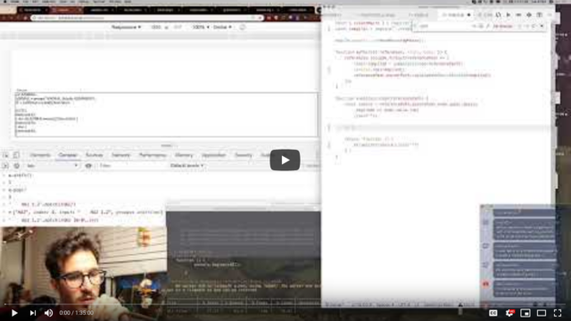](https://www.youtube.com/watch?v=-5GN_ozw7rk)

[part 2](https://www.youtube.com/watch?v=jM_qSs4TBd0), [part 3](https://www.youtube.com/watch?v=LxekQLDmgHw), [part 4](https://www.youtube.com/watch?v=C0OTz47m1To), [part 5](https://www.youtube.com/watch?v=dGzXWM7qJ5o)

## What is LOLCODE

[LOLCODE](http://www.lolcode.org/) is an esoteric programming language from 2007. The peak of the lolcat meme when the internet was for cats.

You might remember i can haz cheezburger?

Yeah that was 12 years ago my friends. We're getting old. Some of you might not even remember. A coworker recently said he's "happy that the internet has moved on from such silly nonsense".

Kids these days have TikTok and Snapchat filters so has it really? 🤔

Anyway, Adam Lindsay asked the \\important question: _"What if you could write code like cats speak?"_. LOLCODE was the answer.

Despite a never quite finished spec, several interpreters exist and maybe a compiler or two. I wasn't able to find a JavaScript compiler even though interpreters do exist.

One such interpreter is [loljs by Mark Watkinson](https://github.com/markwatkinson/loljs). I used it as the basis for my compiler.

_Aside: an [interpreter](https://en.wikipedia.org/wiki/Interpreter_(computing)) executes your code as it's read, a [compiler](https://en.wikipedia.org/wiki/Compiler) translates it to a different language (or machine code) to be executed later. Important distinction_

## What is a Babel macro

A Babel macro is a sort of language extension for JavaScript. Since modern JavaScript is a compiled language, usually from modern JS to ES5, we can add fun features to the compilation step.

The most common type of Babel macro are prefixed ES6 strings. You may have seen them as GraphQL queries or CSS-in-JS. JSX is a Babel plugin. Similar to a macro but different mechanics.

For example:

[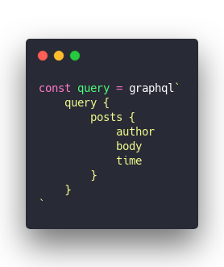](https://carbon.now.sh/?bg=rgba(255,255,255,1)&t=seti&l=javascript&ds=true&wc=true&wa=true&pv=48px&ph=32px&ln=false&code=const%20query%20%3D%20graphql%60%0A%09query%20%7B%0A%09%09posts%20%7B%0A%09%09%09author%0A%09%09%09body%0A%09%09%09time%0A%09%09%7D%0A%09%7D%0A%60)

That is a Babel macro.

At compile-time Babel looks for the `graphql` function. `graphql` compiles the query into a JavaScript function, which gets inserted in place of that string.

When your browser executes the resulting JavaScript it has no idea that a string used to live there.

Zero run-time overhead 🤘

Macros are _extremely_ powerful and many programming communities have decided they're _too_ powerful. More trouble than they're worth.

JavaScript so far has been sensible about sticking with obvious macros and not, say, overwriting how `+` works.

## How to build a Babel macro

The easiest way to build a Babel macro is with Kent C Dodds's [babel-plugin-macros](https://github.com/kentcdodds/babel-plugin-macros) library. The [author docs](https://github.com/kentcdodds/babel-plugin-macros#author-docs) are pretty good.

You follow a 3 step process:

1. Create a `macro.js` file (naming convention matters)
2. Get the wrapper function

[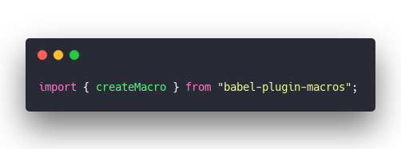](https://carbon.now.sh/?bg=rgba(255,255,255,1)&t=seti&l=javascript&ds=true&wc=true&wa=true&pv=48px&ph=32px&ln=false&code=\import%20%7B%20createMacro%20%7D%20from%20%22babel-plugin-macros%22%3B)

3. Write your function

[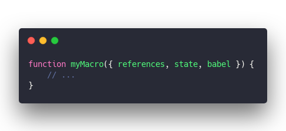](https://carbon.now.sh/?bg=rgba(255,255,255,1)&t=seti&l=javascript&ds=true&wc=true&wa=true&pv=48px&ph=32px&ln=false&code=function%20myMacro(%7B%20references%2C%20state%2C%20babel%20%7D)%20%7B%0A%09%2F%2F%20...%0A%7D)

4. Default export your function wrapped in `createMacro`

[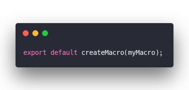](https://carbon.now.sh/?bg=rgba(255,255,255,1)&t=seti&l=javascript&ds=true&wc=true&wa=true&pv=48px&ph=32px&ln=false&code=export%20default%20createMacro(myMacro)%3B)

Somehow this creates a named export. I'm not sure why or how, but that's how it is. Best not to poke.

You also _cannot export anything alongside your macro_. Which is a shame and caused me many grief. You can work around it by letting people \\import other files in your library.

### Your macro function

The macro function itself can get tricky. You're dealing with [Abstract Syntax Trees (AST)](https://en.wikipedia.org/wiki/Abstract_syntax_tree). It's up to you to modify as you see fit.

In my case that was finding all `lolcode` nodes and replacing them with compiled code.

&t=seti&l=javascript&ds=true&wc=true&wa=true&pv=48px&ph=32px&ln=false&code=function%20myMacro(%7B%20references%2C%20state%2C%20babel%20%7D)%20%7B%0A%20%20%20%20references.lolcode.forEach(referencePath%20%3D%3E%20%7B%0A%20%20%20%20%20%20%20%20const%20compiled%20%3D%20compileLolcode(referencePath)%3B%0A%20%20%20%20%20%20%20%20referencePath.parentPath.replaceWithSourceString(compiled)%3B%0A%20%20%20%20%7D)%3B%0A%7D)

`references` is a reference to the JavaScript AST. `state` and `babel` are the same as they are in a normal Babel plugin. Which isn't helpful, if you've never built a Babel plugin 😅

My macro ends up replacing each lolcode's parent node with the compiled string. That worked well.

## How to build a compiler

Most compilers are split into 3 parts:

1. [The front-end](https://en.wikipedia.org/wiki/Compiler#Front_end), which uses a Lexer and a Parser to turn your code into an AST
2. [The middle-end](https://en.wikipedia.org/wiki/Compiler#Middle_end), which performs optimizations and other transformations on your AST
3. [The back-end](https://en.wikipedia.org/wiki/Compiler#Back_end), which turns your AST into the final output code

In theory you can swap these parts around.

Once you have a back-end that generates JavaScript from an AST, you can attach different front-ends to compile other languages to JavaScript. Once you have a front-end, you can use different target outputs. Etc.

Best explained with a LOLCODE example 👇

## Creating a LOLCODE-to-JavaScript compiler

The swappability of compiler parts is what helped me build [lolcode-babel-macro](https://github.com/Swizec/lolcode-babel-macro).

I found a working lexer-parser-AST online, [loljs by Mark Watkinson](https://github.com/markwatkinson/loljs), updated it to work in modern JavaScript creating [@swizec/loljs](https://github.com/Swizec/loljs), and replaced the interpreting back-end with a compiler.

### The tokenizer, lexer, and parser

The first step in compiling code is a tokenizer. [Tokenizers](https://en.wikipedia.org/wiki/Lexical_analysis#Tokenization) take plain strings or files and turn them into lists of tokens. Usually a combination of split-by-space and regex.

The LOLCODE tokenizer turns strings like `O RLY?` into `O_RLY` tokens, `I HAS A` into `VAR_DEC`, `BIGGR THAN` into `BIN_OP` etc. You can see the full list [here](https://github.com/Swizec/loljs/blob/master/src/loljs.jison), lines 6 to 86.

#### The lexer

The next step is a [lexer](https://en.wikipedia.org/wiki/Lexical_analysis), which turns combinations of tokens into recognizable sequences. This is your grammar definition and is best used with a parser generator like [bison](https://en.wikipedia.org/wiki/GNU_Bison), or its JavaScript counterpart [jison](https://github.com/zaach/jison).

You don't want to write your own parser from scratch, trust me.

The full grammar definition for LOLCODE lives here 👉 [loljs.jison](https://github.com/Swizec/loljs/blob/master/src/loljs.jison).

It's a series of lexical definitions 👇

[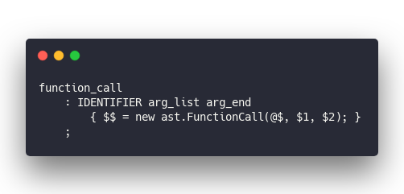](https://carbon.now.sh/?bg=rgba(255,255,255,1)&t=seti&l=jison&ds=true&wc=true&wa=true&pv=48px&ph=32px&ln=false&code=function_call%0A%20%20%20%20%3A%20IDENTIFIER%20arg_list%20arg_end%0A%20%20%20%20%20%20%20%20%7B%20%24%24%20%3D%20new%20ast.FunctionCall(%40%24%2C%20%241%2C%20%242)%3B%20%7D%0A%20%20%20%20%3B)

A function call has an `IDENTIFIER`, followed by an `arg_list` node, and an `arg_end` node.

[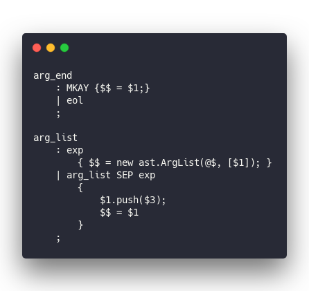](https://carbon.now.sh/?bg=rgba(255,255,255,1)&t=seti&l=jison&ds=true&wc=true&wa=true&pv=48px&ph=32px&ln=false&code=arg_end%0A%20%20%20%20%3A%20MKAY%20%7B%24%24%20%3D%20%241%3B%7D%0A%20%20%20%20%7C%20eol%0A%20%20%20%20%3B%0A%0Aarg_list%0A%20%20%20%20%3A%20exp%0A%20%20%20%20%20%20%20%20%7B%20%24%24%20%3D%20new%20ast.ArgList(%40%24%2C%20%5B%241%5D)%3B%20%7D%0A%20%20%20%20%7C%20arg_list%20SEP%20exp%0A%20%20%20%20%20%20%20%20%7B%0A%20%20%20%20%20%20%20%20%20%20%20%20%241.push(%243)%3B%0A%20%20%20%20%20%20%20%20%20%20%20%20%24%24%20%3D%20%241%0A%20%20%20%20%20%20%20%20%7D%0A%20%20%20%20%3B)

`arg_end` and `arg_list` in turn are built out of more tokens and nodes. The rabbit hole goes very deep and I'm happy that somebody else wrote all that for me :)

I remember doing this in my compilers class in college and _it was not fun_. Easy to make mistakes, hard to verify.

#### The parser

Jison takes your LOLCODE grammar and [turns it into a parser](https://github.com/Swizec/loljs/blob/master/parser.js).

A parser looks like normal JavaScript code except it's a little soupy and 3455 lines long. You really don't want to write parsers by hand.

Here's what the parser code looks like

[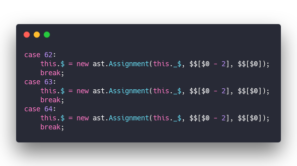](https://carbon.now.sh/?bg=rgba(255,255,255,1)&t=seti&l=javascript&ds=true&wc=true&wa=true&pv=48px&ph=32px&ln=false&code=case%2062%3A%0A%20%20%20%20this.%24%20%3D%20new%20ast.Assignment(this._%24%2C%20%24%24%5B%240%20-%202%5D%2C%20%24%24%5B%240%5D)%3B%0A%20%20%20%20break%3B%0Acase%2063%3A%0A%20%20%20%20this.%24%20%3D%20new%20ast.Assignment(this._%24%2C%20%24%24%5B%240%20-%202%5D%2C%20%24%24%5B%240%5D)%3B%0A%20%20%20%20break%3B%0Acase%2064%3A%0A%20%20%20%20this.%24%20%3D%20new%20ast.Assignment(this._%24%2C%20%24%24%5B%240%20-%202%5D%2C%20%24%24%5B%240%5D)%3B%0A%20%20%20%20break%3B)

A convoluted series of hundreds of `new ast.X` calls to create an abstract syntax tree based on your grammar and your AST definition.

Best stick to defining the grammar and let parser generators do the rest.

### The AST

As you can see above, your parser needs an AST definition. What does your code look like as a JavaScript object tree?

Again thanks to Mark Watkinson, I didn't have to write my own 👉 [the LOLCODE AST](https://github.com/Swizec/loljs/blob/master/src/ast.js)

Defining your AST can be tedious, but it's not very complex. A function call node looks like this

&t=seti&l=javascript&ds=true&wc=true&wa=true&pv=48px&ph=32px&ln=false&code=lol.ast.FunctionCall%20%3D%20function%20(location%2C%20name%2C%20args)%20%7B%0A%20%20%20%20lol.ast.Node.call(this%2C%20location%2C%20'FunctionCall')%3B%0A%20%20%20%20this.name%20%3D%20name%3B%0A%20%20%20%20this.args%20%3D%20args%3B%0A%7D%3B)

To generate a `FunctionCall` node, you need a `location`, a `name`, and some `args`. All coming from your parser.

You return a `Node` called `FunctionCall`, define its `name` (identifier), and `args` node. All very recursive and following the [visitor pattern](https://en.wikipedia.org/wiki/Visitor_pattern)

The resulting AST is an object a little like this (writing from memory)

[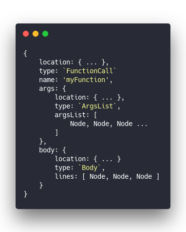](https://carbon.now.sh/?bg=rgba(255,255,255,1)&t=seti&l=javascript&ds=true&wc=true&wa=true&pv=48px&ph=32px&ln=false&code=%7B%0A%09location%3A%20%7B%20...%20%7D%2C%0A%09type%3A%20%60FunctionCall%60%0A%09name%3A%20'myFunction'%2C%0A%09args%3A%20%7B%0A%09%09location%3A%20%7B%20...%20%7D%2C%0A%09%09type%3A%20%60ArgsList%60%2C%0A%09%09argsList%3A%20%5B%0A%09%09%09Node%2C%20Node%2C%20Node%20...%0A%09%09%5D%0A%09%7D%2C%0A%09body%3A%20%7B%0A%09%09location%3A%20%7B%20...%20%7D%0A%09%09type%3A%20%60Body%60%2C%0A%09%09lines%3A%20%5B%20Node%2C%20Node%2C%20Node%20%5D%0A%09%7D%0A%7D)

An AST is a recursive JavaScript data structure. Once you get used to a node or two, everything follows familiar patterns.

### The JS output

It's these recursive AST patterns that make compiling to JavaScript so accessible. Define a method for each node type and recursively call the compiler when needed.

Like this 👇

[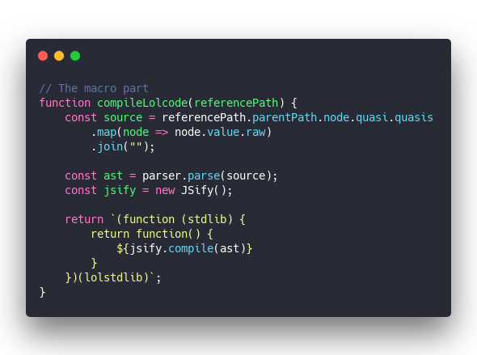](https://carbon.now.sh/?bg=rgba(255,255,255,1)&t=seti&l=javascript&ds=true&wc=true&wa=true&pv=48px&ph=32px&ln=false&code=%2F%2F%20The%20macro%20part%0Afunction%20compileLolcode(referencePath)%20%7B%0A%20%20%20%20const%20source%20%3D%20referencePath.parentPath.node.quasi.quasis%0A%20%20%20%20%20%20%20%20.map(node%20%3D%3E%20node.value.raw)%0A%20%20%20%20%20%20%20%20.join(%22%22)%3B%0A%0A%20%20%20%20const%20ast%20%3D%20parser.parse(source)%3B%0A%20%20%20%20const%20jsify%20%3D%20new%20JSify()%3B%0A%0A%20%20%20%20return%20%60(function%20(stdlib)%20%7B%0A%20%20%20%20%20%20%20%20return%20function()%20%7B%0A%20%20%20%20%20%20%20%20%20%20%20%20%24%7Bjsify.compile(ast)%7D%20%0A%20%20%20%20%20%20%20%20%7D%0A%20%20%20%20%7D)(lolstdlib)%60%3B%0A%7D)

Kent's babel macros plugin gives us the JavaScript AST. We use it to find our LOLCODE source. Hiding in `parentPath.node.quasi.quasis` in this case. We walk through all `quasis`, get their `raw` values, and join them into a string.

That's how prefixed ES6 strings work, don't know why.

Take the resulting `source` code, `parse` it, instantiate the `JSify` compiler backend, and return the output as a string. We wrap compiled code in a closure with the LOLCODE stdlib, which defines some basic functions.

All your LOLCODE instances share the same stdlib. Assumed to exist in scope via an \\import.

#### JSify – translate an AST to JavaScript

Compiling an AST to JavaScript is now a matter of recursively calling node-specific methods on the JSify object and return strings. Each method on its own is pretty small, but when they work together, the result is magical.

You can see [the full JSify file here](https://github.com/Swizec/lolcode-babel-macro/blob/master/src/JSify.js).

Keeping with our FunctionCall example from earlier ...

[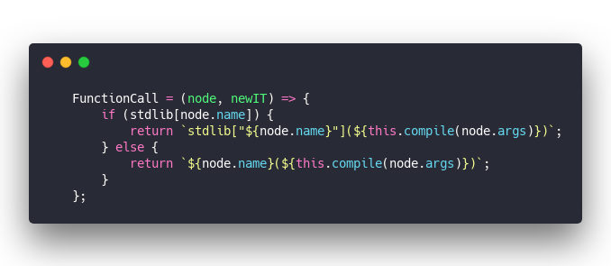](https://carbon.now.sh/?bg=rgba(255,255,255,1)&t=seti&l=javascript&ds=true&wc=true&wa=true&pv=48px&ph=32px&ln=false&code=%20%20%20%20FunctionCall%20%3D%20(node%2C%20newIT)%20%3D%3E%20%7B%0A%20%20%20%20%20%20%20%20if%20(stdlib%5Bnode.name%5D)%20%7B%0A%20%20%20%20%20%20%20%20%20%20%20%20return%20%60stdlib%5B%22%24%7Bnode.name%7D%22%5D(%24%7Bthis.compile(node.args)%7D)%60%3B%0A%20%20%20%20%20%20%20%20%7D%20else%20%7B%0A%20%20%20%20%20%20%20%20%20%20%20%20return%20%60%24%7Bnode.name%7D(%24%7Bthis.compile(node.args)%7D)%60%3B%0A%20%20%20%20%20%20%20%20%7D%0A%20%20%20%20%7D%3B)

The `FunctionCall` method gets a `node` and a flag whether to instantiate a new `IT` context. This keeps the same function signature throughout JSify.

`IT` in LOLCODE is the implicit variable, by the way. Supposed to hold the value of the last expression ... but I had to take some liberties because this is a compiler not an interpreter. You have to explicitly assign values to `IT`, but the variable is always there for you.

`FunctionCall` then checks if this function is in `stdlib` and returns the appropriate code. Either a stdlib call or a normal function call.

We call `this.compile` for the arguments node.

[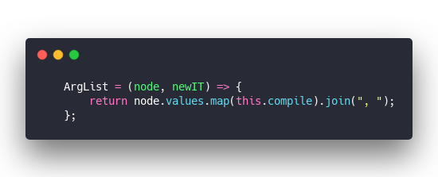](https://carbon.now.sh/?bg=rgba(255,255,255,1)&t=seti&l=javascript&ds=true&wc=true&wa=true&pv=48px&ph=32px&ln=false&code=%20%20%20%20ArgList%20%3D%20(node%2C%20newIT)%20%3D%3E%20%7B%0A%20%20%20%20%20%20%20%20return%20node.values.map(this.compile).join(%22%2C%20%22)%3B%0A%20%20%20%20%7D%3B)

Compiling the `ArgList` node is similar 👉 walk through list of values and recursively call `this.compile` for each node. Who knows what expression might lie in there :)

`this.compile` itself is pretty simple, a switch statement 👇

[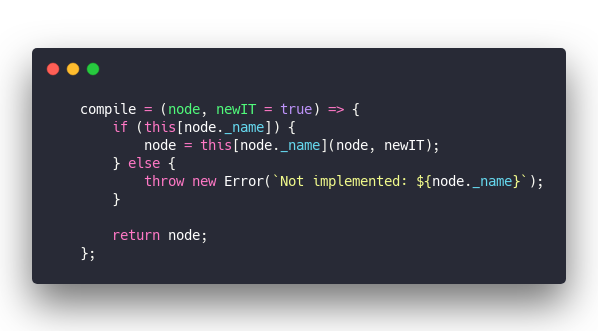](https://carbon.now.sh/?bg=rgba(255,255,255,1)&t=seti&l=javascript&ds=true&wc=true&wa=true&pv=48px&ph=32px&ln=false&code=%20%20%20%20compile%20%3D%20(node%2C%20newIT%20%3D%20true)%20%3D%3E%20%7B%0A%20%20%20%20%20%20%20%20if%20(this%5Bnode._name%5D)%20%7B%0A%20%20%20%20%20%20%20%20%20%20%20%20node%20%3D%20this%5Bnode._name%5D(node%2C%20newIT)%3B%0A%20%20%20%20%20%20%20%20%7D%20else%20%7B%0A%20%20%20%20%20%20%20%20%20%20%20%20throw%20new%20Error(%60Not%20implemented%3A%20%24%7Bnode._name%7D%60)%3B%0A%20%20%20%20%20%20%20%20%7D%0A%0A%20%20%20%20%20%20%20%20return%20node%3B%0A%20%20%20%20%7D%3B)

Checks if it recognizes the node type and calls the appropriate method. If not, it throws an error.

And that's how a bunch of small functions work together to produce complex JavaScript code based on your LOLCODE.

[lolcodemacro-example](https://codesandbox.io/embed/github/Swizec/lolcode.macro-example/tree/master/?fontsize=14)

## But why?

Why not?

LOLCODE is amazing, JavaScript is awesome, and putting them together is ... completely useless let's be honest. Intellectually gratifying but pointless.

HOWEVER, this opens the door for future hacking 👇

1. Great excuse to learn about Babel macros
2. Superb way to practice building a small compiler
3. Get some plug-and-play pieces of tech to build interesting DSLs for JavaScript
4. Unlocks where I got stuck last time I tried to build an AI system that writes JavaScript based on specs

That last part 😏