You know that feeling when you meet an old friend you haven't seen in years? You used to be so close but ...

_"Long time huh ..."_

_"Yeah time flies ... how's the wife?"_

_"Girlfriend. She's good, just started a new job ..."_

_"Nice nice ... you still at that startup?"_

_"Yeah ... it's okay ... you?"_

_"Nah, new gig last year. Think I told you, dunno"_

_"Maybe you did, hard to keep track ... liking it?"_

A beer or two later and you're back to being best buds. Suddenly it's 1am and a long yawn reminds you that you're not quite so young anymore.

That's what messing around with jQuery felt like after all these years.

I was bored Monday night and decided to see if I still know how to build with jQuery. Nothing better to do, no pressing ideas, a bit of fun.

Also a favor for a friend who's preparing to talk about React to a bunch of people who've never seen it before 😛

https&#x3A;//www.youtube.com/watch?v=BP1I28jWuOY

It's funny, jQuery is so old now (2 years since new versions stopped coming) I feel like I almost have to introduce the darn thing. Used to be the backbone of the web, now it's in the dustbin of history.

Pushed web development forward for its entire 10 year run. Oh the memories ...

So, how does jQuery stack up to React and how does React stack up to Svelte? Let's see 👇

## React app

[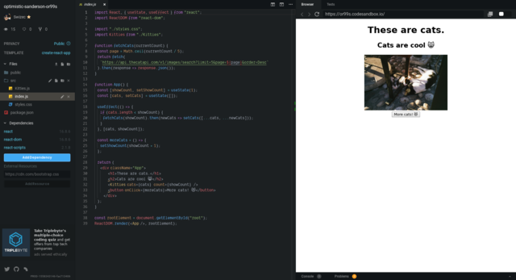](https://codesandbox.io/s/optimistic-sanderson-or99s)

Started with a React app. It's what I'm most familiar with right now.

We built a cat app. Fetches 5 cats from [thecatapi](https://thecatapi.com/), shows first cat. Click a button, get more cats.

When app runs out of cats, it fetches more.

[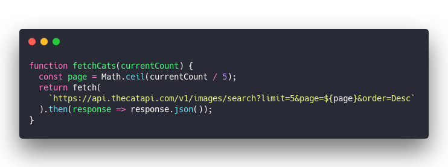](https://carbon.now.sh/?bg=rgba(255,255,255,1)&t=seti&l=javascript&ds=true&wc=true&wa=true&pv=48px&ph=32px&ln=false&code=function%20fetchCats(currentCount)%20%7B%0A%20%20const%20page%20%3D%20Math.ceil(currentCount%20%2F%205)%3B%0A%20%20return%20fetch(%0A%20%20%20%20%60https%3A%2F%2Fapi.thecatapi.com%2Fv1%2Fimages%2Fsearch%3Flimit%3D5%26page%3D%24%7Bpage%7D%26order%3DDesc%60%0A%20%20).then(response%20%3D%3E%20response.json())%3B%0A%7D)

`fetchCats` returns a promise with a bunch of cats. Pagination works based on current count of cats we've got.

Rendering a list of cats happens in a `<Kitties />` component. 'tis but a loop

[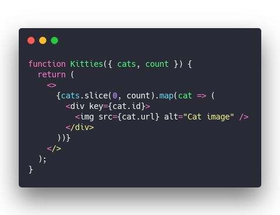](https://carbon.now.sh/?bg=rgba(255,255,255,1)&t=seti&l=javascript&ds=true&wc=true&wa=true&pv=48px&ph=32px&ln=false&code=function%20Kitties(%7B%20cats%2C%20count%20%7D)%20%7B%0A%20%20return%20(%0A%20%20%20%20%3C%3E%0A%20%20%20%20%20%20%7Bcats.slice(0%2C%20count).map(cat%20%3D%3E%20(%0A%20%20%20%20%20%20%20%20%3Cdiv%20key%3D%7Bcat.id%7D%3E%0A%20%20%20%20%20%20%20%20%20%20%3Cimg%20src%3D%7Bcat.url%7D%20alt%3D%22Cat%20image%22%20%2F%3E%0A%20%20%20%20%20%20%20%20%3C%2Fdiv%3E%0A%20%20%20%20%20%20))%7D%0A%20%20%20%20%3C%2F%3E%0A%20%20)%3B%0A%7D)

Take list of `cats`, `count` how many the user wants to see, `slice` the array, render each cat as an image. 👌

Driving this logic with React Hooks isn't bad. React's ergonomics are getting real good.

[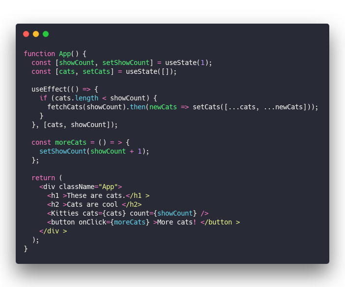](https://carbon.now.sh/?bg=rgba(255,255,255,1)&t=seti&l=javascript&ds=true&wc=true&wa=true&pv=48px&ph=32px&ln=false&code=function%20App()%20%7B%0A%20%20const%20%5BshowCount%2C%20setShowCount%5D%20%3D%20useState(1)%3B%0A%20%20const%20%5Bcats%2C%20setCats%5D%20%3D%20useState(%5B%5D)%3B%0A%0A%20%20useEffect(()%20%3D%3E%20%7B%0A%20%20%20%20if%20(cats.length%20%3C%20showCount)%20%7B%0A%20%20%20%20%20%20fetchCats(showCount).then(newCats%20%3D%3E%20setCats(%5B...cats%2C%20...newCats%5D))%3B%0A%20%20%20%20%7D%0A%20%20%7D%2C%20%5Bcats%2C%20showCount%5D)%3B%0A%0A%20%20const%20moreCats%20%3D%20()%20%3D%20%3E%20%7B%0A%20%20%20%20setShowCount(showCount%20%2B%201)%3B%0A%20%20%7D%3B%0A%0A%20%20return%20(%0A%20%20%20%20%3Cdiv%20className%3D%22App%22%3E%0A%20%20%20%20%20%20%3Ch1%20%3EThese%20are%20cats.%3C%2Fh1%20%3E%0A%20%20%20%20%20%20%3Ch2%20%3ECats%20are%20cool%20%3C%2Fh2%3E%0A%20%20%20%20%20%20%3CKitties%20cats%3D%7Bcats%7D%20count%3D%7BshowCount%7D%20%2F%3E%0A%20%20%20%20%20%20%3Cbutton%20onClick%3D%7BmoreCats%7D%20%3EMore%20cats!%20%3C%2Fbutton%20%3E%0A%20%20%20%20%3C%2Fdiv%20%3E%0A%20%20)%3B%0A%7D)

We got `useState` for the count of cats, and a `useEffect` to deal with fetching. Fetches on first load and makes sure to fetch more when `showCount` is bigger than the current amount of cats.

React handles the rest.

## jQuery app

[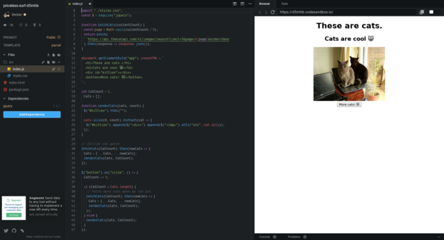](https://codesandbox.io/s/priceless-surf-d5mhb)

The hardest part of building the jQuery version was figuring out how to \\import jQuery in a modern compiled-JavaScript app. 😂

No seriously, I struggled, tried a bunch of things, and ended up with a good old script tag and a public CDN.

[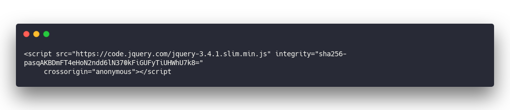](https://carbon.now.sh/?bg=rgba(255,255,255,1)&t=seti&l=html&ds=true&wc=true&wa=true&pv=48px&ph=32px&ln=false&code=%3Cscript%20src%3D%22https%3A%2F%2Fcode.jquery.com%2Fjquery-3.4.1.slim.min.js%22%20integrity%3D%22sha256-pasqAKBDmFT4eHoN2ndd6lN370kFiGUFyTiUHWhU7k8%3D%22%0A%09%20crossorigin%3D%22anonymous%22%3E%3C%2Fscript%3E)

People don't do that in real life anymore. It's all \\import this \\import that.

For the app itself we used a naive unoptimized approach much like many jQuery apps of old 👉 find div, empty div, render everything from scratch every time.

[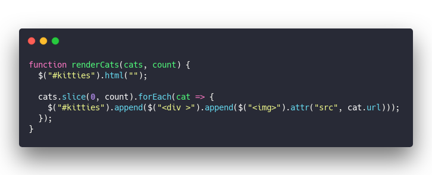](https://carbon.now.sh/?bg=rgba(255,255,255,1)&t=seti&l=javascript&ds=true&wc=true&wa=true&pv=48px&ph=32px&ln=false&code=function%20renderCats(cats%2C%20count)%20%7B%0A%20%20%24(%22%23kitties%22).html(%22%22)%3B%0A%0A%20%20cats.slice(0%2C%20count).forEach(cat%20%3D%3E%20%7B%0A%20%20%20%20%24(%22%23kitties%22).append(%24(%22%3Cdiv%20%3E%22).append(%24(%22%3Cimg%3E%22).attr(%22src%22%2C%20cat.url)))%3B%0A%20%20%7D)%3B%0A%7D)

Notice the mess with creating a small component tree of `

`? Painful. JSX improved this a lot. Almost can't believe we used to build complex apps like this.

You can see it's slow too.

Open [the CodeSandbox](https://codesandbox.io/s/priceless-surf-d5mhb), add a couple cats. You'll see the more cats there are the slower the app gets.

Not so with React because React avoids re-rendering components that don't change.

PS: check out this mess of attaching a button click handler and driving the cat fetching logic.

[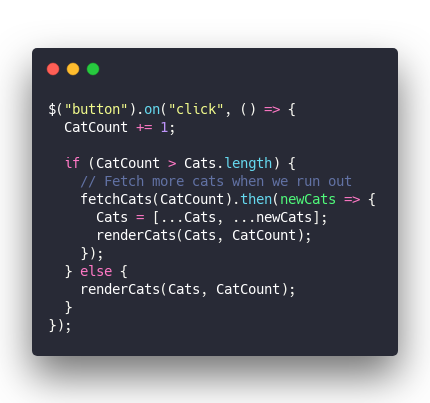](https://carbon.now.sh/?bg=rgba(255,255,255,1)&t=seti&l=javascript&ds=true&wc=true&wa=true&pv=48px&ph=32px&ln=false&code=%24(%22button%22).on(%22click%22%2C%20()%20%3D%3E%20%7B%0A%20%20CatCount%20%2B%3D%201%3B%0A%0A%20%20if%20(CatCount%20%3E%20Cats.length)%20%7B%0A%20%20%20%20%2F%2F%20Fetch%20more%20cats%20when%20we%20run%20out%0A%20%20%20%20fetchCats(CatCount).then(newCats%20%3D%3E%20%7B%0A%20%20%20%20%20%20Cats%20%3D%20%5B...Cats%2C%20...newCats%5D%3B%0A%20%20%20%20%20%20renderCats(Cats%2C%20CatCount)%3B%0A%20%20%20%20%7D)%3B%0A%20%20%7D%20else%20%7B%0A%20%20%20%20renderCats(Cats%2C%20CatCount)%3B%0A%20%20%7D%0A%7D)%3B)

🤮

I like hooks.

## Svelte app

[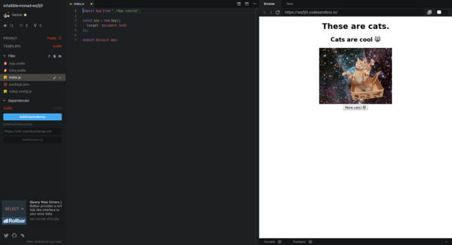](https://codesandbox.io/s/infallible-monad-wq5j9)

The Svelte version wins in the immense straightforward simplicity of it all. I'm pretty blown away.

Check out the `<Kitty />` component

&t=seti&l=javascript&ds=true&wc=true&wa=true&pv=48px&ph=32px&ln=false&code=%3Cscript%3E%0A%20%20%20%20export%20let%20id%3B%0A%20%20%20%20export%20let%20url%3B%0A%3C%2Fscript%3E%0A%0A%3Cstyle%20%3E%0A%20%20%20%20img%20%7B%0A%20%20%20%20%20%20width%3A%20300px%3B%0A%20%20%20%20%7D%0A%3C%2Fstyle%3E%0A%0A%3Cdiv%3E%0A%20%20%20%20%3Cimg%20src%3D%7Burl%7D%20alt%3D%22Kitty%20pic%22%20%2F%3E%0A%3C%2Fdiv%3E)

Gets an `id` and a `url`, has some `style`, and renders a div with an image. Pretty slick, looks almost like pure HTML.

Then you got the component that drives state and renders a bunch of kitties with a button.

[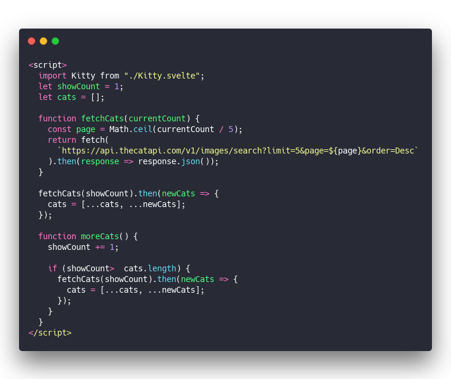](https://carbon.now.sh/?bg=rgba(255,255,255,1)&t=seti&l=javascript&ds=true&wc=true&wa=true&pv=48px&ph=32px&ln=false&code=%3Cscript%3E%0A%20%20\import%20Kitty%20from%20%22.%2FKitty.svelte%22%3B%0A%20%20let%20showCount%20%3D%201%3B%0A%20%20let%20cats%20%3D%20%5B%5D%3B%0A%0A%20%20function%20fetchCats(currentCount)%20%7B%0A%20%20%20%20const%20page%20%3D%20Math.ceil(currentCount%20%2F%205)%3B%0A%20%20%20%20return%20fetch(%0A%20%20%20%20%20%20%60https%3A%2F%2Fapi.thecatapi.com%2Fv1%2Fimages%2Fsearch%3Flimit%3D5%26page%3D%24%7Bpage%7D%26order%3DDesc%60%0A%20%20%20%20).then(response%20%3D%3E%20response.json())%3B%0A%20%20%7D%0A%0A%20%20fetchCats(showCount).then(newCats%20%3D%3E%20%7B%0A%20%20%20%20cats%20%3D%20%5B...cats%2C%20...newCats%5D%3B%0A%20%20%7D)%3B%0A%0A%20%20function%20moreCats()%20%7B%0A%20%20%20%20showCount%20%2B%3D%201%3B%0A%0A%20%20%20%20if%20(showCount%3E%20%20cats.length)%20%7B%0A%20%20%20%20%20%20fetchCats(showCount).then(newCats%20%3D%3E%20%7B%0A%20%20%20%20%20%20%20%20cats%20%3D%20%5B...cats%2C%20...newCats%5D%3B%0A%20%20%20%20%20%20%7D)%3B%0A%20%20%20%20%7D%0A%20%20%7D%0A%3C%2Fscript%3E)

The script looks similar to React Hooks. You got some variables with state and you got a `moreCats` method that drives it.

Repeating that array merging logic twice is a little less elegant than the `useEffect` hook, but probably easier to understand how it works 🤔

Rendering is neat too

[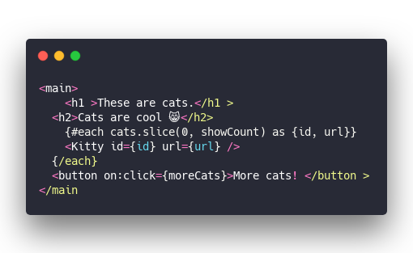](https://carbon.now.sh/?bg=rgba(255,255,255,1)&t=seti&l=javascript&ds=true&wc=true&wa=true&pv=48px&ph=32px&ln=false&code=%3Cmain%3E%0A%09%3Ch1%20%3EThese%20are%20cats.%3C%2Fh1%20%3E%0A%20%20%3Ch2%3ECats%20are%20cool%20%F0%9F%98%B8%3C%2Fh2%3E%0A%09%7B%23each%20cats.slice(0%2C%20showCount)%20as%20%7Bid%2C%20url%7D%7D%0A%20%20%20%20%3CKitty%20id%3D%7Bid%7D%20url%3D%7Burl%7D%20%2F%3E%0A%20%20%7B%2Feach%7D%0A%20%20%3Cbutton%20on%3Aclick%3D%7BmoreCats%7D%3EMore%20cats!%20%3C%2Fbutton%20%3E%0A%3C%2Fmain%3E)

Similar to React, but we used `{#each}` instead of JavaScript's `.map`. Still not sure how I feel about that but it's pretty readable you gotta admit.

## 🤔

Between you and me I think React wins this one. Maybe it's because I'm used to it.

But Svelte does look like it might be quicker to grasp for someone who's new to modern JavaScript.

What do you think?

Happy Friday,  
~Swizec