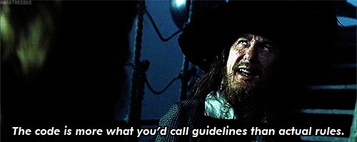
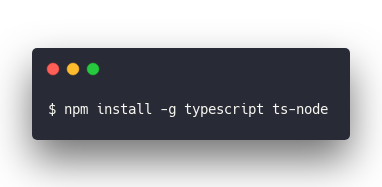
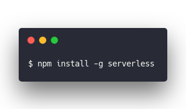
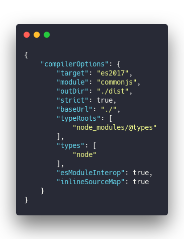
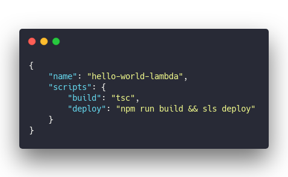
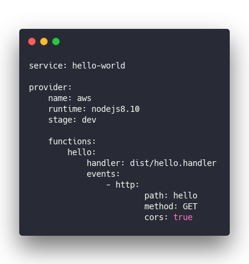
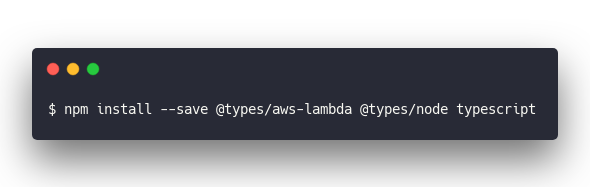
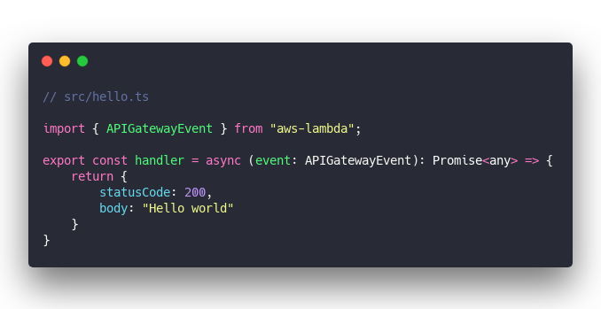

A few months ago I inherited a Kotlin project. It was an unfinished prototype and all I had to do was wrap it up and deploy.

How hard can it be?

https&#x3A;//twitter.com/Swizec/status/1103070682248704002

Weeks passed. Even months.

Every time I touched the project, it broke. Nothing worked. Wouldn't run on my machine, wouldn't read API requests, couldn't get tests working, if I changed some code I broke it all.

That's when I realized [Learning a new field is super hard](https://swizec.com/blog/learning-a-new-field-is-super-hard-i-get-it-now-%F0%9F%98%85/swizec/8974) 😅

Tried to look for help online and ... nothing. The Kotlin community just doesn't seem to exist. There's no gaggle of blogs, no quality courses, there's a few books but _everything is for Android_.

I'm using Kotlin for the backend damn it, why do I feel so alone?

With no community to be found there's only one conclusion 👉 I'm forcing Kotlin to do something it doesn't want to do. Or Kotlin is weird and on its way out.

Hell, it was easier to find LOLCODE resources for that [LOLCODE-to-JavaScript compiler](https://swizec.com/blog/lolcode-to-javascript-compiler-babel-macro/swizec/9083) the other day ...

So I said screw it and got the whole project working in TypeScript in 3 days. ✌️

## Why Kotlin? Why TypeScript?

A good question at this point: _Why did we even try Kotlin in the first place?_

There's a lot of backstory, but it's all about solving these problems 👇

- we have a Ruby on Rails backend
- it is slow
- parts of the system are struggling under load
- dynamic typing leads to bugs

We wanted to extract the most impacted subsystem. Build it so that it's fast, reliable, and easy for many developers to work with. And isolated from the rest of our monolith.

You can get speed and reliability with AWS Lambdas. You can get type safety with Java. And Java is a _very_ popular language on the backend.

But Java is hard to use and annoying to write.

Kotlin seemed like a great alternative. Runs on the Java Virtual Machine (JVM), interops with Java, and supports many modern functional idioms. Plus it's fast because the JVM is fast.

Except nobody on the team knows Kotlin.

😅

But we're smart, we can learn this! And we sort of did.

Until both the person leading the lets-move-to-JVM charge left the company and his I-love-doing-backend protege left us for a career at Google.

Backend people are a special breed, they all seem to love Java and Java-like things so much.

So here I was with this unfinished prototype, no skills in Kotlin, a deep seated distrust of all things Java from college, and an open deadline. Get it working when you can, nothing's on fire right now.

I tried. I did my best. I gave up.

### TypeScript!

TypeScript solves our problems, works _great_ with AWS Lambdas, and the whole team knows at least JavaScript.

https&#x3A;//twitter.com/Swizec/status/1132156516289482752

TypeScript with AWS Lambda 👇

- super fast because your code is small
- faster cold start times than Kotlin
- type safety for robustness

You see the thing with AWS Lambda is that you are charged for time. [Faster is cheaper](https://medium.com/@jconning/aws-lambda-faster-is-cheaper-6bf32f58d741), and while JVM functions _run_ faster, node functions [_start_ faster](https://medium.com/@nathan.malishev/lambda-cold-starts-language-comparison-%EF%B8%8F-a4f4b5f16a62).

Our functions are small so runtimes are small. But those cold starts can add up since [most Lambda calls are cold](https://hackernoon.com/im-afraid-you-re-thinking-about-aws-lambda-cold-starts-all-wrong-7d907f278a4f). It's a new computer almost every time :)

Engineering is all about tradeoffs

## How to use TypeScript for AWS Lambdas

So how do you use TypeScript to write an AWS Lambda function?

Let's write a `Hello World` function. I'm extracting this from my real code and haven't tested it. Think of this code as a guide, not a copypasta.

You start by installing the TypeScript compiler. You'll need node support too.

&t=seti&l=null&ds=true&wc=true&wa=true&pv=48px&ph=32px&ln=false&code=%24%20npm%20install%20-g%20typescript%20ts-node)

You can now write TypeScript programs and compile them with `tsc` so node can run them. Yes you'll need to compile every time before running.

But you already do that for your frontend code anyway :)

You're also going to need the Serverless framework.

&t=seti&l=null&ds=true&wc=true&wa=true&pv=48px&ph=32px&ln=false&code=%24%20npm%20install%20-g%20serverless)

At this point it's a good idea to open a new terminal window so the new CLI commands register.

Oh and you should [setup serverless AWS credentials](https://serverless.com/framework/docs/providers/aws/guide/credentials/). It's a little tedious, but you only gotta do it once for all your projects.

### tsconfig.json

Before you can seamlessly compile the whole project, you need to configure TypeScript. I copypasta'd this JSON from a blogpost and it works great. Sensible defaults I'd say 😇

&t=seti&l=json&ds=true&wc=true&wa=true&pv=48px&ph=32px&ln=false&code=%7B%0A%09%22compilerOptions%22%3A%20%7B%0A%09%09%22target%22%3A%20%22es2017%22%2C%0A%09%09%22module%22%3A%20%22commonjs%22%2C%0A%09%09%22outDir%22%3A%20%22.%2Fdist%22%2C%0A%09%09%22strict%22%3A%20true%2C%0A%09%09%22baseUrl%22%3A%20%22.%2F%22%2C%0A%09%09%22typeRoots%22%3A%20%5B%0A%09%09%09%22node_modules%2F%40types%22%0A%09%09%5D%2C%0A%09%09%22types%22%3A%20%5B%0A%09%09%09%22node%22%0A%09%09%5D%2C%0A%09%09%22esModuleInterop%22%3A%20true%2C%0A%09%09%22inlineSourceMap%22%3A%20true%0A%09%7D%0A%7D)

This tells the TypeScript compiler that you're targeting `es2017` – the latest JavaScript standard supported by Node 8.10, which is the latest Node that AWS supports. You're using `commonjs` modules, writing compiled files to `./dist` and so on.

tsconfig.json supports many options but you aren't likely to need them. At least not at first.

### The package.json

Next we'll need a package.json file with some scripts. These will help you build and deploy your code.

&t=seti&l=json&ds=true&wc=true&wa=true&pv=48px&ph=32px&ln=false&code=%7B%0A%09%22name%22%3A%20%22hello-world-lambda%22%2C%0A%09%22scripts%22%3A%20%7B%0A%09%09%22build%22%3A%20%22tsc%22%2C%0A%09%09%22deploy%22%3A%20%22npm%20run%20build%20%26%26%20sls%20deploy%22%0A%09%7D%0A%7D)

We run `tsc` to build the project, and `sls deploy` to deploy. Adding the build step to your `deploy` script makes it less likely that you'll forget to build before deploying.

Always \\important to deploy the latest code. Gets very frustrating if you don't 😅

### serverless.yml

We use `serverless.yml` to configure the Serverless framework. Using this file means you:

- never have to deal with the UI on AWS (or Azure or whatever)
- keep your system architecture in source control
- can reliably build the same server environment every time

Might seem weird at first, but once you get used to all your infrastructure being part of your code ... wow. It's like a whole new world.

Our `Hello World` example doesn't need much 👇

&t=seti&l=yaml&ds=true&wc=true&wa=true&pv=48px&ph=32px&ln=false&code=service%3A%20hello-world%0A%0Aprovider%3A%0A%09name%3A%20aws%0A%09runtime%3A%20nodejs8.10%0A%09stage%3A%20dev%0A%09%0A%09functions%3A%0A%09%09hello%3A%0A%09%09%09handler%3A%20dist%2Fhello.handler%0A%09%09%09events%3A%0A%09%09%09%09-%20http%3A%0A%09%09%09%09%09%09path%3A%20hello%0A%09%09%09%09%09%09method%3A%20GET%0A%09%09%09%09%09%09cors%3A%20true)

With that you've configured:

- an AWS Lambda function called `hello`
- an APIGateway to proxy API requests
- a CloudWatch setup for any logs

Yep. All that in those few lines of Yaml. Once you deploy Serverless will give you the URL for your hello function.

But first you gotta write it

### The hello function – src/hello.ts

Before you write the function, there's a couple dependencies I'd recommend. They make TypeScript work smoother with node and AWS.

&t=seti&l=null&ds=true&wc=true&wa=true&pv=48px&ph=32px&ln=false&code=%24%20npm%20install%20--save%20%40types%2Faws-lambda%20%40types%2Fnode%20typescript)

I'm not sure the `typescript` dependency is strictly necessary, but I have it. The two `@types` dependencies give you type information for built-in stuff.

Your hello world function looks like this 👇

&t=seti&l=typescript&ds=true&wc=true&wa=true&pv=48px&ph=32px&ln=false&code=%2F%2F%20src%2Fhello.ts%0A%0A\import%20%7B%20APIGatewayEvent%20%7D%20from%20%22aws-lambda%22%3B%0A%0Aexport%20const%20handler%20%3D%20async%20(event%3A%20APIGatewayEvent)%3A%20Promise%3Cany%3E%20%3D%3E%20%7B%0A%09return%20%7B%0A%09%09statusCode%3A%20200%2C%0A%09%09body%3A%20%22Hello%20world%22%0A%09%7D%0A%7D)

And that's it.

You're \\importing the type definition for the `APIGatewayEvent`. That specifies which properties it does and doesn't have, gives you code completion, and helpful tooltips in VS Code.

To make an endpoint, you export a function. Often called `handler` but can be anything. You specified the exact name in your serverless.yml earlier (`handler: dist/hello.handler`).

This function takes an `event`, does whatever it wants, and returns a response with a `statusCode` and a `body`. 200 means `OK`.

You can run `npm run deploy`, wait a bit, and voila you've got a URL that says `Hello World` 👌

That's what I love about this new function-as-a-service world. _Anyone_ can build a backend. A _good_ backend. Not just those Java-toting backend weirdos.

Happy Monday ❤️,  
~Swizec

PS: if you wanna read more about my initial impressions of TypeScript, you should check out [this twitter thread](https://twitter.com/Swizec/status/1132156516289482752)