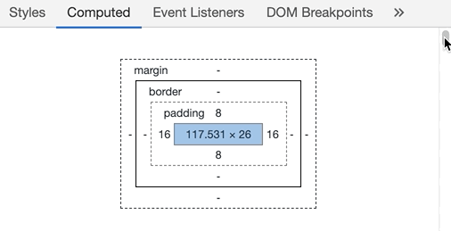
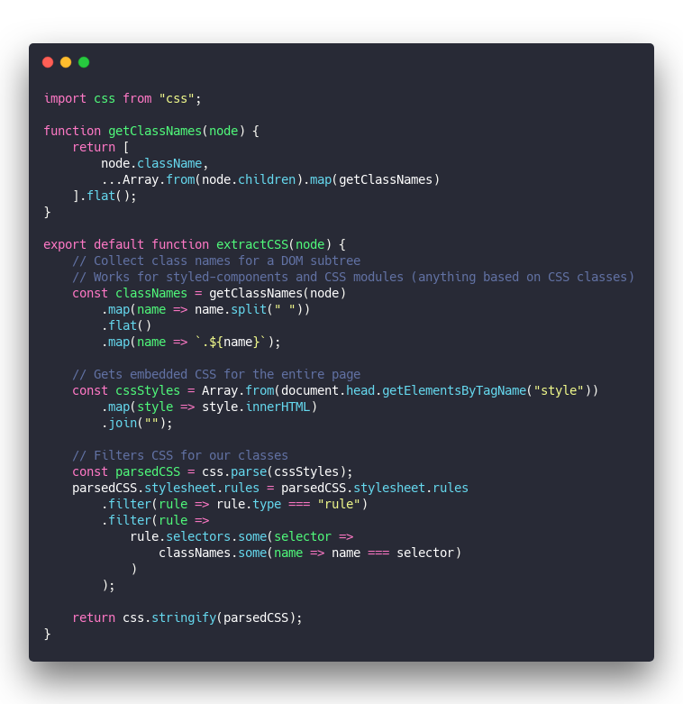

Here's a fun problem for ya: How do you get the CSS from a rendered React component?

Right-click, inspect element, see it in dev tools. D'oh 🙄 What about programmatically?  Turns out that's not so easy. You could, for example, try the [`window.getComputedStyle`](https://developer.mozilla.org/en-US/docs/Web/API/Window/getComputedStyle) method. Same as that DevTools view with all the styles.  But that's too much stuff. You get values for every CSS property that exists in the spec. 😅 What else can you try? Well there's always the `style` prop. You could get its value and hope for the best. But that only works if you're actually using it. Most people these days do not. Sure it's plenty useful for one-off overrides, but when was the last time you saw a project that heavily relies on the style prop? Exactly. Not in a while. Most projects have settled on styled-components or CSS modules. That makes our job both easier and harder. 🤨

## Getting CSS from styled-components

You can watch me figure this one out in a livestream 👇 https&#x3A;//www.youtube.com/watch?v=v-akMfXZZNE I tried all of the above and then some. Here's the solution I came up with: [👨‍🎨 component-css-extractor](https://github.com/Swizec/component-css-extractor). Open sourced for your ease of use 😊 CodeSandbox to prove it works 👇 [heuristic-leakey-b645b](./img/heuristic-leakey-b645b?fontsize=14) [👨‍🎨 component-css-extractor](https://github.com/Swizec/component-css-extractor) relies on the fact that both styled-components and CSS modules use class names. Each styled component that you write is assigned a unique class name. Rendered components get the class property, CSS rules go in a `<style>` tag in your header. We can combine those to get a clean set of CSS rules. Scoped to the target component with nothing extra to mess us up. 👌 34 lines of prettified code in total 👇

&t=seti&l=javascript&ds=true&wc=true&wa=true&pv=48px&ph=32px&ln=false&code=import%20css%20from%20%22css%22%3B%0A%0Afunction%20getClassNames(node)%20%7B%0A%20%20%20%20return%20%5B%0A%20%20%20%20%20%20%20%20node.className%2C%0A%20%20%20%20%20%20%20%20...Array.from(node.children).map(getClassNames)%0A%20%20%20%20%5D.flat()%3B%0A%7D%0A%0Aexport%20default%20function%20extractCSS(node)%20%7B%0A%20%20%20%20%2F%2F%20Collect%20class%20names%20for%20a%20DOM%20subtree%0A%20%20%20%20%2F%2F%20Works%20for%20styled-components%20and%20CSS%20modules%20(anything%20based%20on%20CSS%20classes)%0A%20%20%20%20const%20classNames%20%3D%20getClassNames(node)%0A%20%20%20%20%20%20%20%20.map(name%20%3D%3E%20name.split(%22%20%22))%0A%20%20%20%20%20%20%20%20.flat()%0A%20%20%20%20%20%20%20%20.map(name%20%3D%3E%20%60.%24%7Bname%7D%60)%3B%0A%0A%20%20%20%20%2F%2F%20Gets%20embedded%20CSS%20for%20the%20entire%20page%0A%20%20%20%20const%20cssStyles%20%3D%20Array.from(document.head.getElementsByTagName(%22style%22))%0A%20%20%20%20%20%20%20%20.map(style%20%3D%3E%20style.innerHTML)%0A%20%20%20%20%20%20%20%20.join(%22%22)%3B%0A%0A%20%20%20%20%2F%2F%20Filters%20CSS%20for%20our%20classes%0A%20%20%20%20const%20parsedCSS%20%3D%20css.parse(cssStyles)%3B%0A%20%20%20%20parsedCSS.stylesheet.rules%20%3D%20parsedCSS.stylesheet.rules%0A%20%20%20%20%20%20%20%20.filter(rule%20%3D%3E%20rule.type%20%3D%3D%3D%20%22rule%22)%0A%20%20%20%20%20%20%20%20.filter(rule%20%3D%3E%0A%20%20%20%20%20%20%20%20%20%20%20%20rule.selectors.some(selector%20%3D%3E%0A%20%20%20%20%20%20%20%20%20%20%20%20%20%20%20%20classNames.some(name%20%3D%3E%20name%20%3D%3D%3D%20selector)%0A%20%20%20%20%20%20%20%20%20%20%20%20)%0A%20%20%20%20%20%20%20%20)%3B%0A%0A%20%20%20%20return%20css.stringify(parsedCSS)%3B%0A%7D)

As the comments say:

1.  Collect class names for entire subtree
2.  Use `document.head.getElementsByTagName("style")` to get all `<style>` tags
3.  Use the [`css`](https://github.com/reworkcss/css) module to parse collected CSS into a JavaScript object
4.  Filter rules that don't apply to our classes
5.  Stringify and return

Works like a charm 👨‍🎨 

## Some caveats

As always there are some limitations. First of all, this won't work on the server or during build time. Collecting `<style>` tags requires access to the DOM as it exists in the browser. You don't have that during server-side-rendering, I think. Fortunately you don't need [👨‍🎨 component-css-extractor](https://github.com/Swizec/component-css-extractor) on the server. Styled-components has a built-in way of extracting styles into a string for serving to the client. The built-in way doesn't work in the browser, hence why I went down this rabbit hole. Second of all, if you have global stylesheets in a `.css` file, [👨‍🎨 component-css-extractor](https://github.com/Swizec/component-css-extractor) won't pick those up. Makes the code simpler. Imagine having to parse all of CSS in all your stylesheets and figuring out what does and doesn't apply to a particular DOM node. Might as well build a browser rendering engine lol. Happy Monday, ~Swizec
