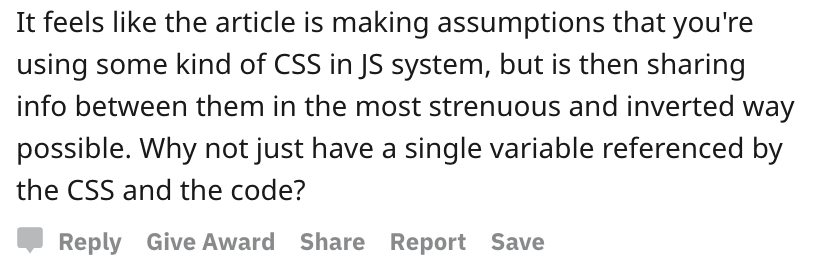

My favorite part of posting on Reddit is saying _"Hey look at this cool solution to an interesting problem I had"_

And the response is _"This isn't a problem"_  Makes you wonder sometimes why you even bother doesn't it? Now between you and me, I'm used to it and that stuff doesn't get me. But what if I wasn't? What if that was my first time sharing something cool with the world? Let's say you're a newbie sharing some cool technique for the first time. You get a comment like this  Wow bummer ... you had a curious, albeit weird, problem and you solved it. You share with the world and _"Yeah that's dumb, your problem is dumb, and wtf are you even doing!? How is it possible that you would ever need that? Get off my lawn"_ Maybe, just maybe, the author spent a little more time thinking about this than the commenter? 🤔 What about a comment like this? Remember this is the same article and these are real comments.  So much better! This commenter still has no idea _why_ you'd wanna use this technique or what makes it useful, **_but he's encouraging_**. Great experimentation! Keep going! Wonderful 🙌 See the difference?  Shooting people down on the internet might make you feel cool but that shit's weak, my friend. You might think you're helping by poking holes in people's arguments, but you probably aren't. Not unless you have all the context. And yes I get it, it's up to the author to include enough context. Gotta explain _why_ you built it, _why_ you had the problem, and _then_ how you solved it. But then there's also this meme  You wouldn't read a 1000 word backstory anyway. 😉

## The Principle of Charity

Instead, use the [Principle of Charity](https://en.wikipedia.org/wiki/Principle_of_charity) every time you read an article, have a technical debate, or discuss code with your team.

> In philosophy and rhetoric, the principle of charity or charitable interpretation requires interpreting a speaker's statements in the most rational way possible and, in the case of any argument, considering its best, strongest possible interpretation.

Assume they're skilled, assume they had a good reason, assume there's constraints you don't know about. Ask questions. I can almost promise you that the article you're reading, the code you're reviewing, or the spec you're seeing for the first time – the author has spent more time thinking about it than you have. Respect that. You aren't clever when you point out every flaw. You're not showing off your smarts when you say _"I'd never have that problem"_. You're not fooling anyone when you say _"I could build that in an afternoon"_ _Helping_ people improve is important. There's a time and place to point out flaws, question solutions, and suggest better ideas. But you gotta earn the right to do so. And that requires context. Anyway I hope you're not the kind of person who goes online and shoots people down, calls their ideas dumb, and questions their skills. If you are, please unfollow :P. Cheers,  
~Swizec
