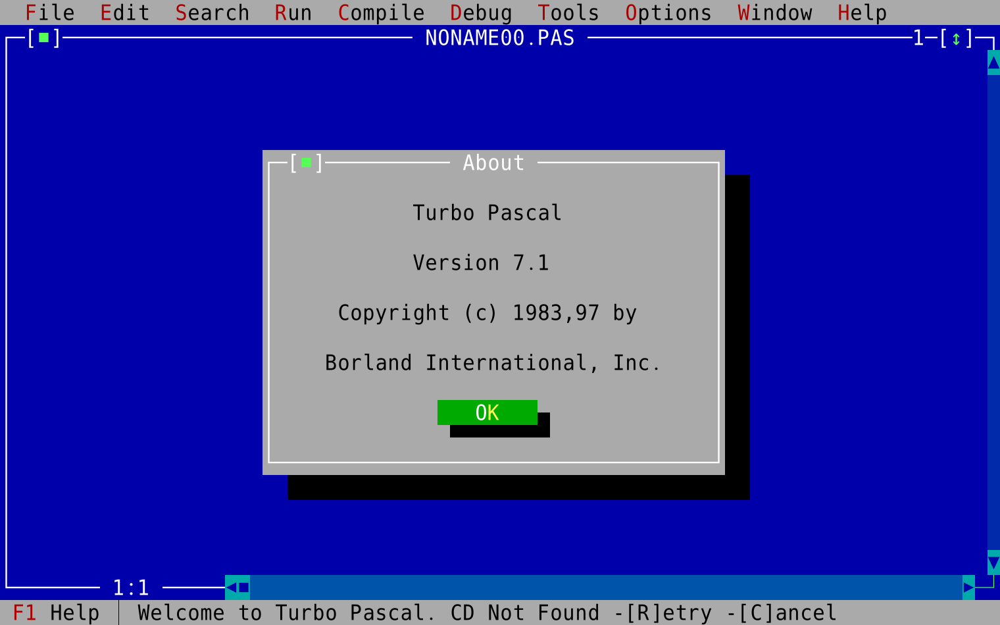

You sometimes hear people on the internet complain that JavaScript is becoming too complex. They reminisce of the old days when you could write some code, plop it in a `<script>` tag, and it worked.

Now you need Babel, and Webpack bundling, and transpiling, and a bazillion different versions of JavaScript, and a framework for components, a framework for CSS, and and it's all just one big hairy mess.

Baloney

JavaScript is wonderful. ❤️

The JavaScript community is one of the most welcoming beginner friendly communities I've ever met. Everyone is welcome. Everyone is productive. Everyone can get started.

With experience or without, there is a place for you in the JavaScript world.

https&#x3A;//twitter.com/Swizec/status/1137419997527961601

What I love about the JavaScript community is how hard everyone works to make it _even more accessible_. There's a wealth of resources to learn from, a bunch of tools making your life easier, abstracting away the complexities. 👌

https&#x3A;//twitter.com/Swizec/status/1137420747813474305

In the JavaScript world you can find everything from total beginner stuff like _"How to write a for loop and why"_ to complex topics you run into after years of working on real projects.

There's even people streaming their work! I would've killed to learn by watching experts work when I was a kid.

You know how I learned to code?

By opening [Turbo Pascal](https://en.wikipedia.org/wiki/Turbo_Pascal)'s help files, in a language I barely understood (English), and _trying things_. It was fun but dear god it was slow.

And I didn't even have the internet. Once a week I could ask my teacher about things and that was it. No Google, no blogs, not even books.

I probably could've had books but have you tried to read a college text book as a 12 year old? It doesn't work very well.

That's what learning how to code used to look like. You can poke around and try stuff, ask one or two mentors, or read books way beyond your level.

Now you have blogs and courses and video streamers and experts answering questions and ... it's amazing. I love it 😍

## Beginner friendly helps everyone

The best part is that this helps everyone. Even experts.

https&#x3A;//twitter.com/Swizec/status/1137420748941717504

When you make something more accessible to beginners, when it's quicker to get started, that helps experienced people too.

Consider this 👇

Would you rather spend an hour setting up Webpack and Babel and your basic file structure and a development server and hot reloading and all the plugins or ...

... run `create-react-app` and get started building your app in 30 seconds?

I know what I'd pick 😉

That same CRA tool that makes it easier for beginners to start with React, makes it quicker for an expert, too.

Or how about this 👇

Would you rather spend your time thinking about memory optimization, clearing array buffers, making sure there's no overflows, thinking about deallocation, and memory paging, and swapping and thrashing and all those things ...

... or trust a garbage collector is Good Enough and focus on solving your business problems?

yeah, exactly

## We stand on the shoulders of giants

Computer science and software engineering go back many decades. Every generation solved a new set of challenges and we take those solutions for granted.

We love to think the stuff we learned in our engineering youth represents The Fundamental Fundamentals. We scoff at the new kids on the block. _Pha, they don't even know how to efficiently write to a drum-memory. Useless_

Wait what, a drum memory?

Read [The story of Mel](http://www.catb.org/~esr/jargon/html/story-of-mel.html) my friend, it is amazing.

But here's the thing, you don't know (me neither) about drum memory because _we don't need to_.

Someone before us solved that problem.

We also don't think about optimizing registry assignment, aligning memory so it's used efficiently, writing to hard drives without leaving huge holes, or cleaning up our own memory. Tools baked right into our environment handle that for us.

And that's amazing.

Time saved thinking about low level concerns, is time you get to use for problems unique to you and your company.

So please, keep adding complexity, keep adding abstractions, the more you come up with, the less time I have to waste on silly little details :)

Enjoy your Monday, ~Swizec