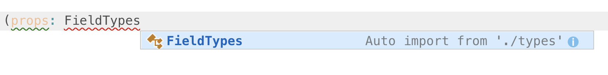
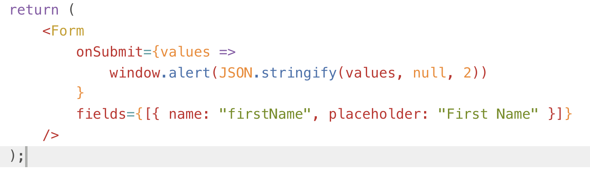
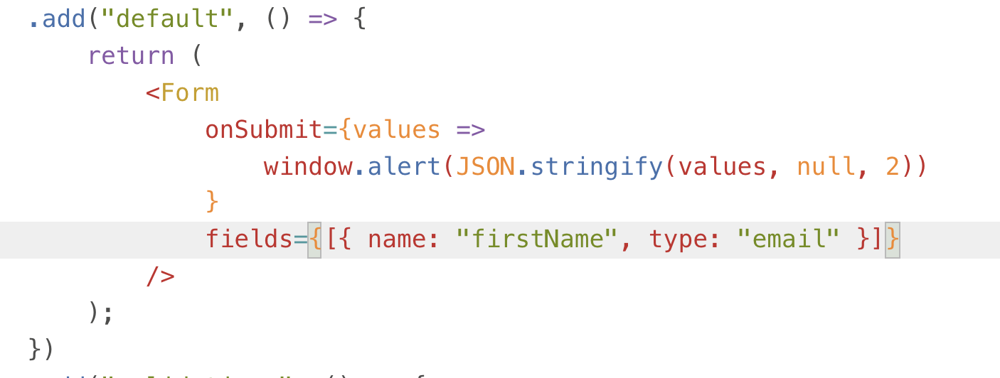
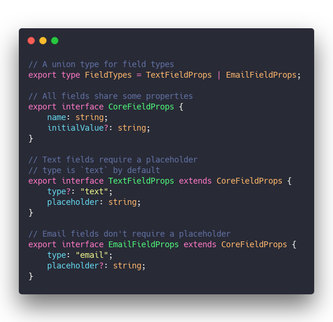
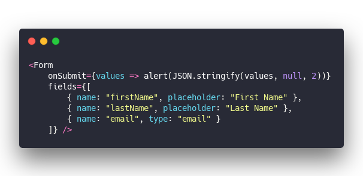
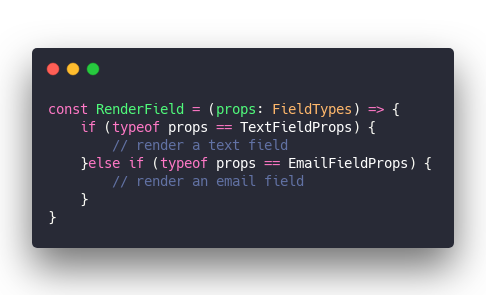
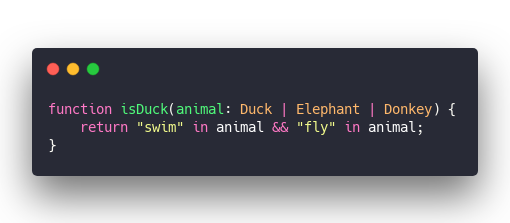

TypeScript is wonderful. Been using it more and more and I love it. 🥰

There's something magical about useful autocomplete suggestions, object blobs with property hints, and auto \\imports. That's right, auto \\imports.

Press enter and VSCode adds `\import { FieldTypes } from './types'` at the top.

And check this out: I got a form builder that takes JavaScript blobs as configuration. VSCode is smart enough to tell me when they're wrong. 👌

This works:

Got a field with a `name` and a `placeholder`. Remove one and o-oh.

The error is cryptic type vomit. You get used to that. Means that one of your blobs doesn't match any known field type.

But get this, add `type: "email"` and no need for a placeholder 😮

Whoa

So what's going on here? What's TypeScript doing to support this? And why do we need a `type` property if we're using a typed language?

## Static analysis

[Static analysis](https://en.wikipedia.org/wiki/Static_program_analysis) is where TypeScript shines. Its main design goal 👉 enable static analysis of JavaScript

> Static program analysis is the analysis of computer software that is performed without actually executing programs, in contrast with dynamic analysis, which is analysis performed on programs while they are executing.

Static analysis uses [static types](https://en.wikipedia.org/wiki/Type_system#Static_typing) to understand your code. Editors use this understanding to help you write better code.

Everything from autocompletion, hints on object properties, and squiggly lines when you get something wrong. Some editors even integrate with documentation and give you help right in the editor.

TypeScript with VSCode brings all that to JavaScript.

You get a better coding experience most of the time. Sometimes you fight the type system, but it's got your back ... mostly. Great for large teams and large codebases.

Know your code has at least a remote chance of being correct without running every single line? Love it ❤️

## Dynamic analysis

In contrast to static analysis you have [dynamic analysis](https://en.wikipedia.org/wiki/Dynamic_program_analysis). That's JavaScript's normal mode.

> Dynamic program analysis is the analysis of computer software that is performed by executing programs on a real or virtual processor. For dynamic program analysis to be effective, the target program must be executed with sufficient test inputs to produce interesting behavior.

To analyze a dynamic language, you gotta run it. That's where test driven development comes in.

You don't have a static type system saving your butt for some classes of errors. You gotta run the thing and see if it works. And you better make sure you run every line of code.

If you don't, I promise your users will 😉

## Duck typing

[Duck typing](https://en.wikipedia.org/wiki/Duck_typing) is a strange beast most popular in the land of Lisp. It falls under dynamic typing, but statically typed duck languages exist also. Wikipedia classifies it as the 4th major category next to static, dynamic, and nominal typing.

> If it walks like a duck and it quacks like a duck, then it must be a duck

The duck test 🦆

You're duck typing every time you write code like `if (object.property && object.property.value === 'something')`

Verify the object is a duck, has a `property`, then use it like a duck.

## Type guards in TypeScript

That brings us to TypeScript's biggest flaw.

From [TypeScript Design Goals](https://github.com/Microsoft/TypeScript/wiki/TypeScript-Design-Goals)

> Impose **no runtime** overhead on emitted programs. Emit clean, idiomatic, recognizable JavaScript code.

TypeScript is a static analysis tool only. No types at runtime. No type checking. No validations. Nothing.

Great for program size and understandability. Not great for useful type system.

Say you've got a form builder with two field types like I mentioned before.

&t=seti&l=typescript&ds=true&wc=true&wa=true&pv=48px&ph=32px&ln=false&code=%2F%2F%20A%20union%20type%20for%20field%20types%0Aexport%20type%20FieldTypes%20%3D%20TextFieldProps%20%7C%20EmailFieldProps%3B%0A%0A%2F%2F%20All%20fields%20share%20some%20properties%0Aexport%20interface%20CoreFieldProps%20%7B%0A%20%20%20%20name%3A%20string%3B%0A%20%20%20%20initialValue%3F%3A%20string%3B%0A%7D%0A%0A%2F%2F%20Text%20fields%20require%20a%20placeholder%0A%2F%2F%20type%20is%20%60text%60%20by%20default%0Aexport%20interface%20TextFieldProps%20extends%20CoreFieldProps%20%7B%0A%20%20%20%20type%3F%3A%20%22text%22%3B%0A%20%20%20%20placeholder%3A%20string%3B%0A%7D%0A%0A%2F%2F%20Email%20fields%20don't%20require%20a%20placeholder%0Aexport%20interface%20EmailFieldProps%20extends%20CoreFieldProps%20%7B%0A%20%20%20%20type%3A%20%22email%22%3B%0A%20%20%20%20placeholder%3F%3A%20string%3B%0A%7D)

A union `FieldTypes` type saves typing in a bunch of places.

Then we got a `CoreFieldProps` interface that defines properties all fields share. Every field needs a `name`, optionally an `initialValue` too.

Specific field types extend the core props and add their own. Most \\importantly they add the `type` field.

That's how TypeScript knows what you mean when you write

&t=seti&l=typescript&ds=true&wc=true&wa=true&pv=48px&ph=32px&ln=false&code=%3CForm%0A%20%20%20%20onSubmit%3D%7Bvalues%20%3D%3E%20alert(JSON.stringify(values%2C%20null%2C%202))%7D%0A%20%20%20%20fields%3D%7B%5B%0A%20%20%20%20%20%20%20%20%7B%20name%3A%20%22firstName%22%2C%20placeholder%3A%20%22First%20Name%22%20%7D%2C%0A%20%20%20%20%20%20%20%20%7B%20name%3A%20%22lastName%22%2C%20placeholder%3A%20%22Last%20Name%22%20%7D%2C%0A%20%20%20%20%20%20%20%20%7B%20name%3A%20%22email%22%2C%20type%3A%20%22email%22%20%7D%0A%20%20%20%20%5D%7D%20%2F%3E)

Looks at the first two blobs, sees they match `TextFieldProps`. They've got a name and a placeholder, no type.

The last blob uses `type: "email"` so TypeScript knows it's okay that there's no placeholder. Optional in emails.

## Duck typing at runtime

Static analysis worked great in the editor. What about when you want to render different fields based on their type?

You're using a typed language right, how hard can it be.

&t=seti&l=typescript&ds=true&wc=true&wa=true&pv=48px&ph=32px&ln=false&code=const%20RenderField%20%3D%20(props%3A%20FieldTypes)%20%3D%3E%20%7B%0A%09if%20(typeof%20props%20%3D%3D%20TextFieldProps)%20%7B%0A%09%09%2F%2F%20render%20a%20text%20field%0A%09%7Delse%20if%20(typeof%20props%20%3D%3D%20EmailFieldProps)%20%7B%0A%09%09%2F%2F%20render%20an%20email%20field%0A%09%7D%0A%7D)

Not so fast buster.

JavaScript has no idea about your types. `typeof props` evaluates to `object`. That's not gonna match your artisanally crafted types you worked so hard to build 😉

Instead, you'll have to use [TypeScript Type Guards](https://www.typescriptlang.org/docs/handbook/advanced-types.html#type-guards-and-differentiating-types)

Two types of guards prove useful in the wild:

1. Duck typing
2. Explicit `type` property

### Duck typing

A duck typed type guard uses the duck test. If property exists on object, do the things.

&t=seti&l=typescript&ds=true&wc=true&wa=true&pv=48px&ph=32px&ln=false&code=function%20isDuck(animal%3A%20Duck%20%7C%20Elephant%20%7C%20Donkey)%20%7B%0A%09return%20%22swim%22%20in%20animal%20%26%26%20%22fly%22%20in%20animal%3B%0A%7D)

An animal is a duck if it can both swim and fly. The `in` operator checks for the existence of a key (or property) on an object.

### Explicit type property

The other approach works best in an object blob situation. You provide a `type` attribute, define types with hardcoded values, then make sure they're defined.

Use those values at runtime to decide what to do

&t=seti&l=typescript&ds=true&wc=true&wa=true&pv=48px&ph=32px&ln=false&code=const%20RenderField%20%3D%20(props%3A%20FieldTypes)%20%3D%3E%20%7B%0A%20%20%20%20switch%20(props.type)%20%7B%0A%20%20%20%20%20%20%20%20case%20%22email%22%3A%0A%20%20%20%20%20%20%20%20%20%20%20%20%2F%2F%20render%20email%20field%0A%20%20%20%20%20%20%20%20case%20%22text%22%3A%0A%20%20%20%20%20%20%20%20%20%20%20%20%2F%2F%20render%20text%20field%0A%20%20%20%20%7D%0A%7D%3B)

An object constructor can help too. `new EmailFieldProps()` and it sets `this.type` to email by default.

But I prefer blobs for passing data and use duck typing when dealing with actual objects. If it can do what I need, what do I care what type it is?

# Quack

And that's how you can use ducks to solve TypeScript's biggest flaw – lack of type support at runtime.

Hope this was useful ✌️

Cheers,  
~Swizec