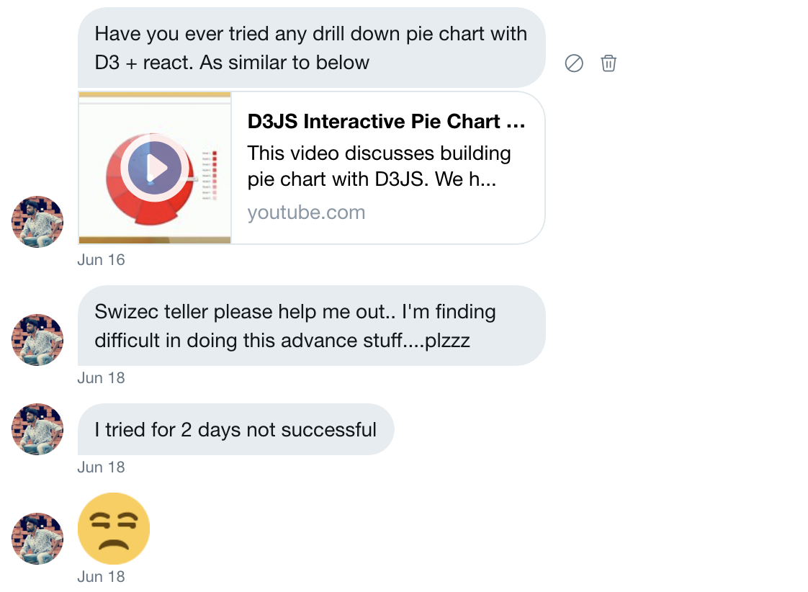
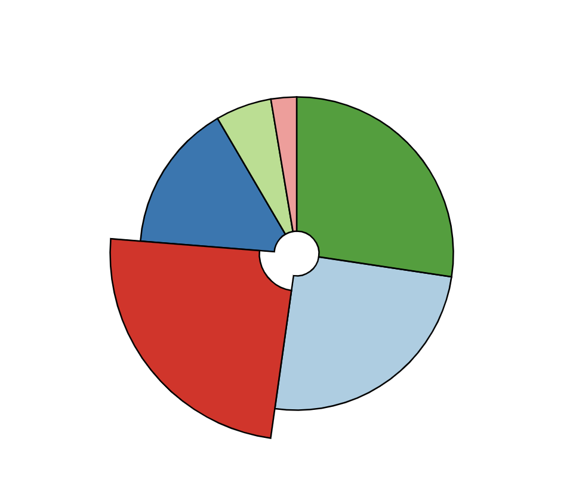
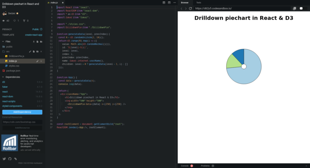
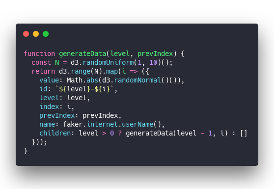
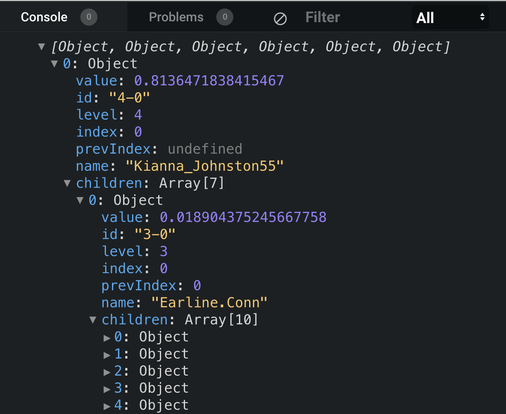
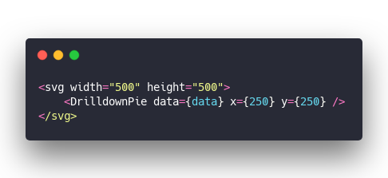
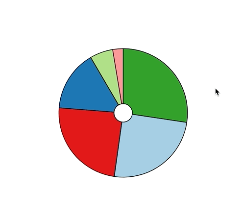
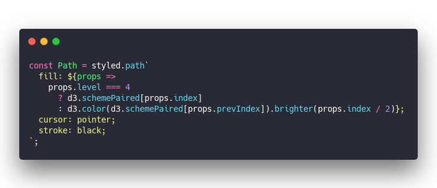
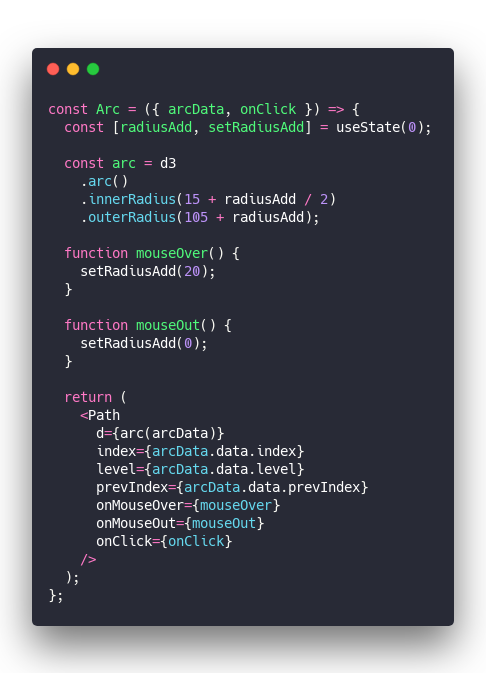
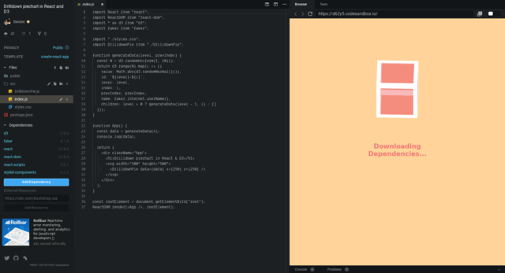

A few days ago Kiran B sent me a challenge via Twitter DM: How can I make a drilldown piechart?

The annoyed emoji is a bit much but I'll allow it. The challenge was fun to solve. Got it roughly working in a 45min stream 👇

https&#x3A;//www.youtube.com/watch?v=adZ61pB7iFI

You can also [try it out via CodeSandbox](https://codesandbox.io/s/drilldown-piechart-in-react-and-d3-d62y5). I'm surprised how nice default D3 category colors work with a black border. It's gorgeous 😍

## Here's how a drilldown piechart works

You can think of a drilldown piechart as a recursive data visualization. Take a tree structure of data and you render a piechart for each level. Click on a slice, drill down into that branch.

Easiest way to get started is to generate that dataset from scratch ✌️

&t=seti&l=javascript&ds=true&wc=true&wa=true&pv=48px&ph=32px&ln=false&code=function%20generateData(level%2C%20prevIndex)%20%7B%0A%20%20const%20N%20%3D%20d3.randomUniform(1%2C%2010)()%3B%0A%20%20return%20d3.range(N).map(i%20%3D%3E%20(%7B%0A%20%20%20%20value%3A%20Math.abs(d3.randomNormal()())%2C%0A%20%20%20%20id%3A%20%60%24%7Blevel%7D-%24%7Bi%7D%60%2C%0A%20%20%20%20level%3A%20level%2C%0A%20%20%20%20index%3A%20i%2C%0A%20%20%20%20prevIndex%3A%20prevIndex%2C%0A%20%20%20%20name%3A%20faker.internet.userName()%2C%0A%20%20%20%20children%3A%20level%20%3E%200%20%3F%20generateData(level%20-%201%2C%20i)%20%3A%20%5B%5D%0A%20%20%7D))%3B%0A%7D)

Random number of datapoints, `N`, create an array with `d3.range`, loop through, generate a datapoint for each step. Random value, some identifier, save the level of recursing, the index, the parent index, a name, and then generate some children.

Generating children calls this same function thus creating a recursive data structure.

We'll use the level and index and previous index to help us pick slice colors later on.

I like to keep my `<App>` component simple so using the data and rendering the piechart looks like this:

&t=seti&l=javascript&ds=true&wc=true&wa=true&pv=48px&ph=32px&ln=false&code=%3Csvg%20width%3D%22500%22%20height%3D%22500%22%3E%0A%09%3CDrilldownPie%20data%3D%7Bdata%7D%20x%3D%7B250%7D%20y%3D%7B250%7D%20%2F%3E%0A%3C%2Fsvg%3E)

An svg element with a `<DrilldownPie>` component.

## DrilldownPie component

Ok the colors aren't perfect, the drilling down is confusing without an animation, and you can't drill up just yet. But it's a great start!

Three components play together:

1. A styled `<Path>` component handles colors
2. An `<Arc>` component renders arcs, deals with mouseovers, and registers clicks
3. A `<DrilldownPie>` component holds it all together and deals with drilling

### Path

The `<Path>` component is a styled SVG path that uses props to decide the color of each slice.

&t=seti&l=javascript&ds=true&wc=true&wa=true&pv=48px&ph=32px&ln=false&code=const%20Path%20%3D%20styled.path%60%0A%20%20fill%3A%20%24%7Bprops%20%3D%3E%0A%20%20%20%20props.level%20%3D%3D%3D%204%0A%20%20%20%20%20%20%3F%20d3.schemePaired%5Bprops.index%5D%0A%20%20%20%20%20%20%3A%20d3.color(d3.schemePaired%5Bprops.prevIndex%5D).brighter(props.index%20%2F%202)%7D%3B%0A%20%20cursor%3A%20pointer%3B%0A%20%20stroke%3A%20black%3B%0A%60%3B)

Level 4 is the top level 👉 use a color scheme from D3 and the slice index to pick a color.

With other levels the idea was to take the base color and make it progressively brighter based on the index. Works okay for the first level down, didn't quite work later on.

Might have to change how we approach this. Maybe colors as part of the dataset itself?

### Arc

The `<Arc>` component renders a single slice of the piechart and handles mouseover events using hooks to change size. Messing with the radius creates the effect of individual slices popping out.

&t=seti&l=javascript&ds=true&wc=true&wa=true&pv=48px&ph=32px&ln=false&code=const%20Arc%20%3D%20(%7B%20arcData%2C%20onClick%20%7D)%20%3D%3E%20%7B%0A%20%20const%20%5BradiusAdd%2C%20setRadiusAdd%5D%20%3D%20useState(0)%3B%0A%0A%20%20const%20arc%20%3D%20d3%0A%20%20%20%20.arc()%0A%20%20%20%20.innerRadius(15%20%2B%20radiusAdd%20%2F%202)%0A%20%20%20%20.outerRadius(105%20%2B%20radiusAdd)%3B%0A%0A%20%20function%20mouseOver()%20%7B%0A%20%20%20%20setRadiusAdd(20)%3B%0A%20%20%7D%0A%0A%20%20function%20mouseOut()%20%7B%0A%20%20%20%20setRadiusAdd(0)%3B%0A%20%20%7D%0A%0A%20%20return%20(%0A%20%20%20%20%3CPath%0A%20%20%20%20%20%20d%3D%7Barc(arcData)%7D%0A%20%20%20%20%20%20index%3D%7BarcData.data.index%7D%0A%20%20%20%20%20%20level%3D%7BarcData.data.level%7D%0A%20%20%20%20%20%20prevIndex%3D%7BarcData.data.prevIndex%7D%0A%20%20%20%20%20%20onMouseOver%3D%7BmouseOver%7D%0A%20%20%20%20%20%20onMouseOut%3D%7BmouseOut%7D%0A%20%20%20%20%20%20onClick%3D%7BonClick%7D%0A%20%20%20%20%2F%3E%0A%20%20)%3B%0A%7D%3B)

That's the whole component. Let's break it down :)

**First** we've got the state management: A single `radiusAdd` variable that tells us how much to add or take away from the default radius of our arc.

**Second** we've got the `d3.arc` generator. Takes some configuration and produces path definitions using SVG's crazy path language.

**Third** we've got 2 functions calling the `setRadiusAdd` setter to change the radius. That triggers a re-render, the arc generator sees the new value, creates a different path definition 👌

**Fourth** we render our styled `<Path>` component making sure to pass in all the right props. The path definition, the level and index for color, and all the event listeners.

### DrilldownPie

The `<DrilldownPie>` component ties this all together.

&t=seti&l=javascript&ds=true&wc=true&wa=true&pv=48px&ph=32px&ln=false&code=const%20DrilldownPie%20%3D%20(%7B%20data%2C%20x%2C%20y%20%7D)%20%3D%3E%20%7B%0A%20%20const%20%5BrenderData%2C%20setRenderData%5D%20%3D%20useState(data)%3B%0A%0A%20%20const%20pie%20%3D%20d3.pie().value(d%20%3D%3E%20d.value)%3B%0A%0A%20%20function%20drilldown(index)%20%7B%0A%20%20%20%20setRenderData(renderData%5Bindex%5D.children)%3B%0A%20%20%7D%0A%0A%20%20return%20(%0A%20%20%20%20%3Cg%20transform%3D%7B%60translate(%24%7Bx%7D%2C%20%24%7By%7D)%60%7D%3E%0A%20%20%20%20%20%20%7Bpie(renderData).map(d%20%3D%3E%20(%0A%20%20%20%20%20%20%20%20%3CArc%20arcData%3D%7Bd%7D%20key%3D%7Bd.id%7D%20onClick%3D%7B()%20%3D%3E%20drilldown(d.index)%7D%20%2F%3E%0A%20%20%20%20%20%20))%7D%0A%20%20%20%20%3C%2Fg%3E%0A%20%20)%3B%0A%7D%3B)

Less code even than the Arc component god I love hooks 😱

**First** we've got state. We copy our data into it. That's so we can do the drilling down. Haven't tried how this plays with data changing from the outside ... trigger a re-render I assume 🤔

**Second** we've got a `d3.pie` generator. Takes our data and creates an array of objects perfectly suited for the `d3.arc` generator. Angles and values and all.

**Third** the `drilldown` function uses our state setter to move data one level down. Take the children, set them as current data, trigger re-render, magic. 🧙‍♂️

**Fourth** render it all in a loop.

And that's how you build a drilldown piechart with React and D3 and hooks.

## PS

I'm going to continue this challenge either Friday night (today) or Sunday afternoon. Want to figure out how to make the drilldown transition animated and get drilling up to work.

Drilling up is easy in principle, but gets tricky if you want to support arbitrary levels. That's because we aren't using real recursion to drill down 😅

See you at the stream maybe?

Cheers, ~Swizec