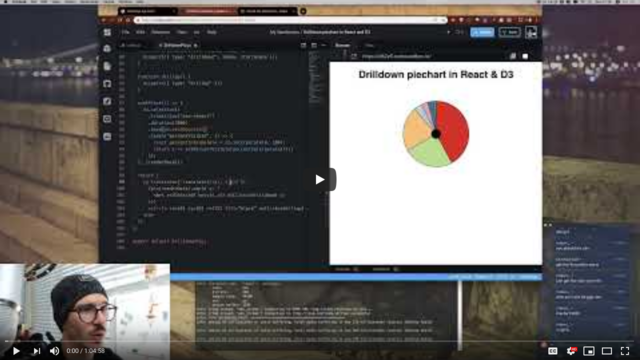
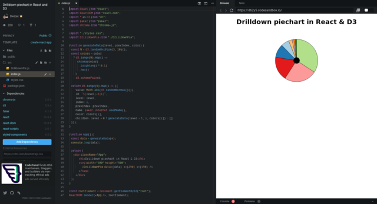
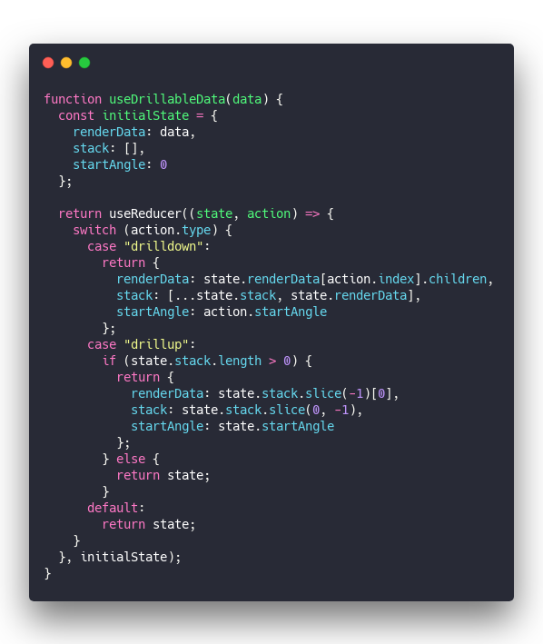
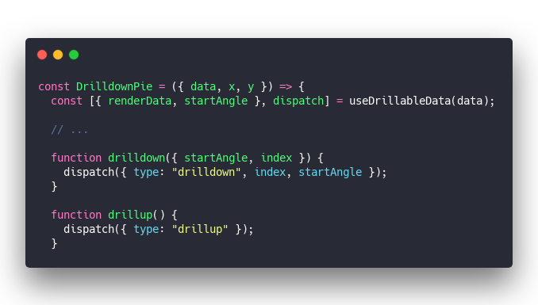
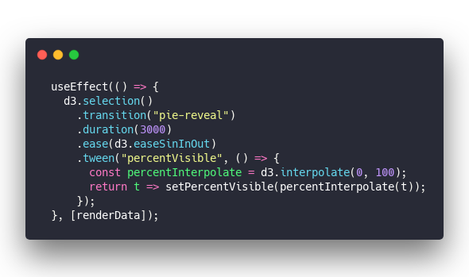
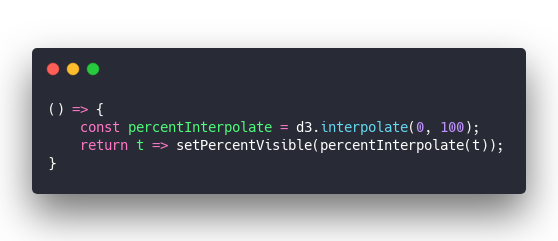
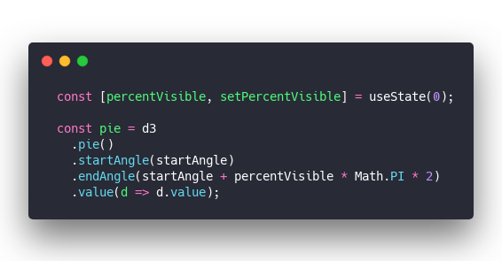

Here's part 2 of [Kiran B's challenge](https://swizec.com/blog/a-drilldown-piechart-with-react-and-d3/swizec/9140) from last week 👉 animating our drilldown piechart.

You can watch the whole stream or keep reading. This was fun to figure out. I'm loving the flexibility of this hybrid approach to animation.

Yelling at my computer when it got too slow to run CodeSandbox was A+ 👌

And if you prefer to jump straight into messing around with code, here's the CodeSandbox

## Wtf is hybrid animation?

Hybrid animation is a merger of two approaches to animation I teach in [React for Data Visualization](https://reactfordataviz.com). Also a brand new chapter I just added ✌️

1. Change state 60 times per second, trigger re-renders, components look animated
2. Give control to D3, use a transition, move back to React

Both those approaches work great.

You get heaps of control with the state-based approach, it's fast, the animations look sick, and you spend a lot of brain cycles thinking about details.

Transitions are easier, look great, and you mess with the DOM just a little. React doesn't like that but will tolerate your shenanigans if you're nice about it.

But transitions fail when you have complex scenarios with animations spanning multiple components.

And that's where hybrid animation comes in 👉 ease of transitions, full render control.

## Cleaning up our piechart

We're working off of the [drilldown piechart from last week](https://swizec.com/blog/a-drilldown-piechart-with-react-and-d3/swizec/9140). So we've got the basics

1. Hierarchical data where each slice has multiple children
2. `<Arc>` component that renders individual slices
3. `<DrilldownPie>` that uses a `d3.pie()` generator and renders slices in a loop

We cleaned up state management and added the drill-up feature.

&t=seti&l=javascript&ds=true&wc=true&wa=true&pv=48px&ph=32px&ln=false&code=function%20useDrillableData(data)%20%7B%0A%20%20const%20initialState%20%3D%20%7B%0A%20%20%20%20renderData%3A%20data%2C%0A%20%20%20%20stack%3A%20%5B%5D%2C%0A%20%20%20%20startAngle%3A%200%0A%20%20%7D%3B%0A%0A%20%20return%20useReducer((state%2C%20action)%20%3D%3E%20%7B%0A%20%20%20%20switch%20(action.type)%20%7B%0A%20%20%20%20%20%20case%20%22drilldown%22%3A%0A%20%20%20%20%20%20%20%20return%20%7B%0A%20%20%20%20%20%20%20%20%20%20renderData%3A%20state.renderData%5Baction.index%5D.children%2C%0A%20%20%20%20%20%20%20%20%20%20stack%3A%20%5B...state.stack%2C%20state.renderData%5D%2C%0A%20%20%20%20%20%20%20%20%20%20startAngle%3A%20action.startAngle%0A%20%20%20%20%20%20%20%20%7D%3B%0A%20%20%20%20%20%20case%20%22drillup%22%3A%0A%20%20%20%20%20%20%20%20if%20(state.stack.length%20%3E%200)%20%7B%0A%20%20%20%20%20%20%20%20%20%20return%20%7B%0A%20%20%20%20%20%20%20%20%20%20%20%20renderData%3A%20state.stack.slice(-1)%5B0%5D%2C%0A%20%20%20%20%20%20%20%20%20%20%20%20stack%3A%20state.stack.slice(0%2C%20-1)%2C%0A%20%20%20%20%20%20%20%20%20%20%20%20startAngle%3A%20state.startAngle%0A%20%20%20%20%20%20%20%20%20%20%7D%3B%0A%20%20%20%20%20%20%20%20%7D%20else%20%7B%0A%20%20%20%20%20%20%20%20%20%20return%20state%3B%0A%20%20%20%20%20%20%20%20%7D%0A%20%20%20%20%20%20default%3A%0A%20%20%20%20%20%20%20%20return%20state%3B%0A%20%20%20%20%7D%0A%20%20%7D%2C%20initialState)%3B%0A%7D)

`useDrillableData` is a custom hook that takes our data and sets up a reducer so we can tie different state changes together.

When you `drilldown` we

- change `renderData` to the children array; this creates the drilldown effect
- add current data to the `stack`; this will help us know how to drill back up
- update `startAngle` so pie animations look connected to what you clicked

When you `drilldown` we

- pop the previous data from the `stack` and update `renderData`
- drop the last element in our `stack`
- keep the same `startAngle`

If you're at the highest level already, we do nothing.

To use this new state management mechanism we replaced the previous `useState` code with `useDrillableData` and called `dispatch` on click events instead of `setState`.

&t=seti&l=javascript&ds=true&wc=true&wa=true&pv=48px&ph=32px&ln=false&code=const%20DrilldownPie%20%3D%20(%7B%20data%2C%20x%2C%20y%20%7D)%20%3D%3E%20%7B%0A%20%20const%20%5B%7B%20renderData%2C%20startAngle%20%7D%2C%20dispatch%5D%20%3D%20useDrillableData(data)%3B%0A%20%20%0A%20%20%2F%2F%20...%0A%20%20%0A%20%20function%20drilldown(%7B%20startAngle%2C%20index%20%7D)%20%7B%0A%20%20%20%20dispatch(%7B%20type%3A%20%22drilldown%22%2C%20index%2C%20startAngle%20%7D)%3B%0A%20%20%7D%0A%0A%20%20function%20drillup()%20%7B%0A%20%20%20%20dispatch(%7B%20type%3A%20%22drillup%22%20%7D)%3B%0A%20%20%7D)

Now `<DrilldownPie>` can go in both directions. That was a problem before 😅

## Adding hybrid animation

Hybrid animation is all about leveraging both React and D3 for what they do best: React manages rendering and events, D3 calculates the tricky stuff for smooth animations.

Here's the recipe:

- trigger a React effect
- start a D3 transition
- create a custom tween
- use the tween to drive state

&t=seti&l=javascript&ds=true&wc=true&wa=true&pv=48px&ph=32px&ln=false&code=%20%20useEffect(()%20%3D%3E%20%7B%0A%20%20%20%20d3.selection()%0A%20%20%20%20%20%20.transition(%22pie-reveal%22)%0A%20%20%20%20%20%20.duration(3000)%0A%20%20%20%20%20%20.ease(d3.easeSinInOut)%0A%20%20%20%20%20%20.tween(%22percentVisible%22%2C%20()%20%3D%3E%20%7B%0A%20%20%20%20%20%20%20%20const%20percentInterpolate%20%3D%20d3.interpolate(0%2C%20100)%3B%0A%20%20%20%20%20%20%20%20return%20t%20%3D%3E%20setPercentVisible(percentInterpolate(t))%3B%0A%20%20%20%20%20%20%7D)%3B%0A%20%20%7D%2C%20%5BrenderData%5D)%3B)

`useEffect` runs its method when `renderData` changes. That's every time you drilldown or drillup.

The effect runs a D3 transition on an empty selection. Sets duration to 3 seconds, an easing function to look pretty, and fires off a custom tween.

&t=seti&l=javascript&ds=true&wc=true&wa=true&pv=48px&ph=32px&ln=false&code=()%20%3D%3E%20%7B%0A%09const%20percentInterpolate%20%3D%20d3.interpolate(0%2C%20100)%3B%0A%09return%20t%20%3D%3E%20setPercentVisible(percentInterpolate(t))%3B%0A%7D)

Tweens are meant to manipulate DOM attributes, but when you think about it, they're just functions that run on every step of the transition. They can do whatever you want to do on every keyframe. 🤔

We start with an interpolator from `0` to `100`. Interpolators translate the time parameter, `t`, into a smooth transition from start to end. Easing functions manipulate that `t` parameter to create fun effects.

Interpolator in hand, we return a parametrized function that updates state with `setPercentVisible` using the interpolator.

### percentVisible state

Using that state change to animate our piechart looks like this:

&t=seti&l=javascript&ds=true&wc=true&wa=true&pv=48px&ph=32px&ln=false&code=%20%20const%20%5BpercentVisible%2C%20setPercentVisible%5D%20%3D%20useState(0)%3B%0A%0A%20%20const%20pie%20%3D%20d3%0A%20%20%20%20.pie()%0A%20%20%20%20.startAngle(startAngle)%0A%20%20%20%20.endAngle(startAngle%20%2B%20percentVisible%20*%20Math.PI%20*%202)%0A%20%20%20%20.value(d%20%3D%3E%20d.value)%3B)

`percentVisible` and `setPercentVisible` come from a `useState` hook. Getter and setter :)

D3 pie generators take a `startAngle` and `endAngle` config and fit the entire piechart between those angles. If we keep changing the `endAngle` to be closer and closer to a full circle based on `percentVisible`, we get an animation that looks like a piechart revealing itself.

Neat 🤘

## Wat gives

The trick here is that React hooks are magic and the tree diffing algorithm is fast as hell.

On each step of the transition, our tween changes state and triggers a re-render. When the piechart re-renders, it uses the updated angle.

The updated angle creates a bigger piechart. The arc components adjust and make themselves fit inside.

Crucially, React doesn't re-run the effect. Nothing that our effect relies on changed, so it keeps running uninterrupted.

The result is a powerful new animation technique ✌️

Cheers,

~Swizec