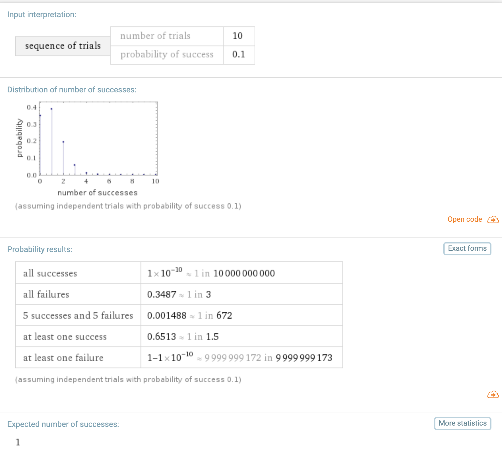

I watched this short Casey Neistat video again this morning and it made me think about hustle. Does hustle actually lead to success, or is it all just luck?

The answer is yes, both. Lemme explain 👇 In the video Casey makes a point that life is like going the wrong way on a conveyor belt. Stand still and move backwards. You gotta hustle to get ahead. Run faster than the belt. But does hustle actually work or is it just a platitude? We live in a probabilistic universe so nothing is ever guaranteed. Luck plays a HUGE role. "Luck" doesn't mean what you think it means, however. You can create luck. Back in 1713 Bernoulli derived a formula for the expected outcome of a series of independent experiments. How likely are you to get at least N heads after flipping a coin K times? <https://en.wikipedia.org/wiki/Bernoulli_trial> Here's the formula: N over K multiplied by probability(heads)^K times probability(not_heads)^N-K  Math is hard and this is 2019 so you can use Wolfram Alpha and iteration to figure out your chance of success. Say each of your things has a 10% chance of going viral 👉 P=0.1, Q= 1-0.1 = 0.9 According to Bernoulli you can expect at least 1 success after 10 things with a 65% probability.  The same is true for everything you do. Applying for jobs, launching side projects, creating open source, founding startups, companies, or just cooking a fantastic meal. Take probability of success, add hustle, use Bernoulli to see how long it takes :) Sure, life isn't quite a series of independent experiments 👉Your experience compounds, you learn stuff, you get more resources. Bernoulli trials are still a great framework to keep in mind. The more often you try, the more likely you are to succeed. Enjoy your 4-day weekend ✌️ Cheers,  
~Swizec
