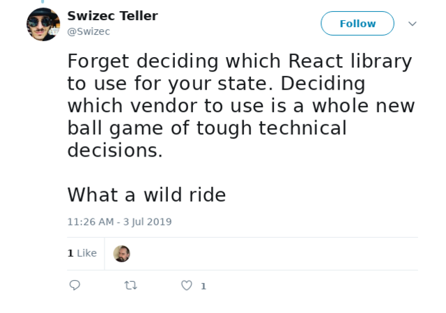
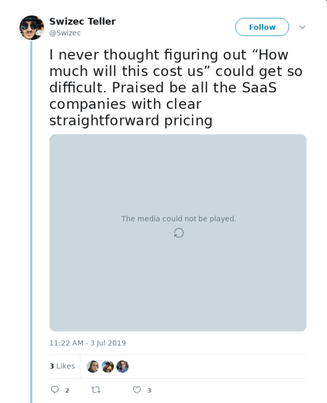

You know how hard it can be to choose React vs. Vue, Redux vs. useReducer, styled-components vs. css modules ... child's play compared to the technical decision I helped with last week. Wow 😳

A few weeks ago I wrote [Build one to throw away](https://swizec.com/blog/build-one-to-throw-away/swizec/9131) about replacing an in-house marketing automation system with a 3rd party solution. My baby for over 2 years is going bye bye. Thank god.

I'm ready to have new babies, work on other interesting problems, y'know ...

Well, time has come to pick a replacement. And ho boy is that a whole new level of technical decision making. Never thought it could be so difficult 🤯

You google "marketing automation", click top result, swipe the company card, and voila. Right?

Nope.

Here's what choosing a vendor to replace your hard work actually looks like:

## 1 👉 What do you want and what's out there?

1. You get a long list of requirements from Product – some must-haves, some nice-to-haves, some implied assumeds
2. You add requirements from the old implementation that you remember are \\important
3. After some back-and-forth, a few conversations with stakeholders, you know what you're looking for
4. You Google "marketing automation" and drown in marketing speak. Everything is perfect, everything solves all your problems, everything does everything

At this point you're like

The marketing automation space has _exploded_ in the last couple of years. Everything from complex email campaigns to chatbots and integrated email-website-facebookads.

There's a lot to dig through.

## 2 👉 What even looks like a maybe?

5. You ask around for recommendations, opinions, and experiences. Learning from other people's mistakes is always a great approach.
6. You create a list of potential vendors. Everyone who does "marketing automation"
7. You go through all the websites and create a ranked list

I ranked in my mind, but I should've created a spreadsheet. The formula went something like this

If the page looks scammy – super marketing speak, plenty of conversion optimizers, bunch of growth hacks – disqualify.

If the page looks professional, clean, like real care was put into it 👉 plus point.

If the tool was recommended by a friend 👉 2 plus points.

If a friend says they've struggled with the tool 👉 3 minus points.

If I've heard of the tool or company before 👉 plus point.

You have a list of potential vendors. Companies you'd trust with your data, expect to stick around for a few years, think are serious about marketing automation being their thing that they do.

Starting to look like a solvable problem

## 3 👉 What does everything you need?

8. You have a narrow selection of maybes
9. You go through their list of features
10. Plus 1 point for every feature from your list

Comparing marketing pages can be difficult. Different companies use different words to describe the same things, they all promise everything and they all mean slightly different behaviors.

All of them say "We have A/B testing", for example. But what does that mean?

Well in most cases it means "You can test subject lines"

Yeah what about the copy itself? What about the customer segment? How about the medium of outreach?

You gotta be careful 😉

The best way I've found to compare SaaS companies is their pricing page. That's where they list every feature in a list because they want to show which feature comes with which package.

If they just did that on their homepage instead of using marketing speak life would be so much easier.

You now have a ranked list of companies. At the top are the most serious companies that cover the most of your features.

## 4 👉 What does it feel like?

11. Pick 3 companies from top of your list
12. All 3 likely cover all your must-haves and need-to-haves
13. Try them out

At this point you're making a technical assessment: Which of the companies that does everything we need, does it best?

You're looking to sign up as a user, click around the interface, try the features on your list.

What's it like to build an automation? Could a non-technical person use it? Does it feel sluggish and clunky? Can you do all the weird things you want to do? What does the editor feel like? Does everything fit together nicely?

Are there any red flags their marketing speak didn't highlight? Features they mention that aren't there yet?

If you were to integrate this with your system, could you? How hard would that be? How well would it work? What's their API like?

Bonus points, if you reach out to their support to see how hard it would be to get help when something goes wrong. Because something _will_ go wrong.

Discard what doesn't pass muster

## 5 👉 What can you afford?

14. At this point you've likely presented your findings to leadership – whoever makes the final call
15. Final tiebreaker is price

When it comes to choosing between 2 or 3 vendors who all do what you need, all do it well, and all integrate with your system after writing some glue code 👉 you're in a great position.

All you gotta do is pick the cheapest option.

Picking the cheapest option can be hard however 😅

We were choosing between two vendors. One a very modern SaaS, the other a very sales-focused enterprise.

The SaaS was easy.

You sign up as a user, try everything out, look at the pricing page, see that it costs $66/month. Simple, self-serve, straight-forward, just what I like to see in a piece of software. Plus Crunchbase says they've got enough funding to stick around awhile. 👌

The enterprise was like pulling teeth.

We were already a user, just needed some new features. Products as they call them. Unclear what we need to fulfill our needs but looks like the right combination of 2 or 3, maybe 5, products covers everything.

There's no sign up button, reach out to them. Support really wants to funnel you into a sales call.

Sales person realizes they can't help. You need to talk to that other sales person.

Damn can we just try it out? No way sir, we only demo on a sales call so we can do it right. No trying it out yourself.

Ok fine.

A few video calls later we suss out the tool and ask for pricing. Wait for the offer.

$X0,000 with a 1 year commitment.

😳

## 6 👉 The real cost??

They gotta be kidding us. $66/month SaaS versus $X0,000 enterprise??

Ah but the SaaS requires more glue code. More things to do on our end. More code to maintain. More engineers to keep busy. More things to go wrong.

Distributed transactions are a bitch.

Ok so you're comparing apples to potatoes here. What does the real cost look like?

On one hand you have a $66/month SaaS. That's $792 per year. Plus the cost of integration, maintenance, and dealing with problems.

How much are your engineers worth? What else could they be doing instead of writing integrations? 🤔

Hard to put a number on those. There's _a_ number I'm sure, but it's hard to pinpoint. Let's say 2 person days per week averaged out over a year.

Some $50,000

🤨 hmmmm

Suddenly that $X0,000 enterprise quote doesn't look so bad.

You give them a call.

_"Yo we've got your competitor here at 2 orders of magnitude lower price than your offer. What can you do?"_

They slash the price. You sign the deal.

A tough technical decision well made

Cheers,  
~Swizec