Here's a fun challenge for ya: Add Giphy support to GitHub comments. How hard can it be?

Indeed, how hard _can_ it be?

45min speedcoding challenge! _That_'s how hard.

All you need is a Chrome extension that injects a little input field next to each comment. Type search into input field, press Enter, talk to Giphy's API, add markdown to the textarea.

Piece of cake.

So on Monday I gave it a shot ...

[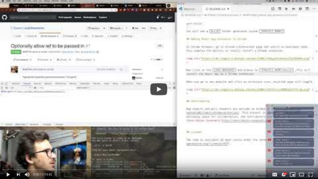](https://www.youtube.com/watch?v=JtgVsrW7WkI)

... and failed miserably.

[Chrome extensions are easy in theory](https://swizec.com/blog/build-chrome-extension/swizec/8278), but I wanted to use React for reasons. A different project where it makes more sense and this was a good excuse to figure it out.

Well, it didn't work. It is nigh impossible to convince create-react-app to work as a Chrome Extension.

Until I discovered [react-chrome-extension](https://github.com/satendra02/react-chrome-extension). A boilerplate that comes with everything configured. Build steps, manifest files, full React support. It's wonderful 👌

## Attempt no. 2

React problem resolve, surely this is gonna be a piece of cake now. Let's do this!

Friday I tried again

[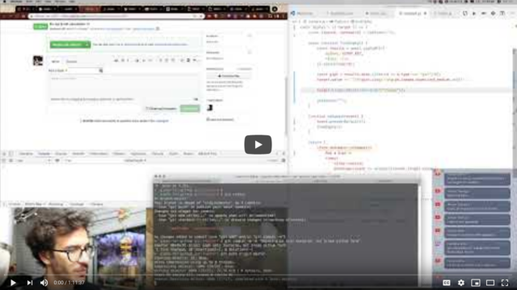](https://www.youtube.com/watch?v=5XRyY6YQzjA)

We wasted time drinking beer and shooting the shit about San Francisco, Silicon Valley, and some recent career news on my end (more on that later). Would you say SF is fancy? It's covered in poop, but also seeing a Porsche is so common you don't even notice anymore 🤔

But [giphs-for-github](https://github.com/Swizec/giphs-for-github) worked!

Well ... the operation was a success but the patient died. Oops.

### The Giphy part

Finding a giph was easy. Giphy's API is great and React Hooks make building small forms a breeze.

[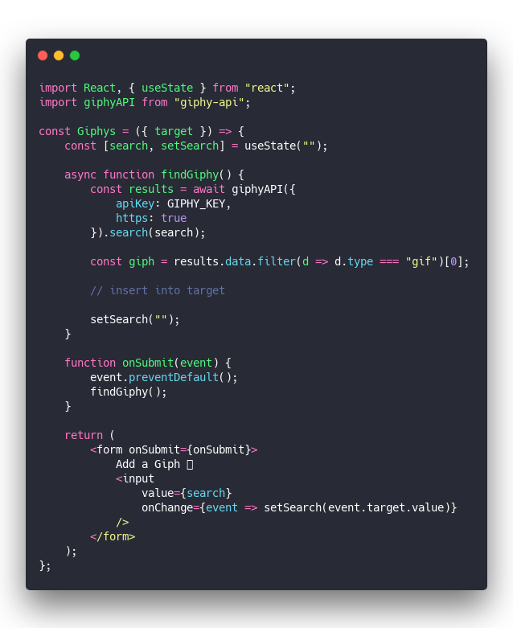](https://carbon.now.sh/?bg=rgba(255,255,255,1)&t=seti&l=javascript&ds=true&wc=true&wa=true&pv=48px&ph=32px&ln=false&code=\import%20React%2C%20%7B%20useState%20%7D%20from%20%22react%22%3B%0A\import%20giphyAPI%20from%20%22giphy-api%22%3B%0A%0Aconst%20Giphys%20%3D%20(%7B%20target%20%7D)%20%3D%3E%20%7B%0A%20%20%20%20const%20%5Bsearch%2C%20setSearch%5D%20%3D%20useState(%22%22)%3B%0A%0A%20%20%20%20async%20function%20findGiphy()%20%7B%0A%20%20%20%20%20%20%20%20const%20results%20%3D%20await%20giphyAPI(%7B%0A%20%20%20%20%20%20%20%20%20%20%20%20apiKey%3A%20GIPHY_KEY%2C%0A%20%20%20%20%20%20%20%20%20%20%20%20https%3A%20true%0A%20%20%20%20%20%20%20%20%7D).search(search)%3B%0A%0A%20%20%20%20%20%20%20%20const%20giph%20%3D%20results.data.filter(d%20%3D%3E%20d.type%20%3D%3D%3D%20%22gif%22)%5B0%5D%3B%0A%20%20%20%20%20%20%20%20%0A%20%20%20%20%20%20%20%20%2F%2F%20insert%20into%20target%0A%0A%20%20%20%20%20%20%20%20setSearch(%22%22)%3B%0A%20%20%20%20%7D%0A%0A%20%20%20%20function%20onSubmit(event)%20%7B%0A%20%20%20%20%20%20%20%20event.preventDefault()%3B%0A%20%20%20%20%20%20%20%20findGiphy()%3B%0A%20%20%20%20%7D%0A%0A%20%20%20%20return%20(%0A%20%20%20%20%20%20%20%20%3Cform%20onSubmit%3D%7BonSubmit%7D%3E%0A%20%20%20%20%20%20%20%20%20%20%20%20Add%20a%20Giph%20%F0%9F%91%89%0A%20%20%20%20%20%20%20%20%20%20%20%20%3Cinput%0A%20%20%20%20%20%20%20%20%20%20%20%20%20%20%20%20value%3D%7Bsearch%7D%0A%20%20%20%20%20%20%20%20%20%20%20%20%20%20%20%20onChange%3D%7Bevent%20%3D%3E%20setSearch(event.target.value)%7D%0A%20%20%20%20%20%20%20%20%20%20%20%20%2F%3E%0A%20%20%20%20%20%20%20%20%3C%2Fform%3E%0A%20%20%20%20)%3B%0A%7D%3B)

A single `<Giphys>` component.

1. Render a form with an input element
2. Use a `search` state
3. Run `setSearch` on change events
4. Call `findGiphy` on submit and prevent default
5. Use [giphy-api](https://github.com/austinkelleher/giphy-api) to run a search query
6. Take the first result
7. Insert into textarea

Rendering this next to every textarea is a matter of some classic DOM manipulation. Find all textareas, inject an element in their parent.

[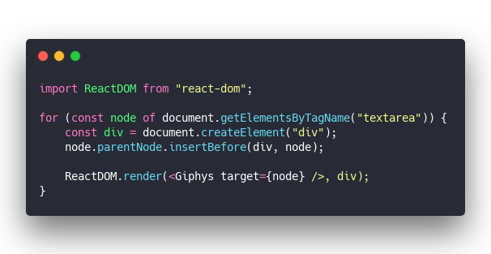](https://carbon.now.sh/?bg=rgba(255,255,255,1)&t=seti&l=javascript&ds=true&wc=true&wa=true&pv=48px&ph=32px&ln=false&code=\import%20ReactDOM%20from%20%22react-dom%22%3B%0A%0Afor%20(const%20node%20of%20document.getElementsByTagName(%22textarea%22))%20%7B%0A%20%20%20%20const%20div%20%3D%20document.createElement(%22div%22)%3B%0A%20%20%20%20node.parentNode.insertBefore(div%2C%20node)%3B%0A%0A%20%20%20%20ReactDOM.render(%3CGiphys%20target%3D%7Bnode%7D%20%2F%3E%2C%20div)%3B%0A%7D)

Works great 👌

So why does it break the textarea?

## Attempt no. 3

The most obvious way to add content to a textarea using JavaScript looks like this.

[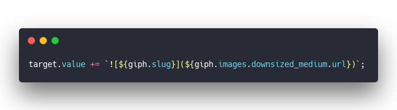](https://carbon.now.sh/?bg=rgba(255,255,255,1)&t=seti&l=javascript&ds=true&wc=true&wa=true&pv=48px&ph=32px&ln=false&code=target.value%20%2B%3D%20%60!%5B%24%7Bgiph.slug%7D%5D(%24%7Bgiph.images.downsized_medium.url%7D)%60%3B)

`target` is our textarea node. Its value resides in the `.value` property and the DOM spec allows us to change it.

Value is just a string so we `+=` another string. Works.

But GitHub's JavaScript framework freaks out. The Comment button doesn't become enabled, there's an error, and anything you type into the textarea triggers even more errors.

Which brings us to Sunday when I tried to figure this out once and for all.

[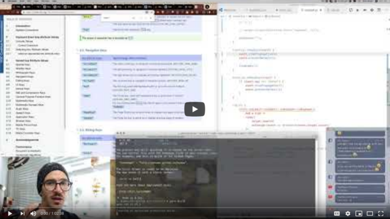](https://www.youtube.com/watch?v=7vM1hJCVUKg)

That was ... fun? Confusing? I learned more than I ever wanted to know about keyboard events? 🤨

### Why is this so hard?

The problem is two-fold:

1. Pressing Enter causes an error. GitHub's code picks up on the event and gets confused
2. GitHub's framework is data-driven. Our shenanigans put reality out of sync with internal state and GitHub JS gets confused

I don't know what they use, but you can imagine why it wouldn't like outsiders messing with things.

Nothing a little change event can't fix.

[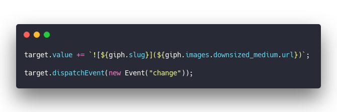](https://carbon.now.sh/?bg=rgba(255,255,255,1)&t=seti&l=javascript&ds=true&wc=true&wa=true&pv=48px&ph=32px&ln=false&code=target.value%20%2B%3D%20%60!%5B%24%7Bgiph.slug%7D%5D(%24%7Bgiph.images.downsized_medium.url%7D)%60%3B%0A%0Atarget.dispatchEvent(new%20Event(%22change%22))%3B)

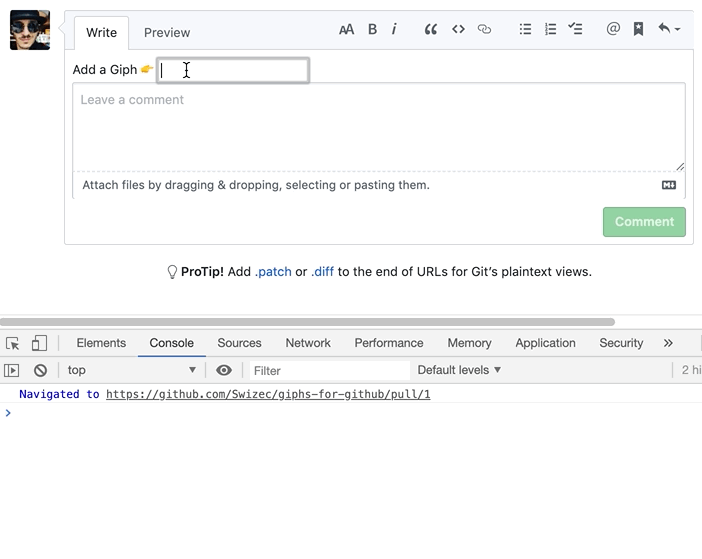

Nope.

That's strange. How could a change event _not_ make it work? Most frameworks use the `onChange` event ...

But then you look at the list of events GitHub's textarea is listening for and wow that's a lot.

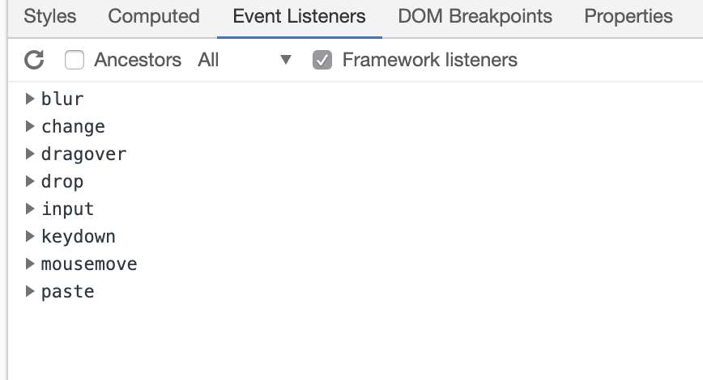

Maybe we need to replay the full keyboard interaction to make this work? Something crazy like [this StackOverflow comment](https://stackoverflow.com/a/23964375) lists?

Focus, keydown, beforeinput, keypress, input, change, keyup ... essentially replaying the whole sequence of events as if this were a real user interacting with the website.

It didn't work.

Not only didn't it work, the content didn't even show up. You still have to call `textarea.value +=`.

We even tried faking the `input` event to make it look like a copy paste. Didn't work. Not even gonna show you the code.

### What about faking the textarea itself?

The craziest idea was replacing the whole textarea with a textarea of our own. If you could unrender that one and make it listen to all the same DOM events as the original, that should be seamless, right?

Unfortunately you can't get a list of event listeners for a DOM node.

Yes Chrome lists them in dev tools. You can even use `getEventListeners` in Chrome console.

There's no way to get them in real code.

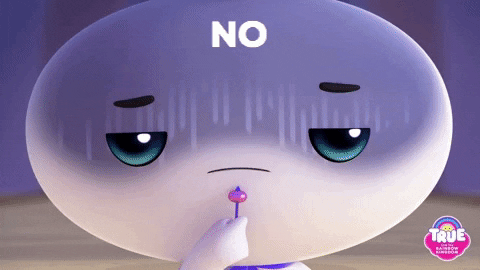

## Wisdom of the crowds to the rescue

Out of options, out of ideas, I asked the internet for help.

[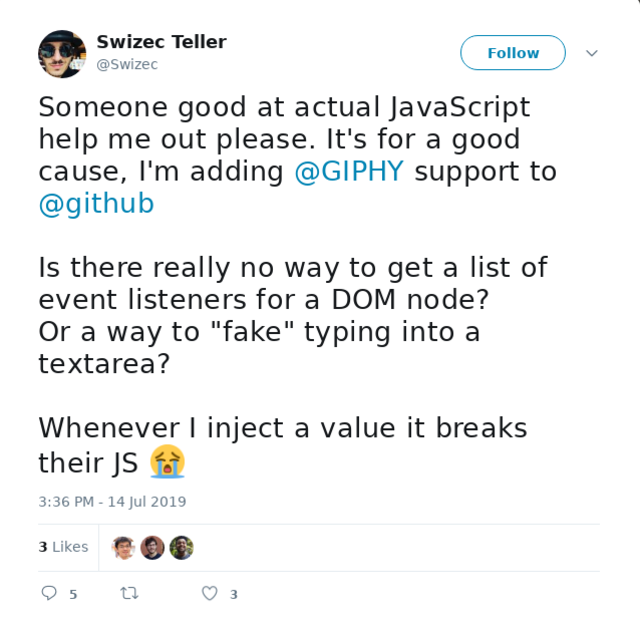](https://twitter.com/Swizec/status/1150534623954210817)

And the internet delivered! Thanks [@\_tarekdj](https://twitter.com/_tarekdj)

Firing the `change` event was the right idea. I was just doing it wrong.

[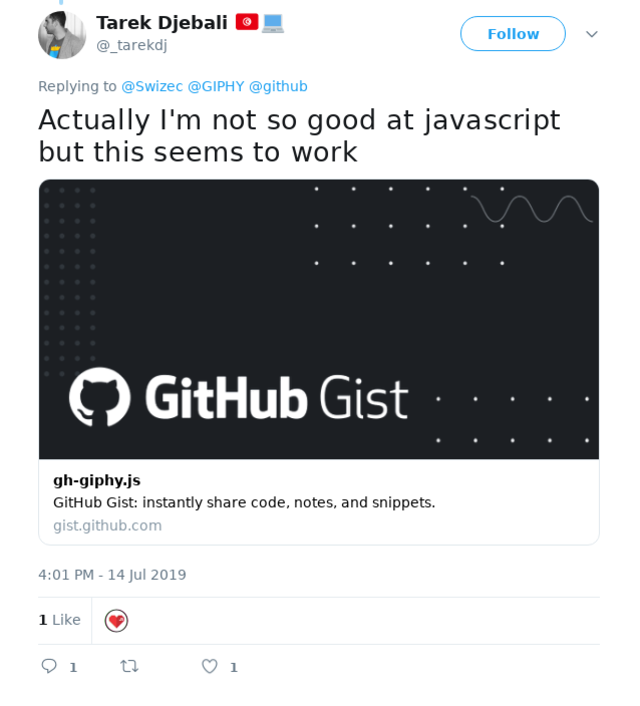](https://twitter.com/_tarekdj/status/1150540911866187779)

[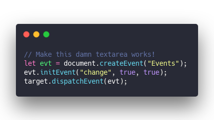](https://carbon.now.sh/?bg=rgba(255,255,255,1)&t=seti&l=javascript&ds=true&wc=true&wa=true&pv=48px&ph=32px&ln=false&code=%2F%2F%20Make%20this%20damn%20textarea%20works!%0Alet%20evt%20%3D%20document.createEvent(%22Events%22)%3B%0Aevt.initEvent(%22change%22%2C%20true%2C%20true)%3B%0Atarget.dispatchEvent(evt)%3B)

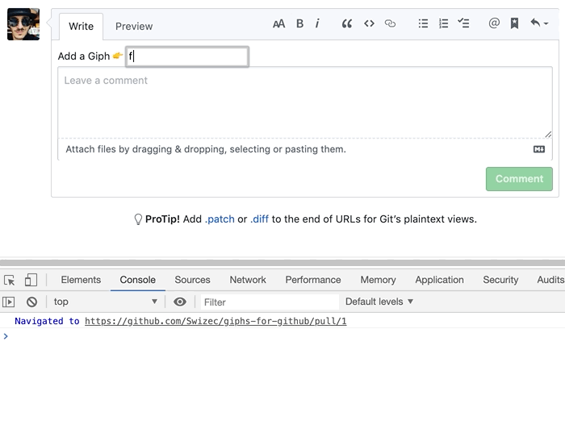

Yay it works!

Sure, the framework error is still there but we can fix that with a submit button instead of pressing Enter. I've tried, it worked.

As long as it doesn't break functionality I'm okay with firing an error.

What's more curious is why [@\_tarekdj](https://twitter.com/_tarekdj)'s change event works and mine doesn't.

## A change event is not a change event

Let's see, we've got two change events. One works, one doesn't

[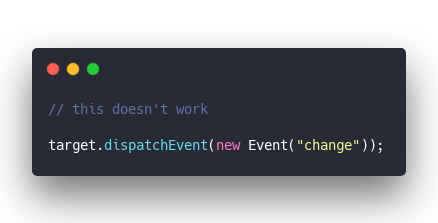](https://carbon.now.sh/?bg=rgba(255,255,255,1)&t=seti&l=javascript&ds=true&wc=true&wa=true&pv=48px&ph=32px&ln=false&code=%2F%2F%20this%20doesn't%20work%0A%0Atarget.dispatchEvent(new%20Event(%22change%22))%3B)

We're creating a new Event as per [MDN docs](https://developer.mozilla.org/en-US/docs/Web/API/Event). It's the most basic of event objects that all the others build off of.

> The Event interface represents an event which takes place in the DOM.

The [Event Constructor](https://developer.mozilla.org/en-US/docs/Web/API/Event/Event) creates an event object of a certain type. `dispatchEvent` fires it.

Second argument is an `EventInit` dictionary with options. By default events are non-bubbling.

That feels \\important 🤔

Event bubbling is how events propagate up the hierarchy of DOM elements by the way. That's how a form knows to submit when you press Enter inside an input field 5 levels down.

[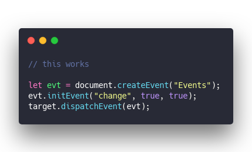](https://carbon.now.sh/?bg=rgba(255,255,255,1)&t=seti&l=javascript&ds=true&wc=true&wa=true&pv=48px&ph=32px&ln=false&code=%2F%2F%20this%20works%0A%0Alet%20evt%20%3D%20document.createEvent(%22Events%22)%3B%0Aevt.initEvent(%22change%22%2C%20true%2C%20true)%3B%0Atarget.dispatchEvent(evt)%3B)

The working version _also_ creates an event and dispatches it. Except it's using a more old school approach.

Calls [createEvent](https://developer.mozilla.org/en-US/docs/Web/API/Document/createEvent) which has a shiny red banner saying we should be using event constructors instead. But it still creates an uninitialized event.

> Creates an event of the type specified. The returned object should be first initialized and can then be passed to EventTarget.dispatchEvent.

The `initEvent` call initializes it.

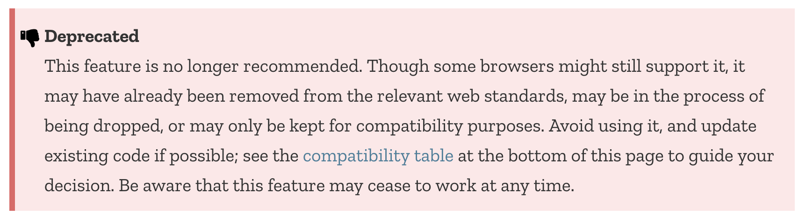

That's not a good sign 😅

What do those booleans we're passing in do? Here's the function signature

[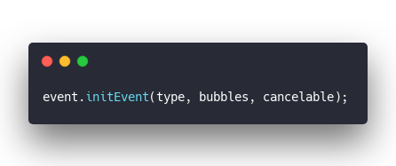](https://carbon.now.sh/?bg=rgba(255,255,255,1)&t=seti&l=javascript&ds=true&wc=true&wa=true&pv=48px&ph=32px&ln=false&code=event.initEvent(type%2C%20bubbles%2C%20cancelable)%3B)

🤔

So it _was_ all about bubbling! Let's try

[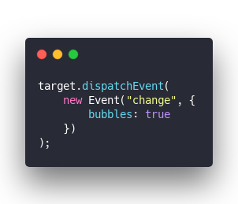](https://carbon.now.sh/?bg=rgba(255,255,255,1)&t=seti&l=javascript&ds=true&wc=true&wa=true&pv=48px&ph=32px&ln=false&code=target.dispatchEvent(%0A%20%20%20%20new%20Event(%22change%22%2C%20%7B%0A%20%20%20%20%20%20%20%20bubbles%3A%20true%0A%20%20%20%20%7D)%0A)%3B)

It works! 😱

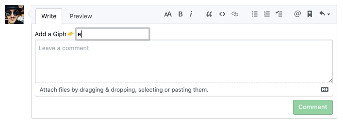

Well that was fun. Thanks for reading.

Happy Monday ✌️,  
~Swizec