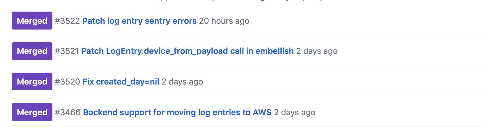
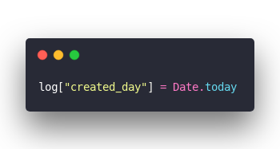

Wednesday was a fun day for me my friend. A system I'd been working on for months went live and everything died. 😅

Deploy. HOT PATCH. Patch. Fix. phew

You might remember reading about this system in December when I wrote about [Logging 1,721,410 events per day with Postgres, Rails, Heroku, and a bit of JavaScript](https://swizec.com/blog/logging-events-postgres-rails-heroku-javascript/swizec/8825). Yes I know what you're going to say ...

> Yo, Swiz, dunno if you've heard, logging is a solved problem bro. It don't have to be this hard. Just write to a text file and parse it later.

Think of this more as telemetry for an entire product, business, and everything in between. We need logs from various clients (web and mobile), we need to tie those logs back to real users and devices and business tests, and we need every department in the company to use these for analytics to drive business decisions.

Yeah it touches everything.

So of course I crashed it.

Not only did I crash it. I brought down _everything_. Every single API that we've got was errorring out. For a whole hour.

## So what happened?

The backstory is that we're moving the whole system to AWS Lambda as a ... microservice. A nanoservice? A bunch of FaaS? What do you call a gaggle of lambda functions that work together as a system?

So I've been working on that for a few months and on Wednesday it was time to unleash Phase 1 upon the world.

Pipe logs to AWS and see what happens. Disable the lambdas that push to Datadog and Mixpanel.

Goal was to run both the old and the new system in parallel and work out the kinks. I was certain _something_ was going to go wrong. And we can't have an outage of a business critical system now can we?

Instead we had an outage of everything. 😇

Our API requests create metrics, you see. Something like `backend.request.success` with a bit of metadata about the request, the user, stuff like that.

Most metrics go through a function that adds more info. A sort of catch all for meta data when it makes sense.

But _those_ backend metrics do not. There's too many of them and the metadataing is too slow. Hella SQL queries.

While refactoring I moved a piece of code from the normal flow to the metadata flow.

&t=seti&l=ruby&ds=true&wc=true&wa=true&pv=48px&ph=32px&ln=false&code=log%5B%22created_day%22%5D%20%3D%20Date.today)

Moved it a few lines down.

Innocuous change right? What could possibly go wrong?

In production we use that field to build [table partitions](https://www.postgresql.org/docs/10/ddl-partitioning.html). It's a way to speed up Postgres tables by effectively splitting them into smaller tables. You need that when you're writing millions of rows per day.

Partitioning is a lot like the [sharding](https://en.wikipedia.org/wiki/Shard_(database_architecture)) concept from NoSQL.

You can't build partitions on `null` fields.

That throws a database error.

That database error says _"Yo you can't write this log"_

That error throws an exception

That exception bubbles up

Your API request fails

_Every_ API request fails

Your service goes down. You have a big outage.

You have to stop eating lunch and go fix that shit. Yeah don't run a big scary deploy and go eat lunch thinking all will be well. All will not be well.

The hotpatch was easy. Move the code, deploy. Service restored.

The proper fix included writing some tests. And we discovered another error thanks to [Sentry errors](https://sentry.io/welcome/).

Fixing _that_ error caused another error because I'm dumb. But that error was in the background with no effect on the end users. Just meant that a queue was filling up with data and would eventually drain when we fix the bug.

Those are the kind of errors you can take your sweet time to fix. 👌

## What did I learn?

A bunch of things!

1. **Our [Datadog](https://www.datadoghq.com/) alarms work great.** We have a system of overlapping alarms that trigger even if parts of the system don't work. Hard to trigger a _Too many errors_ alarm if there's no events coming through right? But you can trigger a _Too few API requests_ alarm 😉
2. **It's easy to ignore alarms that look like alarms you've ignored in the past**. Sometimes our alarms freak out for no reason. When that happens we've learned to say _"Eh it ain't so bad we'll fix it later"_. That lead us astray here because a super-very-critical alarm looked a lot like a not-quite-critical alarm.
3. **Avoid refactors without test coverage**. The root cause of my woes? Poor test coverage. Both automated test and manual QA test coverage. This is a critical system so of course we've got tests. I relied on those when refactoring. But I missed that coverage was poor so most of my code didn't even get tested. 🤦‍♂️
4. **Consider using a typed language for critical stuff**. Types are like automated unit tests with 100% coverage for many sorts of checks. They totally would have caught what I broke while refactoring. AND you are forced to write types all along so coverage is 100% if you avoid `any`.
5. **Decouple. Decouple. Decouple. Then decouple some more.** Why was a failure in logging able to crash the system it was observing? No excuse. The move to AWS Lambda automatically solves the problem but damn. Past Swizec why you dumb?

Lucky for me this was the only tight coupling in the system. That's why the other 3 errors weren't critical: Clients don't rely on logs succeeding. Backend processing doesn't rely on processing succeeding. Even the backend itself doesn't rely on any of that to work.

It was just this one darn thing ...

✌️

~Swizec