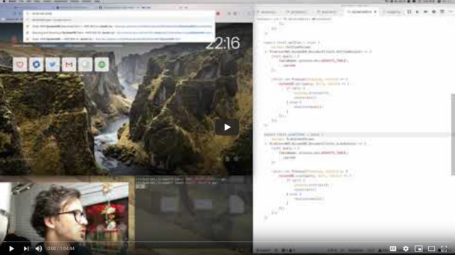
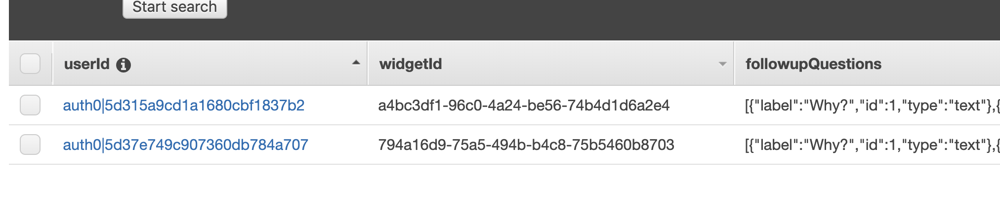
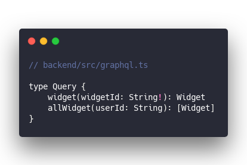
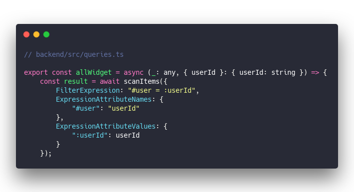
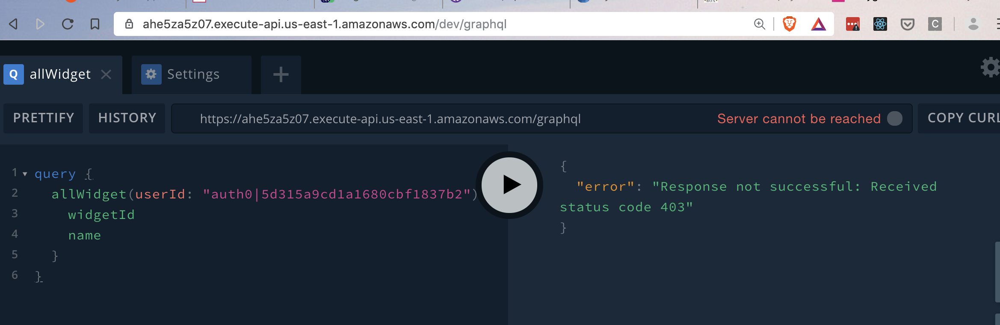
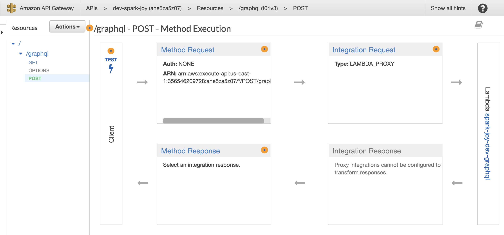
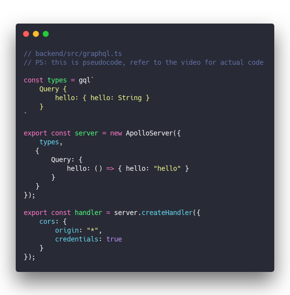
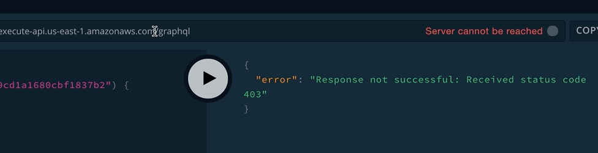
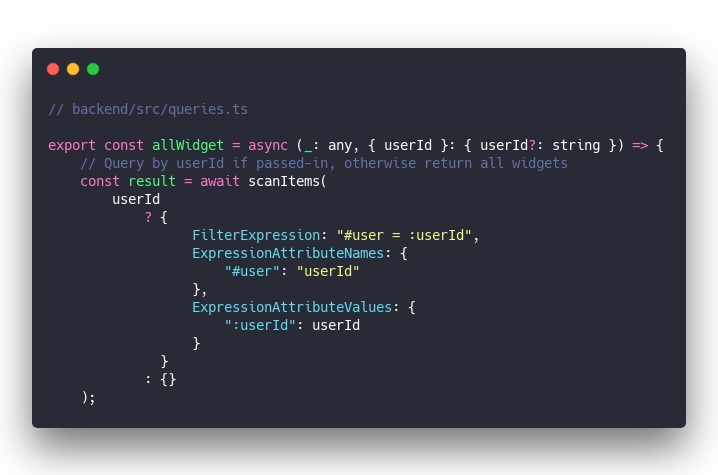

Hello friend 👋

Today I wanted to share a quick lesson in debugging complex systems. It's from my upcoming course on building modern React apps with GraphQL, Serverless, and such. Currently a live video series :)

On Tuesday we hit a snag that derailed the whole session. Unfortunate yes, but I think it produced a great teachable moment. How _do_ you debug complex systems and figure out what's wrong?

enjoy ❤️

* * *

Near the beginning a wild error appeared: 403 Forbidden.

GraphQL failed. Nothing went through.

It was a great lesson in systematically debugging complex systems. And in the end we did get our `allWidget(userId: "some-long-id")` to work.

As Nico later said

> Even though we didn't make a lot of measurable progress this evening, I still feel like I learned a lot about the troubleshooting side of things 🙂 Notably, creating the basic apollo server was 👌. You explained how to narrow down where the issue could be via simplification, and that thought process might not exist for audience members that don't have an Ops or DevOps background.

Thanks Nico ❤️

Here's how it all went down 👇

## Add userId to the allWidget query

We wanted to display per user widget lists on the homepage.

That shows `email` and `video` widgets which is a fine list, but check this out: They're from two different users.

Best way to fix that is changing our `allWidget` query so it accepts a `userId` and returns a list of widgets just for that user. It's \\important this filtering happens on the backend so data the user shouldn't see never reaches their browser.

&t=seti&l=javascript&ds=true&wc=true&wa=true&pv=48px&ph=32px&ln=false&code=%2F%2F%20backend%2Fsrc%2Fgraphql.ts%0A%0Atype%20Query%20%7B%0A%20%20%20%20widget(widgetId%3A%20String!)%3A%20Widget%0A%20%20%20%20allWidget(userId%3A%20String)%3A%20%5BWidget%5D%0A%7D)

The query now accepts a `userId` parameter.

Passing a few extra arguments into the `scanItems` query in our resolver makes the magic work.

&t=seti&l=javascript&ds=true&wc=true&wa=true&pv=48px&ph=32px&ln=false&code=%2F%2F%20backend%2Fsrc%2Fqueries.ts%0A%0Aexport%20const%20allWidget%20%3D%20async%20(_%3A%20any%2C%20%7B%20userId%20%7D%3A%20%7B%20userId%3A%20string%20%7D)%20%3D%3E%20%7B%0A%20%20%20%20const%20result%20%3D%20await%20scanItems(%7B%0A%20%20%20%20%20%20%20%20FilterExpression%3A%20%22%23user%20%3D%20%3AuserId%22%2C%0A%20%20%20%20%20%20%20%20ExpressionAttributeNames%3A%20%7B%0A%20%20%20%20%20%20%20%20%20%20%20%20%22%23user%22%3A%20%22userId%22%0A%20%20%20%20%20%20%20%20%7D%2C%0A%20%20%20%20%20%20%20%20ExpressionAttributeValues%3A%20%7B%0A%20%20%20%20%20%20%20%20%20%20%20%20%22%3AuserId%22%3A%20userId%0A%20%20%20%20%20%20%20%20%7D%0A%20%20%20%20%7D)%3B)

DynamoDB scan queries can be cumbersome. Getting a list of everything is easy – no arguments – a specific list takes 3 arguments. That's a lot 🤨

- `FilterExpression` says what we're filtering by. Equality with `userId` in our case
- `ExpressionAttributeNames` maps filter attributes to table columns
- `ExpressionAttributeValues` maps filter value placeholders to real values

## Try the query and 403

We decided to test our new query in Apollo Playground first. This would let us focus on the query itself and not on the details of Gatsby or React being just right.

And that's when all hell broke loose.

Server unreachable. Console full of `Forbidden: 403` errors. Gatsby local server crashed out on us. Everything died.

## Narrow down the problem

Something was clearly very wrong. But we didn't change anything that could cause this did we? 🤔

**Zeroth step** check the logs, but there were no useful errors there. This is a sign you're about to go on a wild ride.

**First step** make sure we didn't change something.

Git checkout the old version of our server. Deploy the lambdas. Try our playground again. If this works, we know some code change on our end broke the server.

Still didn't work.

Okay **second step** try to remember what was wrong last time something like this happened.

We had a problem a few sessions ago where our lambda wasn't configured to accept POST requests. Looking at `serverless.yml` confirmed that POST requests are in fact configured.

**Third step** is Serverless messing up somehow and misconfiguring AWS APIGateway?

Looked into the AWS dashboard. Spelunked through the UI and found a configuration for our APIGateway. Everything looked right. GET requests connected to our lambda. So are POST requests.

Okay what else can we try?

**Fourth step** try deploying to a new stage. Maybe we clicked something in the UI that broke things in a way Serverless can't correct.

So we ran `sls deploy -s dev2` to create a whole new AWS setup for our service. Everything fresh and from scratch. Make sure the environment isn't the problem.

Nope. Still broken.

🤔

Okay **fifth step** reduce our server to the absolute smallest possible setup. Make sure _nothing_ about our code could be causing this.

&t=seti&l=javascript&ds=true&wc=true&wa=true&pv=48px&ph=32px&ln=false&code=%2F%2F%20backend%2Fsrc%2Fgraphql.ts%0A%2F%2F%20PS%3A%20this%20is%20pseudocode%2C%20refer%20to%20the%20video%20for%20actual%20code%0A%0Aconst%20types%20%3D%20gql%60%0A%09Query%20%7B%0A%09%09hello%3A%20%7B%20hello%3A%20String%20%7D%0A%09%7D%0A%60%0A%0Aexport%20const%20server%20%3D%20new%20ApolloServer(%7B%0A%20%20%20%20types%2C%0A%20%20%20%7B%0A%09%20%20%20Query%3A%20%7B%0A%09%09%20%20%20hello%3A%20()%20%3D%3E%20%7B%20hello%3A%20%22hello%22%20%7D%0A%09%20%20%20%7D%0A%20%20%20%7D%0A%7D)%3B%0A%0Aexport%20const%20handler%20%3D%20server.createHandler(%7B%0A%20%20%20%20cors%3A%20%7B%0A%20%20%20%20%20%20%20%20origin%3A%20%22*%22%2C%0A%20%20%20%20%20%20%20%20credentials%3A%20true%0A%20%20%20%20%7D%0A%7D)%3B)

If that works, we know the problem is somewhere in how we configured GraphQL.

**Sixth step** getting desperate, but what if we create a server that just returns a hello world?

That was a dead end too. Now what ...

**Seventh step** start googling. Has anyone else had this problem before?

We found an old github issue on Apollo's repository. Something about Apollo playground using the wrong server URL ...

## The facepalm 🤦‍♀️

That was it. Apollo was using the wrong server URL.

Change the target URL to `/dev/graphql` and everything works. Everything.

It wasn't a change that we made breaking things at all. And to make matters worse: Gatsby crashed because of a completely unrelated problem but it confirmed our fears that the server is broken 🤦‍♀️

## Make allWidget work without userId

Gatsby crashed not because our server was broken but because it queries `allWidget` to create pages for thumbsup/thumbsdown.

We have to make the query work with _and_ without `userId`.

&t=seti&l=javascript&ds=true&wc=true&wa=true&pv=48px&ph=32px&ln=false&code=%2F%2F%20backend%2Fsrc%2Fqueries.ts%0A%0Aexport%20const%20allWidget%20%3D%20async%20(_%3A%20any%2C%20%7B%20userId%20%7D%3A%20%7B%20userId%3F%3A%20string%20%7D)%20%3D%3E%20%7B%0A%20%20%20%20%2F%2F%20Query%20by%20userId%20if%20passed-in%2C%20otherwise%20return%20all%20widgets%0A%20%20%20%20const%20result%20%3D%20await%20scanItems(%0A%20%20%20%20%20%20%20%20userId%0A%20%20%20%20%20%20%20%20%20%20%20%20%3F%20%7B%0A%20%20%20%20%20%20%20%20%20%20%20%20%20%20%20%20%20%20FilterExpression%3A%20%22%23user%20%3D%20%3AuserId%22%2C%0A%20%20%20%20%20%20%20%20%20%20%20%20%20%20%20%20%20%20ExpressionAttributeNames%3A%20%7B%0A%20%20%20%20%20%20%20%20%20%20%20%20%20%20%20%20%20%20%20%20%20%20%22%23user%22%3A%20%22userId%22%0A%20%20%20%20%20%20%20%20%20%20%20%20%20%20%20%20%20%20%7D%2C%0A%20%20%20%20%20%20%20%20%20%20%20%20%20%20%20%20%20%20ExpressionAttributeValues%3A%20%7B%0A%20%20%20%20%20%20%20%20%20%20%20%20%20%20%20%20%20%20%20%20%20%20%22%3AuserId%22%3A%20userId%0A%20%20%20%20%20%20%20%20%20%20%20%20%20%20%20%20%20%20%7D%0A%20%20%20%20%20%20%20%20%20%20%20%20%20%20%7D%0A%20%20%20%20%20%20%20%20%20%20%20%20%3A%20%7B%7D%0A%20%20%20%20)%3B)

Make the `userId` optional, pass arguments into `scanItems` based on whether it's available.

And just like that everything works again. That was fun.

## To recap

We used what I've heard referred to as the Sherlock method 👉 make a hypothesis, find clues, follow every clue to its end. Repeat until solved.

You can tackle any debugging problem this way.

Cheers, ~Swizec