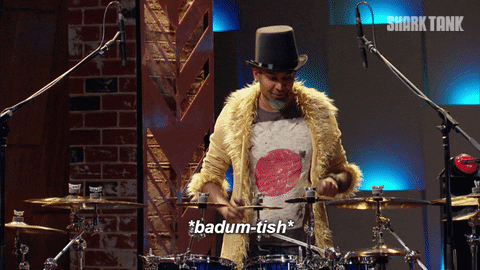
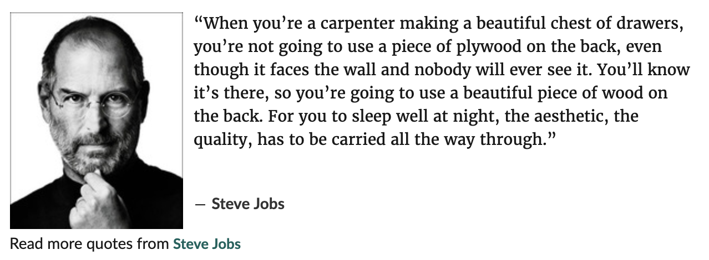
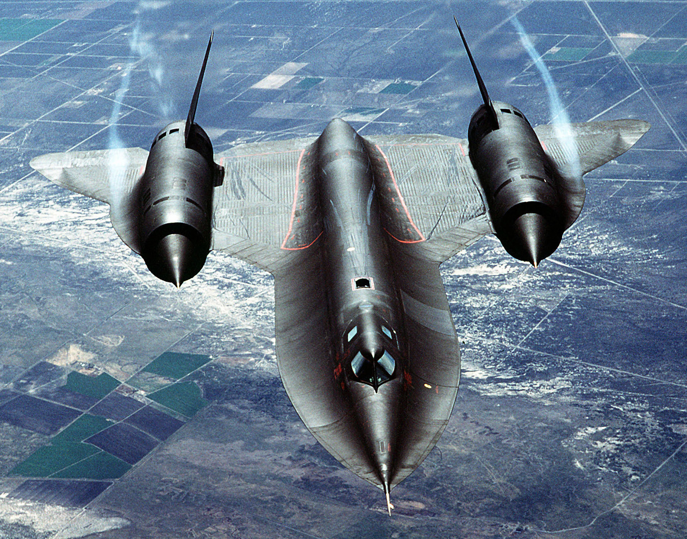

What's the difference between a better engineer and a more effective engineer?

That's the question I posed my friend after a heated debate on what mindset engineers should focus on. It was meant to be a challenge. A debate ender. Meditate on that this weekend, what's the difference?  And then it wouldn't let me sleep. What IS the difference? I can feel it in my gut that there is a difference, but ... what is it? 🤨 Let's define some terms. A **better engineer** is someone who is better at their craft. You look at their code and it's all nicely punctuated, well formatted, easy to read. The names of methods make their purpose apparent, the architecture is easy to follow, nothing is either too big or too small. There are tests. Looking at their code gives you this feeling in your gut – that this is good craftsmanship. High quality code. To steal an [analogy from Steve Jobs](https://www.goodreads.com/quotes/445621-when-you-re-a-carpenter-making-a-beautiful-chest-of-drawers): Even the backs of the cabinets, the code nobody will ever see, are built with care and precision.  A **more effective engineer** is someone who gets on base. The kind of engineer who takes their craft and aims it squarely at a goal. The goal is their ultimate aim. They care about craft, quality, and all the rest, but only in so far as it makes the goal easier to achieve. If push comes to shove, all craft goes out the window. _Get it done_ is what matters most. Like Moneyball: We don't care who you are, what you are, or how you do it. Do you get on base?

Because at the end of the day that's what matters: Do you ship?

## Craft in pursuit of a goal is the ultimate

Race cars inspire the 9 year old in your heart and they win races. That's it.  The [Porsche 956](https://en.wikipedia.org/wiki/Porsche_956) is gorgeous. And it also set a Nürburgring lap record that stood for 35 years, won 24 hours of Le Mans 4 times, and is one of only four cars in history to win the race twice in a row. _That_ is good engineering. But it's a race car. I can almost promise you it was only as well crafted as it needed to be to win races.  The [SR-71 Blackbird](https://en.wikipedia.org/wiki/Lockheed_SR-71_Blackbird) is (officially) the fastest non-rocket aircraft ever made. With a cruising speed of Mach 3.2 its missile defense system consisted of _"Run away from the missile"_. Awe inspiring. But the SR-71 also leaked fuel on the ground and had to be [refueled right after takeoff](https://theaviationgeekclub.com/former-sr-71-driver-explains-why-the-blackbird-had-to-refuel-after-takeoff/) lest fumes catch fire on the hot fuselage. Talk about technical debt. Your beautiful airplane will literally explode if you hold it wrong. Is that craft or effectiveness? It flew real missions ... ... unlike Howard Hughes's perfect [H-4 Hercules](https://en.wikipedia.org/wiki/Hughes_H-4_Hercules). The biggest flying boat airplane ever made. Beautiful feat of engineering that never flew a single mission. The war it was built for ended too soon. Oops. Here's a fun example from my high school years of downhill mountain biking 👉 mountain bike pedals come in two forms. You can have [knobby pedals](https://www.rei.com/media/product/130123) with tiny screws that impale your shoes to create unimaginable grip. Then there's [clip-in pedals](https://www.rei.com/media/product/878487) where a mechanism clips onto special shoes to create infinite grip. Obviously any self respecting biker would use knobby pedals. Clip-ins are like cheating. Knobbies take skill. Racers use clip-ons. Shaves seconds off their times. Wins races. Race car drivers, too, _love_ electronic driver aids. It's faster. It wins races. Screw ego.  
Don't worry so much about craft, my friend, win the race. ✌️  
Cheers,  
~Swizec
