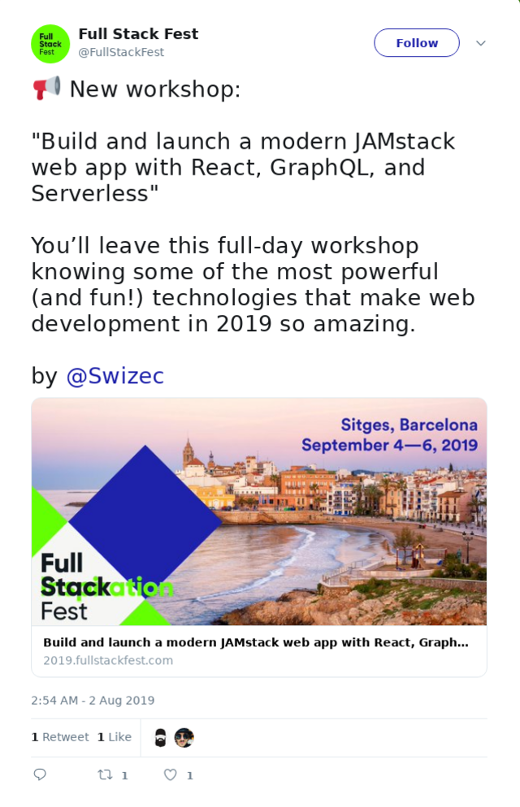
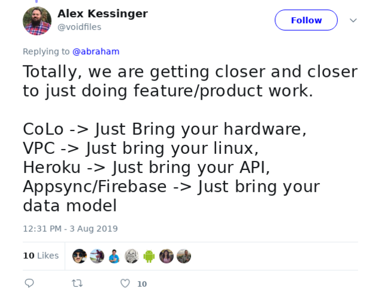
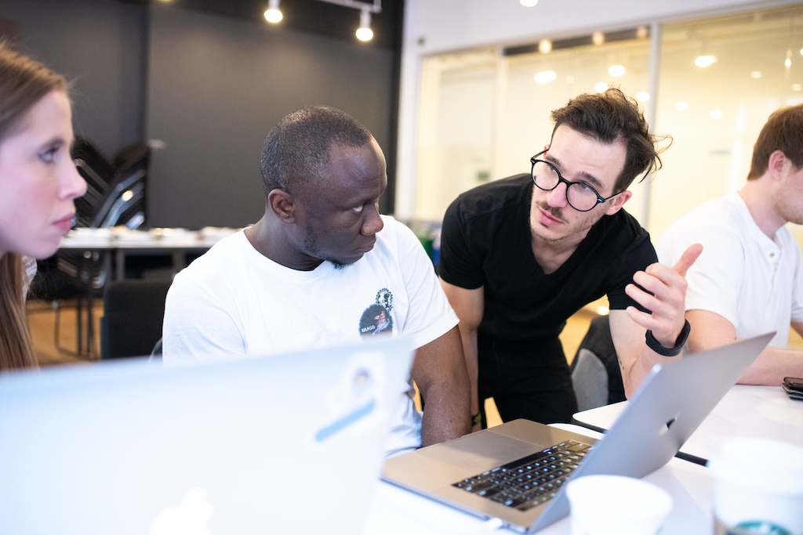
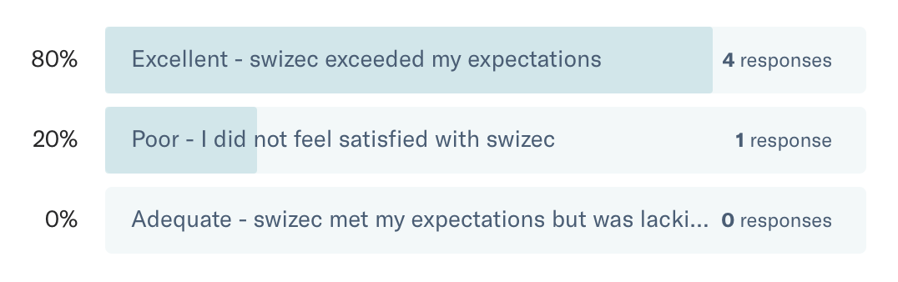
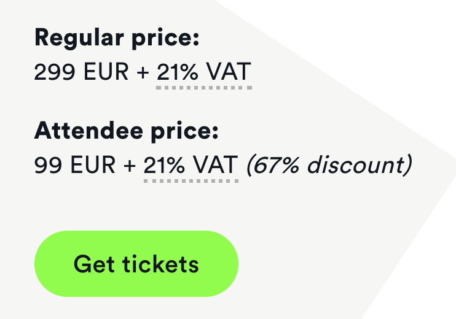

Wanna learn GraphQL, Serverless, how to build a modern React app from scratch front and back? Join me in Barcelona this September!

A little backstory

Earlier this year, or was it late last year 🤔, I took part of the 24 Hour Startup challenge. You sit down, press stream, and build an entire product in 24 hours. Completely from scratch.

And it worked! I ended up with [a wonderful tool](https://techletter.app) that helps me build these emails 🎉

See that tweet screenshot above? I paste a text file into a box, JavaScript parses my markdown, fires up a function on AWS Lambda that runs Chrome, takes a screenshot, and sends it back to my frontend code. Then a button lets me export to HTML.

Same process works for code, instagram, youtube, giphy ...

See that? I just wrote `` 🧙‍♂️

That project made me realize something: **We're on the verge of a revolution**

How we build webapps is about to change forever. No more frontend engineers and backend engineers. No more systems engineers, no more devops.

Just product engineers building awesome stuff.

Alex is right.

What makes the modern web? Bring your data model and do your magic.

React frontend, Serverless backend, GraphQL to make them talk. It's amazing and I love it. I never want to configure another server or build another API.

## What would you build if you could build anything?

What if next time you have an idea for a great feature, you just build it?

Own the whole stack from start to finish. You'd be a superhero! Even if it's not in your job description right now.

Maybe it's a side project? Dream of making money while you sleep? Making a little income on the side? Chasing that FIRE (financial independence, retire early) dream? A painful problem to solve?

Yep 💪

- Beautiful UI? Got that.
- Great SEO? Yep. Easy.
- Amazing lighthouse speed scores? You got it.
- Running heavy code on the backend? Done.
- Saving user data? Yepp.
- Works on mobile? Of course.
- What about an offline PWA? D’oh.
- Makes money? Yep got that too.

All of that in a 1 day workshop 😍

### Build and launch a modern JAMstack web app with React, GraphQL, and Serverless

I wanna teach you how to build modern fullstack apps. Everything. The whole thing.

GraphQL, Serverless, React frontends, DynamoDB to store data, Gatsby to make your app fast, user authentication ... everything you need to build a product. You can use what you learn at your job or for a side hustle. Up to you ✌️

I ran this workshop for the first time at Reactathon in March. It sold like hot cakes. We had to get a bigger room!

With this workshop, you'll learn:

- How to set up a static webapp with Gatsby
- Why that’s \\important for SEO and speed scores
- How to build good looking UIs without design skills
- How to move some functionality to the backend using a serverless approach
- How to use serverless to store user data
- Using GraphQL to query and write your data
- How to monetize your creation

You’ll leave this full-day workshop knowing some of the most powerful (and fun!) technologies that make web development in 2019 so amazing.

Now I'll be honest ... the Reactathon version was great, but it had some flaws. First time presenting this content at a full day workshop and it wasn't as polished as I'd like. Yet.

Here's what some attendees had to say

> How simple some of the GraphQL stuff was, seemed kind of robust from the outside and not having used it before. Serverless also suprised me in how useful it could be, taking care of all routing and other aspects of the backend letting you just write business logic specific functions and have them pre-mapped.

\--

> How easy serverless is to use

\--

> The instruction was great, I thought the layout for the workshop could be improved a bit, /../ I was also thinking about the VS Code live sharing feature, you could give students a link to a vscode live share /../ I ended up just listening to your presentation

\--

> Excellent workshop! Thank you

I have since improved the workshop. Just finished an epic live video series edition. We built a product from scratch using these technologies over a few evenings.

It was great fun. The content is better. And my approach to using the stack has improved. You'll get all those benefits ✌️

> I'ts been really fun and interesting how this series tuned out. I learned all kinds of things I had no idea even existed.

\--

> It was great to watch you build an app from concept to launch. It has been very motivating and educational series.

Don't you [wanna join](https://2019.fullstackfest.com/workshops/build-and-launch-jamstack-react-graphql-serverless/)? 😛

## Discount for my readers because I love you ❤️

FullStackFest organizers gave me a bunch of discount codes to share.

1. You automatically get 200 euro off the workshop price, if you attend the conference as well. That's hella neat.

2. If you don't want to come to my workshop, no hard feelings. I got you a [25% discount for the conference](https://ti.to/codegram/full-stack-fest-2019/discount/SWIZEC). We can still hang out 😍
3. Want just the workshop and no conference? YES! Here's [$100 off the workshop price](https://ti.to/codegram/full-stack-fest-2019/discount/SWIZEC-WORKSHOP-100)

Will I see you in Barcelona? I'm excited.

Cheers, ~Swizec