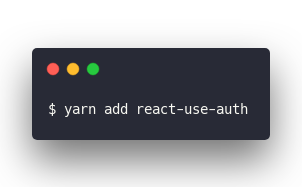
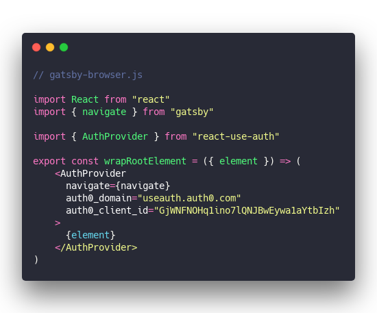
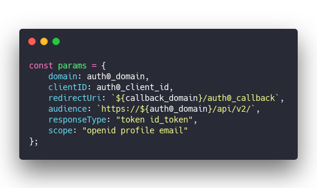
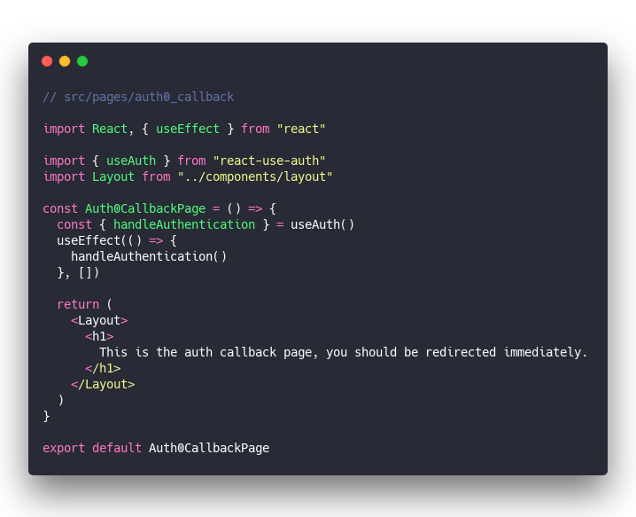
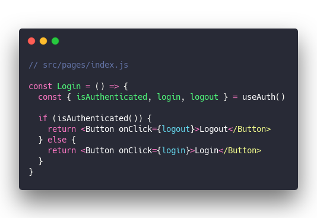
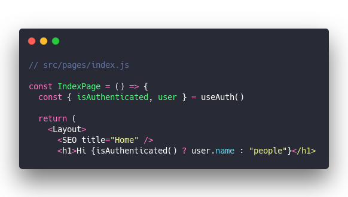

> Omg I just built the simplest way to add authentication to your React app. Should seriously open source it
>
>
>
> Handles everything for you. Users, login forms, redirects, sharing state between components. Everything

So I did 😎

## Announcing useAuth

[`useAuth`](https://github.com/Swizec/useAuth) is the simplest way to add authentication to your React app. Handles everything for you – user management, cookies, sharing state between components, login forms, everything you need to get started.

A lot of that is handled through Auth0 right now and I'm very open to adding other providers. I like Auth0 because it's free for way more users than I'll ever have and it isn't Google 😛

You can try it out here 👉 <https://gatsby-useauth-example.now.sh/>

See the code here 👉 <https://github.com/Swizec/useAuth>

Example code here 👉 <https://github.com/Swizec/useAuth/tree/master/examples/useauth-gatsby>

## How to use useAuth

[`useAuth`](https://github.com/Swizec/useAuth) is designed to be quick to setup. You'll need an Auth0 account with an app domain and client id.

### 1. Install the hook

&t=seti&l=null&ds=true&wc=true&wa=true&pv=48px&ph=32px&ln=false&code=%24%20yarn%20add%20react-use-auth)

Downloads from npm, adds to your package.json, etc. You can use `npm` as well.

### 2. Set up AuthProvider

useAuth uses an `AuthProvider` component to configure the Auth0 client and share state between components. It's using React context with a reducer behind the scenes, but that's an implementation detail.

I recommend adding this around your root component. In Gatsby that's done in `gatsby-browser.js` and `gatsby-ssr.js`. Yes `useAuth` is built so it doesn't break server-side rendering. ✌️

But of course server-side "you" will always be logged out.

&t=seti&l=javascript&ds=true&wc=true&wa=true&pv=48px&ph=32px&ln=false&code=%2F%2F%20gatsby-browser.js%0A%0A\import%20React%20from%20%22react%22%0A\import%20%7B%20navigate%20%7D%20from%20%22gatsby%22%0A%0A\import%20%7B%20AuthProvider%20%7D%20from%20%22react-use-auth%22%0A%0Aexport%20const%20wrapRootElement%20%3D%20(%7B%20element%20%7D)%20%3D%3E%20(%0A%09%3CAuthProvider%0A%09%20%20navigate%3D%7Bnavigate%7D%0A%09%20%20auth0_domain%3D%22useauth.auth0.com%22%0A%09%20%20auth0_client_id%3D%22GjWNFNOHq1ino7lQNJBwEywa1aYtbIzh%22%0A%09%3E%0A%09%20%20%7Belement%7D%0A%09%3C%2FAuthProvider%3E%0A))

`<AuthProvider>` creates a context, sets up a state reducer, initializes an Auth0 client and so on. Everything you need for authentication to work in your whole app :)

The API takes a couple config options:

1. `navigate` – your navigation function, used for redirects. I've tested with Gatsby, but anything should work
2. `auth0_domain` – from your Auth0 app
3. `auth0_client_id` – from your Auth0 app
4. `auth0_params` – an object that lets you overwrite any of the default Auth0 client parameters

_PS: even though Auth doesn't do anything server-side, useAuth will throw errors during build, if its context doesn't exist_

#### Default Auth0 params

By default `useAuth`'s Auth0 client uses these params:

&t=seti&l=javascript&ds=true&wc=true&wa=true&pv=48px&ph=32px&ln=false&code=const%20params%20%3D%20%7B%0A%20%20%20%20domain%3A%20auth0_domain%2C%0A%20%20%20%20clientID%3A%20auth0_client_id%2C%0A%20%20%20%20redirectUri%3A%20%60%24%7Bcallback_domain%7D%2Fauth0_callback%60%2C%0A%20%20%20%20audience%3A%20%60https%3A%2F%2F%24%7Bauth0_domain%7D%2Fapi%2Fv2%2F%60%2C%0A%20%20%20%20responseType%3A%20%22token%20id_token%22%2C%0A%20%20%20%20scope%3A%20%22openid%20profile%20email%22%0A%7D%3B)

`domain` and `clientID` come from your props.

`redirectUri` is set to use the `auth0_callback` page on the current domain. Auth0 redirects here after users login so you can set cookies and stuff. `useAuth` will handle this for you ✌️

`audience` is set to use api/v2. I know this is necessary but honestly have been copypasting it through several of my projects.

`responseType` same here. I copy paste this from old projects so I figured it's a good default.

`scope` you need `openid` for social logins and to be able to fetch user profiles after authentication. Profile and Email too. You can add more via the `auth0_params` override.

### 3. Create the callback page

Auth0 and most other authentication providers use OAuth. That requires redirecting your user to _their_ login form. After login, the provider redirects the user back to _your_ app.

Any way of creating React pages should work, here's what I use for Gatsby.

&t=seti&l=javascript&ds=true&wc=true&wa=true&pv=48px&ph=32px&ln=false&code=%2F%2F%20src%2Fpages%2Fauth0_callback%0A%0A\import%20React%2C%20%7B%20useEffect%20%7D%20from%20%22react%22%0A%0A\import%20%7B%20useAuth%20%7D%20from%20%22react-use-auth%22%0A\import%20Layout%20from%20%22..%2Fcomponents%2Flayout%22%0A%0Aconst%20Auth0CallbackPage%20%3D%20()%20%3D%3E%20%7B%0A%20%20const%20%7B%20handleAuthentication%20%7D%20%3D%20useAuth()%0A%20%20useEffect(()%20%3D%3E%20%7B%0A%20%20%20%20handleAuthentication()%0A%20%20%7D%2C%20%5B%5D)%0A%0A%20%20return%20(%0A%20%20%20%20%3CLayout%3E%0A%20%20%20%20%20%20%3Ch1%3E%0A%20%20%20%20%20%20%20%20This%20is%20the%20auth%20callback%20page%2C%20you%20should%20be%20redirected%20immediately.%0A%20%20%20%20%20%20%3C%2Fh1%3E%0A%20%20%20%20%3C%2FLayout%3E%0A%20%20)%0A%7D%0A%0Aexport%20default%20Auth0CallbackPage)

The goal is to load a page, briefly show some text, and run the `handleAuthentication` method from `useAuth` on page load.

That method will create a cookie in local storage with your user's information and redirect back to homepage. Redirecting to other post-login pages currently isn't supported but is a good idea now that I thought of it 🤔

**_PS: Make sure you add `<domain>/auth0_callback` as a valid callback URL in your Auth0 config_**

### 4. Enjoy useAuth

You're ready to use `useAuth` for authentication in your React app.

Here's a login button for example:

&t=seti&l=javascript&ds=true&wc=true&wa=true&pv=48px&ph=32px&ln=false&code=%2F%2F%20src%2Fpages%2Findex.js%0A%0Aconst%20Login%20%3D%20()%20%3D%3E%20%7B%0A%20%20const%20%7B%20isAuthenticated%2C%20login%2C%20logout%20%7D%20%3D%20useAuth()%0A%0A%20%20if%20(isAuthenticated())%20%7B%0A%20%20%20%20return%20%3CButton%20onClick%3D%7Blogout%7D%3ELogout%3C%2FButton%3E%0A%20%20%7D%20else%20%7B%0A%20%20%20%20return%20%3CButton%20onClick%3D%7Blogin%7D%3ELogin%3C%2FButton%3E%0A%20%20%7D%0A%7D)

`isAuthenticated` is a method that checks if the user's cookie is still valid. `login` and `logout` trigger their respective actions.

You can even say hello to your users

&t=seti&l=javascript&ds=true&wc=true&wa=true&pv=48px&ph=32px&ln=false&code=%2F%2F%20src%2Fpages%2Findex.js%0A%0Aconst%20IndexPage%20%3D%20()%20%3D%3E%20%7B%0A%20%20const%20%7B%20isAuthenticated%2C%20user%20%7D%20%3D%20useAuth()%0A%0A%20%20return%20(%0A%20%20%20%20%3CLayout%3E%0A%20%20%20%20%20%20%3CSEO%20title%3D%22Home%22%20%2F%3E%0A%20%20%20%20%20%20%3Ch1%3EHi%20%7BisAuthenticated()%20%3F%20user.name%20%3A%20%22people%22%7D%3C%2Fh1%3E>)

Check `isAuthenticated` then use the user object. Simple as that.

* * *

You can try it out here 👉 <https://gatsby-useauth-example.now.sh/>

See the code here 👉 <https://github.com/Swizec/useAuth>

Example code here 👉 <https://github.com/Swizec/useAuth/tree/master/examples/useauth-gatsby>

* * *

Hope you like it :)

Cheers,  
~Swizec

PS: we'll be using and talking about useAuth in more depth at my [Barcelona workshop in September](https://swizec.com/blog/wanna-come-hang-out-in-barcelona/swizec/9175)