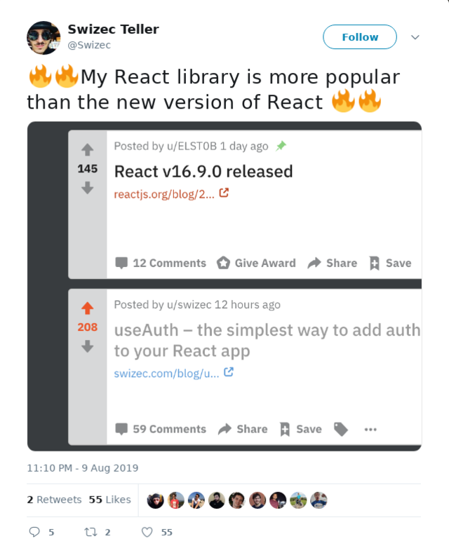
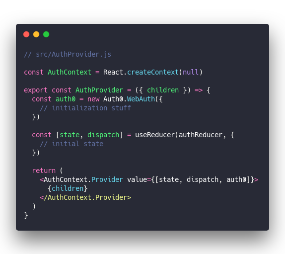
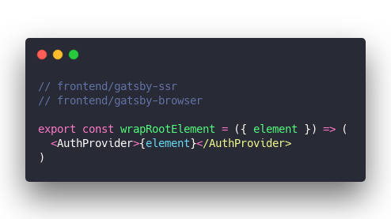
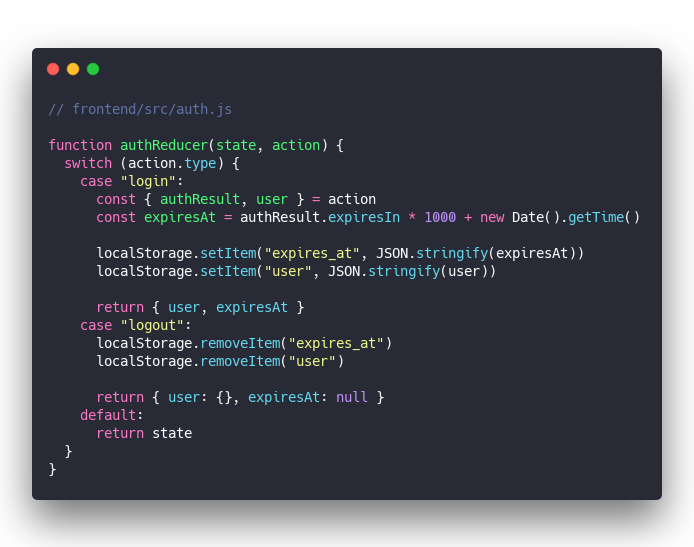
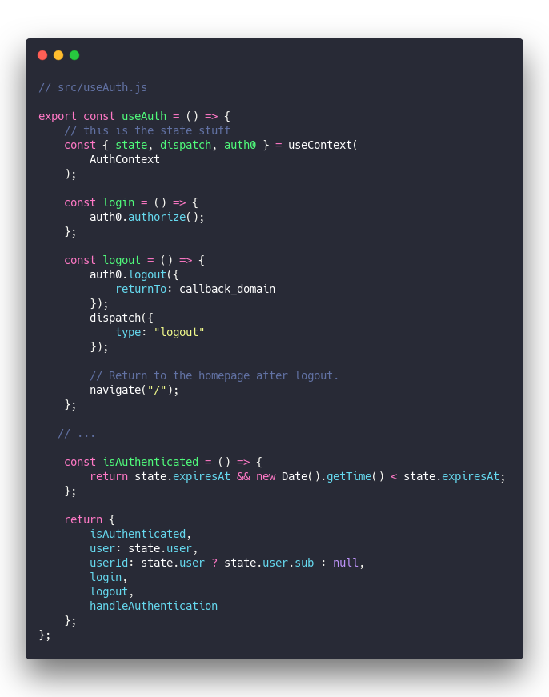
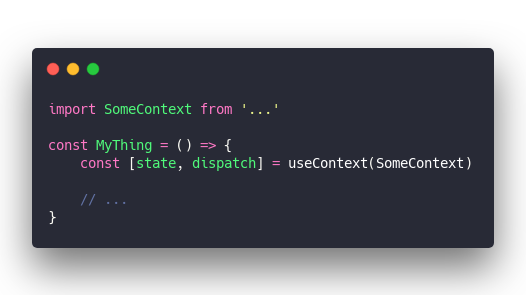
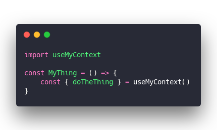

Since [useAuth](https://github.com/Swizec/useAuth) is taking off, I wanted to talk about the global state management technique that makes it work. You might find it useful too, or think it's obvious, I was pretty excited when it clicked :)

And when I say useAuth is taking off ...

Yep 🔥

Ok so global state management, how do you do it? You grab [Redux](https://github.com/reduxjs/redux) or [MobX](https://github.com/mobxjs/mobx), or maybe [Unstated](https://github.com/jamiebuilds/unstated) or [Constate](https://github.com/diegohaz/constate) and you're done. Right?

All those libraries give you a global store to put your data, allow every component to access that state, and manage re-renders. You get some way of updating that state and life is good.

Sometimes there's extra features.

But what if you don't want to learn yet another library? You just wanna share some state between a bunch of components. What then?

## Global state without the hassle

The simplest approach is to put global state in your top-level component. Pass it down through props and if you want to change it, pass down some callbacks too.

Works great and gets out of hand real fast. Passing props is cumbersome and you can create a situation where every little update re-renders your entire app.

Here's a better solution 👉 You can share the `state` and `dispatch` from `useReducer` through context and access them with a hook.

I'll explain using [useAuth](https://github.com/Swizec/useAuth) as an example, but the same approach works for anything.

There's 3 parts to this story:

1. A context provider component
2. A reducer for state
3. A hook providing our API

Users render the context provider somewhere close to the root of their app. Similar to a theme provider, Apollo provider, etc.

The provider feeds state from our reducer into the context. When you fire actions on the reducer, state in the context changes, and every component using the `useAuth` hook re-renders with new data.

It's pretty great.

## AuthProvider

[file link](https://github.com/Swizec/useAuth/blob/master/src/AuthProvider.js)

&t=seti&l=javascript&ds=true&wc=true&wa=true&pv=48px&ph=32px&ln=false&code=%2F%2F%20src%2FAuthProvider.js%0A%0Aconst%20AuthContext%20%3D%20React.createContext(null)%0A%0Aexport%20const%20AuthProvider%20%3D%20(%7B%20children%20%7D)%20%3D%3E%20%7B%0A%20%20const%20auth0%20%3D%20new%20Auth0.WebAuth(%7B%0A%20%20%20%20%2F%2F%20initialization%20stuff%0A%20%20%7D)%0A%0A%20%20const%20%5Bstate%2C%20dispatch%5D%20%3D%20useReducer(authReducer%2C%20%7B%0A%20%20%20%20%2F%2F%20initial%20state%0A%20%20%7D)%0A%0A%20%20return%20(%0A%20%20%20%20%3CAuthContext.Provider%20value%3D%7B%5Bstate%2C%20dispatch%2C%20auth0%5D%7D%3E%0A%20%20%20%20%20%20%7Bchildren%7D%0A%20%20%20%20%3C%2FAuthContext.Provider%3E%0A%20%20)%0A%7D)

That's our context provider.

The provider initializes `auth0` using Auth0's API and configures some properties. Full version supports a bunch of config via props, overwriting defaults, etc.

We call `useReducer` to get a state object and the action dispatch function. Initialize state from local storage if you want persistence, or keep it empty to start with.

I recommend defining initial values so your code doesn't have to deal with undefineds.

Our provider renders `AuthContext.Provider` and as its value uses the `state` object, `dispatch` function, and `auth0` object.

This was the trick to getting different `useAuth` hooks to talk to each other. Using reducer state and dispatch as the context value.

### Using AuthProvider

In Gatsby you use the auth provider in `gatsby-ssr` and `gatsby-browser` to wrap your entire component tree. With create-react-app this goes around your App component, with other frameworks who knows.

The higher up it renders, the more parts of your app share state.

&t=seti&l=javascript&ds=true&wc=true&wa=true&pv=48px&ph=32px&ln=false&code=%2F%2F%20frontend%2Fgatsby-ssr%0A%2F%2F%20frontend%2Fgatsby-browser%0A%0Aexport%20const%20wrapRootElement%20%3D%20(%7B%20element%20%7D)%20%3D%3E%20(%0A%20%20%3CAuthProvider%3E%7Belement%7D%3C%2FAuthProvider%3E%0A))

## Auth reducer

The auth reducer takes care of state transitions. [full file](https://github.com/Swizec/useAuth/blob/master/src/authReducer.js)

&t=seti&l=javascript&ds=true&wc=true&wa=true&pv=48px&ph=32px&ln=false&code=%2F%2F%20frontend%2Fsrc%2Fauth.js%0A%0Afunction%20authReducer(state%2C%20action)%20%7B%0A%20%20switch%20(action.type)%20%7B%0A%20%20%20%20case%20%22login%22%3A%0A%20%20%20%20%20%20const%20%7B%20authResult%2C%20user%20%7D%20%3D%20action%0A%20%20%20%20%20%20const%20expiresAt%20%3D%20authResult.expiresIn%20*%201000%20%2B%20new%20Date().getTime()%0A%0A%20%20%20%20%20%20localStorage.setItem(%22expires_at%22%2C%20JSON.stringify(expiresAt))%0A%20%20%20%20%20%20localStorage.setItem(%22user%22%2C%20JSON.stringify(user))%0A%0A%20%20%20%20%20%20return%20%7B%20user%2C%20expiresAt%20%7D%0A%20%20%20%20case%20%22logout%22%3A%0A%20%20%20%20%20%20localStorage.removeItem(%22expires_at%22)%0A%20%20%20%20%20%20localStorage.removeItem(%22user%22)%0A%0A%20%20%20%20%20%20return%20%7B%20user%3A%20%7B%7D%2C%20expiresAt%3A%20null%20%7D%0A%20%20%20%20default%3A%0A%20%20%20%20%20%20return%20state%0A%20%20%7D%0A%7D)

If you're not familiar with reducers: it's a function that takes the current state and an action, and calculates the next state. Always returning a fresh object.

In our case the `login` and `logout` actions handle the user model and cookie expiration time. Both actions also save data to local storage so it persists across page reloads.

## useAuth hook itself

With heavy lifting moved to the context provider and auth reducer, our `useAuth` hook becomes a sort of thin wrapper and API provider. [full file](https://github.com/Swizec/useAuth/blob/master/src/useAuth.js)

&t=seti&l=javascript&ds=true&wc=true&wa=true&pv=48px&ph=32px&ln=false&code=%2F%2F%20src%2FuseAuth.js%0A%0Aexport%20const%20useAuth%20%3D%20()%20%3D%3E%20%7B%0A%20%20%20%20%2F%2F%20this%20is%20the%20state%20stuff%0A%20%20%20%20const%20%7B%20state%2C%20dispatch%2C%20auth0%20%7D%20%3D%20useContext(%0A%20%20%20%20%20%20%20%20AuthContext%0A%20%20%20%20)%3B%0A%0A%20%20%20%20const%20login%20%3D%20()%20%3D%3E%20%7B%0A%20%20%20%20%20%20%20%20auth0.authorize()%3B%0A%20%20%20%20%7D%3B%0A%0A%20%20%20%20const%20logout%20%3D%20()%20%3D%3E%20%7B%0A%20%20%20%20%20%20%20%20auth0.logout(%7B%0A%20%20%20%20%20%20%20%20%20%20%20%20returnTo%3A%20callback_domain%0A%20%20%20%20%20%20%20%20%7D)%3B%0A%20%20%20%20%20%20%20%20dispatch(%7B%0A%20%20%20%20%20%20%20%20%20%20%20%20type%3A%20%22logout%22%0A%20%20%20%20%20%20%20%20%7D)%3B%0A%0A%20%20%20%20%20%20%20%20%2F%2F%20Return%20to%20the%20homepage%20after%20logout.%0A%20%20%20%20%20%20%20%20navigate(%22%2F%22)%3B%0A%20%20%20%20%7D%3B%0A%0A%20%20%20%2F%2F%20...%0A%0A%20%20%20%20const%20isAuthenticated%20%3D%20()%20%3D%3E%20%7B%0A%20%20%20%20%20%20%20%20return%20state.expiresAt%20%26%26%20new%20Date().getTime()%20%3C%20state.expiresAt%3B%0A%20%20%20%20%7D%3B%0A%0A%20%20%20%20return%20%7B%0A%20%20%20%20%20%20%20%20isAuthenticated%2C%0A%20%20%20%20%20%20%20%20user%3A%20state.user%2C%0A%20%20%20%20%20%20%20%20userId%3A%20state.user%20%3F%20state.user.sub%20%3A%20null%2C%0A%20%20%20%20%20%20%20%20login%2C%0A%20%20%20%20%20%20%20%20logout%2C%0A%20%20%20%20%20%20%20%20handleAuthentication%0A%20%20%20%20%7D%3B%0A%7D%3B)

The state management part of `useAuth` is that `useContext` call. It hooks into the context shared by `AuthProvider` and gets access to the `state` object and `dispatch` method.

That gives any component that uses `useAuth` access to the same shared state.

You could use `useContext` directly. I prefer using a custom hook because it makes your code easier to read.

What's better, doing this everywhere you want to access some shared state:

&t=seti&l=javascript&ds=true&wc=true&wa=true&pv=48px&ph=32px&ln=false&code=\import%20SomeContext%20from%20'...'%0A%0Aconst%20MyThing%20%3D%20()%20%3D%3E%20%7B%0A%09const%20%5Bstate%2C%20dispatch%5D%20%3D%20useContext(SomeContext)%0A%0A%09%2F%2F%20...%0A%7D)

Or this

&t=seti&l=javascript&ds=true&wc=true&wa=true&pv=48px&ph=32px&ln=false&code=\import%20useMyContext%0A%0Aconst%20MyThing%20%3D%20()%20%3D%3E%20%7B%0A%09const%20%7B%20doTheThing%20%7D%20%3D%20useMyContext()%0A%7D)

I know what I prefer :)

With a custom hook you can use `dispatch` with carefully controlled values internally. Nobody needs to know what's going on. All they need to remember is your convenient API.

## ✌️

So that's how you can use React hooks to build powerful abstractions on top of global state shared by all.

What do you think?

Cheers,  
~Swizec