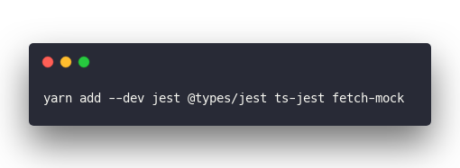
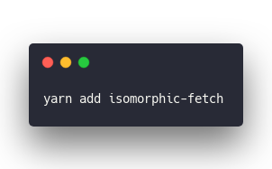
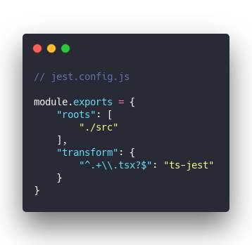
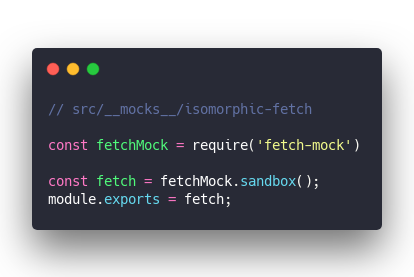
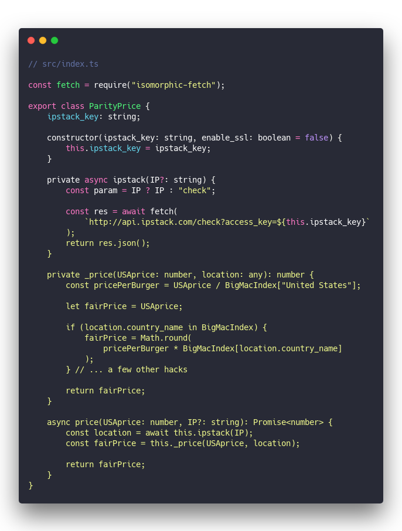

The Big Mac index is a purchasing power parity index published by The Economist. Jest fetch testing is a tech task so frustrating that it almost made me quit the industry.

Screenshots don't have gifs, here:

I'm writing this so you don't have to read 8234721 different blog posts, stack overflow answers, and GitHub threads with conflicting info on how to get Jest and fetch to play together.

Library where I got it working 👉 [bigmac-index-price-calculator](https://github.com/Swizec/bigmac-index-price-calculator).

Context is a project built from scratch without a CLI generator. Maybe that was part of my pain.

## How to test fetch requests with Jest

A couple of ground rules:

1. **Our test suite must work offline.** You shouldn't be blocked from coding just because you're on an airplane even if coding on an airplane is a terrible idea and you should really get some sleep instead.
2. **Our test suite must be reliable.** You don't want to get different results running at different times. No expiring API keys, no changing responses, no network failures.

We're using Jest because it's winning the JavaScript and TypeScript testing market. fetch() because it's the standard way to make API requests.

Our ground rules mean we have to mock requests – make them return a static object that we set up. Recording and replaying requests would be cool, but as far as I can tell [Ruby VCR](https://github.com/vcr/vcr) hasn't made it to the JavaScript world yet.

There's at least 2 fetch mocking libraries I could find: [fetch-mock](https://github.com/wheresrhys/fetch-mock) and [jest-fetch-mock](https://github.com/jefflau/jest-fetch-mock). Both annoying as shit to set up. `fetch-mock` was the one I got working in the end.

Jest tests run in node. Node doesn't have fetch. You have to use a library for that too. There's a fetch polyfills and ponyfills and Idontknowwhatelsefills out there. I found at least 3.

[isomorphic-fetch](https://github.com/matthew-andrews/isomorphic-fetch) is the library I got working in the end.

Let us begin.

### Install dependencies

Assuming you've got an empty project initialized with `npm init` or `yarn init`, you start by installing everything you'll need

&t=seti&l=bash&ds=true&wc=true&wa=true&pv=48px&ph=32px&ln=false&code=yarn%20add%20--dev%20jest%20%40types%2Fjest%20ts-jest%20fetch-mock%20)

Dev dependencies are those only used in development. We need Jest itself, its type definitions, its TypeScript sister, and fetch-mock.

Using `ts-jest` gives you TypeScript testing superpowers so you don't have to compile your code first and test second. Test your TypeScript directly. It's nice.

&t=seti&l=bash&ds=true&wc=true&wa=true&pv=48px&ph=32px&ln=false&code=yarn%20add%20isomorphic-fetch)

We need `isomorphic-fetch` both in development and when running live. That way your library doesn't break if used server-side in Gatsby or something.

### Configure Jest

Configure Jest in a `jest.config.js` file. There's a bunch of info out there on where exactly this configuration should live. This is the one that finally worked for me.

&t=seti&l=javascript&ds=true&wc=true&wa=true&pv=48px&ph=32px&ln=false&code=%2F%2F%20jest.config.js%0A%0Amodule.exports%20%3D%20%7B%0A%20%20%20%20%22roots%22%3A%20%5B%0A%20%20%20%20%20%20%20%20%22.%2Fsrc%22%0A%20%20%20%20%5D%2C%0A%20%20%20%20%22transform%22%3A%20%7B%0A%20%20%20%20%20%20%20%20%22%5E.%2B%5C%5C.tsx%3F%24%22%3A%20%22ts-jest%22%0A%20%20%20%20%7D%0A%7D)

We're saying code lives in a `/src` directory and that typescript files should run with `ts-jest`.

### Mock fetch requests

Jest has built-in support for mocking entire libraries. That was a nice discovery after trying many approaches from many articles and tutorials.

You put files in a `__mocks__` directory and they overwrite the library you're calling.

To use `fetch-mock` instead of `isomorphic-fetch` in your tests, create a file like this:

&t=seti&l=javascript&ds=true&wc=true&wa=true&pv=48px&ph=32px&ln=false&code=%2F%2F%20src%2F__mocks__%2Fisomorphic-fetch%0A%0Aconst%20fetchMock%20%3D%20require('fetch-mock')%0A%0Aconst%20fetch%20%3D%20fetchMock.sandbox()%3B%0Amodule.exports%20%3D%20fetch%3B)

This means that every time you \\import `isomorphic-fetch` in a test file, it will instead \\import a sandboxed `fetch-mock` instance. You can add any other setup you want here. Anything you need for your mocks to work correctly.

**BIG WARNING** 👉 you have to use the `require()` syntax. No ES6 \\imports because this is Node not JavaScript. That tripped me up for hours and rumors say you _can_ get `\import from` to work, but I eventually gave up.

### Write a Jest fetch test

We're ready to write a test. Everything _should_ work.

The file I'm testing is called `index.ts` so my test file is called `index.test.ts`. Here's an example:

&t=seti&l=typescript&ds=true&wc=true&wa=true&pv=48px&ph=32px&ln=false&code=%2F%2F%20src%2Findex.test.ts%0A%0A\import%20%7B%20ParityPrice%20%7D%20from%20%22.%2Findex%22%3B%0A\import%20*%20as%20fetchMock%20from%20%22isomorphic-fetch%22%3B%0A%0Aconst%20URL%20%3D%0A%20%20%20%20%22http%3A%2F%2Fapi.ipstack.com%2Fcheck%3Faccess_key%3D%3Capi%20key%3E%22%3B%0A%0Adescribe(%22ParityPrice%22%2C%20()%20%3D%3E%20%7B%0A%20%20%20%20beforeEach(()%20%3D%3E%20%7B%0A%20%20%20%20%20%20%20%20fetchMock.reset()%3B%0A%20%20%20%20%7D)%3B%0A%20%20%20%20%0A%20%20%20%20test(%22returns%20Japan%20price%20for%20Japan%22%2C%20async%20()%20%3D%3E%20%7B%0A%20%20%20%20%20%20%20%20fetchMock.mock(URL%2C%20%7B%0A%20%20%20%20%20%20%20%20%20%20%20%20status%3A%20200%2C%0A%20%20%20%20%20%20%20%20%20%20%20%20body%3A%20%7B%0A%20%20%20%20%20%20%20%20%20%20%20%20%20%20%20%20ip%3A%20%221.33.213.230%22%2C%0A%20%20%20%20%20%20%20%20%20%20%20%20%20%20%20%20type%3A%20%22ipv4%22%2C%0A%20%20%20%20%20%20%20%20%20%20%20%20%20%20%20%20continent_code%3A%20%22AS%22%2C%0A%20%20%20%20%20%20%20%20%20%20%20%20%20%20%20%20continent_name%3A%20%22Asia%22%2C%0A%20%20%20%20%20%20%20%20%20%20%20%20%20%20%20%20country_code%3A%20%22JP%22%2C%0A%20%20%20%20%20%20%20%20%20%20%20%20%20%20%20%20country_name%3A%20%22Japan%22%2C%0A%20%20%20%20%20%20%20%20%20%20%20%20%20%20%20%20region_code%3A%20%2213%22%2C%0A%20%20%20%20%20%20%20%20%20%20%20%20%20%20%20%20region_name%3A%20%22Tokyo%22%2C%0A%20%20%20%20%20%20%20%20%20%20%20%20%20%20%20%20city%3A%20%22Tokyo%22%2C%0A%20%20%20%20%20%20%20%20%20%20%20%20%20%20%20%20zip%3A%20%22100-6801%22%2C%0A%20%20%20%20%20%20%20%20%20%20%20%20%20%20%20%20latitude%3A%2035.688838958740234%2C%0A%20%20%20%20%20%20%20%20%20%20%20%20%20%20%20%20longitude%3A%20139.7628631591797%2C%0A%20%20%20%20%20%20%20%20%20%20%20%20%20%20%20%20location%3A%20%7B%0A%20%20%20%20%20%20%20%20%20%20%20%20%20%20%20%20%20%20%20%20geoname_id%3A%201850147%2C%0A%20%20%20%20%20%20%20%20%20%20%20%20%20%20%20%20%20%20%20%20capital%3A%20%22Tokyo%22%2C%0A%20%20%20%20%20%20%20%20%20%20%20%20%20%20%20%20%20%20%20%20languages%3A%20%5B%0A%20%20%20%20%20%20%20%20%20%20%20%20%20%20%20%20%20%20%20%20%20%20%20%20%7B%0A%20%20%20%20%20%20%20%20%20%20%20%20%20%20%20%20%20%20%20%20%20%20%20%20%20%20%20%20code%3A%20%22ja%22%2C%0A%20%20%20%20%20%20%20%20%20%20%20%20%20%20%20%20%20%20%20%20%20%20%20%20%20%20%20%20name%3A%20%22Japanese%22%2C%0A%20%20%20%20%20%20%20%20%20%20%20%20%20%20%20%20%20%20%20%20%20%20%20%20%20%20%20%20native%3A%20%22%5Cu65e5%5Cu672c%5Cu8a9e%22%0A%20%20%20%20%20%20%20%20%20%20%20%20%20%20%20%20%20%20%20%20%20%20%20%20%7D%0A%20%20%20%20%20%20%20%20%20%20%20%20%20%20%20%20%20%20%20%20%5D%2C%0A%20%20%20%20%20%20%20%20%20%20%20%20%20%20%20%20%20%20%20%20country_flag%3A%20%22http%3A%2F%2Fassets.ipstack.com%2Fflags%2Fjp.svg%22%2C%0A%20%20%20%20%20%20%20%20%20%20%20%20%20%20%20%20%20%20%20%20country_flag_emoji%3A%20%22%5Cud83c%5Cuddef%5Cud83c%5Cuddf5%22%2C%0A%20%20%20%20%20%20%20%20%20%20%20%20%20%20%20%20%20%20%20%20country_flag_emoji_unicode%3A%20%22U%2B1F1EF%20U%2B1F1F5%22%2C%0A%20%20%20%20%20%20%20%20%20%20%20%20%20%20%20%20%20%20%20%20calling_code%3A%20%2281%22%2C%0A%20%20%20%20%20%20%20%20%20%20%20%20%20%20%20%20%20%20%20%20is_eu%3A%20false%0A%20%20%20%20%20%20%20%20%20%20%20%20%20%20%20%20%7D%0A%20%20%20%20%20%20%20%20%20%20%20%20%7D%0A%20%20%20%20%20%20%20%20%7D)%3B%0A%0A%20%20%20%20%20%20%20%20const%20parity%20%3D%20new%20ParityPrice(%3Capi%20key%3E)%3B%0A%20%20%20%20%20%20%20%20await%20expect(parity.price(149)).resolves.toBe(96)%3B%0A%20%20%20%20%7D)%3B%0A%7D)%3B)

We're in Jest now so we can use modern \\imports.

Rest mocks before each test so there's no overlap, then mock an API request with a matcher and the response we want. The matcher in my case is a URL string, the exact URL my code is going to call, and the response is a JSON object.

Response code `200` for success and body for the data.

Now when you call `fetch(URL)` in the code, it won't make an API call, it's just gonna get this response object.

Makes your tests fast, offline, and reliable. ✌️

## The Big Mac purchasing parity code we're testing

TDD says to write your test first and your code second, but I actually wrote the code first. Here's the part we're testing above :)

&t=seti&l=javascript&ds=true&wc=true&wa=true&pv=48px&ph=32px&ln=false&code=%2F%2F%20src%2Findex.ts%0A%0Aconst%20fetch%20%3D%20require(%22isomorphic-fetch%22)%3B%0A%0Aexport%20class%20ParityPrice%20%7B%0A%20%20%20%20ipstack_key%3A%20string%3B%0A%0A%20%20%20%20constructor(ipstack_key%3A%20string%2C%20enable_ssl%3A%20boolean%20%3D%20false)%20%7B%0A%20%20%20%20%20%20%20%20this.ipstack_key%20%3D%20ipstack_key%3B%0A%20%20%20%20%7D%0A%0A%20%20%20%20private%20async%20ipstack(IP%3F%3A%20string)%20%7B%0A%20%20%20%20%20%20%20%20const%20param%20%3D%20IP%20%3F%20IP%20%3A%20%22check%22%3B%0A%0A%20%20%20%20%20%20%20%20const%20res%20%3D%20await%20fetch(%0A%20%20%20%20%20%20%20%20%20%20%20%20%60http%3A%2F%2Fapi.ipstack.com%2Fcheck%3Faccess_key%3D%24%7Bthis.ipstack_key%7D%60%0A%20%20%20%20%20%20%20%20)%3B%0A%20%20%20%20%20%20%20%20return%20res.json()%3B%0A%20%20%20%20%7D%0A%20%20%20%20%0A%20%20%20%20private%20_price(USAprice%3A%20number%2C%20location%3A%20any)%3A%20number%20%7B%0A%20%20%20%20%20%20%20%20const%20pricePerBurger%20%3D%20USAprice%20%2F%20BigMacIndex%5B%22United%20States%22%5D%3B%0A%0A%20%20%20%20%20%20%20%20let%20fairPrice%20%3D%20USAprice%3B%0A%0A%20%20%20%20%20%20%20%20if%20(location.country_name%20in%20BigMacIndex)%20%7B%0A%20%20%20%20%20%20%20%20%20%20%20%20fairPrice%20%3D%20Math.round(%0A%20%20%20%20%20%20%20%20%20%20%20%20%20%20%20%20pricePerBurger%20*%20BigMacIndex%5Blocation.country_name%5D%0A%20%20%20%20%20%20%20%20%20%20%20%20)%3B%0A%20%20%20%20%20%20%20%20%7D%20%2F%2F%20...%20a%20few%20other%20hacks%0A%0A%20%20%20%20%20%20%20%20return%20fairPrice%3B%0A%20%20%20%20%7D%0A%20%20%20%20%0A%20%20%20%20async%20price(USAprice%3A%20number%2C%20IP%3F%3A%20string)%3A%20Promise%3Cnumber%3E%20%7B%0A%20%20%20%20%20%20%20%20const%20location%20%3D%20await%20this.ipstack(IP)%3B%0A%20%20%20%20%20%20%20%20const%20fairPrice%20%3D%20this._price(USAprice%2C%20location)%3B%0A%0A%20%20%20%20%20%20%20%20return%20fairPrice%3B%0A%20%20%20%20%7D%0A%7D)

You instantiate `ParityPrice` with your [Ipstack](https://ipstack.com/) API key (you can get one for free) and call `.price()` with the price you're trying to parity match.

[bigmac-index-price-calculator](https://github.com/Swizec/bigmac-index-price-calculator) then calls Ipstack to geolocate your visitor based on IP, looks up their country in the BigMacIndex and returns the adjusted price.

The full version has some continent-based conversions when a country isn't found and a bit of caching so you can call multiple times without making too many requests. It works pretty well.

**RIDICULOUS WARNING** 👉 notice the `const fetch = require()` part up top? That's because while modern \\imports work for Jest files and they definitely work when packaging your library, _I couldn't get them to work when testing your library_. I tried everything. Nothing worked.

## Purchasing power parity on reactfordataviz.com

You can see [Big Mac Index](https://en.wikipedia.org/wiki/Big_Mac_Index) purchasing power parity in action on <https://reactfordataviz-staging.swizec.now.sh/>. Scroll down and you'll see a custom price for your location.

Don't click the button yet though. I haven't wired up the adjusted prices with Gumroad yet.

A lot of people have been asking for this and I think it's a great idea. Value based pricing all the way. If learning React Dataviz gets you a $150,000/year job in USA that's very different value than a $50,000/year job somewhere else.

Cheers,  
~Swizec