A couple weeks ago I was preparing for a workshop. Making life easy for students on their fun day of hacking, GraphQL, Serverless, React, and Gatsby.

[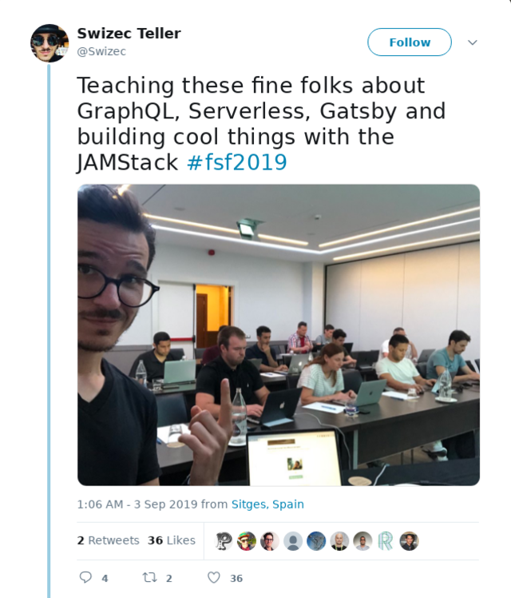](https://twitter.com/Swizec/status/1168797303253024768)

The workshop was great and then my AWS account got suspended 😅

You see, a brilliant idea I had was to do file uploads. How hard can it be? A bit of JavaScript, a dash of S3, and voila you've got files on the server.

Not so.

[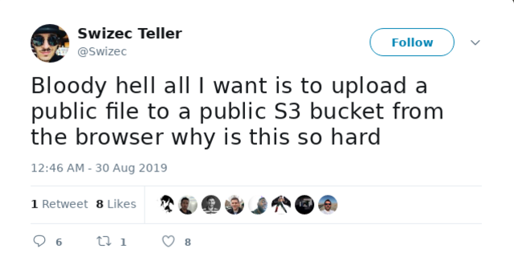](https://twitter.com/Swizec/status/1167342901564780544)

Uploading files to S3 from the browser is _really hard_. You need an S3 bucket, that's easy, then you need a server that accepts a file from your submitted form and uploads it to S3 with the SDK and gets back the URL and ...

## Security by default

You can't upload files straight to S3 from the browser because Amazon believes in security by default. _Thou shalt not have an app out in the wild that is not secure._

Great in theory, annoying when you're tight against a deadline for a toy app you intend to kill 3 days later.

You can make an S3 bucket public. You can make files public too. You need an S3 access key to upload anyway.

Yes even if it's a public bucket and a public file. You _have to_ upload securely.

Were this not the case, anyone could upload a bunch of nefarious things to your S3 and report you to the FBI. You don't want that. 😉

Uploading a file with the S3 SDK looks something like this:

[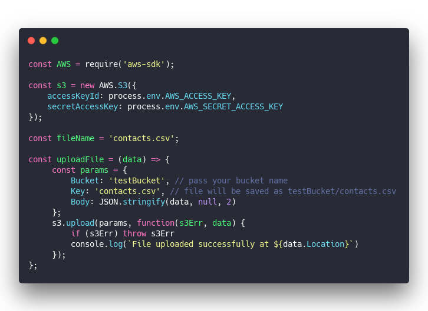](https://carbon.now.sh/?bg=rgba(255,255,255,1)&t=seti&l=javascript&ds=true&wc=true&wa=true&pv=48px&ph=32px&ln=false&code=const%20AWS%20%3D%20require('aws-sdk')%3B%0A%0Aconst%20s3%20%3D%20new%20AWS.S3(%7B%0A%20%20%20%20accessKeyId%3A%20process.env.AWS_ACCESS_KEY%2C%0A%20%20%20%20secretAccessKey%3A%20process.env.AWS_SECRET_ACCESS_KEY%0A%7D)%3B%0A%0Aconst%20fileName%20%3D%20'contacts.csv'%3B%0A%0Aconst%20uploadFile%20%3D%20(data)%20%3D%3E%20%7B%0A%20%20%20%20%20const%20params%20%3D%20%7B%0A%20%20%20%20%20%20%20%20%20Bucket%3A%20'testBucket'%2C%20%2F%2F%20pass%20your%20bucket%20name%0A%20%20%20%20%20%20%20%20%20Key%3A%20'contacts.csv'%2C%20%2F%2F%20file%20will%20be%20saved%20as%20testBucket%2Fcontacts.csv%0A%20%20%20%20%20%20%20%20%20Body%3A%20JSON.stringify(data%2C%20null%2C%202)%0A%20%20%20%20%20%7D%3B%0A%20%20%20%20%20s3.upload(params%2C%20function(s3Err%2C%20data)%20%7B%0A%20%20%20%20%20%20%20%20%20if%20(s3Err)%20throw%20s3Err%0A%20%20%20%20%20%20%20%20%20console.log(%60File%20uploaded%20successfully%20at%20%24%7Bdata.Location%7D%60)%0A%20%20%20%20%20%7D)%3B%0A%7D%3B)

Looks fine, right?

Notice this part:

[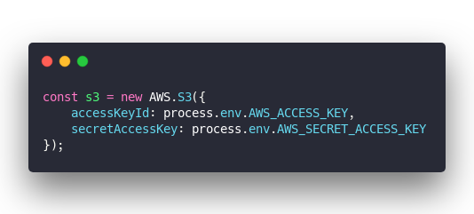](https://carbon.now.sh/?bg=rgba(255,255,255,1)&t=seti&l=javascript&ds=true&wc=true&wa=true&pv=48px&ph=32px&ln=false&code=const%20s3%20%3D%20new%20AWS.S3(%7B%0A%20%20%20%20accessKeyId%3A%20process.env.AWS_ACCESS_KEY%2C%0A%20%20%20%20secretAccessKey%3A%20process.env.AWS_SECRET_ACCESS_KEY%0A%7D)%3B)

If you send that to the browser, anyone can see your credentials and upload nefarious things.

You're supposed to run that code on a server.

That keeps your credentials secure (unless your server is hacked) and means you now have to deal with file uploads in two places:

- browser submits file upload form to server
- server uploads file to S3
- server returns URL

But I didn't want a server.

The whole point of my workshop is that there's no servers and everything runs on AWS Lambda. Plus data transfer on AWS can get expensive.

You don't want to transfer each file twice. First to your lambda, then to your S3.

[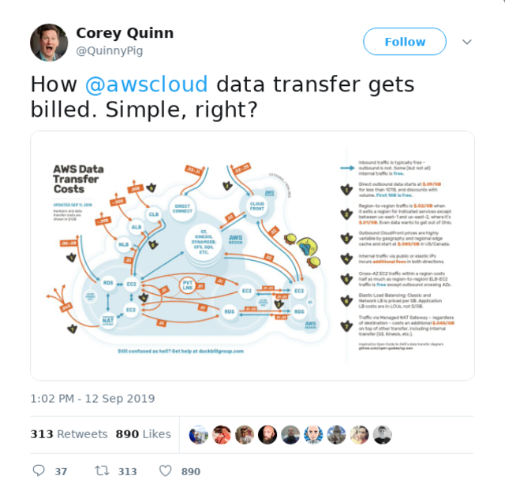](https://twitter.com/QuinnyPig/status/1172239124251709449)

## Presigned URLs – a secure way to upload

AWS offers a secure solution 👉 pre-signed URLs.

With a pre-signed URL, your server creates a unique URL with credentials, filenames, and other params baked in. Your browser code makes a `fetch()` request with some data and a file shows up on your S3 bucket.

You request a new pre-signed URL for the next file.

I'll write more about secure S3 file uploads from the browser soon, but here's the server code in a nutshell:

[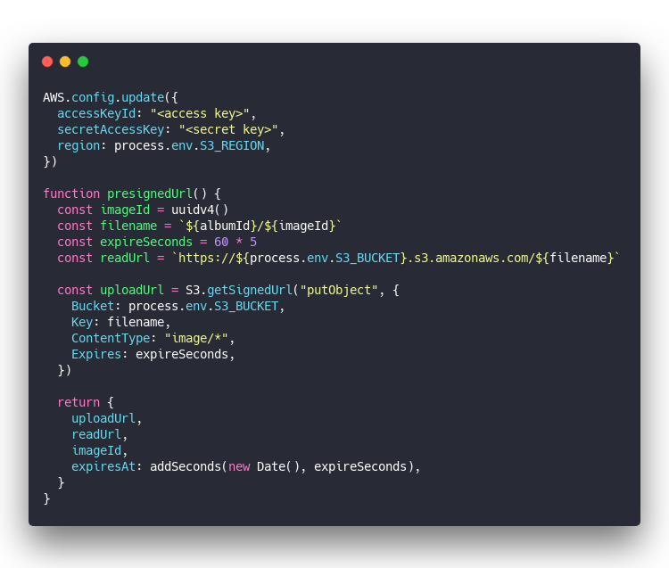](https://carbon.now.sh/?bg=rgba(255,255,255,1)&t=seti&l=javascript&ds=true&wc=true&wa=true&pv=48px&ph=32px&ln=false&code=AWS.config.update(%7B%0A%20%20accessKeyId%3A%20%22%3Caccess%20key%3E%22%2C%0A%20%20secretAccessKey%3A%20%22%3Csecret%20key%3E%22%2C%0A%20%20region%3A%20process.env.S3_REGION%2C%0A%7D)%0A%0Afunction%20presignedUrl()%20%7B%0A%20%20const%20imageId%20%3D%20uuidv4()%0A%20%20const%20filename%20%3D%20%60%24%7BalbumId%7D%2F%24%7BimageId%7D%60%0A%20%20const%20expireSeconds%20%3D%2060%20*%205%0A%20%20const%20readUrl%20%3D%20%60https%3A%2F%2F%24%7Bprocess.env.S3_BUCKET%7D.s3.amazonaws.com%2F%24%7Bfilename%7D%60%0A%0A%20%20const%20uploadUrl%20%3D%20S3.getSignedUrl(%22putObject%22%2C%20%7B%0A%20%20%20%20Bucket%3A%20process.env.S3_BUCKET%2C%0A%20%20%20%20Key%3A%20filename%2C%0A%20%20%20%20ContentType%3A%20%22image%2F*%22%2C%0A%20%20%20%20Expires%3A%20expireSeconds%2C%0A%20%20%7D)%0A%0A%20%20return%20%7B%0A%20%20%20%20uploadUrl%2C%0A%20%20%20%20readUrl%2C%0A%20%20%20%20imageId%2C%0A%20%20%20%20expiresAt%3A%20addSeconds(new%20Date()%2C%20expireSeconds)%2C%0A%20%20%7D%0A%7D)

You still need a server, but you can run this on a Lambda. It's a small request that's quick to calculate. A perfect fit ☺️

Returns an upload URL that expires in 5 minutes with a pre-baked filename and read URL.

## So how did Swizec's workshop get his AWS account suspended?

See this part of my code:

[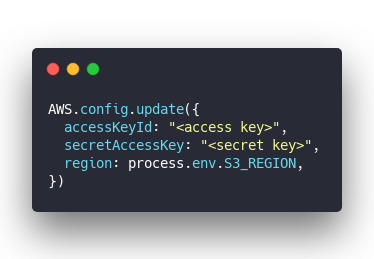](https://carbon.now.sh/?bg=rgba(255,255,255,1)&t=seti&l=javascript&ds=true&wc=true&wa=true&pv=48px&ph=32px&ln=false&code=AWS.config.update(%7B%0A%20%20accessKeyId%3A%20%22%3Caccess%20key%3E%22%2C%0A%20%20secretAccessKey%3A%20%22%3Csecret%20key%3E%22%2C%0A%20%20region%3A%20process.env.S3_REGION%2C%0A%7D))

Before I cleaned my GitHub that contained actual access keys. I knew it was bad, I knew I shouldn't, I did it anyway. Correct secrets management just felt too complicated in this case.

First I created a special S3 user with access to a specific bucket. Then I copy pasted those credentials into my code and pushed away.

You might steal my credentials but it's okay. They're limited!

And boy oh boy did that make the workshop **wonderful**. Having access keys baked into my code _made everything so easy_. Pull my code and get started right away.

We built the whole UI before students had to even _think_ about AWS. It was fire. 🔥

## AWS saw what I did 😅

[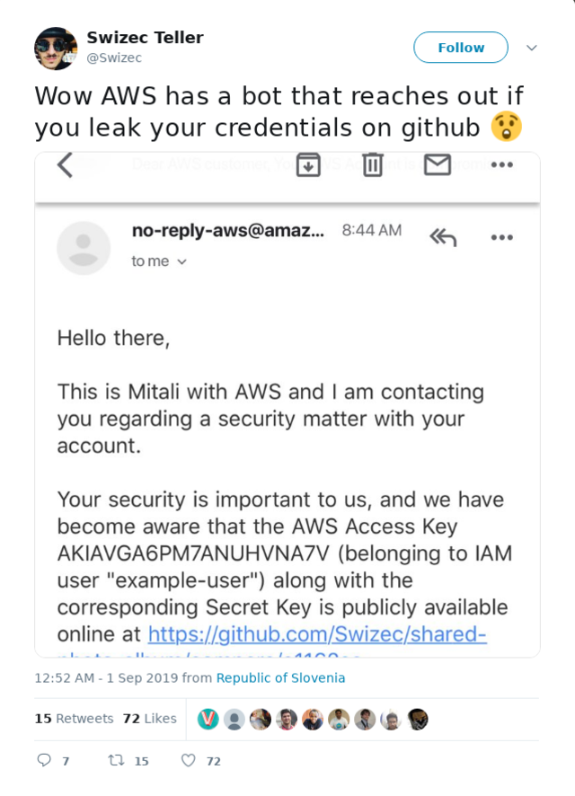](https://twitter.com/Swizec/status/1168069016251854848)

A few days before the workshop, almost as soon as I "leaked" my credentials, Amazon sent me an email.

> Hey we saw your credentials got leaked. We get it, shit happens, no biggie, please fix it ... ... AND IF YOU DON'T WE WILL KILL YOUR ACCOUNT

Whoa wait what? They can't be serious.

So I ignored the warning and thought to myself _Pfft, paranoid ops people, it's an example account. Who cares_

They kept emailing me. First every day. Then every couple hours. Like yo, you should really fix this.

After the workshop I though fine fine, if you insist, I'll fix it.

### What to do when you leak AWS credentials

Once your AWS credentials are out there, there's only one thing you can do: **_change everything_**

1. You have to change your AWS password
2. You have to go into the IAM app and _delete_ all existing keys for all sub-users
3. Generate new keys
4. Scrub GitHub clean

First 3 are easy. Go into your AWS console and click the things.

The 4th ... how the hell do you scrub your entire GitHub history of a specific string? [BFG](https://rtyley.github.io/bfg-repo-cleaner/)

[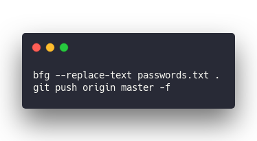](https://carbon.now.sh/?bg=rgba(255,255,255,1)&t=seti&l=bash&ds=true&wc=true&wa=true&pv=48px&ph=32px&ln=false&code=bfg%20--replace-text%20passwords.txt%20.%0Agit%20push%20origin%20master%20-f%20)

Put the strings you want to replace in `passwords.txt` and BFG rewrites your entire history. Each password becomes a `accessKeyId: "***REMOVED***",` ... but you can still see the diff. Lol

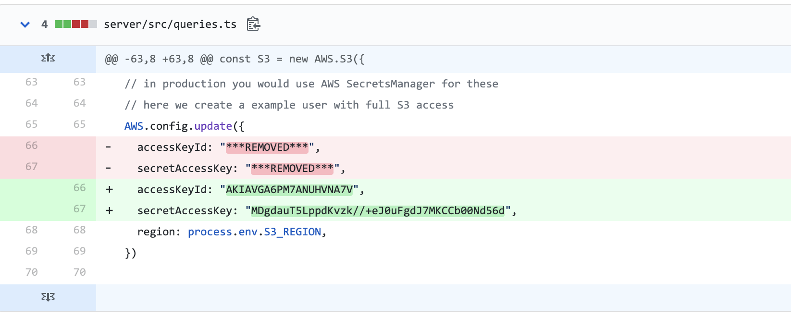

I guess that's part of why you also _delete_ the keys. Deactivating isn't enough Amazon says, you have to delete.

## You might still get banned

Once you've finished all the steps _tell Amazon_. They might be omniscient in detecting that you did something bad, but they don't see that you fixed it. I don't know why.

I forgot to tell them and my account got suspended.

[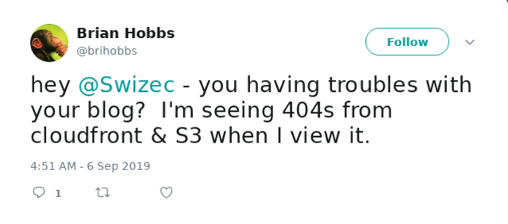](https://twitter.com/brihobbs/status/1169941279981146113)

swizec.com looked like a brutalist website, techletter.app didn't work so I couldn't write newsletters, everything died. You don't know how much of your life relies on AWS until it dies.

**Amazon support was wonderful** however. A little aloof when scolding me for leaking the credentials, but absolutely wonderful once I got suspended and started crying about it on Twitter.

[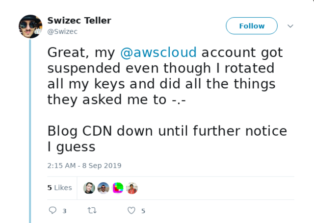](https://twitter.com/Swizec/status/1170626595163430912)

[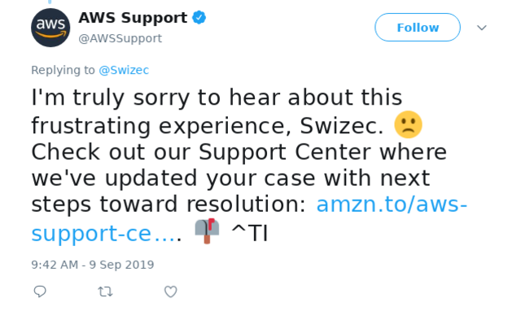](https://twitter.com/AWSSupport/status/1171101468679708673)

What surprised me most was that _I could use Support with a suspended account_. Can't log into AWS, can't see any of the services, but you can see support and get help.

Top notch UX 👌

Cheers,  
~Swizec

PS: everything works now ^\_^