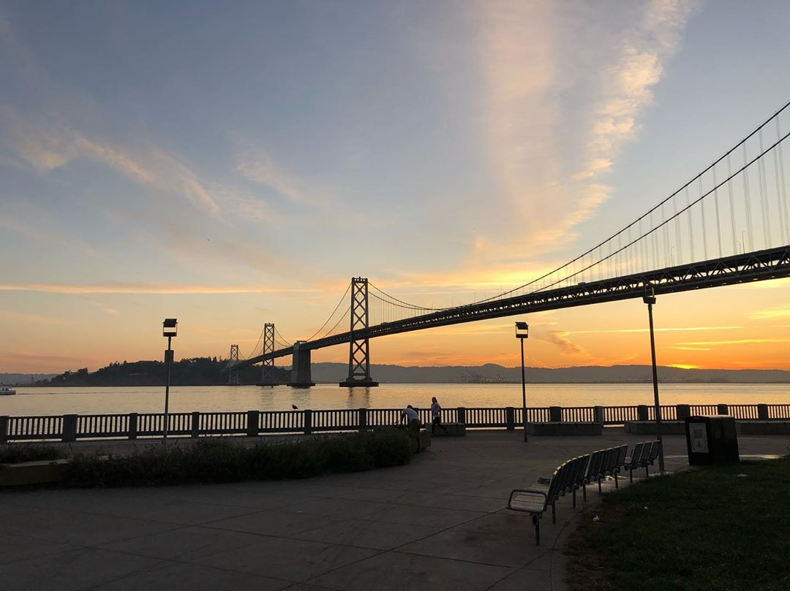
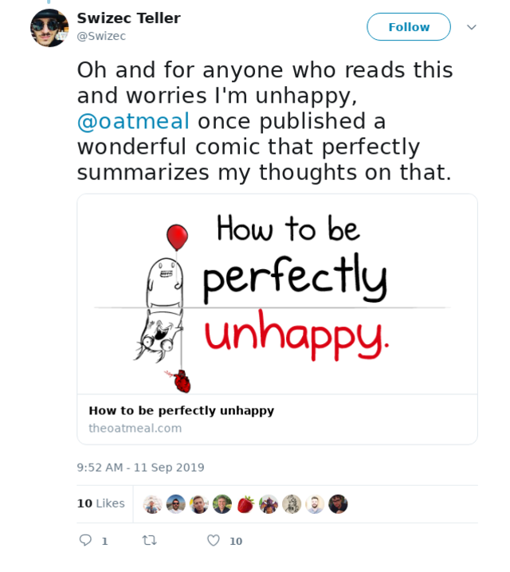
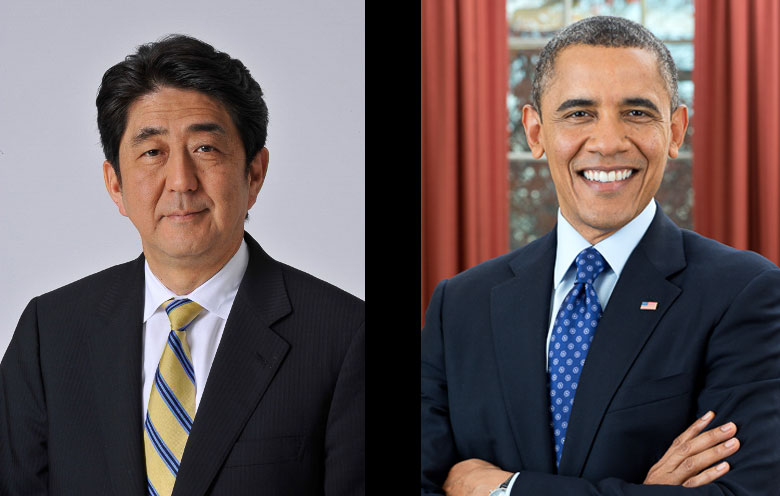

Last week I published [Thoughts on San Francisco after 2 weeks in Europe](https://swizec.com/blog/thoughts-on-san-francisco-after-2-weeks-in-europe/swizec/9191) – a deep and thoughtful comparison of life in San Francisco and Europe focused on culture and "feel". Your response has been _tremendous_. 😍

64 replies just to the typeform at the bottom of my emails. More than any before it. Plus many slacks, facebooks, and tweets. Here's a followup post answering some of those questions.

# San Francisco v. Europe part 2

First I want to assuage some concerns that I'm not "happy".

The subtitle of last week's post was _You don't move to San Francisco to be happy. You move there to make it._. A few people reached out and offered support. Thank you, you're wonderful. ❤️

The Oatmeal once published a comic that perfectly captures my opinion on happiness.

You should give it a read. It's a wonderful new perspective. Life isn't just about happiness, life is about doing things that fulfill you.

* * *

> You show some naiveté about Europe. It's not all fun and games in the big cities. Culture in something like London or Paris is a lot more like San Francisco than the Europe you describe.

Yes I agree.

My experience of Europe comes from living in Ljubljana, which is a tiny capital, and visiting places as a tourist. Out of the 14 or 15 European countries I've been to, they all _felt_ more relaxed than San Francisco. Even the big commercial hubs.

I imagine the effect of a London, Paris, Amsterdam, or Berlin can be similar to San Francisco. People move there to work on their careers and change their circumstance.

That dynamic creates the frantic pace, the striving, and the culture of overwork. But Europe for the most part balances that with a strong welfare system and lots of worker's rights.

Even in London you get 28 days of paid vacation by law. The USA minimum is 14 days. 😉

> Non-coastal America is nothing like the San Francisco you describe.

I agree and that's why I was careful to talk about San Francisco, not America. America is a big place with a lot of variety.

Any time I visit somewhere even just an hour's drive from San Francisco it feels relaxing and wonderful. A great place to visit. Haven't explored the flyover states yet but I hope to soon.

To quote a reader: _‌... as someone from a small town whose also been to San Francisco a few times, I think the difference between "Small Town America" and San Francisco are probably almost as great as San Francisco and Europe, just something I thought you might find interesting._

> What issues come up when an American attempts to work/live in Europe?

All the same issues as when a European attempts to work/live in Europe, I'd say. You have to deal with visas, get your papers in order, find an employer or spouse to sponsor your stay.

Once you do make it over, you're gonna have to learn a new culture, find a group of friends, build support networks, learn new ways to express yourself. Europeans like to make fun of The American Smile in photos, for example.

You're on your own in a strange land.

There's a special kind of isolation you feel that's hard to capture in words. Even if you make lots of friends you'll see a lack of shared cultural roots. The stories they read as kids are different than yours, their school was different, even the playground games are strange and foreign.

All this makes it difficult to connect on a deep level.

But at least everyone in Europe watches American movies and TV shows. They'll have some extras that you've never heard of from the local entertainment industry.

> Are you thinking of coming back to Europe?

As an abstract sometime in the future I'll go back. No definitive plans.

> Does it feel to you that Europe's big banks, like Deutsche Bank, are likely to fail sometime in the next 2 or 3 years? If they do fail, do you expect there to be a Greater Recession and a change of the monetary order like a peg to rare commodities like gold or perhaps hyperinflation or extreme stagflation? Are people in Europe generally aware that something is wrong economically? Do many of them know what is wrong? Have you heard of the Austrian school of economics?

Worrying about macro economics is above my pay grade. I was 3 or 4 during the hyperinflation in Yugoslavia, I saw the Slovenian currency start with a max bill of 1000 and die when the max was 10,000. Switched to Euro at a 239 conversion rate.

My career started out during 2008 while I was still in college.

You know what I noticed about all these economic hardships and oh noes the sky is falling scenarios? Nothing.

Some opportunities dry up, some new ones show up. Such is life. You play the cards you've got, not the cards you wish you had.

You and I are too small to worry about macroeconomics or even to be impacted by them too much. The next Great Recession is always coming. We've got a long way to go and many recessions to see in our lifetimes.

Yes people the world over are aware _something_'s brewing. Make sure you have more assets than liabilities and in the long term you'll be fine.

> How to “successfully” escape the SF Bay Area grind without descending into the invisibility of loserville.

This one's easy: Redefine your notions of success and loserville.

Are you a loser if you move to a small town in the middle of nowhere and freelance for SF startups? Not at all. You're gonna live like a king even if you forego some income and some career achievement.

If that's what makes you happy and satisfies your drive for achievement, you go girl! You might find you don't need any of this San Francisco crap.

There is always a choice. You are in control.

> How much longer are you planning to stay in SF? Is it worth it for you?

I plan to stay in SF for as long as the staying stays good.

Work on meaningful projects, play with fun technologies, access to interesting people, amenities of a large city, and get paid well while I do so? Yes please.

San Francisco is totally worth it. Both financially and otherwise.

It's just dense enough that you can live downtown and lead a walking lifestyle. Restaurants to last a lifetime, more bars and clubs than I could ever see, nature but a short drive away.

And I need the push. I _want_ the fire under butt that San Francisco provides.

🔥

> Can you do more emails like this last one?

> Would you move to SF again knowing everything you know about it now?

Yes. I'd move sooner. Waited far too long.

> What qualifies as burnout according to you?

[Burn out is pretty well defined](https://en.wikipedia.org/wiki/Occupational_burnout). You can think of it as work-specific depression.

Characterized by cynicism, disengagement, lack of passion for your work, finding no more joy in doing the things you used to love to do. You might even start avoiding it.

For me those symptoms come every few months. The best approach I've found is to take a few days off. Go do something fun. Something completely different.

When I return the zest for work always comes back.

> Explore tech options (from a a quality of life perspective) living away from tech hubs. Community experience and remote working tools etc. This might also answer the critique that you are attacking the American dream.

Eh "the American dream" ... you mean that thing people had in the 1950's and 60's when America and the world was fast recovering from WW2, the economy was booming, and as long as you worked hard, you too could have everything you ever dreamed of?

That dream's dead.

I don't know a single millennial who still thinks that's achievable. At least not in the Western world.

We have a new dream now. Based on minimalism, renting instead of owning, and experiences instead of accumulating stuff.

There are some people still who "live the American dream" and I believe it often comes down to income arbitrage. Work remote and live somewhere cheap.

That's a nice life too. High quality of life in some dimensions, low in others.

> Should I move to SF to "make it" ? Or can one "make it" European style ? How can or should a european move to SF to make it ?

Go for it. You almost never regret the chances you take.

You can always go back home, if it doesn't work. European startups love folks with experience in The Valley I've heard.

Easiest way to move is to find a job that will sponsor your visa. The other good way is to create a startup and sponsor your own visa.

I wouldn't recommend doing it as a freelancer. Very difficult to get a visa, even harder to get gigs. Easier once you've been here awhile.

> How to get noticed to potential employers using your skills/worth/knowledge?

Build a portfolio. _Show_ that you can do the work. Then roll up your sleeves and start reaching out.

> What could SF be if it were competently run?

No idea. I'm sure everyone's doing their best.

Happy Monday ✌️

Cheers,  
~Swizec