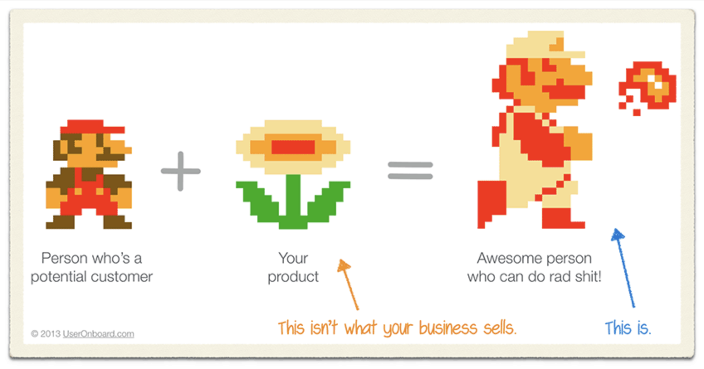

We often write code to distract ourselves from the fact we don't know what we're building.

Yesterday I had a long conversation with a friend who's starting a company. Let's call him Matt because that's not his name.

After months of thought, Matt quit his job and went looking for investors. He realized it was too early and he doesn't know shit. So he started really digging into his idea and his market.

He uncovered a goldmine.

A swathe of the economy that's growing, inefficient, and needs some help. His wonderful idea will grease the wheels, the economy will flourish, the consumers will love him, and he'll get filthy rich in the process 💪

Matt wanted my help hiring an engineer. Or a designer. Someone, anyone, who could help him build the product.

Matt is not technical, you see. His skill lies in business development, sales, and big picture thinking. The skills you _really_ need to succeed in the market he's targeting. The stuff us engineers run away from screaming.

_"How do I find an engineer? Someone local, someone I can sit down and work with, who won't rip me off."_

🤔

He's unfunded, bootstrapping, and on his own in San Francisco. Money is always tight when you have no income.

_"Mate, you're looking for a cofounder?"_

_"Yeah but nobody I talked to wants to work for equity"_

Well yeah. You're a guy with an idea.

_"Matt, what have you done to prove people will pay for this? Why do you think you're ready to build software?"_

Hint: he isn't.

## Software is a tool, not a goal

Through conversation we discovered that Matt wants to build software because his company doesn't feel real without it. You need _something_ that you're building. You can't just "be a company".

But you can.

A company isn't the software it sells. A company isn't the offices. It isn't the team. It isn't even anything in particular.

A company is a set of processes. A machine.

Some of those processes are encoded in software, some are done by people, some aren't even documented. _That_'s a company. That set of processes and ideas.

Software is just a tool.

What Matt needs are customers. People whose problem his solving. People who are _better people_ because they use his service.

That **service** is what he needs to build. Not some nebulous piece software the definition of which he doesn't even know yet.

I dug deeper.

_"Matt, what do you **need**? What's blocking you from making your first sale?"_

Well I need a website.

Why?

So I look real when I'm talking to people. So there's something to point them at.

Why?

Because it builds credibility. Without a website I'm just a random schmo.

Okay that's fair. Credibility and authority. You don't need a designer or even an engineer for that. You definitely don't need to _hire_ anyone. Get an account on square space, carrd, or similar, pick the prettiest template you can find, and fill in your info.

Voila, a website.

You can even hire a freelancer to cobble it together for you. Don't waste money on a custom solution until you need one.

Ok there's your website, you've got your credibility. What's next? Why do you need an engineer, Matt?

Well I need to build the product.

Why?

... because I'm a product company? Because it isn't real without a product?

Why?

Err ...

Matt, did anyone pay you yet? Do you know exactly what they need to make their jobs easier? Have you talked to them?

Well I know they have to fill out a form with 465 fields and reproduce it in triplicate and file it to the right people and it's just a mess and super hard and nobody wants to do that.

Okay and you can make it easier with software?

Yes! I can build a beautiful flow and a wonderful UI that guides them through needing just 250 fields it's gonna be amazing!

And you need an engineer for that?

Well I can't build it myself.

Mate, you need a google form and some customer research. Go sell a shitty version of your product. No code, no software, just your elbow grease and a smile.

## People buy your solution, not your software

People don't really care _how_ you solve their problem. They just want somebody to do it for them.

When I hire an accountant to do my taxes, I'm not buying the software they use, I'm buying peace of mind. The confidence that I won't overpay or underpay and that we'll find every legal loophole.

When I pay for Spotify, I'm paying for ease of access to all the world's music. Their software, the player, just needs to be good enough.

When I hire a lawyer to help me get a visa, I don't care what they use to make the process easier or their margins higher. I only care that I get my visa and Trump doesn't kick me out. That's it. That's what I'm paying for.

And that was my advice to Matt.

**Build the service first**. Solve somebody's problem. Make them a better human. **Get paid**.

Then, when you're ready, when you feel the inefficiency deep within your bones, _then_ build your software. You'll know what you need.

Cheers,

~Swizec