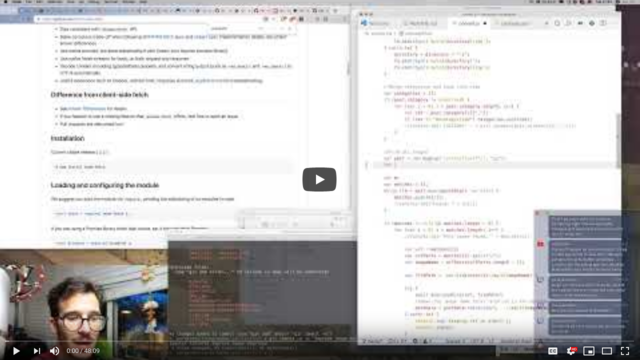
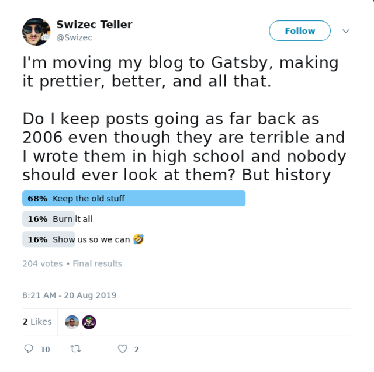
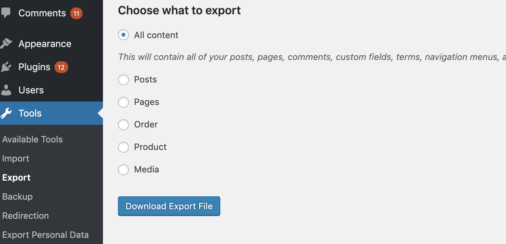
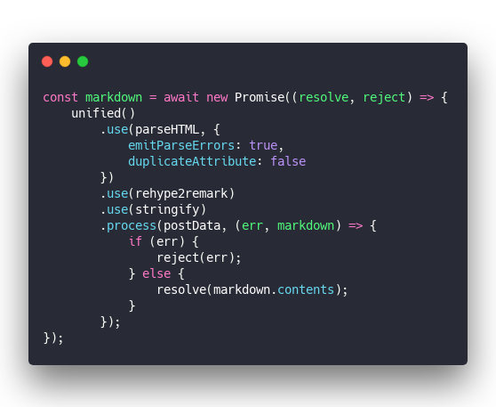
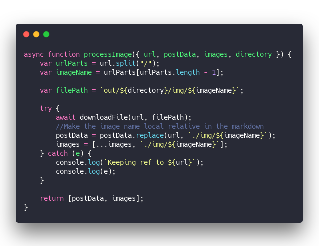
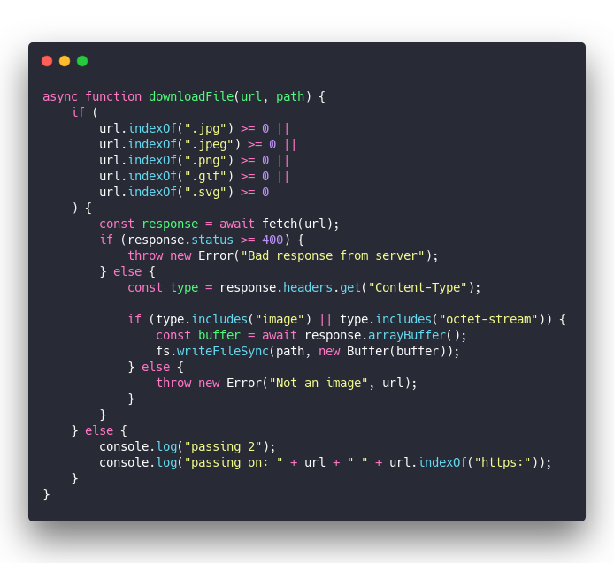
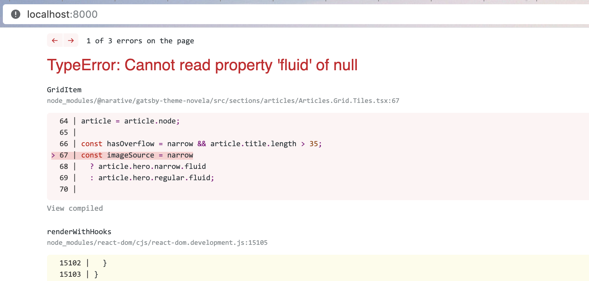
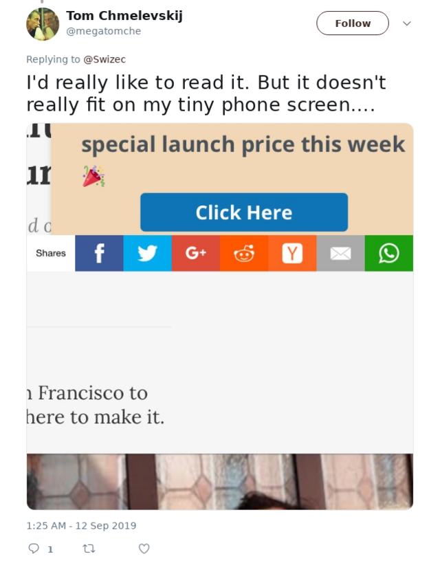

Did you know most websites go offline within 2 years of publishing? Don't let your writing join the graveyard.

More and more people are creating blogs with Gatsby and that's exciting as heck! I miss the internet days when everyone had a place to call their own.

It's pretty easy, too.

You initiate a repo, follow a quick tutorial, write your first article, press build, and voila: A beautiful new place to publish your ideas.

And you get some amazing benefits we didn't get when I built my first site on Geocities.

Great lighthouse scores, fast load times, easy build&publish process with Zeit or Netlify, and image optimization unlike anything I've ever seen. Plop a 40MB photo from a DSLR into your blog and Gatsby plugins convert it to a tiny fast loading 900Kb version.

Done that before, didn't even notice. On Wordpress it breaks your site. Tried that too 😇

But what if you already have a blog? That's where it gets tricky.

## How to move an existing Wordpress blog to Gatsby

Creating the blog itself is easy:

1. Setup repo
2. Follow [the gatsby tutorial](https://www.gatsbyjs.org/tutorial/)
3. Add a bunch of plugins that sound useful

Now, your old stuff may not be great but you should keep it anyway. For the memories, for not breaking old links, for being a good member of the internet.

Did you know most websites go offline within 2 years of publishing? Don't let your writing join the graveyard.

There's 2 parts to this and both are hard:

1. Convert your Wordpress history to a format Gatsby understands
2. Keep the old links working

I haven't solved #2 yet. I imagine there's going to be a redirect page on Gatsby that takes a URL from the old format and pushes you to the correct article.

No. 1 proved harder than I thought.

## A script that converts Wordpress to Gatsby

Gatsby has a plugin to source data directly from Wordpress's API. This is great, if you want to continue using Wordpress as your CMS and use Gatsby as the frontend.

I prefer writing in Markdown.

Your other option is downloading the `wordpress.xml` datadump and converting it to Gatsby. Get all your content, your blogs, even the comments in one big file ... then what?

Then you 👇

1. [clone this wordpress-to-markdown repo](https://github.com/Swizec/wordpress-to-markdown)
2. Run `yarn install` or `npm install` as preferred
3. Name your file `export.xml` and place it in root
4. [Edit line 181](https://github.com/Swizec/wordpress-to-markdown/blob/master/convert.js#L181) to change the author
5. Run `node convert.js`
6. Wait

Yes it's a little hacky right now. Might productize later :)

`convert.js` started life as [ytechie](https://github.com/ytechie)'s hack some 6 years ago. A couple forks later I found a version that mostly works in 2019.

Making it work for Gatsby took some tinkering.

The generated Markdown wasn't valid [MDX](https://github.com/mdx-js/mdx), which I prefer for blogs since it lets you run JavaScript, downloading images was wonky, and I needed more self-contained posts with better headers. Gatsby likes it when each article comes in its own folder with its own images.

Using a folder-per-article schema also makes it filename collisions less likely. ✌️

### Parse XML posts into Gatsby

The core of `convert.js` is a method that parses XML, iterates through posts, generates markdown, and downloads all images.

Using [xml2js](https://github.com/Leonidas-from-XIV/node-xml2js) to parse XML, [rehype](https://github.com/rehypejs/rehype) to parse HTML content, [remark](https://github.com/remarkjs/remark) to generate Markdown, and good old [node-fetch](https://github.com/bitinn/node-fetch) to download images.

You can see the [full code on GitHub](https://github.com/Swizec/wordpress-to-markdown) altho it's not the prettiest.

Here's the fun part that takes HTML and spits out Markdown 😛

&t=seti&l=javascript&ds=true&wc=true&wa=true&pv=48px&ph=32px&ln=false&code=const%20markdown%20%3D%20await%20new%20Promise((resolve%2C%20reject)%20%3D%3E%20%7B%0A%20%20%20%20unified()%0A%20%20%20%20%20%20%20%20.use(parseHTML%2C%20%7B%0A%20%20%20%20%20%20%20%20%20%20%20%20emitParseErrors%3A%20true%2C%0A%20%20%20%20%20%20%20%20%20%20%20%20duplicateAttribute%3A%20false%0A%20%20%20%20%20%20%20%20%7D)%0A%20%20%20%20%20%20%20%20.use(rehype2remark)%0A%20%20%20%20%20%20%20%20.use(stringify)%0A%20%20%20%20%20%20%20%20.process(postData%2C%20(err%2C%20markdown)%20%3D%3E%20%7B%0A%20%20%20%20%20%20%20%20%20%20%20%20if%20(err)%20%7B%0A%20%20%20%20%20%20%20%20%20%20%20%20%20%20%20%20reject(err)%3B%0A%20%20%20%20%20%20%20%20%20%20%20%20%7D%20else%20%7B%0A%20%20%20%20%20%20%20%20%20%20%20%20%20%20%20%20resolve(markdown.contents)%3B%0A%20%20%20%20%20%20%20%20%20%20%20%20%7D%0A%20%20%20%20%20%20%20%20%7D)%3B%0A%7D)%3B)

I forked from a version with [a complex homegrown Markdown generator](https://github.com/Swizec/wordpress-to-markdown/commit/5214b4e0f8836dbb1bf40d872ee2993f66fab7a0) and many bugs. Mixing rehype, remark, unified, and plugins makes the process more reliable and easier to maintain.

1. Parse HTML to an AST
2. Convert to Markdown AST
3. Stringify
4. Output

👌

My surrounding code adds some headers and other meta data. Makes it easier to plop straight into Gatsby.

### Download all the images

Most images on my old posts are dead. 404, 500, 301, you name the error, it's in there somewhere.

The only way to avoid that fate in the future is to keep local copies of images that you host yourself. Gatsby supports that really well with MDX – put images next to your words and use relative paths.

But you need to download them first.

I created this `processImage` method and tried a few different ways to download images one by one. The original crashed my computer. Too much parallelism.

&t=seti&l=javascript&ds=true&wc=true&wa=true&pv=48px&ph=32px&ln=false&code=async%20function%20processImage(%7B%20url%2C%20postData%2C%20images%2C%20directory%20%7D)%20%7B%0A%20%20%20%20var%20urlParts%20%3D%20url.split(%22%2F%22)%3B%0A%20%20%20%20var%20imageName%20%3D%20urlParts%5BurlParts.length%20-%201%5D%3B%0A%0A%20%20%20%20var%20filePath%20%3D%20%60out%2F%24%7Bdirectory%7D%2Fimg%2F%24%7BimageName%7D%60%3B%0A%0A%20%20%20%20try%20%7B%0A%20%20%20%20%20%20%20%20await%20downloadFile(url%2C%20filePath)%3B%0A%20%20%20%20%20%20%20%20%2F%2FMake%20the%20image%20name%20local%20relative%20in%20the%20markdown%0A%20%20%20%20%20%20%20%20postData%20%3D%20postData.replace(url%2C%20%60.%2Fimg%2F%24%7BimageName%7D%60)%3B%0A%20%20%20%20%20%20%20%20images%20%3D%20%5B...images%2C%20%60.%2Fimg%2F%24%7BimageName%7D%60%5D%3B%0A%20%20%20%20%7D%20catch%20(e)%20%7B%0A%20%20%20%20%20%20%20%20console.log(%60Keeping%20ref%20to%20%24%7Burl%7D%60)%3B%0A%20%20%20%20%20%20%20%20console.log(e)%3B%0A%20%20%20%20%7D%0A%0A%20%20%20%20return%20%5BpostData%2C%20images%5D%3B%0A%7D)

Ignore the ancient `var` syntax, I didn't want to rewrite everything 😇

We take an image URL, split it into parts, create a new `filePath`, run the `downloadFile` method, replace the original URL in our post with the new relative path.

Updating the `images` array is \\important so we can collect candidates for our hero image. The part that goes into social thumbnails and on the homepage.

Tried a bunch of ways to download files, this is the one that worked best in the end.

&t=seti&l=javascript&ds=true&wc=true&wa=true&pv=48px&ph=32px&ln=false&code=async%20function%20downloadFile(url%2C%20path)%20%7B%0A%20%20%20%20if%20(%0A%20%20%20%20%20%20%20%20url.indexOf(%22.jpg%22)%20%3E%3D%200%20%7C%7C%0A%20%20%20%20%20%20%20%20url.indexOf(%22.jpeg%22)%20%3E%3D%200%20%7C%7C%0A%20%20%20%20%20%20%20%20url.indexOf(%22.png%22)%20%3E%3D%200%20%7C%7C%0A%20%20%20%20%20%20%20%20url.indexOf(%22.gif%22)%20%3E%3D%200%20%7C%7C%0A%20%20%20%20%20%20%20%20url.indexOf(%22.svg%22)%20%3E%3D%200%0A%20%20%20%20)%20%7B%0A%20%20%20%20%20%20%20%20const%20response%20%3D%20await%20fetch(url)%3B%0A%20%20%20%20%20%20%20%20if%20(response.status%20%3E%3D%20400)%20%7B%0A%20%20%20%20%20%20%20%20%20%20%20%20throw%20new%20Error(%22Bad%20response%20from%20server%22)%3B%0A%20%20%20%20%20%20%20%20%7D%20else%20%7B%0A%20%20%20%20%20%20%20%20%20%20%20%20const%20type%20%3D%20response.headers.get(%22Content-Type%22)%3B%0A%0A%20%20%20%20%20%20%20%20%20%20%20%20if%20(type.includes(%22image%22)%20%7C%7C%20type.includes(%22octet-stream%22))%20%7B%0A%20%20%20%20%20%20%20%20%20%20%20%20%20%20%20%20const%20buffer%20%3D%20await%20response.arrayBuffer()%3B%0A%20%20%20%20%20%20%20%20%20%20%20%20%20%20%20%20fs.writeFileSync(path%2C%20new%20Buffer(buffer))%3B%0A%20%20%20%20%20%20%20%20%20%20%20%20%7D%20else%20%7B%0A%20%20%20%20%20%20%20%20%20%20%20%20%20%20%20%20throw%20new%20Error(%22Not%20an%20image%22%2C%20url)%3B%0A%20%20%20%20%20%20%20%20%20%20%20%20%7D%0A%20%20%20%20%20%20%20%20%7D%0A%20%20%20%20%7D%20else%20%7B%0A%20%20%20%20%20%20%20%20console.log(%22passing%202%22)%3B%0A%20%20%20%20%20%20%20%20console.log(%22passing%20on%3A%20%22%20%2B%20url%20%2B%20%22%20%22%20%2B%20url.indexOf(%22https%3A%22))%3B%0A%20%20%20%20%7D%0A%7D)

Check the URL is an image, use `fetch()`, make sure the response is an image (some server errors return a success with a bunch of HTML, that was fun to learn), and write the file.

You'd think this was the easiest part, but it isn't. Most libraries you find are meant to work with APIs, not file downloads. Handling all sorts of errors gets tricky, and when you have thousands of files to download you gotta be really careful with your async code.

First version downloaded everything in parallel. Crashed my computer.

Now it goes one-by-one which is slower, but at least it finishes.

## The result

An error.

I told you this was hard.

The way I setup my new Gatsby blog, it expects every article to have a hero image. Looks like some either have no images, or no working images.

That's next on my list to fix. What do we do with missing images? Do I create a 404 graphic? Do I remove them from the post? What about the hero image? 🤔

Until then this will continue to be the main comment I get

Cheers,  
~Swizec