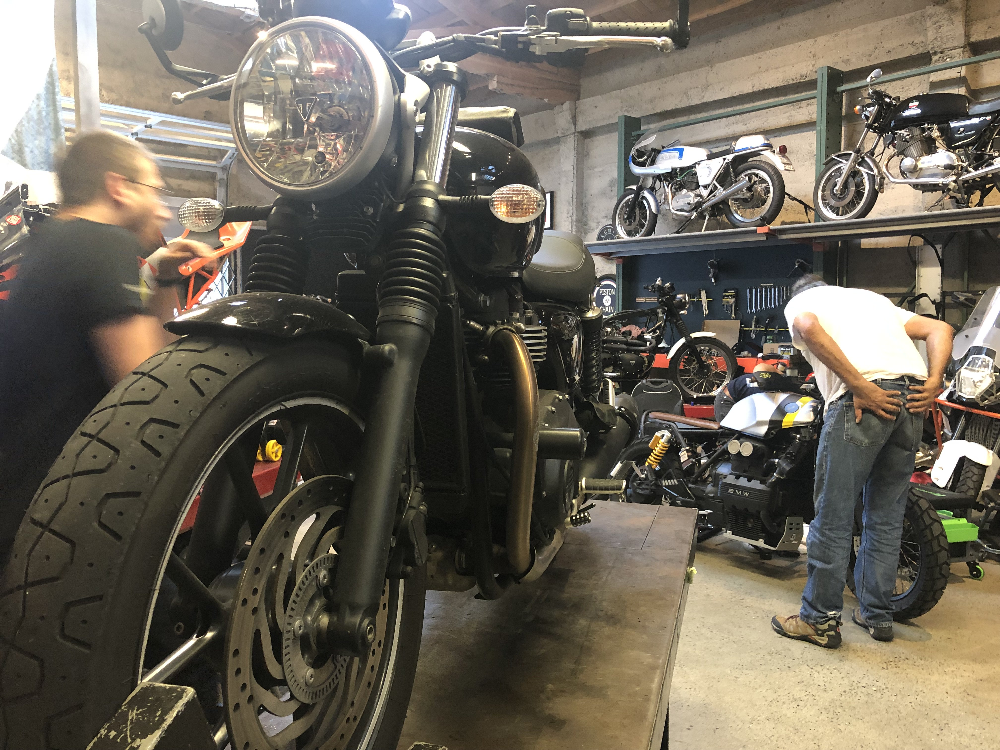
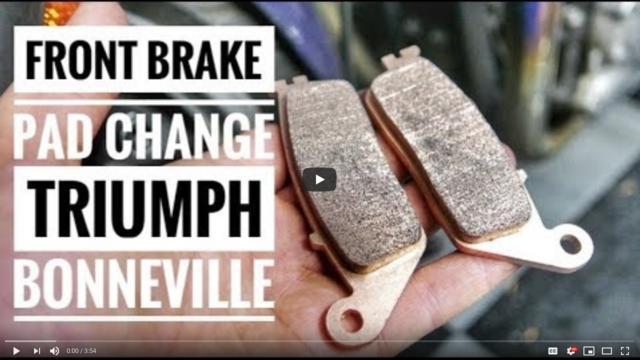

Last night I did something special. Something I've never done before. I replaced my brake pads, all on my own, and it was magical 😍

That feeling of power, greatness, raw manliness ... _YOU CAN DO ANYTHING_ screamed every fibre of my being.

That's my bike up on a pneumatic jack. A proper mechanic's jack that brings it up to eye level with a foot pedal. 😍 Great ergonomics, wonderful workshop, every tool your heart desires.

[Piston & Chain](https://pistonandchain.com/), if you're curious. They let anyone come in, bring their bike, and borrow the tools to muck around.

Obviously, I'm no mechanic. I can barely tell a wrench from a screw driver.

I know [how brakes work in theory](https://en.wikipedia.org/wiki/Disc_brake) – hydraulic pressure squeezes a rotating piece of metal with two softer pieces of metal and converts kinetic energy to heat thus slowing you down ...

But theory is all talk. Theory is easy. I can talk your ear off about the mechanics of motor vehicles all day.

Hell do I know about taking brakes apart and wrenching on a bike? Nothing.

So how'd I do it?

I watched a 3 minute YouTube video, of course. There's a YouTube for everything these days. ✌️

Replacing your brake pads is one of the easiest jobs on a bike, it turns out.

Unscrew a pin, 2 screws to remove assembly, remove pads, brush dust, new pads in, re-screw holding pin, re-attach to bike.

That's it. Took me longer to find the tools than to do the job.

## But expert charges $125 for something I learned to do in 3 minutes 🤔

I was going to have an expert replace my pads. Bike's going in for its first annual service in two weeks anyway.

The regular maintenance is pre-paid, but the brake pads aren't. Wear item.

Expert quoted me $125.

$35 for the pads, $90 for the expert. For a job I learned how to do from YouTube in 3 minutes.

What gives?

He's an expert. Sure, he can replace brake pads, but really it's a waste of his time. It's a job below his skill level. The price reflects that.

$90 is what 30 minutes of his life costs.

He'd rather work on something better, but if pads is what you want, pads is what you get. He's not gonna lower his price because the job is easy. That would be silly. Not like he can spend those 30 minutes on something else.

So when you hire an expert **_you're hiring an expert regardless of what you ask them to do_**.

How do I know he's an expert?

A few months ago my clutch was sticking. Pull the lever, clutch stuck, no good.

Took my bike to the shop.

Generalist mechanic looked at it and scratched his head. Oof I don't know man, could be so many things. Maybe the clutch is broken, the cable could be getting stuck, maybe it's the lever itself, looks like there's a bang near the clutch where you dropped the bike ... honestly dude this is like a 3 hour job. I'd have to take everything apart and really dig into it. Best you make an appointment.

So I made an appointment.

This time I got the expert.

He took one look and said _"Oh yeah, Triumph over-tightens that screw from the factory. We loosen it when setting up the bike for ya, but sometimes it goes back. Here, lemme loosen that for ya with my keys_

Poked at it with a tiny keychain wrench. Clutch was perfect. 10 second fix, 2 minute conversation. Didn't charge me anything.

And that's the difference between an expert, a generalist, and a guy who watched a 3 minute YouTube Video. I can do a very specific task, a generalist can figure anything out, and the expert knows the best solution.

Be the expert, my friend.

Cheers,  
~Swizec