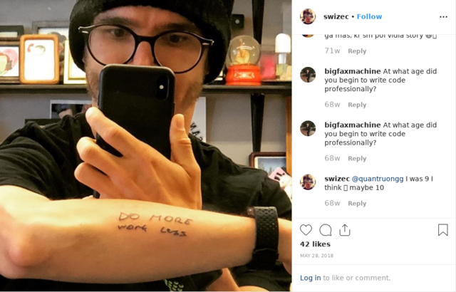
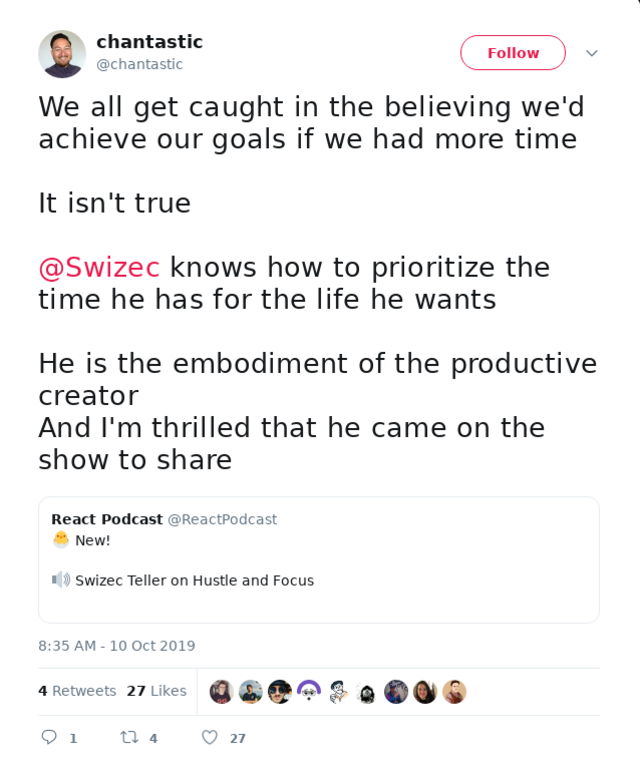

Readers often ask me how they can make time to write, work, learn, workout, code, and still read too much Hacker News and Twitter.

Here's two examples from just last week:

> How do you make time to code and learn and write? How do I learn new languages and frameworks while still continuing my job?

And in truth, I like Sarah Drasner's answer a lot. I asked her that same question at a conference last month.

> I'm tired a lot

I'm tired a lot too, Sarah. 😴

A more inspiring answer comes from an old internet anecdote. The one I always butcher when retelling in person.

You can hear me butcher it on [ReactPodcast episode 67](https://reactpodcast.com/67) where I talked with [@chantastic](https://twitter.com/chantastic) about life, hustle, and getting shit done.

## The Jar of Life

A philosophy professor stood before his class and had some items in front of him. When the class began, wordlessly he picked up a large jar and proceeded to fill it with rocks about 2″ in diameter. He then asked the students if the jar was full. They agreed that it was.Visual

So the professor then picked up a box of pebbles and poured them into the jar. He shook the jar lightly. The pebbles, of course, rolled into the open areas between the rocks. He then asked the students again if the jar was full. They agreed it was.

The students laughed as the professor picked up a box of sand and poured it into the jar. Of course, the sand filled up everything else.

“Now,” said the professor, “I want you to recognize that this is your life. The rocks are the \\important things — your family, your partner, your health, your children — things that if everything else was lost and only they remained, your life would still be full. The pebbles are the other things that matter like your job, your house, your car. The sand is everything else. The small stuff.”

There was total silence as the students absorbed the lesson.

“If you put the sand into the jar first, there is no room for the pebbles or the rocks. The same goes for your life. If you spend all your time and energy on the small stuff, you will never have room for the things that are \\important to you. Pay attention to the things that are critical to your happiness. Play with your children. Take time to get medical checkups. Take your partner out dancing. There will always be time to go to work, clean the house, give a dinner party and fix the disposal.”

The students started nodding in agreement at the professor’s profound wisdom.

“Take care of the rocks first,” the professor finished — “the things that really matter. Set your priorities. The rest is just sand.”

But then…

A student then took the jar which the other students and the professor agreed was full, and proceeded to pour in a bottle of beer — and then another! Of course the beer filled the remaining spaces within the jar making the jar truly full.

The moral of this tale is…

That no matter how full your life is, there is always room for a beer or two.

## Oh and buy time if you can

The Jar of Life is a wonderful story and it's missing a key component: You can _buy time_.

Let me explain.

Everyone's got the same 24 hours in the day, right? Wrong. You can buy extra hours in the day with cold hard cash. If you have it.

Here's how it works:

1. You make more money than you need for your immediate needs. As a software engineer this is doable.
2. You use some of that money to buy other people's time
3. Voila, 25 hour days. Or 26. Or 27. Maybe even 240.

Your CEO runs a company, for example.

They make decisions, wave their arms, and things happen. With 100 employees each day fits 800 hours. At Apple scale, Tim Cook can get 1,056,000 hours of work done every day. 🤯

At a smaller scale, you can hire professionals for certain tasks.

Me and my girlfriend pay for cleaners. That's 2 hours and one incredibly tedious task off our plates. Chantastic has a podcast editor, job gets done better and faster than he could do it himself.

I have an assistant that sorts my email so instead of 300+ emails per day I read 5. She also handles random little tasks like replacing my broken sunglasses case or renewing my motorcycle registration. Just so I can focus on coding instead.

Once upon a time I had an editor who took my writing and compiled it into emails, blogs, etc. Now there's [techletter.app](https://techletter.app).

Saves 3 frustrating tedious hours every month.

## Focus

Point is: **Focus on what you're uniquely good at** outsource everything else.

Do this at work also.

If someone else can test, let them. If someone else can compile that report, let them. If someone else can go to that meeting, let them. Focus on the one thing only you can do: Being awesome.

**DO** more and _work_ less.

Happy weekend ❤️

Cheers,  
~Swizec