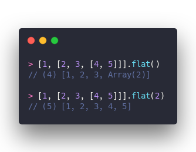
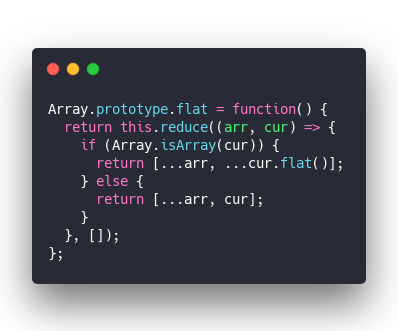
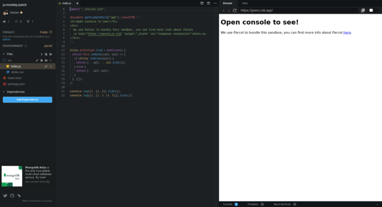
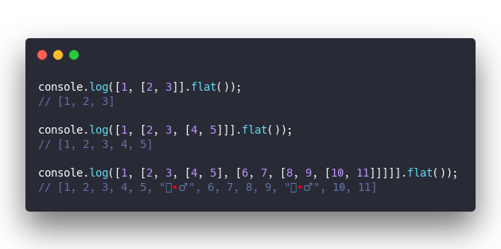
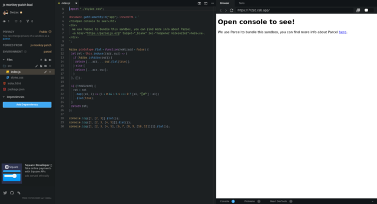
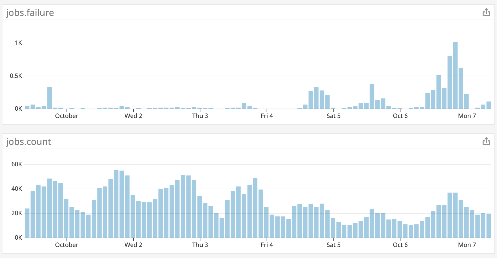
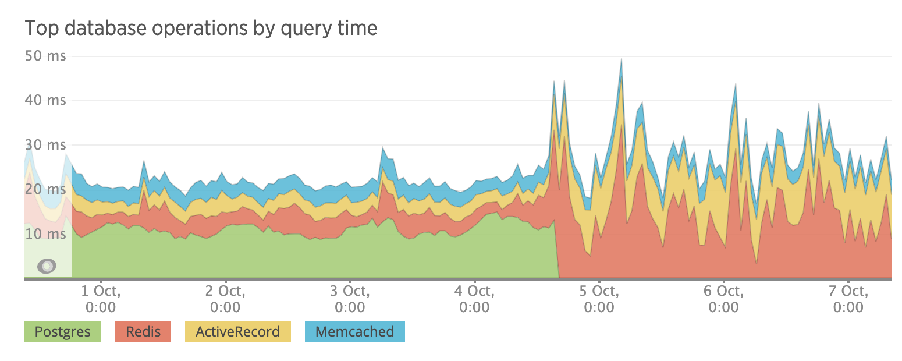
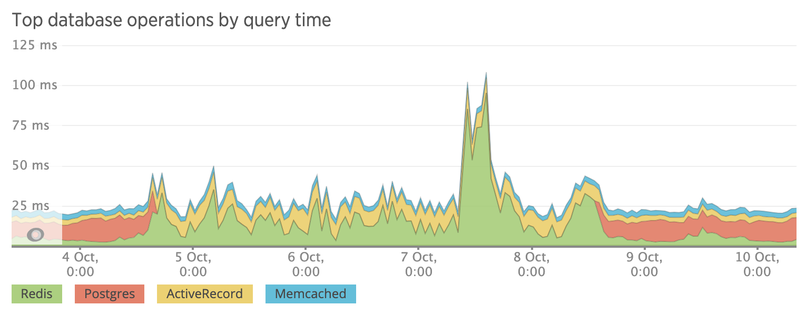
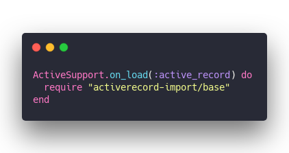
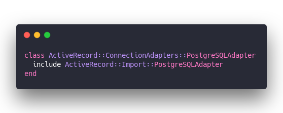

Monkey patching is a programming technique popular in the Ruby world and nipped-in-the-bud by the JavaScript Community. Good.

Remember the [smoosh controversy](https://developers.google.com/web/updates/2018/03/smooshgate)? JavaScript couldn't adopt `Array.flatten` because [MooTools](https://en.wikipedia.org/wiki/MooTools) used it in the 2010's and making a new one might break the web. That was due to monkey patching.

So what's monkey patching anyway?

I'm glad you asked

## Monkey Patching

> the term [monkey patch](https://en.wikipedia.org/wiki/Monkey_patch) only refers to dynamic modifications of a class or module at runtime, motivated by the intent to patch existing third-party code as a workaround to a bug or feature which does not act as desired

You can think of monkey patching as a magic trick. Run a function and it changes how other functions behave without changing the source code.

Let's take `.flat` for example. It recursively flattens an array.

&t=seti&l=javascript&ds=true&wc=true&wa=true&pv=48px&ph=32px&ln=false&code=%3E%20%5B1%2C%20%5B2%2C%203%2C%20%5B4%2C%205%5D%5D%5D.flat()%0A%2F%2F%20(4)%C2%A0%5B1%2C%202%2C%203%2C%20Array(2)%5D%0A%0A%3E%20%5B1%2C%20%5B2%2C%203%2C%20%5B4%2C%205%5D%5D%5D.flat(2)%0A%2F%2F%20(5)%C2%A0%5B1%2C%202%2C%203%2C%204%2C%205%5D)

Now let's say you disagree with the levels of recursion argument. You want `.flat` to always completely flatten an array.

You can overwrite JavaScript's native `.flat` implementation. Run this somewhere, anywhere, in your codebase.

&t=seti&l=javascript&ds=true&wc=true&wa=true&pv=48px&ph=32px&ln=false&code=Array.prototype.flat%20%3D%20function()%20%7B%0A%20%20return%20this.reduce((arr%2C%20cur)%20%3D%3E%20%7B%0A%20%20%20%20if%20(Array.isArray(cur))%20%7B%0A%20%20%20%20%20%20return%20%5B...arr%2C%20...cur.flat()%5D%3B%0A%20%20%20%20%7D%20else%20%7B%0A%20%20%20%20%20%20return%20%5B...arr%2C%20cur%5D%3B%0A%20%20%20%20%7D%0A%20%20%7D%2C%20%5B%5D)%3B%0A%7D%3B)

Overwrite `Array.prototype.flat` and replace it with a function of your own.

`.reduce` the array and use `...` to combine values. When the current value is an array, go into recursion, otherwise use the value.

Every array in your codebase now has this function. 🧙‍♂️

Here's a CodeSandbox to prove it works

## When monkey patching goes rogue

Monkey patching on its own ain't bad at all. It's a great tool when used responsibly. You can make non-standard methods easy to use, add to your language's standard library, and even fix bugs.

[Polyfills](https://en.wikipedia.org/wiki/Polyfill_(programming)) are \[sort of] an example of successful monkey patching in the JavaScript world. Adding features to browsers that otherwise don't have them.

But we can take that `.flat` example from before and make it sinister.

&t=seti&l=javascript&ds=true&wc=true&wa=true&pv=48px&ph=32px&ln=false&code=console.log(%5B1%2C%20%5B2%2C%203%5D%5D.flat())%3B%0A%2F%2F%20%5B1%2C%202%2C%203%5D%0A%0Aconsole.log(%5B1%2C%20%5B2%2C%203%2C%20%5B4%2C%205%5D%5D%5D.flat())%3B%0A%2F%2F%20%5B1%2C%202%2C%203%2C%204%2C%205%5D%0A%0Aconsole.log(%5B1%2C%20%5B2%2C%203%2C%20%5B4%2C%205%5D%2C%20%5B6%2C%207%2C%20%5B8%2C%209%2C%20%5B10%2C%2011%5D%5D%5D%5D%5D.flat())%3B%0A%2F%2F%20%5B1%2C%202%2C%203%2C%204%2C%205%2C%20%22%F0%9F%A7%99%E2%80%8D%E2%99%82%EF%B8%8F%22%2C%206%2C%207%2C%208%2C%209%2C%20%22%F0%9F%A7%99%E2%80%8D%E2%99%82%EF%B8%8F%22%2C%2010%2C%2011%5D)

Whoa where'd that wizard come from?

Some unscrupulous programmer monkey patched our `.flat` method to add a wizard after every 5th element. How dare they play such a trick on us!

## And then monkey patching took 2 days off my life

That's what happened to me one fateful day when a feature finally shipped to production after a million rounds of testing. We got it to work, product was happy, QA was happy, PR was happy. Ship it.

boom 💥

I mean the feature worked but ...

Trouble started on Friday as soon as we deployed. Yes we deployed on Friday.

Our [Sentry](https://sentry.io/welcome/) slack channel started blowing up with `ActiveRecord::ConnectioTimeoutError:> could not obtain a database connection within 5.000 seconds` errors.

That's a bad error because it means your server couldn't establish a connection to your database. When that happens, nothing works. The request fails and the user cries.

Luckily most errors happened in background processes and users didn't notice. Think we got 1 actual user complaint?

But a 3% error rate _every time you do anything_ is no joke.

We like to keep `jobs.failure` at a cool 0.1% or so. Now it shot up to almost 3%. 30 times worse 😬

So what happened?

We couldn't figure it out for the life of us. The database wasn't out of memory, there were plenty of connections left in the connection pool. Both common causes of connection timeouts.

What's worse, our memory and connection usage _went down_ because of the issue. With 3% less load the database was absolutely thriving. She was loving it!

And yet our application was failing.

I spent that entire Monday poring through logs, looking at graphs, smashing my face against New Relic graphs, even looked through the entire code diff between now production and old production.

Nothing.

We didn't change how we talk to the database. We didn't add a bunch of background processes competing for resources. We didn't even change any configuration. One of our queries just happened to start taking 10x longer.

_it was a coincidence_

Graphs don't just change color like that at the exact same timestamp your deploy went through because of a coincidence.

At wit's end we tried a thing.

What if we remove that gem we added? That's the only thing left. Could that library that enables CSV data \\imports have something to do with this?

It worked. We lost a feature and gained a working system.

Digging through the gem's codebase we found this in a dependency.

&t=seti&l=ruby&ds=true&wc=true&wa=true&pv=48px&ph=32px&ln=false&code=ActiveSupport.on_load(%3Aactive_record)%20do%0A%20%20require%20%22activerecord-\import%2Fbase%22%0Aend)

and this ...

&t=seti&l=ruby&ds=true&wc=true&wa=true&pv=48px&ph=32px&ln=false&code=class%20ActiveRecord%3A%3AConnectionAdapters%3A%3APostgreSQLAdapter%0A%20%20include%20ActiveRecord%3A%3AImport%3A%3APostgreSQLAdapter%0Aend)

You know what that means? It means this gem _messes with every single Postgres operation in your codebase_.

Every single one of them. They go through this gem whether you like it or not.

And that's how I lost 2 days of my life that I'm never getting back. A gem monkey patching my database connection.

Cheers,  
~Swizec