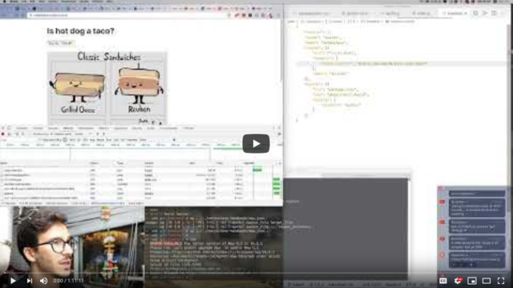
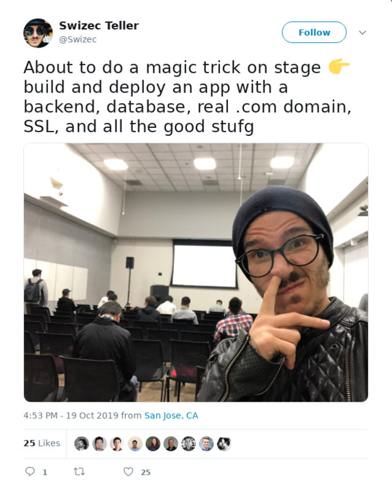
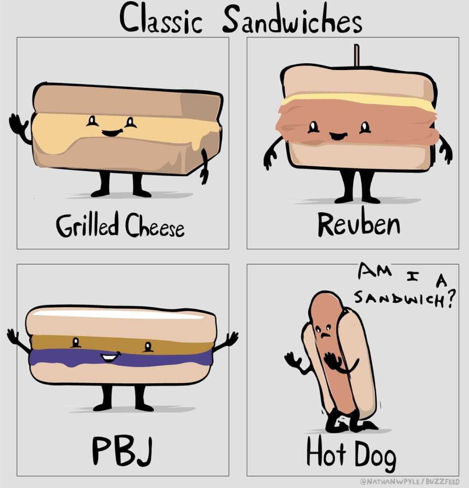
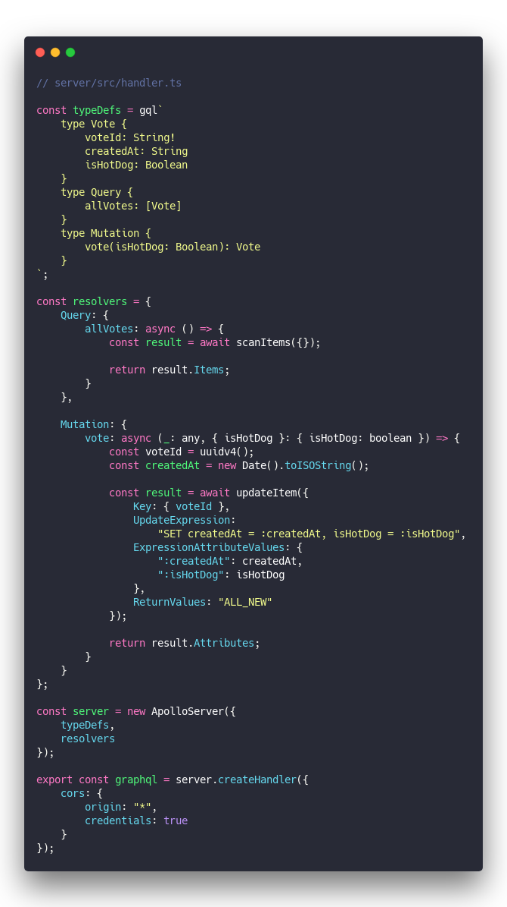
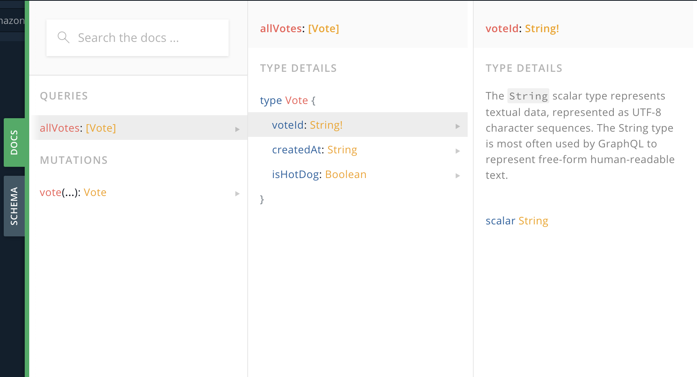
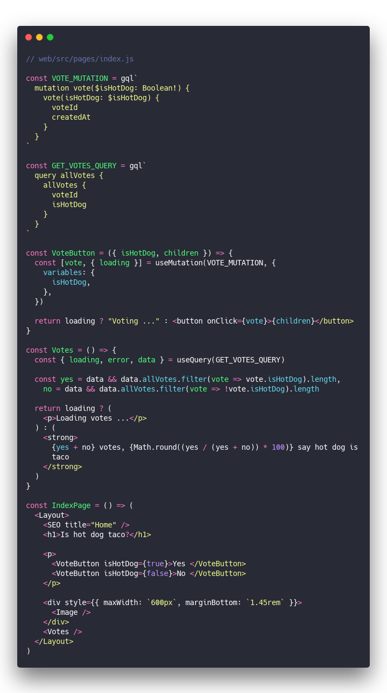

What if I told you modern tools let you build and launch a small webapp in 30 minutes? Complete with SSL, a .com domain, a database, a _documented_ API, CDN hosting, fast static initial loads, and a hydrated SPA?

That's the challenge I posed at Silicon Valley Code Camp this weekend. The audience didn't believe me, so it was time to perform some magic. 🧙

Here's the app 👉 [ishotdogtaco.com](https://ishotdogtaco.com)

And the code 👉 [Swizec/hot-dog-taco](https://github.com/Swizec/hot-dog-taco)

Like all magicians, I cheated on stage. Had some code snippets prepared, knew what I was building, and how. Like Penn & Teller once said:

> Sometimes, magic is just someone spending more time on something than anyone else might reasonably expect.

The real build, from scratch, while figuring it out ... that takes 70min.

## But how?

It's all about the stack. A new paradigm for building webapps that's emerging.

You build the application logic, platforms take care of the rest. Focus on the part that makes your idea special.

Your app comes in two parts:

- **server** for sharing and persisting data between clients, heavy slow operations, data analysis, etc.
- **web/mobile** for user-facing UI, single user logic, etc.

You use [serverless technologies](https://serverlesshandbook.dev/) to host your server. A few lines of configuration, some javascript code, and you're ready to accept requests. Plus it's scalable.

No need to deal with Kubernetes and Dockers and setting up your own DNS configs and dev environments and whatnot. It's pretty neat.

For the frontend, you use the JAMstack. Loosely. Create a single page app, use Gatsby or Next to get fast static initial loads, talk to your backend via API – a GraphQL API.

Since your frontend and backend are decoupled, you can host them separately. Let serverless deal with just your API and data, host everything else as a static page on a CDN.

Your app is live, fast, and scales well.

### The server side

I encourage you to [look at github](https://github.com/Swizec/hot-dog-taco/tree/master/server) for the full code. Here's a couple interesting bits.

Hot Dog Taco is a small app so the backend is simple: A graphql server that handles one API endpoint serving all queries.

Bigger graphql servers still have just a single API, but their type definitions and query resolvers are bigger :)

&t=seti&l=javascript&ds=true&wc=true&wa=true&pv=48px&ph=32px&ln=false&code=%2F%2F%20server%2Fsrc%2Fhandler.ts%0A%0Aconst%20typeDefs%20%3D%20gql%60%0A%20%20%20%20type%20Vote%20%7B%0A%20%20%20%20%20%20%20%20voteId%3A%20String!%0A%20%20%20%20%20%20%20%20createdAt%3A%20String%0A%20%20%20%20%20%20%20%20isHotDog%3A%20Boolean%0A%20%20%20%20%7D%0A%20%20%20%20type%20Query%20%7B%0A%20%20%20%20%20%20%20%20allVotes%3A%20%5BVote%5D%0A%20%20%20%20%7D%0A%20%20%20%20type%20Mutation%20%7B%0A%20%20%20%20%20%20%20%20vote(isHotDog%3A%20Boolean)%3A%20Vote%0A%20%20%20%20%7D%0A%60%3B%0A%0Aconst%20resolvers%20%3D%20%7B%0A%20%20%20%20Query%3A%20%7B%0A%20%20%20%20%20%20%20%20allVotes%3A%20async%20()%20%3D%3E%20%7B%0A%20%20%20%20%20%20%20%20%20%20%20%20const%20result%20%3D%20await%20scanItems(%7B%7D)%3B%0A%0A%20%20%20%20%20%20%20%20%20%20%20%20return%20result.Items%3B%0A%20%20%20%20%20%20%20%20%7D%0A%20%20%20%20%7D%2C%0A%0A%20%20%20%20Mutation%3A%20%7B%0A%20%20%20%20%20%20%20%20vote%3A%20async%20(_%3A%20any%2C%20%7B%20isHotDog%20%7D%3A%20%7B%20isHotDog%3A%20boolean%20%7D)%20%3D%3E%20%7B%0A%20%20%20%20%20%20%20%20%20%20%20%20const%20voteId%20%3D%20uuidv4()%3B%0A%20%20%20%20%20%20%20%20%20%20%20%20const%20createdAt%20%3D%20new%20Date().toISOString()%3B%0A%0A%20%20%20%20%20%20%20%20%20%20%20%20const%20result%20%3D%20await%20updateItem(%7B%0A%20%20%20%20%20%20%20%20%20%20%20%20%20%20%20%20Key%3A%20%7B%20voteId%20%7D%2C%0A%20%20%20%20%20%20%20%20%20%20%20%20%20%20%20%20UpdateExpression%3A%0A%20%20%20%20%20%20%20%20%20%20%20%20%20%20%20%20%20%20%20%20%22SET%20createdAt%20%3D%20%3AcreatedAt%2C%20isHotDog%20%3D%20%3AisHotDog%22%2C%0A%20%20%20%20%20%20%20%20%20%20%20%20%20%20%20%20ExpressionAttributeValues%3A%20%7B%0A%20%20%20%20%20%20%20%20%20%20%20%20%20%20%20%20%20%20%20%20%22%3AcreatedAt%22%3A%20createdAt%2C%0A%20%20%20%20%20%20%20%20%20%20%20%20%20%20%20%20%20%20%20%20%22%3AisHotDog%22%3A%20isHotDog%0A%20%20%20%20%20%20%20%20%20%20%20%20%20%20%20%20%7D%2C%0A%20%20%20%20%20%20%20%20%20%20%20%20%20%20%20%20ReturnValues%3A%20%22ALL_NEW%22%0A%20%20%20%20%20%20%20%20%20%20%20%20%7D)%3B%0A%0A%20%20%20%20%20%20%20%20%20%20%20%20return%20result.Attributes%3B%0A%20%20%20%20%20%20%20%20%7D%0A%20%20%20%20%7D%0A%7D%3B%0A%0Aconst%20server%20%3D%20new%20ApolloServer(%7B%0A%20%20%20%20typeDefs%2C%0A%20%20%20%20resolvers%0A%7D)%3B%0A%0Aexport%20const%20graphql%20%3D%20server.createHandler(%7B%0A%20%20%20%20cors%3A%20%7B%0A%20%20%20%20%20%20%20%20origin%3A%20%22*%22%2C%0A%20%20%20%20%20%20%20%20credentials%3A%20true%0A%20%20%20%20%7D%0A%7D)%3B)

Those 56 or so lines are all it took. Apollo GraphQL libraries do most of the heavy lifting.

We write a type definition for our GraphQL schema – the types, queries, and mutations – and a bunch of resolvers that say _"When this query comes in, run this function to get or save data to the database"_

The database is DynamoDB because that's quickest to set up.

Oh and I promised a _documented_ API. Apollo takes care of that when you open the GraphQL playground.

### The web side

The web side is a bunch of React components using Apollo hooks to run queries and fetch data. No central authority, no setup for global state, just components getting what they need when they need.

You can see [the webapp code on github](https://github.com/Swizec/hot-dog-taco/tree/master/web)

Apollo caching takes care of speed and performance behind the scenes, I think. Haven't dug into that very deep yet to be honest.

Here's how the webapp works:

&t=seti&l=javascript&ds=true&wc=true&wa=true&pv=48px&ph=32px&ln=false&code=%2F%2F%20web%2Fsrc%2Fpages%2Findex.js%0A%0Aconst%20VOTE_MUTATION%20%3D%20gql%60%0A%20%20mutation%20vote(%24isHotDog%3A%20Boolean!)%20%7B%0A%20%20%20%20vote(isHotDog%3A%20%24isHotDog)%20%7B%0A%20%20%20%20%20%20voteId%0A%20%20%20%20%20%20createdAt%0A%20%20%20%20%7D%0A%20%20%7D%0A%60%0A%0Aconst%20GET_VOTES_QUERY%20%3D%20gql%60%0A%20%20query%20allVotes%20%7B%0A%20%20%20%20allVotes%20%7B%0A%20%20%20%20%20%20voteId%0A%20%20%20%20%20%20isHotDog%0A%20%20%20%20%7D%0A%20%20%7D%0A%60%0A%0Aconst%20VoteButton%20%3D%20(%7B%20isHotDog%2C%20children%20%7D)%20%3D%3E%20%7B%0A%20%20const%20%5Bvote%2C%20%7B%20loading%20%7D%5D%20%3D%20useMutation(VOTE_MUTATION%2C%20%7B%0A%20%20%20%20variables%3A%20%7B%0A%20%20%20%20%20%20isHotDog%2C%0A%20%20%20%20%7D%2C%0A%20%20%7D)%0A%0A%20%20return%20loading%20%3F%20%22Voting%20...%22%20%3A%20%3Cbutton%20onClick%3D%7Bvote%7D%3E%7Bchildren%7D%3C%2Fbutton%3E%0A%7D%0A%0Aconst%20Votes%20%3D%20()%20%3D%3E%20%7B%0A%20%20const%20%7B%20loading%2C%20error%2C%20data%20%7D%20%3D%20useQuery(GET_VOTES_QUERY)%0A%0A%20%20const%20yes%20%3D%20data%20%26%26%20data.allVotes.filter(vote%20%3D%3E%20vote.isHotDog).length%2C%0A%20%20%20%20no%20%3D%20data%20%26%26%20data.allVotes.filter(vote%20%3D%3E%20!vote.isHotDog).length%0A%0A%20%20return%20loading%20%3F%20(%0A%20%20%20%20%3Cp%3ELoading%20votes%20...%3C%2Fp%3E%0A%20%20)%20%3A%20(%0A%20%20%20%20%3Cstrong%3E%0A%20%20%20%20%20%20%7Byes%20%2B%20no%7D%20votes%2C%20%7BMath.round((yes%20%2F%20(yes%20%2B%20no))%20*%20100)%7D%20say%20hot%20dog%20is%0A%20%20%20%20%20%20taco%0A%20%20%20%20%3C%2Fstrong%3E%0A%20%20)%0A%7D%0A%0Aconst%20IndexPage%20%3D%20()%20%3D%3E%20(%0A%20%20%3CLayout%3E%0A%20%20%20%20%3CSEO%20title%3D%22Home%22%20%2F%3E%0A%20%20%20%20%3Ch1%3EIs%20hot%20dog%20taco%3F%3C%2Fh1%3E%0A%0A%20%20%20%20%3Cp%3E%0A%20%20%20%20%20%20%3CVoteButton%20isHotDog%3D%7Btrue%7D%3EYes%20%3C%2FVoteButton%3E%0A%20%20%20%20%20%20%3CVoteButton%20isHotDog%3D%7Bfalse%7D%3ENo%20%3C%2FVoteButton%3E%0A%20%20%20%20%3C%2Fp%3E%0A%0A%20%20%20%20%3Cdiv%20style%3D%7B%7B%20maxWidth%3A%20%60600px%60%2C%20marginBottom%3A%20%601.45rem%60%20%7D%7D%3E%0A%20%20%20%20%20%20%3CImage%20%2F%3E%0A%20%20%20%20%3C%2Fdiv%3E%0A%20%20%20%20%3CVotes%20%2F%3E%0A%20%20%3C%2FLayout%3E%0A))

We've got a couple of GraphQL queries defined as constants, and two \\important React components:

1. `<VoteButton>` is a button that votes Yes or No when clicked. Runs a GraphQL mutation and waits for a response.
2. `<Votes>` pokes our GraphQL API with a query and returns the results. This is where we see whether a hot dog is a taco.

Notice how each component handles its own API communication internally? No need to bother the whole app with global state and other weird complications.

It's like [edge computing](https://en.wikipedia.org/wiki/Edge_computing) but for React components 🤔

The rest is Gatsby machinery handling all the hard stuff. Compiles to a static build at deploy, gives us routing, basic page layout, even a little bit of CSS defaults.

Host it with Netlify or Zeit and voila: A live webapp with SSL and fast CDN setup.

## But why?

Because the [Cube Rule](https://cuberule.com/) is an amazing unified theory of food identification.

But also to show that it can be done.

You _can_ launch an app with little effort these days. The web stack has never been so productive and I'm excited as heck to see what happens next.

I'm expecting a cambrian explosion of indie startups. Small apps solving real problems, making their creators rich.

You excited?

Cheers, ~Swizec