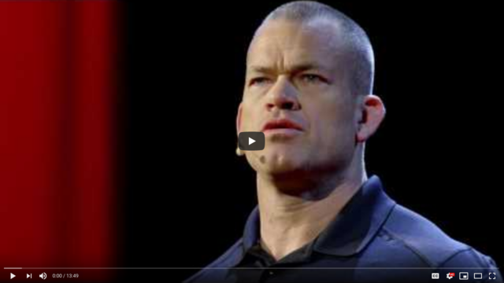
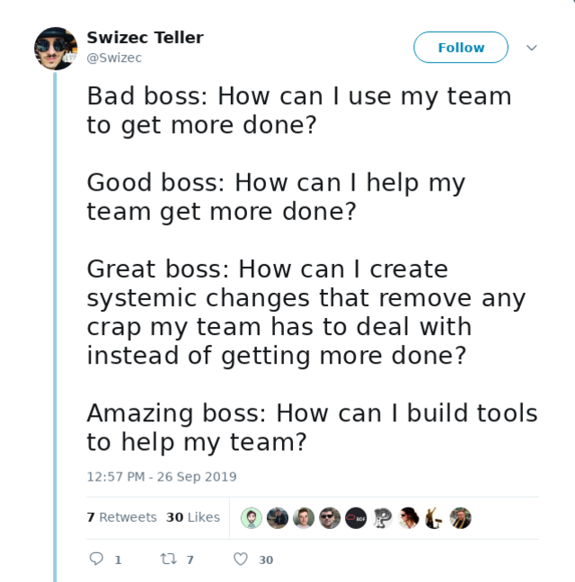
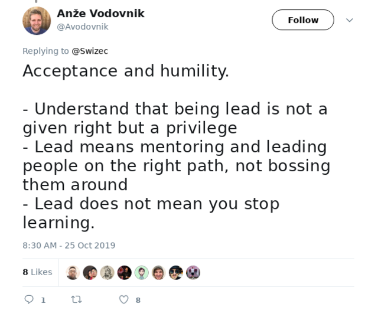
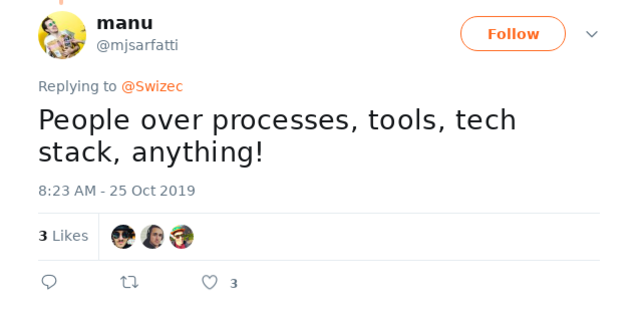
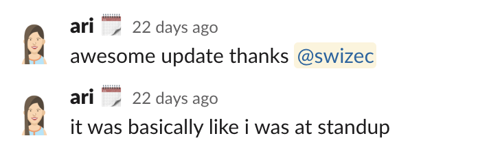
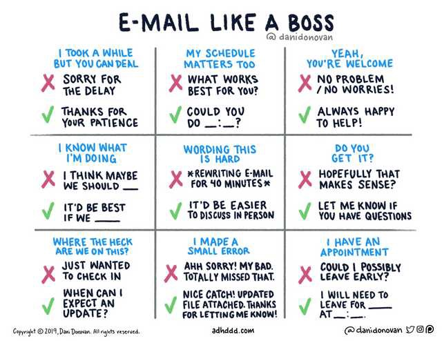
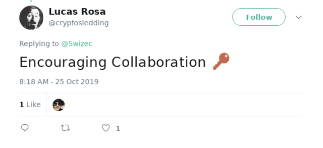

You've just been handed a big project at work. It spans parts of the app you've never touched, tech you've never heard of, and it all needs to work together in one big unified feature.

But fear not! Bob's gonna help with iOS, Kevin has Android, Stuart's doing backend, and you've got the webapp. You got dis! 💪

Congratulations, you just became Lead Engineer on a project. You're nobody's boss and it's your fault when something goes wrong.

Yes, _your_ fault. Not your team's, not your boss's, yours.

[Extreme Ownership](https://echelonfront.com/extreme-ownership/) is a book you should read. Here's a TEDx recap from the author. Ignore the navy seal hardass delivery.

I've been leading projects more and more this year as our team grows and the folks with "manager" in their title become too busy. It's been both empowering and frustratingly humbling.

My last project was so smooth I think I finally figured out how to lead well. Here's what I've learned 👇

## How to succeed as a lead engineer

As lead engineer you are straddling the line between management and engineering. Your job is to do your work, write your code, oh and also you're responsible for the whole project and everybody else's work. Good luck.

You often have no power – you don't choose your team, you don't hire anyone, you don't pick what to work on ... **you manage the project, not the people.**

Ever noticed how there's no project managers in Silicon Valley? This is why. _Engineers are project managers._

Because you're lead _engineer_ your main work is still writing the code. You are expected to focus on implementing the feature, making tests pass, getting through code review.

Managing the project is just tacked on top. It won't show up in your sprint, time will not be allotted. You just gotta find it.

But come review time all your manager is going to ask, or know, is _"Was that project successful?"_

Doesn't matter if you wrote the best code of your life and everyone else produced crap, or you wrote shit code and managed everyone else to excellence. Project failed.

**Your objective is a successful project**

Make sure you check with your boss to know what that means. _"What does success look like?"_ is the most \\important question in your arsenal when starting any project.

## It's a shift in mindset

Once you realize your goal is a successful project, not great code, everything changes. What can _you_ do to make this smoother?

Your role is that of a [force multiplier](https://en.wikipedia.org/wiki/Force_multiplication).

> In military science, force multiplication or a force multiplier refers to a factor or a combination of factors that gives personnel the ability to accomplish greater things than without it.

What can _you_ do to make everyone else better?

The best way to become a 10x engineer is to find 10 engineers and make them 2x. That's your role as lead. Making your team kickass.

Your team is likely smaller so maybe aim for 5x? 😛

What this means is that you will have to deprioritize your own work in favor of everybody else's work. Somebody blocked? Help them. Decision needs to be made? Help. Code review waiting for ya? Do it now, not later. Stuff needs to go into QA? Do it.

**Your job is to take on the crap work nobody else wants to do.**

That means organizing discussions, keeping everyone in sync, dealing with QA, getting product signoff, organizing deployment, carrying that project over the finish line no matter what. All the stuff that makes you groan and wish you were writing code.

## So what do you _do_

Mindsets and objectives are nice, but what do you _do_? We're engineers, we like details.

You can read this section as an SOP – standard operating procedure. It's what I've found works for me and something I hope others on my team use as a guideline. Hi Pru 👋

### Create a Slack channel

Or email thread, or whatever your team uses for communication. You need a central place for everything to do with a specific project. All async communication goes there. All in-person communication gets a recap there.

This will be invaluable later on when something goes wrong and you want to see what the fuck happened. _If you didn't write it down, it didn't happen._

Humans forget everything.

### Keep a checklist

Ask your team to break down their part of the project as much as they can. You can attach estimates to each line or not. I personally find them useless but my bosses love seeing those imaginary numbers. 🤷‍♀️

Add a checkbox next to each line. When a task gets done. Check it off.

This creates an overview at a glance for all stakeholders. Someone wonders how the project is doing, how close to completion y'all are 👉 check the checklist.

Your boss will ask you less often how it's going because they're already gonna know.

### Daily standup

Create a daily standup. In person if that's your culture, over video, if you're remote.

This is a quick sync up, 5 minutes or less. Chat about the project, discuss any issues, get an update on how everyone's doing. Build a team spirit. We're all in this together and we all want the project to succeed.

There is no judgement, no guilt, only facts.

Some management theories say standups are about making people feel guilty for not being as productive as their peers so they'll work harder. That shit is bullshit.

### Post a standup recap

Only those actively working on the project _today_ should participate in your standup.

The smaller the standup, the faster it's gonna go. You don't need everyone there in person. Sometimes they just need to know when they can start working on their part.

Don't waste people's time.

Instead, after standup, write a short recap summarizing the project status. Post it in the common communication area you created earlier.

To quote my wonderful PM:

That's the goal right there.

**Added bonus: your boss won't bug you for updates. They can read the standup recap**

I like to split the recap by person for accountability. Stuart did so and so, Kevin got this far, Bob was stolen from us by a production issue.

### Delegate

This is your new super power. As lead, you get to delegate.

Delegating is hard. It means letting go of your babies, letting others play with your legos, and stepping away from some of the work.

But it's okay, they're great engineers and they're gonna do it even better than you could have.

You're delegating everything you _can't_ do. Those parts of the feature you aren't owning anyway. Your job there is to provide clarity, help with organization, and hope for the best.

But you should also delegate some of the things you _can_ do. Because others can do them better.

Coming up with examples is tricky, you'll know it when you see it :)

### Communicate like a boss

This is more general advice but I like it a lot. A few turn-of-phrase hacks you can use to make everything flow smoother.

Ask for updates and always follow up. When something's done congratulate, when something falls behind ask why.

And remember, a well managed team will out-code you any day of the week.

Cheers,  
~Swizec

PS: I crowdsourced some of the ideas, you can check out [this thread on twitter](https://twitter.com/Swizec/status/1187749487873183745) for more wisdom