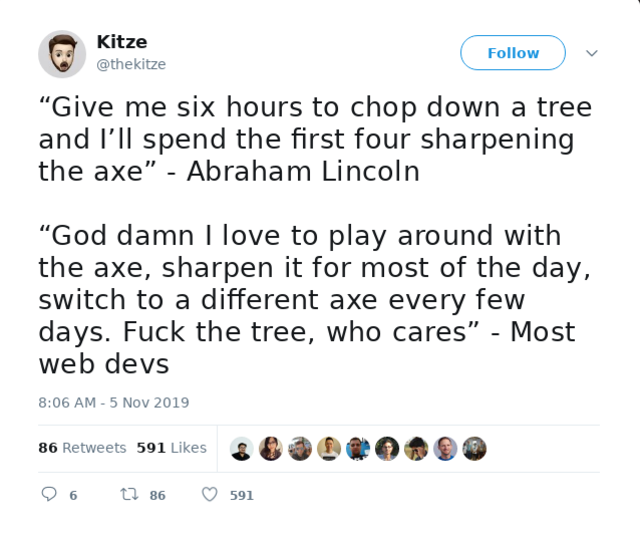
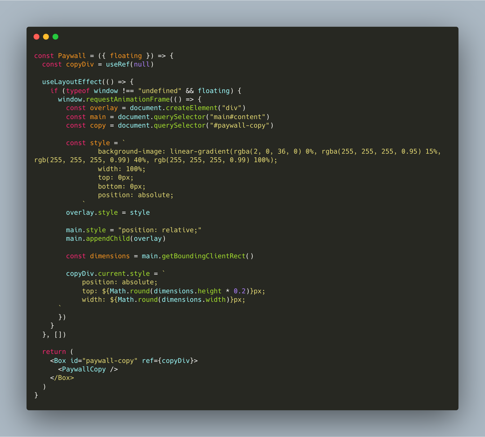
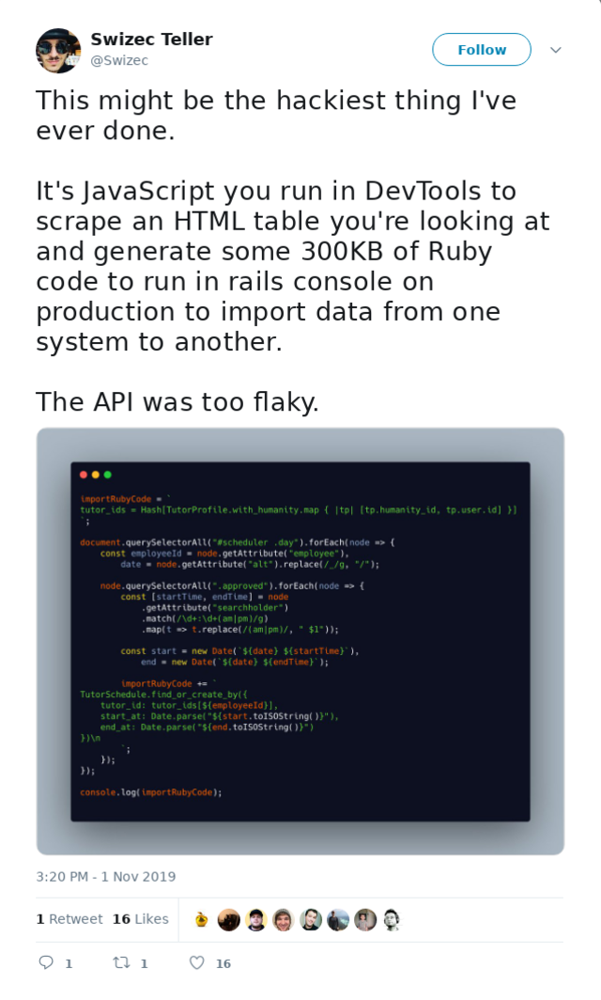
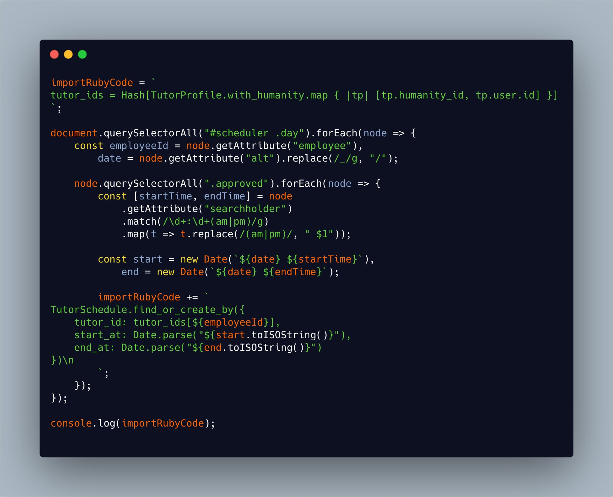

You know what they say: Arguing with an engineer is like wrestling with a pig in the mud. After 5 hours you realize the pig likes it.

Everyone loves a good fight about their tools. It's fun as heck, scares away all the normal people, and makes you feel smart. win-win-win what's not to love?

Wasting time you could spend solving problems. You're paid to _solve problems_ not to "find the best way" to still not solve the problem. 😉

Within reason.

So I figured I'd share a couple gloriously disgusting hacks that made me take a shower right after. But they solved the problem.

## A dirty piece of JS-in-JSX that made $1000 in a week

A few weeks ago I had a problem. My [Serverless Handbook](https://serverlesshandbook.dev) page was done, due in a few hours, and missing its most \\important ingredient: the opt-in wall.

You see I had a paid ad spot in a React newsletter from Cooper Press that was going out to thousands of people in a few hours. I wanted to launch Serverless Handbook there as a free lead magnet.

But it's not a lead magnet unless it asks for your email.

Page is done – copied from Rebass's wonderful docs page – how hard can it be to add an email form?

Yeah but I want each chapter to sort of tease you with its contents then fade out into an opt-in wall.

Okay so render some of the content then add a React component with the form or whatever?

Yeah but the content for each chapter is written in MDX – markdown with JSX. That means it gets parsed by a Gatsby plugin, munged into HTML, and injected into my page as one big blob.

One option was to implement the opt-in wall logic on every page itself. Go into the MDX and wrap paragraphs in conditionals. Do we show this or not?

Ooooooor I could create this glorious hack

It worked. Free product, opt-in wall, made $1000 in its first week as a "pay what you want" offering.

👌

### How it works

It really is quite a nasty piece of work. We've got a React component that renders the paywall itself.

Once React is done rendering we use a `useEffectLayout` to run some vanilla JavaScript that manipulates the DOM directly. You're _really_ not supposed to do that with React.

This JavaScript creates a `div` with a fadeout white background, renders that over the main content, then repositions the paywall copy over it.

Dirty but it works

## A nasty piece of work that got 80 people paid on time

Another nasty piece of work happened at the dayjob.

We use a 3rd party app to manage our fleet of shift workers. Person comes on our platform, creates a account, backend gives them an account on this other service, and there's some integration between us and them.

The ops team uses that integration to run payroll.

Guess what happened on October 27th? That's right, the integration suddenly and mysteriously died.

We dug in and found that the API returns data in shift worker's individual timezones. _Not_ in our timezone or UTC like you'd expect. When we built the integration the API used our timezone.

Nope, the API doesn't tell you which timezone each timestamp is in. Don't even get me started on API's that expect you to assume timezone from context. 😒

We assume it's a bug, talk to support, and go on our merry way. But November 1st is coming fast.

The fateful day arrives and we gotta run payroll. Do I re-engineer our entire system and fast track the development process to get this out in time for payroll and risk doing it all again when the API bug is fixed?

Heck no!

Time to hack.

In about two hours I came up with this wonderful piece of work.

Ran that in Chrome DevTools logged in as admin on the 3rd party app, got the data dump, loaded it into Rails console on our server, and some 80 people got paid on time that day.

💪

### How it works

The idea behind this hack really is quite nasty.

I searched through the app's UI to find a place that gives data in a timezone that we want. The schedule view instead of the payroll view.

Their UI uses the same broken API as our backend, go figure.

Once you have something in the HTML, you can use JavaScript to scrape it. 💡 And that's exactly what I did: Found some orienting classes and HTML ids ad wrote some vanilla JavaScript to read them.

Now what? You can access the data, but how do you get it into your own system?

Generate 300Kb of Ruby code and dump it straight into Chrome DevTools with a console.log of course. D'oh

Then you copy paste that into production and save the day.

PS: The 3rd party has since decided that _"different timezone for each row of data without timezone in the timestamp"_ is the correct behavior. I want to murderize them. ❤️

Happy Friday, ~Swizec