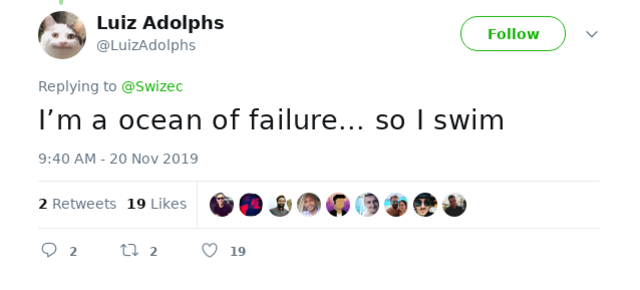

Do you know that game, abysmall failure at life and everything or hungry? It's a fun game, I play it often.

To be honest, I don't know where it comes from. Maybe it's like being hangry – you lack energy so your emotions run wild. Whatever they are.

For me it likes to sneak up when I look at past achievements that I was so proud to achieve and think _"You could've done better and you know it_. I could've, but I didn't. I am where I am.

Note to self: Do not look at metrics when you're hungry. Keep forgetting that one 😅

More \\importantly, folks on twitter shared so many wonderful tips to shake that feeling of failure we all feel sometimes that I wanted to share my favs with you. You should [read the whole thread, too](https://twitter.com/Swizec/status/1197206705743859712)

In a nutshell:

- accept yourself
- remove toxic influence
- mind the wins

And remember, I love and accept you for who you are ❤️

Happy Thursday,  
~Swizec

PS: removing toxic influence [only goes so far 😅](https://twitter.com/Swizec/status/1197255649593188352)