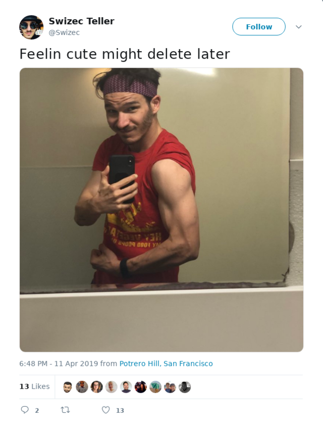
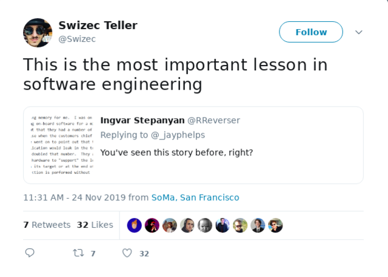
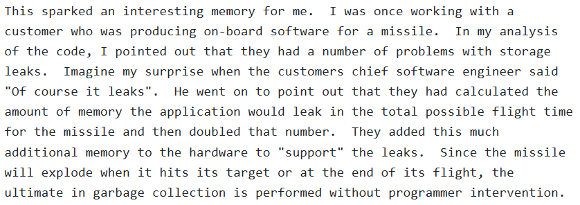

Friend, have you ever thought about what makes you a "talented engineer" versus a _great_ engineer?

Think about it.

When do you say someone is talented? It's before they're great. When they're _just_ a talented X.

A bunch of talented engineers from my 2 months in a YC startup in 2011 👆

[Michael Jordan](https://en.wikipedia.org/wiki/Michael_Jordan) was a **great** basketball player. Heaps of talent for sure, but "talented" isn't the first word that comes to mind.

[Leclerc](https://en.wikipedia.org/wiki/Charles_Leclerc), on the other hand, is a _talented_ Formula 1 driver. He hasn't had time to prove himself yet, but he's the youngest ever Ferrari driver. Historically the best and pickiest team.

**Talent is the potential to develop into greatness.**

Keyword: develop.

Are folks saying you're a _talented_ engineer, or a _good_ maybe even _great_ engineer? Pay attention, you have work to do.

As my sister always likes to say

> Hard work beats talent when talent fails to work hard.

An example from the boxing gym 👇

I've had various trainers in boxing. Most of them damn good boxers.

One of the best was a real talent, been boxing since he was 10. Never went far with competing, but damn did he look great at the gym.

When explaining how to do something, he struggled. Most of the time he could show us what he does, but not explain how he does it, why he does it, or sometimes not even realize what he does until he tries. Then he's like _"Oh yeah I guess I do take a little step there, you're right"_.

Then there's my current trainer who is a little less talented himself.

Alan competed at a decent level as an adult, then decided to pursue training instead. He can tell us what to do and why we should do it. Also how to think about strategies, ring positioning, and so on.

He's great but we need lots of repetition and trial and error.

Then there was the lady who's an 8 time professional world champion in Muay Thai. She came to our gym to become a better boxer and offered to teach in return.

Dude, that was on another level.

Miriam could not only explain why we should do something, but also how. _Exactly_ how. She'd look at your punch and say _"No no, move your wrist 5 degrees this way"_ and damn what a difference. Or she'd explain that yes punching to the body is good, but if you punch an inch higher you hit their ribs and your opponent can't flex those. 🤯

3 months with her improved my boxing more than 3+ years of other trainers. Phenomenal.

The difference was that she wasn't just talented, she also had a deep understanding of fighting. What you have to do, why you have to do it, how you have to do it, the little tricks that make you more effective. Her advice was measured in half-inch adjustments.

Teaching might be a separate skill, but **true mastery is being able to break down exactly how you do what you do and why**.

Oh and better yet: she explained how it should feel when we get it right. So not only would we know what to do, but also how to tell if we did it right.

## So what makes you a true master?

Understanding what you do, why you do it, when you do it, how you do it. The difference between knowing that memory management is \\important and realizing that a guided missile blows up in the end so it doesn't matter.

Happy Monday, we've got a 3 day week in USA. Will you make it count? 🔥

Cheers,  
~Swizec