It's Thanksgiving in America. A week of gratitude, turkey, and a dish my girlfriend's family calls a salad but is really a mix of marshmallows, whipped cream, and cranberries.

It's delicious 😋

So in lieu of a black friday deal this year, I just wanted to say thanks. Thank you, friend, for reading my emails, supporting my work, and being awesome. I wouldn't be where I am without you.

You have no idea how much it means to me ❤️

I started this business about 7 years ago at my desk in my mom's apartment. Swizec Sole Proprietorship, founded September 2012 when I dropped out of college.

My room was juuust big enough for a bed, a PC tower, a desk, and a bunch of crap. I had a laptop, too. With a bluetooth keyboard because I had spilled water on it the previous summer. You had to open it up to user the power button.

[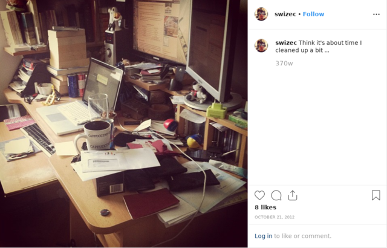](https://www.instagram.com/p/RCbgyJExlG/)

Back then this was a freelancing business. I'd use my moderately successful blog for credibility and finding clients. Focusing on startups from USA because they pay more and I had some startup experience of my own.

Working for Slovenian companies at Slovenian rates felt like a joke. Why should I work for $10/hour? I'm just as good as those American engineers!

## But on the side, I started experimenting with products.

First there was [Why Programmers Work at Night](http://nightowlsbook.com/), a book about how to be a more effective engineer. I learned a lot about productivity and sleep patterns researching that book.

Did you know that nightowls are more creative in the morning?

Never finished that one, but I learned a lot about marketing and making money online. It's also when this email list started. Hi old friends 👋

Made about $6,000 with that project. Thanks everyone

[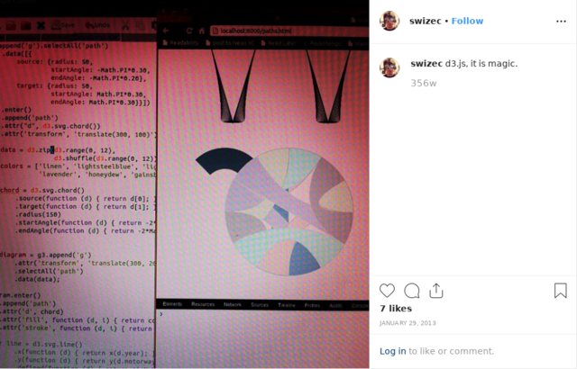](https://www.instagram.com/p/VFPIKBkxsH/)

The first book I did finish was [Data Visualization with d3.js](https://www.packtpub.com/web-development/data-visualization-d3js) for Packt.

By the time it was done, I was so fed up with the project that I never took a photo. But it was a great book. Packt tells me it's a best seller.

[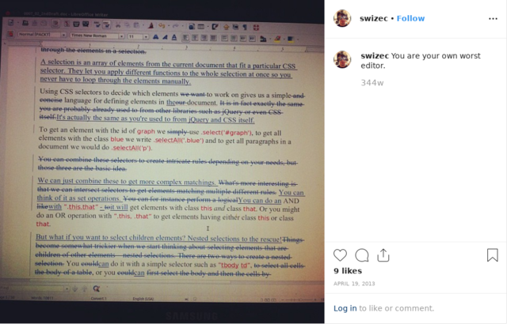](https://www.instagram.com/p/YSzI0Pkxmw/)

They went on to publish 2 or 3 more editions with other authors. I still get some royalties because they used my chapters.

Another $6,000 or so in the bank 💪

There was a video course with Packt too but let's not talk about that it was so bad.

What these two projects really taught me was the power of making money when you aren't working.

## And that's when shit got real.

I upgraded to a bachelor pad in Ljubljana and got to work. Still mostly freelancing for American companies, but spending more time learning about business, mindsets around making money, and changing attitudes towards rich people.

You can't get rich if you think everyone with $100k is a crook.

No longer just a desk in my bedroom, my business had a proper setup now 👉 a desk in the living room.

[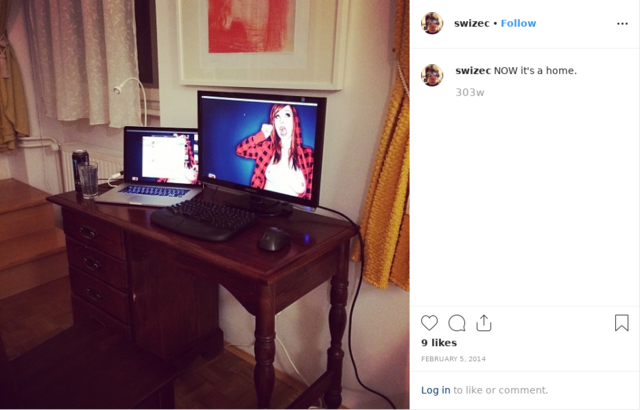](https://www.instagram.com/p/kCsgC-Exo9/)

Excuse the wallpaper. I was 27 working alone with the internet for company.

None of those projects went very far, until suddenly one did.

[React+d3.js](https://reactfordataviz.com) was born. And that's most likely how you met me.

[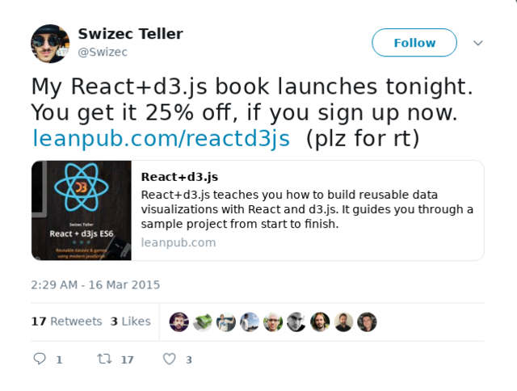](https://twitter.com/Swizec/status/577401306429685760)

It became a featured book on Leanpub!

[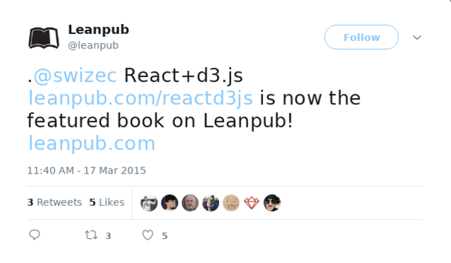](https://twitter.com/leanpub/status/577902292713672704)

And it made around $4,000 in its first week 🎉

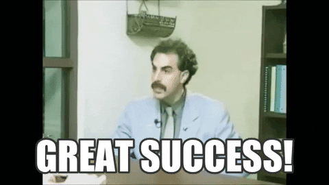

That's when I decided to [switch from freelancing to products](https://swizec.com/blog/switch-to-products/swizec/6812). Still working full-time as a software engineer, now at a startup, but trying to get this product thing to a point that's full-time.

> Now I’ve just gotta figure out how to sell more products than time. How hard can it be?

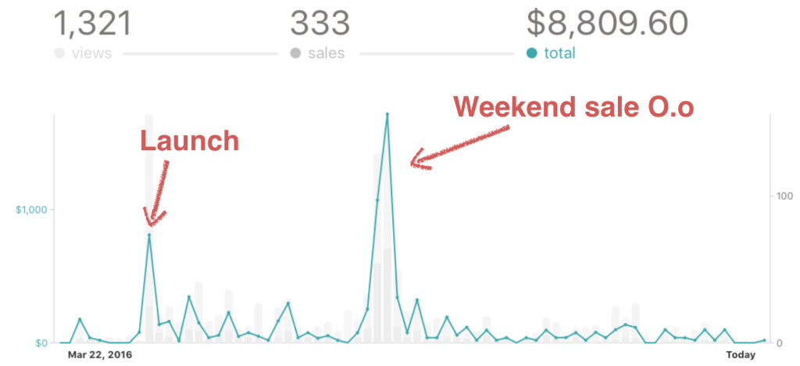

## Oh and I got a "real office"

Oh and I moved to San Francisco.

To be with my girlfriend, to work in exciting startups, to be exposed to more opportunity. And for that fire under butt factor where you tell someone "Yo I made $3k this weekend" and they say _"Why so little?"_

Back home it's more like _"Not possible, don't believe you"_

We moved into our first apartment with The Girl and our bird. He was new at the time.

I had an office now. I was so excited.

[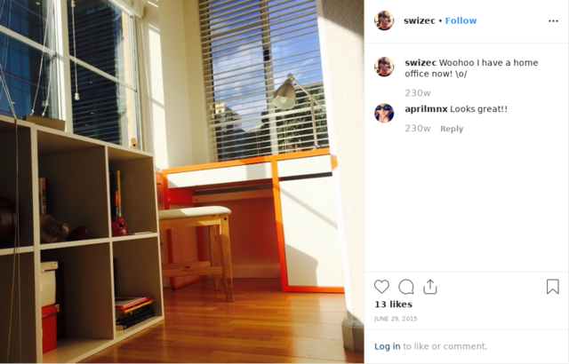](https://www.instagram.com/p/4fk0-ZExlS/)

3ft by 6ft, just big enough for a desk and a chair.

And that desk was the last thing I bought for this business with my own money. Thanks to you, the business was doing well and it paid for its own things.

The office evolved until just last week it reached its final form – a full on video production studio with a 5K monitor, DSLR camera, studio lighting, and sound proofing foam.

[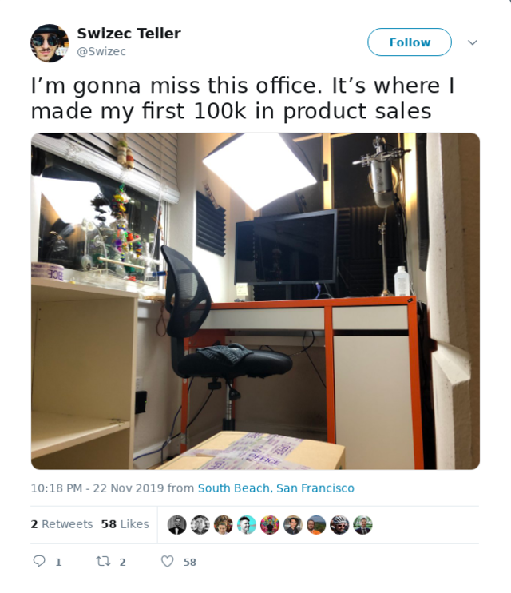](https://twitter.com/Swizec/status/1198123686462550017)

And yes, the bird helped. He's in many of my videos and probably knows React, D3, and JavaScript better than I do by now.

[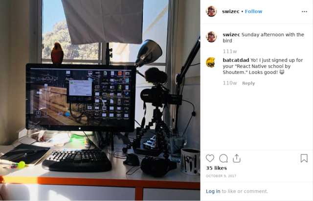](https://www.instagram.com/p/BaAdSWFFQl8/)

## The next step

So here we are, it's November 2019, just over 7 years after I first went into business for myself. There's been many ups and downs, lots of wins and fails, but thanks to you, I'm writing this from my first big boy office in beautiful downtown San Francisco.

[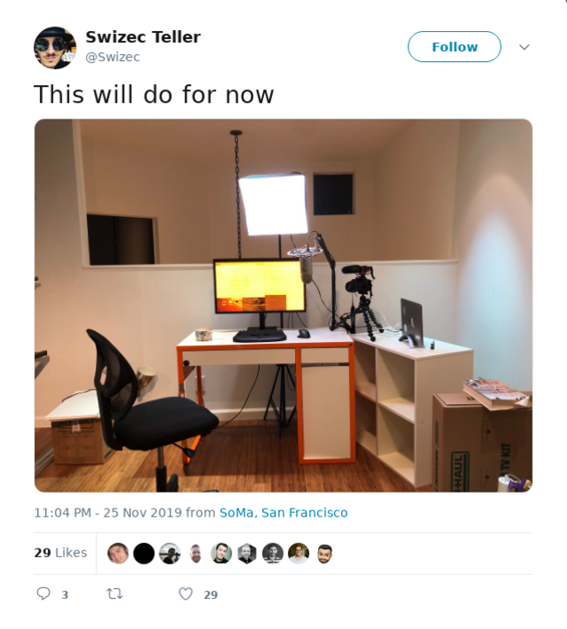](https://twitter.com/Swizec/status/1199222253755351042)

I'm chuffed mate, as the brits would say. A little teary eyed even.

Plenty left to do to make this office what it needs to be, but I think it's going to be great. I've got a new desk coming, more studio lighting, and great things in store.

Just you wait.

Happy thanksgiving 🦃  
~Swizec

Here's a bonus pic of me pitching my first startup in college circa 2010.

[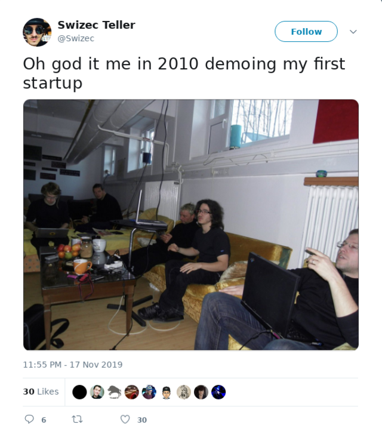](https://twitter.com/Swizec/status/1196336150094286863)

And a video tour of the new apartment we just moved into. It was going to be a vlog but then I didn't make one. The story didn't want to come together.

[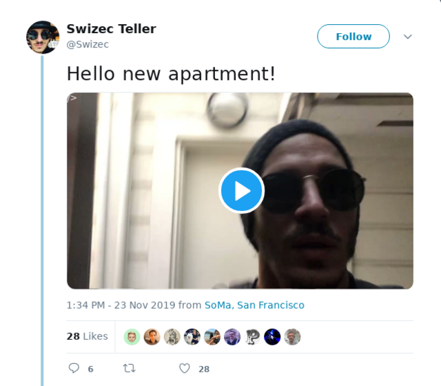](https://twitter.com/Swizec/status/1198354243117146112)