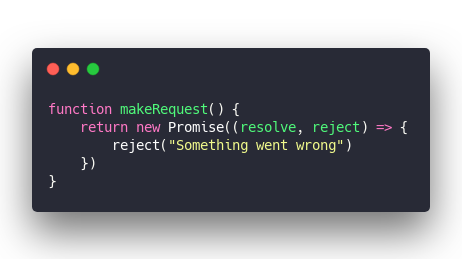
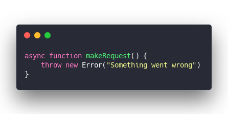
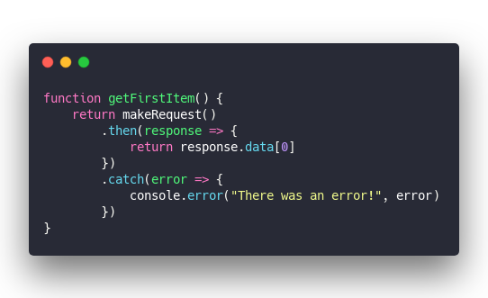
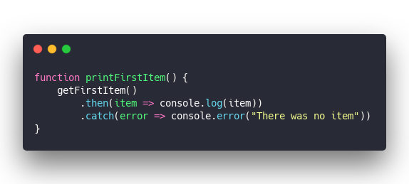
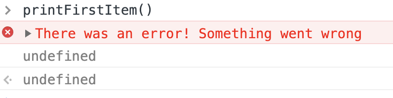
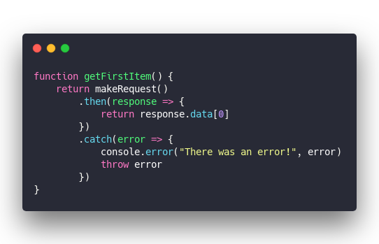
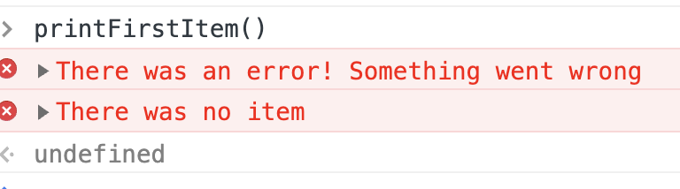

You think you're a JavaScript expert and then you find this all over your codebase.

Happened to us on Friday. You shoulda seen the look of defeat on my coworker's face. Looked like he was ready to give up software and become a goat herder in the Andes 😂

So what happened?

He's performing a networking audit of our codebase. A large app we've built over the years. I built the first version in Backbone, then a team rewrote with Vue, then we all kind of contributed here and there.

And there's been issues. Bugs so frequent users gave up reporting them. They just refresh and move on.

Well, our networking layer leaks errors like a rusty old bucket you find in the back of the shed. API throws an error, app flinches, shrugs it off, and moves on.

Users get undefined behavior galore. App thinks there's data. There isn't data.

_"But how"_, you might ask, _"Doesn't modern JavaScript make error handling easy as shit?"_

It does! Except when it doesn't.

Look at this code:

&t=seti&l=javascript&ds=true&wc=true&wa=true&pv=48px&ph=32px&ln=false&code=function%20makeRequest()%20%7B%0A%09return%20new%20Promise((resolve%2C%20reject)%20%3D%3E%20%7B%0A%09%09reject(%22Something%20went%20wrong%22)%0A%09%7D)%0A%7D)

A mock `makeRequest` method that always rejects its promise. An async/await version would throw instead.

Like this

&t=seti&l=javascript&ds=true&wc=true&wa=true&pv=48px&ph=32px&ln=false&code=async%20function%20makeRequest()%20%7B%0A%09throw%20new%20Error(%22Something%20went%20wrong%22)%0A%7D)

Same effect. Promises make the mistake I'm talking about more apparent. You'll see why.

Okay so you've got this function that sometimes returns an error. You try to be a good citizen, which means handling errors instead of blowing up your app.

&t=seti&l=javascript&ds=true&wc=true&wa=true&pv=48px&ph=32px&ln=false&code=function%20getFirstItem()%20%7B%0A%09return%20makeRequest()%0A%09%09.then(response%20%3D%3E%20%7B%0A%09%09%09return%20response.data%5B0%5D%0A%09%09%7D)%0A%09%09.catch(error%20%3D%3E%20%7B%0A%09%09%09console.error(%22There%20was%20an%20error!%22%2C%20error)%0A%09%09%7D)%0A%7D)

You have a `getFirstItem` method that calls the API and returns an item from its response. If there's an error, it says there was an error.

All good, right? Job well done! You're doing error handling and everything. So good.

Now look at this code, what does it print?

&t=seti&l=javascript&ds=true&wc=true&wa=true&pv=48px&ph=32px&ln=false&code=function%20printFirstItem()%20%7B%0A%09getFirstItem()%0A%09%09.then(item%20%3D%3E%20console.log(item))%0A%09%09.catch(error%20%3D%3E%20console.error(%22There%20was%20no%20item%22))%0A%7D)

Think about it, I'll send you the answer in 30 minutes 😛

PS: if you're not that familiar with promises, here's an old video I made in 2017 – a 2min explanation.

* * *

&t=seti&l=javascript&ds=true&wc=true&wa=true&pv=48px&ph=32px&ln=false&code=function%20printFirstItem()%20%7B%0A%09getFirstItem()%0A%09%09.then(item%20%3D%3E%20console.log(item))%0A%09%09.catch(error%20%3D%3E%20console.error(%22There%20was%20no%20item%22))%0A%7D)

Did you figure it out {{subscriber.first_name}}? My team got it wrong. Even folks with decades of JavaScript experience.

That's right, it prints `undefined`.

o.O

You get an error from `getFirstItem`. **But then the error is handled!**. The rest of your code carries on in the `.then` chain like nothing happened.

And that's how you build a leaky bucket without realizing it. Multiply that across months and years and many developers and well ... 😅

The fix is to _always re-throw errors_. Unless you have a damn good reason why it needs to be eated.

&t=seti&l=javascript&ds=true&wc=true&wa=true&pv=48px&ph=32px&ln=false&code=function%20getFirstItem()%20%7B%0A%09return%20makeRequest()%0A%09%09.then(response%20%3D%3E%20%7B%0A%09%09%09return%20response.data%5B0%5D%0A%09%09%7D)%0A%09%09.catch(error%20%3D%3E%20%7B%0A%09%09%09console.error(%22There%20was%20an%20error!%22%2C%20error)%0A%09%09%09throw%20error%0A%09%09%7D)%0A%7D)

With that tiny modification the code works as expected.

Yes the same rule applies to async/await code. You're eating errors unless you explicitly re-throw.

Now go through your project looking for this mistake and try not to cry. 😛

Good luck and happy Monday

❤️, ~Swizec